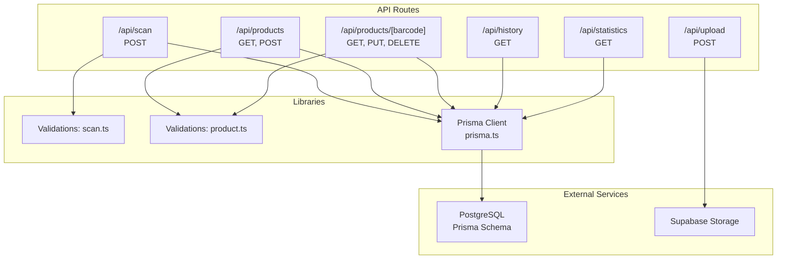
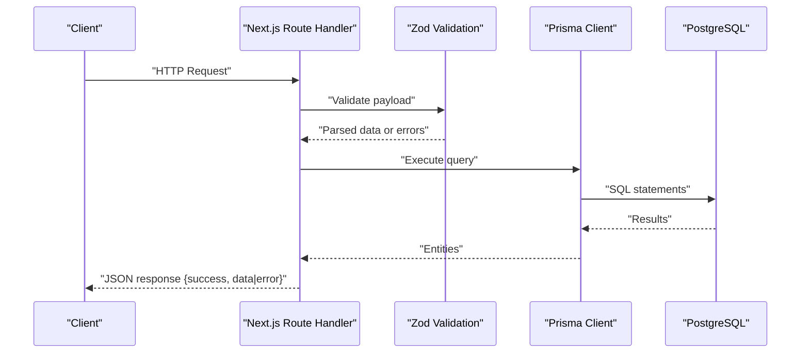
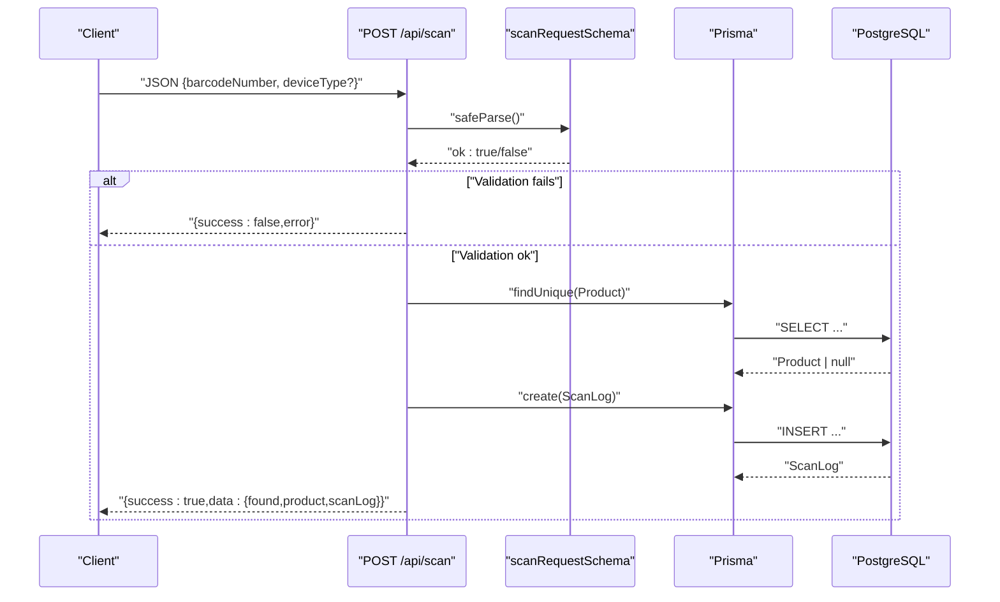
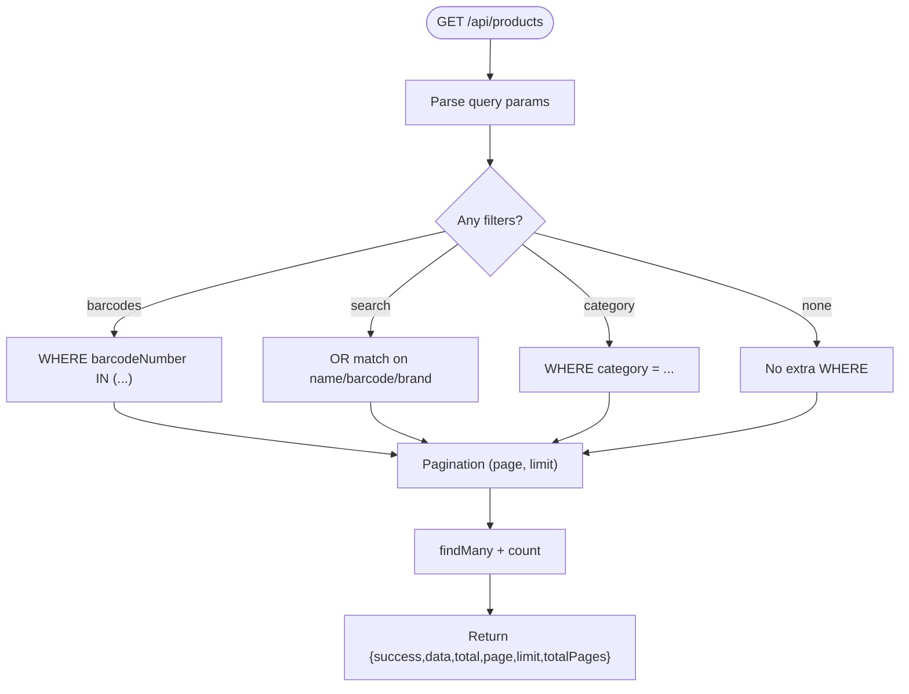
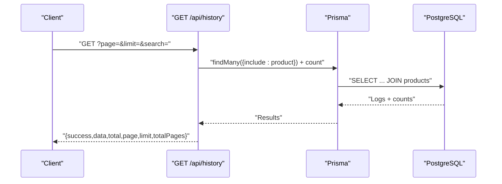
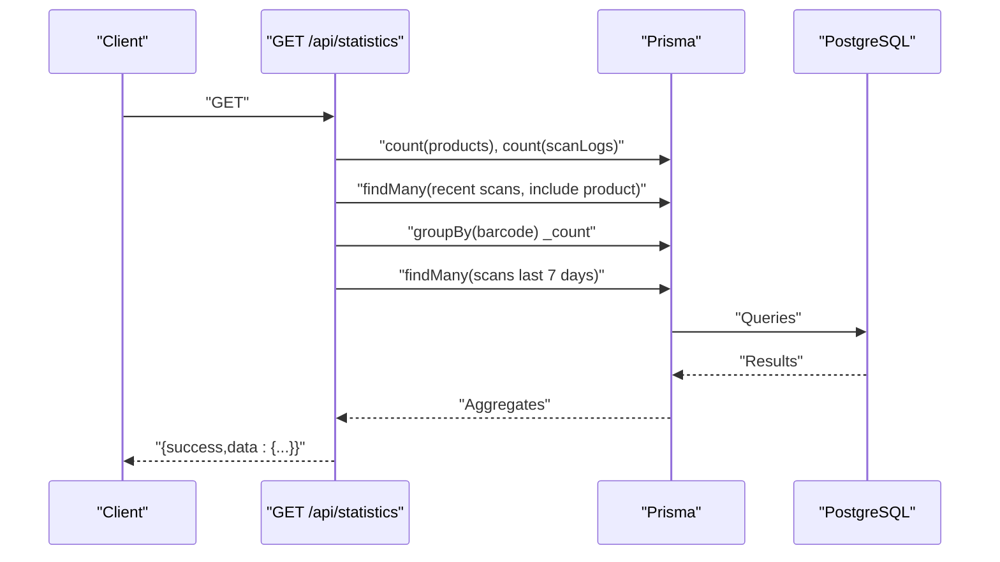
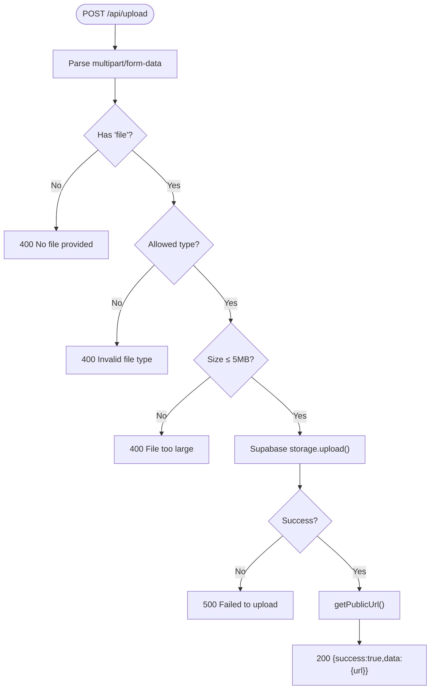
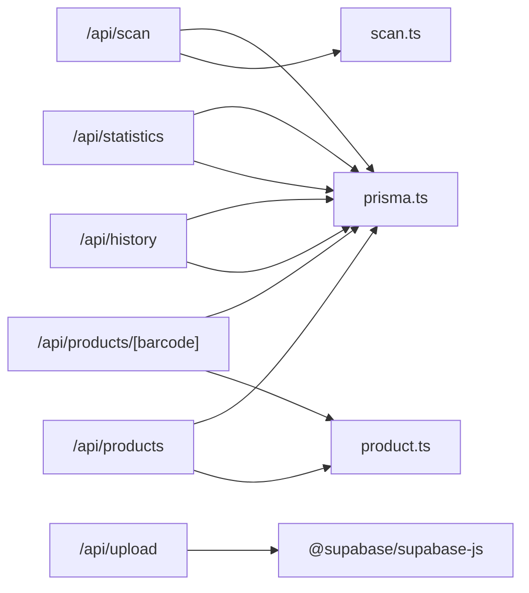
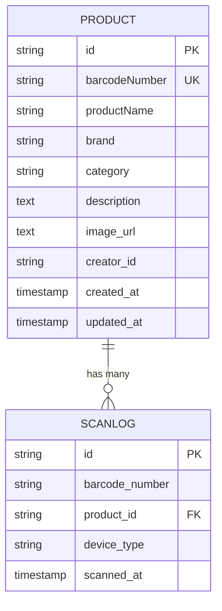

# API Reference

<cite>
**Referenced Files in This Document**
- [scan/route.ts](file://src/app/api/scan/route.ts)
- [products/route.ts](file://src/app/api/products/route.ts)
- [products/[barcode]/route.ts](file://src/app/api/products/[barcode]/route.ts)
- [history/route.ts](file://src/app/api/history/route.ts)
- [statistics/route.ts](file://src/app/api/statistics/route.ts)
- [upload/route.ts](file://src/app/api/upload/route.ts)
- [prisma.ts](file://src/lib/prisma.ts)
- [schema.prisma](file://prisma/schema.prisma)
- [scan.ts](file://src/lib/validations/scan.ts)
- [product.ts](file://src/lib/validations/product.ts)
- [package.json](file://package.json)
</cite>

## Table of Contents
1. [Introduction](#introduction)
2. [Project Structure](#project-structure)
3. [Core Components](#core-components)
4. [Architecture Overview](#architecture-overview)
5. [Detailed Component Analysis](#detailed-component-analysis)
6. [Dependency Analysis](#dependency-analysis)
7. [Performance Considerations](#performance-considerations)
8. [Troubleshooting Guide](#troubleshooting-guide)
9. [Conclusion](#conclusion)
10. [Appendices](#appendices)

## Introduction
This document provides a comprehensive API reference for the Barcode Adventure application. It covers all REST endpoints, including HTTP methods, URL patterns, request/response schemas, authentication requirements, parameter specifications, validation rules, error handling strategies, rate limiting, security considerations, integration guidelines, troubleshooting, and performance optimization tips. Endpoints documented here include:
- Scan API for barcode processing
- Product API for CRUD operations
- History API for scan logs retrieval
- Statistics API for analytics
- Upload API for file handling

## Project Structure
The API is implemented using Next.js App Router routes under src/app/api. Each endpoint resides in its own route module. Validation schemas reside under src/lib/validations. Database access is handled via Prisma, configured in src/lib/prisma.ts, backed by PostgreSQL as defined in prisma/schema.prisma. File uploads leverage Supabase Storage.

**Diagram sources**
- [scan/route.ts:1-60](file://src/app/api/scan/route.ts#L1-L60)
- [products/route.ts:1-119](file://src/app/api/products/route.ts#L1-L119)
- [products/[barcode]/route.ts](file://src/app/api/products/[barcode]/route.ts#L1-L126)
- [history/route.ts:1-68](file://src/app/api/history/route.ts#L1-L68)
- [statistics/route.ts:1-106](file://src/app/api/statistics/route.ts#L1-L106)
- [upload/route.ts:1-77](file://src/app/api/upload/route.ts#L1-L77)
- [prisma.ts:1-33](file://src/lib/prisma.ts#L1-L33)
- [schema.prisma:1-47](file://prisma/schema.prisma#L1-L47)
- [scan.ts:1-11](file://src/lib/validations/scan.ts#L1-L11)
- [product.ts:1-31](file://src/lib/validations/product.ts#L1-L31)

**Section sources**
- [scan/route.ts:1-60](file://src/app/api/scan/route.ts#L1-L60)
- [products/route.ts:1-119](file://src/app/api/products/route.ts#L1-L119)
- [products/[barcode]/route.ts](file://src/app/api/products/[barcode]/route.ts#L1-L126)
- [history/route.ts:1-68](file://src/app/api/history/route.ts#L1-L68)
- [statistics/route.ts:1-106](file://src/app/api/statistics/route.ts#L1-L106)
- [upload/route.ts:1-77](file://src/app/api/upload/route.ts#L1-L77)
- [prisma.ts:1-33](file://src/lib/prisma.ts#L1-L33)
- [schema.prisma:1-47](file://prisma/schema.prisma#L1-L47)
- [scan.ts:1-11](file://src/lib/validations/scan.ts#L1-L11)
- [product.ts:1-31](file://src/lib/validations/product.ts#L1-L31)

## Core Components
- Prisma Client: Provides database access with a lazy-initialized client and fallback behavior during build when DATABASE_URL is unavailable.
- Validation Schemas: Zod-based schemas enforce request payload constraints for scan and product operations.
- Supabase Storage: Handles secure image uploads with type and size checks, generating public URLs.

Key behaviors:
- Dynamic routes disabled at build time but enabled at runtime to support database operations.
- Serialization helpers convert dates to ISO strings for consistent JSON responses.
- Pagination limits are enforced per endpoint to prevent excessive loads.

**Section sources**
- [prisma.ts:1-33](file://src/lib/prisma.ts#L1-L33)
- [scan.ts:1-11](file://src/lib/validations/scan.ts#L1-L11)
- [product.ts:1-31](file://src/lib/validations/product.ts#L1-L31)

## Architecture Overview
The API follows a layered architecture:
- HTTP handlers in src/app/api/* receive requests and apply validation.
- Business logic executes queries against PostgreSQL via Prisma.
- File operations integrate with Supabase Storage for media assets.
- Responses are standardized with a success flag and data/error payloads.

**Diagram sources**
- [scan/route.ts:7-59](file://src/app/api/scan/route.ts#L7-L59)
- [products/route.ts:69-118](file://src/app/api/products/route.ts#L69-L118)
- [products/[barcode]/route.ts](file://src/app/api/products/[barcode]/route.ts#L52-L125)
- [history/route.ts:25-67](file://src/app/api/history/route.ts#L25-L67)
- [statistics/route.ts:27-105](file://src/app/api/statistics/route.ts#L27-L105)
- [upload/route.ts:9-76](file://src/app/api/upload/route.ts#L9-L76)
- [prisma.ts:8-32](file://src/lib/prisma.ts#L8-L32)

## Detailed Component Analysis

### Scan API
- Endpoint: POST /api/scan
- Purpose: Process a barcode scan, lookup product, and record scan log.
- Authentication: Not required by handler; ensure appropriate middleware if needed.
- Request Body
  - Fields:
    - barcodeNumber: string (required, max length 20)
    - deviceType: string (optional, max length 100)
  - Validation rules:
    - barcodeNumber: required, max 20 chars, alphanumeric-like characters.
    - deviceType: optional string.
- Response
  - success: boolean
  - data.found: boolean indicating product presence
  - data.product: Product object or null
  - data.scanLog: ScanLog object with ISO timestamps
- Error Codes
  - 400: Validation failure
  - 500: Internal server error
- Practical Example
  - Request: POST /api/scan with JSON body containing barcodeNumber and optional deviceType.
  - Response: { success: true, data: { found: true|false, product: {...} | null, scanLog: {...} } }

**Diagram sources**
- [scan/route.ts:7-59](file://src/app/api/scan/route.ts#L7-L59)
- [scan.ts:3-9](file://src/lib/validations/scan.ts#L3-L9)
- [schema.prisma:9-37](file://prisma/schema.prisma#L9-L37)

**Section sources**
- [scan/route.ts:1-60](file://src/app/api/scan/route.ts#L1-L60)
- [scan.ts:1-11](file://src/lib/validations/scan.ts#L1-L11)
- [schema.prisma:9-37](file://prisma/schema.prisma#L9-L37)

### Product API
- List Products: GET /api/products
  - Query Parameters:
    - search: string (filters by product name, barcode, or brand)
    - category: string (case-insensitive equality filter)
    - barcodes: comma-separated list (in-filter by barcodeNumber)
    - page: integer ≥ 1 (default 1)
    - limit: integer 1–50 (default 10)
  - Response: { success: true, data: Product[], total, page, limit, totalPages }
  - Error Codes: 500 on internal error
- Create Product: POST /api/products
  - Request Body: Product creation schema
    - barcodeNumber: required, unique, max 20
    - productName: required, max 255
    - brand, category, description: optional, max lengths per schema
    - imageUrl: optional URL
    - creatorId: optional
  - Validation rules:
    - barcodeNumber uniqueness enforced before insert.
  - Response:
    - On success: 201 Created with Product object.
    - On conflict: 409 Conflict if barcode exists.
    - On validation error: 400 Bad Request.
    - On error: 500 Internal Server Error.
  - Practical Example:
    - Request: POST /api/products with JSON body.
    - Response: { success: true, data: { ...Product } }

- Single Product: GET /api/products/[barcode]
  - Path Parameter: barcode (string)
  - Response: { success: true, data: { ..., scanCount: number } }
  - Error Codes: 404 if not found; 500 on error.

- Update Product: PUT /api/products/[barcode]
  - Path Parameter: barcode (string)
  - Request Body: Partial update schema (same fields as create, optional).
  - Validation: Zod schema applied.
  - Response: Updated Product object; 404 if not found; 400 on validation error; 500 on error.

- Delete Product: DELETE /api/products/[barcode]
  - Path Parameter: barcode (string)
  - Header: x-creator-id (required for authorization)
  - Behavior: Only allows deletion if creatorId matches header.
  - Response: { success: true, message: "Product deleted successfully" }; 403 if unauthorized; 404 if not found; 500 on error.

**Diagram sources**
- [products/route.ts:16-67](file://src/app/api/products/route.ts#L16-L67)
- [product.ts:9-28](file://src/lib/validations/product.ts#L9-L28)
- [schema.prisma:9-24](file://prisma/schema.prisma#L9-L24)

**Section sources**
- [products/route.ts:1-119](file://src/app/api/products/route.ts#L1-L119)
- [products/[barcode]/route.ts](file://src/app/api/products/[barcode]/route.ts#L1-L126)
- [product.ts:1-31](file://src/lib/validations/product.ts#L1-L31)
- [schema.prisma:9-37](file://prisma/schema.prisma#L9-L37)

### History API
- Endpoint: GET /api/history
- Purpose: Retrieve paginated scan logs with optional product details.
- Query Parameters:
  - search: string (filters by barcodeNumber or product name)
  - page: integer ≥ 1 (default 1)
  - limit: integer 1–100 (default 20)
- Response: { success: true, data: ScanLogWithProduct[], total, page, limit, totalPages }
- Error Codes: 500 on internal error

**Diagram sources**
- [history/route.ts:25-67](file://src/app/api/history/route.ts#L25-L67)
- [schema.prisma:26-37](file://prisma/schema.prisma#L26-L37)

**Section sources**
- [history/route.ts:1-68](file://src/app/api/history/route.ts#L1-L68)
- [schema.prisma:26-37](file://prisma/schema.prisma#L26-L37)

### Statistics API
- Endpoint: GET /api/statistics
- Purpose: Provide analytics including totals, recent scans, most scanned product, and daily trend over the last 7 days.
- Response Keys:
  - totalProducts: number
  - totalScans: number
  - mostScannedProduct: Product with scanCount
  - recentScans: array of ScanLogWithProduct (latest 10)
  - dailyScanTrend: array of { date, count } for last 7 days
- Error Codes: 500 on internal error

**Diagram sources**
- [statistics/route.ts:27-105](file://src/app/api/statistics/route.ts#L27-L105)
- [schema.prisma:9-37](file://prisma/schema.prisma#L9-L37)

**Section sources**
- [statistics/route.ts:1-106](file://src/app/api/statistics/route.ts#L1-L106)
- [schema.prisma:9-37](file://prisma/schema.prisma#L9-L37)

### Upload API
- Endpoint: POST /api/upload
- Purpose: Upload product images to Supabase Storage with validation and public URL generation.
- Content-Type: multipart/form-data
- Form Fields:
  - file: File (required; allowed types: image/jpeg, image/png, image/webp; max size 5MB)
  - barcode: string (optional; used to derive filename)
- Response: { success: true, data: { url: string } }
- Error Codes:
  - 400: Missing file, invalid type, or file too large
  - 500: Storage upload failure or internal error

**Diagram sources**
- [upload/route.ts:9-76](file://src/app/api/upload/route.ts#L9-L76)

**Section sources**
- [upload/route.ts:1-77](file://src/app/api/upload/route.ts#L1-L77)

## Dependency Analysis
- Internal Dependencies
  - Route handlers depend on validation schemas for request parsing.
  - All routes use Prisma client for database operations.
  - Upload route depends on Supabase SDK for storage.
- External Dependencies
  - Prisma Client and PostgreSQL for persistence.
  - Supabase Storage for file handling.
- Coupling and Cohesion
  - Handlers are cohesive around single responsibilities.
  - Validation schemas decouple request parsing from handlers.
  - Prisma client centralizes database access.

**Diagram sources**
- [scan/route.ts:1-60](file://src/app/api/scan/route.ts#L1-L60)
- [products/route.ts:1-119](file://src/app/api/products/route.ts#L1-L119)
- [products/[barcode]/route.ts](file://src/app/api/products/[barcode]/route.ts#L1-L126)
- [history/route.ts:1-68](file://src/app/api/history/route.ts#L1-L68)
- [statistics/route.ts:1-106](file://src/app/api/statistics/route.ts#L1-L106)
- [upload/route.ts:1-77](file://src/app/api/upload/route.ts#L1-L77)
- [prisma.ts:1-33](file://src/lib/prisma.ts#L1-L33)
- [scan.ts:1-11](file://src/lib/validations/scan.ts#L1-L11)
- [product.ts:1-31](file://src/lib/validations/product.ts#L1-L31)
- [package.json:20-46](file://package.json#L20-L46)

**Section sources**
- [package.json:20-46](file://package.json#L20-L46)
- [prisma.ts:1-33](file://src/lib/prisma.ts#L1-L33)

## Performance Considerations
- Pagination Limits
  - Products: limit capped at 50 per page.
  - History: limit capped at 100 per page.
- Efficient Queries
  - Use indexed fields (barcodeNumber, scannedAt) for filtering and sorting.
  - Prefer selective projections and joins only when needed.
- Database Initialization
  - Prisma client is lazily initialized to avoid build-time DB connectivity.
- Caching Opportunities
  - Consider caching popular product lookups and static analytics segments.
- Network Efficiency
  - Compress responses where applicable and minimize payload sizes.
- Rate Limiting
  - Implement rate limiting at the gateway or middleware to protect endpoints from abuse.

[No sources needed since this section provides general guidance]

## Troubleshooting Guide
Common Issues and Resolutions
- Database Not Configured During Build
  - Symptom: Warning about DATABASE_URL during build; stub client returned.
  - Resolution: Ensure DATABASE_URL is set in runtime environment; dynamic routes enable runtime DB access.
- Validation Errors
  - Symptom: 400 Bad Request with error message.
  - Causes: Missing or invalid fields according to validation schemas.
  - Resolution: Align request payload with schema requirements.
- Product Already Exists
  - Symptom: 409 Conflict on POST /api/products.
  - Cause: Duplicate barcodeNumber.
  - Resolution: Use unique barcode identifiers or update existing product.
- Unauthorized Deletion
  - Symptom: 403 Forbidden on DELETE /api/products/[barcode].
  - Cause: Missing or mismatched x-creator-id header.
  - Resolution: Include correct x-creator-id matching the product’s creatorId.
- Upload Failures
  - Symptom: 400/500 errors on POST /api/upload.
  - Causes: Missing file, unsupported type, size > 5MB, storage errors.
  - Resolution: Verify file type, size, and Supabase credentials.

**Section sources**
- [prisma.ts:11-16](file://src/lib/prisma.ts#L11-L16)
- [products/route.ts:88-93](file://src/app/api/products/route.ts#L88-L93)
- [products/[barcode]/route.ts](file://src/app/api/products/[barcode]/route.ts#L106-L113)
- [upload/route.ts:15-34](file://src/app/api/upload/route.ts#L15-L34)

## Conclusion
The Barcode Adventure API offers a robust set of endpoints for scanning barcodes, managing products, retrieving scan history, obtaining analytics, and uploading images. Adhering to the documented schemas, pagination limits, and error handling ensures reliable integrations. For production deployments, implement rate limiting, monitor database performance, and configure secure headers for sensitive operations like product deletion.

[No sources needed since this section summarizes without analyzing specific files]

## Appendices

### Data Models

**Diagram sources**
- [schema.prisma:9-37](file://prisma/schema.prisma#L9-L37)

### Request/Response Schemas

- Scan Request
  - Fields: barcodeNumber (string), deviceType (string, optional)
  - Validation: see scan.ts

- Product Create/Update
  - Create fields: barcodeNumber, productName, brand, category, description, imageUrl, creatorId
  - Update fields: productName, brand, category, description, imageUrl (all optional)
  - Validation: see product.ts

- Upload Request (multipart/form-data)
  - Fields: file (required), barcode (optional)
  - Constraints: allowedTypes = ["image/jpeg","image/png","image/webp"], maxSize = 5MB

**Section sources**
- [scan.ts:3-9](file://src/lib/validations/scan.ts#L3-L9)
- [product.ts:9-28](file://src/lib/validations/product.ts#L9-L28)
- [upload/route.ts:6-7](file://src/app/api/upload/route.ts#L6-L7)

### Security Considerations
- Authentication
  - Not enforced by current handlers; add middleware as needed.
- Authorization
  - DELETE /api/products/[barcode] requires x-creator-id header matching product’s creatorId.
- CORS and Headers
  - Configure appropriate CORS policies and require HTTPS in production.
- Secrets Management
  - Ensure DATABASE_URL, SUPABASE_SERVICE_ROLE_KEY, and NEXT_PUBLIC_SUPABASE_URL are properly managed.

**Section sources**
- [products/[barcode]/route.ts](file://src/app/api/products/[barcode]/route.ts#L106-L113)
- [upload/route.ts:37-40](file://src/app/api/upload/route.ts#L37-L40)

### Integration Guidelines
- Base URL
  - Use your deployed Next.js base URL for all endpoints.
- Content Types
  - JSON for REST endpoints; multipart/form-data for uploads.
- Pagination
  - Respect page and limit parameters; compute totalPages from total.
- Error Handling
  - Always check success flag; handle 4xx/5xx appropriately.

[No sources needed since this section provides general guidance]