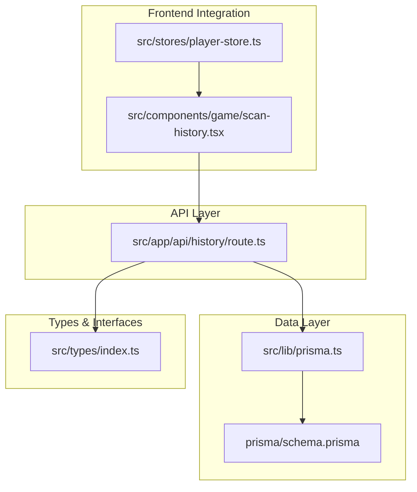
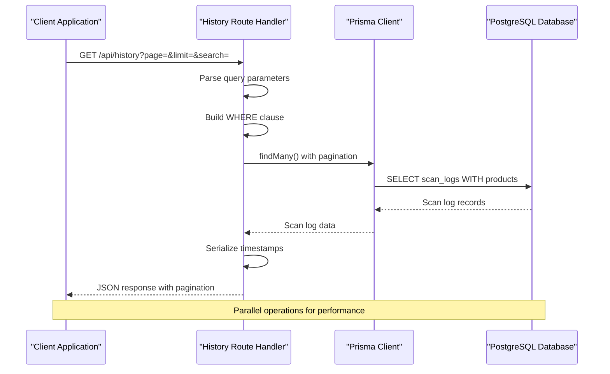
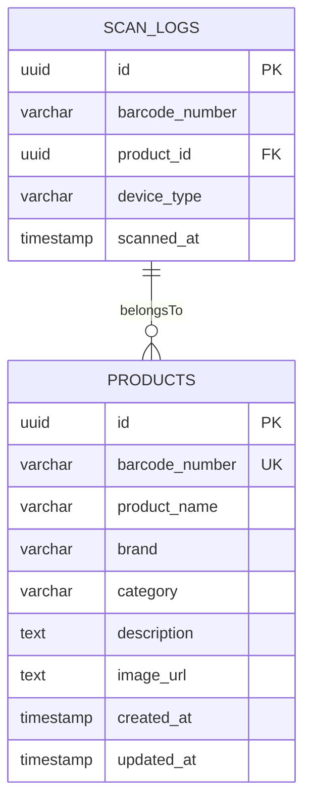
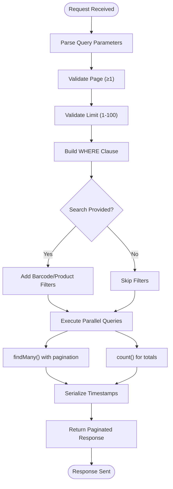
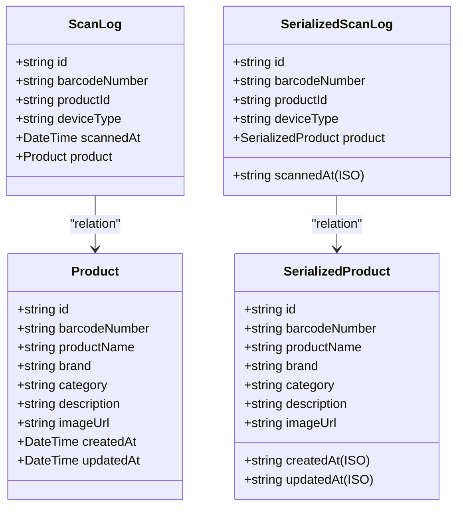
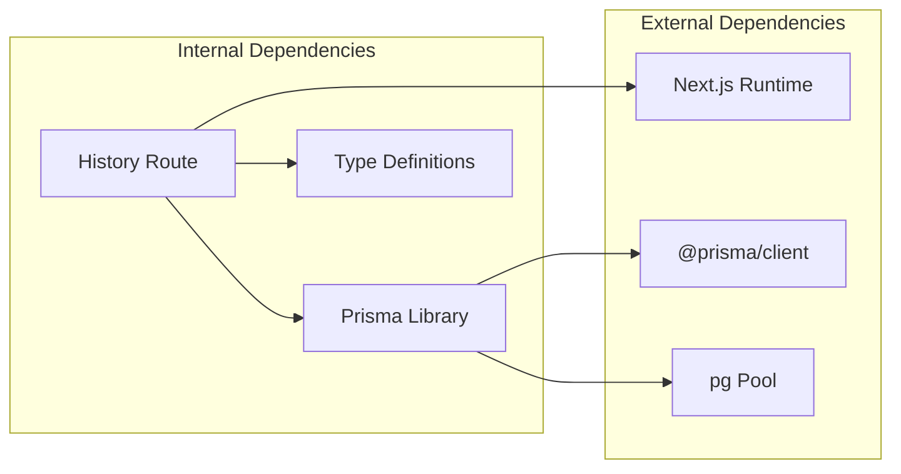
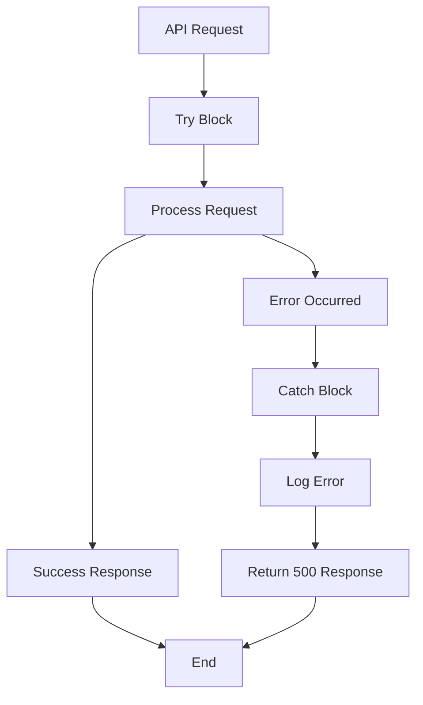

# History API

<cite>
**Referenced Files in This Document**
- [route.ts](file://src/app/api/history/route.ts)
- [prisma.ts](file://src/lib/prisma.ts)
- [schema.prisma](file://prisma/schema.prisma)
- [index.ts](file://src/types/index.ts)
- [scan-history.tsx](file://src/components/game/scan-history.tsx)
- [player-store.ts](file://src/stores/player-store.ts)
</cite>

## Table of Contents
1. [Introduction](#introduction)
2. [Project Structure](#project-structure)
3. [Core Components](#core-components)
4. [Architecture Overview](#architecture-overview)
5. [Detailed Component Analysis](#detailed-component-analysis)
6. [Dependency Analysis](#dependency-analysis)
7. [Performance Considerations](#performance-considerations)
8. [Troubleshooting Guide](#troubleshooting-guide)
9. [Conclusion](#conclusion)

## Introduction
The History API provides access to scan history data with comprehensive filtering, sorting, and pagination capabilities. This endpoint enables clients to retrieve historical barcode scanning records, including associated product information, timestamps, and device metadata. The API is designed to handle large datasets efficiently while maintaining responsive performance through optimized database queries and intelligent caching strategies.

## Project Structure
The History API is implemented as a Next.js App Router API route located in the application's API surface. The implementation integrates with Prisma ORM for database operations and follows Next.js conventions for server-side routing.



**Diagram sources**
- [route.ts:1-68](file://src/app/api/history/route.ts#L1-L68)
- [prisma.ts:1-33](file://src/lib/prisma.ts#L1-L33)
- [schema.prisma:1-47](file://prisma/schema.prisma#L1-L47)
- [index.ts:1-109](file://src/types/index.ts#L1-L109)

**Section sources**
- [route.ts:1-68](file://src/app/api/history/route.ts#L1-L68)
- [prisma.ts:1-33](file://src/lib/prisma.ts#L1-L33)
- [schema.prisma:1-47](file://prisma/schema.prisma#L1-L47)

## Core Components

### API Endpoint Definition
The History API implements a single GET endpoint at `/api/history` that provides comprehensive scan history retrieval with robust filtering capabilities.

### Request Parameters
The endpoint accepts the following query parameters:

| Parameter | Type | Default | Range | Description |
|-----------|------|---------|-------|-------------|
| `page` | integer | 1 | 1..∞ | Page number for pagination (minimum 1) |
| `limit` | integer | 20 | 1..100 | Number of records per page (clamped to 100 max) |
| `search` | string | "" | 0..∞ | Search term for barcode numbers or product names |

### Response Format
The API returns a paginated response containing scan log data with associated product information:

```typescript
interface PaginatedResponse<ScanLogWithProduct> {
  success: boolean;
  data: ScanLogWithProduct[];
  total: number;
  page: number;
  limit: number;
  totalPages: number;
}

interface ScanLogWithProduct {
  id: string;
  barcodeNumber: string;
  productId: string | null;
  deviceType: string | null;
  scannedAt: string; // ISO 8601 timestamp
  product: Product | null;
}
```

**Section sources**
- [route.ts:25-67](file://src/app/api/history/route.ts#L25-L67)
- [index.ts:14-27](file://src/types/index.ts#L14-L27)

## Architecture Overview

The History API follows a layered architecture pattern with clear separation of concerns:



**Diagram sources**
- [route.ts:25-67](file://src/app/api/history/route.ts#L25-L67)
- [prisma.ts:8-21](file://src/lib/prisma.ts#L8-L21)

The architecture implements several key design patterns:

1. **Parallel Query Execution**: Uses `Promise.all()` to execute both data retrieval and count operations concurrently
2. **Lazy Database Initialization**: Prisma client is created only when needed during runtime
3. **Type-Safe Serialization**: Converts database timestamps to ISO format while maintaining type safety
4. **Flexible Filtering**: Supports multiple search criteria with OR conditions

**Section sources**
- [route.ts:41-50](file://src/app/api/history/route.ts#L41-L50)
- [prisma.ts:8-21](file://src/lib/prisma.ts#L8-L21)

## Detailed Component Analysis

### Database Schema and Relationships

The History API operates on two primary tables with a foreign key relationship:



**Diagram sources**
- [schema.prisma:9-37](file://prisma/schema.prisma#L9-L37)

### Request Processing Pipeline

The API implements a sophisticated request processing pipeline:



**Diagram sources**
- [route.ts:25-67](file://src/app/api/history/route.ts#L25-L67)

### Data Serialization Strategy

The API employs careful serialization to ensure consistent data formatting:



**Diagram sources**
- [route.ts:7-23](file://src/app/api/history/route.ts#L7-L23)
- [index.ts:1-27](file://src/types/index.ts#L1-L27)

**Section sources**
- [route.ts:7-23](file://src/app/api/history/route.ts#L7-L23)
- [schema.prisma:9-37](file://prisma/schema.prisma#L9-L37)

### Frontend Integration Patterns

The API serves multiple frontend use cases:

| Component | Usage Pattern | Purpose |
|-----------|---------------|---------|
| Scan History UI | Real-time search and filtering | User browsing of personal scan history |
| Player Store | Local state management | Client-side caching and quick access |
| Product Lookup | Batch product resolution | Optimized product information loading |

**Section sources**
- [scan-history.tsx:20-64](file://src/components/game/scan-history.tsx#L20-L64)
- [player-store.ts:129-180](file://src/stores/player-store.ts#L129-L180)

## Dependency Analysis

The History API has minimal external dependencies, focusing on core Next.js and Prisma functionality:



**Diagram sources**
- [route.ts:1-3](file://src/app/api/history/route.ts#L1-L3)
- [prisma.ts:1-3](file://src/lib/prisma.ts#L1-L3)

### Circular Dependency Prevention
The implementation avoids circular dependencies through:
- Lazy initialization of Prisma client
- Separate type definitions module
- Clear separation between API handlers and database logic

**Section sources**
- [prisma.ts:8-21](file://src/lib/prisma.ts#L8-L21)
- [route.ts:1-5](file://src/app/api/history/route.ts#L1-L5)

## Performance Considerations

### Database Optimization Strategies

The API implements several performance optimizations:

1. **Index Utilization**: Database includes indexes on frequently queried columns
2. **Parallel Operations**: Concurrent execution of data retrieval and counting
3. **Pagination Limits**: Hard limits prevent excessive memory usage
4. **Selective Loading**: Only necessary fields are retrieved from the database

### Query Performance Characteristics

| Operation | Complexity | Optimization |
|-----------|------------|--------------|
| Basic Pagination | O(limit) | Index on scanned_at |
| Search Filtering | O(n) | Text search with indexes |
| Count Operations | O(n) | Dedicated COUNT query |
| Batch Retrieval | O(n) | Single query with LIMIT |

### Memory Management
- Response serialization converts timestamps to strings to reduce payload size
- Pagination ensures manageable response sizes
- Lazy Prisma client creation prevents build-time overhead

### Caching Strategies
- Client-side caching through React state management
- Browser caching for repeated requests
- Potential for Redis caching layer in production

**Section sources**
- [route.ts:28-30](file://src/app/api/history/route.ts#L28-L30)
- [route.ts:41-50](file://src/app/api/history/route.ts#L41-L50)
- [schema.prisma:34-35](file://prisma/schema.prisma#L34-L35)

## Troubleshooting Guide

### Common Issues and Solutions

#### Database Connection Problems
**Symptoms**: API returns internal server error
**Causes**: Missing or invalid DATABASE_URL environment variable
**Solution**: Verify database connection string and ensure it's properly configured

#### Performance Degradation
**Symptoms**: Slow response times with large datasets
**Causes**: Excessive pagination limits or complex search queries
**Solutions**: 
- Use reasonable page sizes (default 20, max 100)
- Implement targeted search queries
- Consider database indexing improvements

#### Data Consistency Issues
**Symptoms**: Missing product information in scan logs
**Causes**: Deleted products or orphaned scan records
**Solutions**: 
- Handle null product relationships gracefully
- Implement referential integrity checks

### Error Handling Implementation

The API implements comprehensive error handling:



**Diagram sources**
- [route.ts:60-66](file://src/app/api/history/route.ts#L60-L66)

**Section sources**
- [route.ts:60-66](file://src/app/api/history/route.ts#L60-L66)

## Conclusion

The History API provides a robust, scalable solution for accessing scan history data with comprehensive filtering, sorting, and pagination capabilities. Its design emphasizes performance through parallel operations, careful pagination limits, and efficient database queries. The implementation demonstrates clean separation of concerns with clear type safety and error handling.

Key strengths include:
- Efficient parallel query execution
- Flexible filtering with multiple search criteria  
- Comprehensive pagination with sensible defaults
- Type-safe serialization with proper timestamp handling
- Minimal external dependencies with clear architectural boundaries

The API is well-suited for both real-time user interactions and batch processing scenarios, with clear pathways for optimization and extension as requirements evolve.