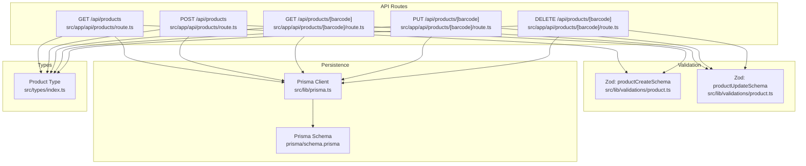
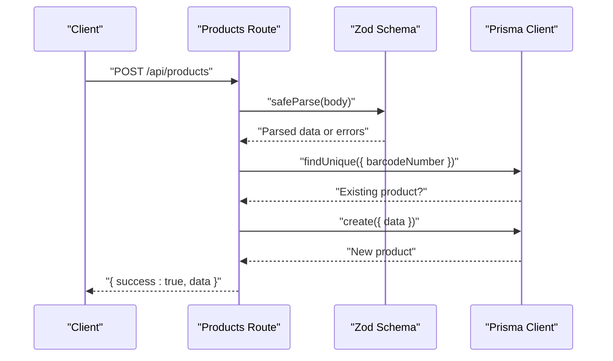
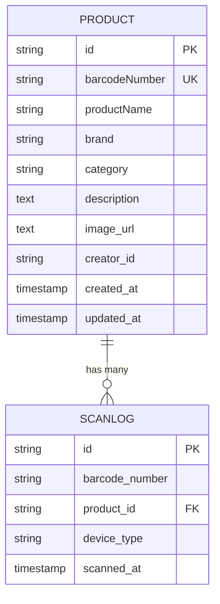
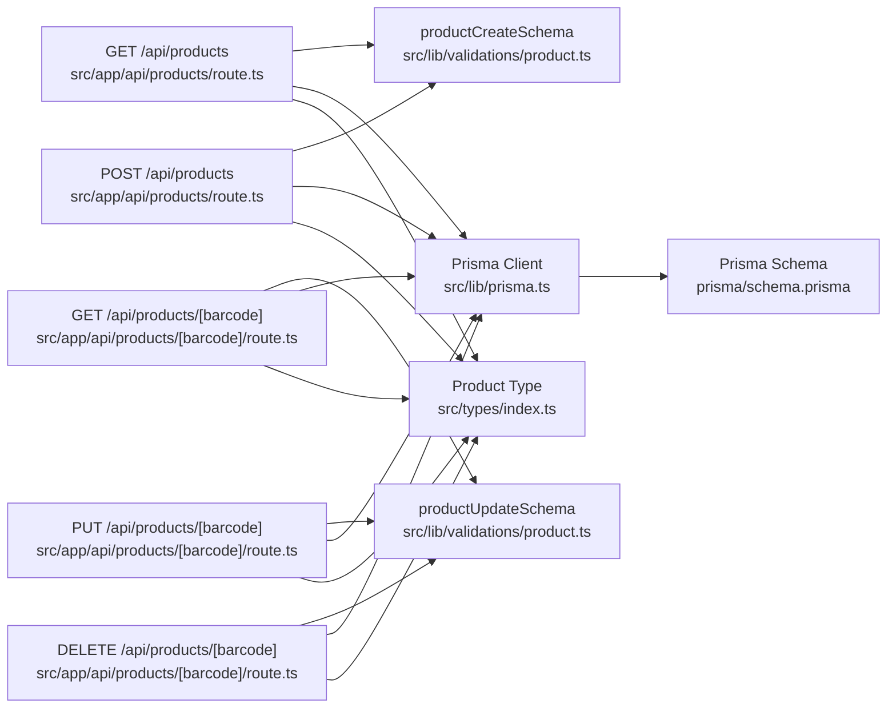

# Products API

<cite>
**Referenced Files in This Document**
- [route.ts](file://src/app/api/products/route.ts)
- [route.ts](file://src/app/api/products/[barcode]/route.ts)
- [product.ts](file://src/lib/validations/product.ts)
- [index.ts](file://src/types/index.ts)
- [schema.prisma](file://prisma/schema.prisma)
- [prisma.ts](file://src/lib/prisma.ts)
- [product-form.tsx](file://src/components/product/product-form.tsx)
</cite>

## Table of Contents
1. [Introduction](#introduction)
2. [Project Structure](#project-structure)
3. [Core Components](#core-components)
4. [Architecture Overview](#architecture-overview)
5. [Detailed Component Analysis](#detailed-component-analysis)
6. [Dependency Analysis](#dependency-analysis)
7. [Performance Considerations](#performance-considerations)
8. [Troubleshooting Guide](#troubleshooting-guide)
9. [Conclusion](#conclusion)

## Introduction
This document provides comprehensive API documentation for the Products API, covering collection retrieval, creation, and individual resource operations. It details request/response schemas, validation rules, error handling, and integration patterns for product management workflows. Authentication and rate limiting policies are outlined with practical guidance for clients.

## Project Structure
The Products API is implemented as Next.js App Router API routes backed by Prisma ORM and validated via Zod schemas. The product domain model is defined in the Prisma schema and mirrored in TypeScript types. Validation schemas enforce input correctness, while UI components demonstrate typical client-side integration patterns.

**Diagram sources**
- [route.ts:16-118](file://src/app/api/products/route.ts#L16-L118)
- [route.ts:18-125](file://src/app/api/products/[barcode]/route.ts#L18-L125)
- [product.ts:1-31](file://src/lib/validations/product.ts#L1-L31)
- [prisma.ts:1-33](file://src/lib/prisma.ts#L1-L33)
- [schema.prisma:9-24](file://prisma/schema.prisma#L9-L24)
- [index.ts:1-12](file://src/types/index.ts#L1-L12)

**Section sources**
- [route.ts:1-119](file://src/app/api/products/route.ts#L1-L119)
- [route.ts:1-126](file://src/app/api/products/[barcode]/route.ts#L1-L126)
- [product.ts:1-31](file://src/lib/validations/product.ts#L1-L31)
- [index.ts:1-12](file://src/types/index.ts#L1-L12)
- [schema.prisma:9-24](file://prisma/schema.prisma#L9-L24)
- [prisma.ts:1-33](file://src/lib/prisma.ts#L1-L33)

## Core Components
- Product collection controller: Implements GET and POST handlers for listing and creating products.
- Product resource controller: Implements GET, PUT, and DELETE handlers for individual product lookup, updates, and deletions.
- Validation layer: Zod schemas define strict input contracts for create and update operations.
- Persistence layer: Prisma client connects to PostgreSQL via a dedicated adapter.
- Types: Shared TypeScript interfaces define response shapes and constants for categories.

Key capabilities:
- Paginated listing with optional filters (search, category, barcodes).
- Rich search across product name, barcode, and brand.
- Strict validation and conflict detection for barcode uniqueness.
- Resource-level authorization for deletion using a creator ID header.

**Section sources**
- [route.ts:16-118](file://src/app/api/products/route.ts#L16-L118)
- [route.ts:18-125](file://src/app/api/products/[barcode]/route.ts#L18-L125)
- [product.ts:1-31](file://src/lib/validations/product.ts#L1-L31)
- [index.ts:1-12](file://src/types/index.ts#L1-L12)
- [schema.prisma:9-24](file://prisma/schema.prisma#L9-L24)
- [prisma.ts:1-33](file://src/lib/prisma.ts#L1-L33)

## Architecture Overview
The Products API follows a layered architecture:
- HTTP layer: Next.js App Router routes handle requests and responses.
- Validation layer: Zod schemas parse and validate incoming payloads.
- Business logic: Controllers enforce constraints (e.g., uniqueness, authorization).
- Persistence layer: Prisma ORM abstracts database operations.
- Response serialization: Dates are normalized to ISO strings; counts included for enriched resources.

**Diagram sources**
- [route.ts:69-118](file://src/app/api/products/route.ts#L69-L118)
- [product.ts:9-28](file://src/lib/validations/product.ts#L9-L28)
- [prisma.ts:27-32](file://src/lib/prisma.ts#L27-L32)

## Detailed Component Analysis

### Endpoint: GET /api/products
Purpose: Retrieve paginated product collection with optional filters.

Parameters (query):
- search: Text to match product name, barcode, or brand (case-insensitive).
- category: Exact category filter (case-insensitive).
- barcodes: Comma-separated list of barcode numbers for direct inclusion.
- page: Page number (minimum 1).
- limit: Items per page (bounded between 1 and 50).

Response shape:
- success: Boolean flag.
- data: Array of product objects with serialized dates.
- total: Total matching records.
- page: Current page.
- limit: Requested limit.
- totalPages: Derived from total and limit.

Validation and constraints:
- Filters are mutually exclusive: if barcodes are present, search is ignored.
- Pagination bounds enforced server-side.
- Sorting order is descending by creation date.

Error handling:
- 500 Internal Server Error on unhandled exceptions.

Example request:
- GET /api/products?page=1&limit=10&category=Snack

Example response:
- 200 OK with success=true and paginated data.

**Section sources**
- [route.ts:16-67](file://src/app/api/products/route.ts#L16-L67)
- [index.ts:37-49](file://src/types/index.ts#L37-L49)

### Endpoint: POST /api/products
Purpose: Create a new product.

Request body (JSON):
- barcodeNumber: Required string, up to 20 chars, alphanumeric and hyphens only.
- productName: Required string, up to 255 chars.
- brand: Optional string, up to 255 chars.
- category: Optional string, up to 255 chars.
- description: Optional string.
- imageUrl: Optional valid URL string.
- creatorId: Optional string identifier.

Validation rules:
- Enforced by productCreateSchema.
- Barcode uniqueness checked against database before insert.

Response:
- 201 Created with success=true and created product data.
- 400 Bad Request with validation error message.
- 409 Conflict if barcode already exists.
- 500 Internal Server Error on failure.

Example request:
- POST /api/products with JSON payload containing required fields.

Example response:
- 201 Created and serialized product.

**Section sources**
- [route.ts:69-118](file://src/app/api/products/route.ts#L69-L118)
- [product.ts:9-20](file://src/lib/validations/product.ts#L9-L20)

### Endpoint: GET /api/products/[barcode]
Purpose: Retrieve a single product by barcode.

Path parameter:
- barcode: Product barcode number.

Response:
- success: Boolean flag.
- data: Product object with serialized dates plus scanCount derived from scan logs.

Authorization:
- Not enforced at read time.

Error handling:
- 404 Not Found if product does not exist.
- 500 Internal Server Error on failure.

Example request:
- GET /api/products/8996001600267

Example response:
- 200 OK with success=true and enriched product data.

**Section sources**
- [route.ts:18-50](file://src/app/api/products/[barcode]/route.ts#L18-L50)
- [schema.prisma:26-37](file://prisma/schema.prisma#L26-L37)

### Endpoint: PUT /api/products/[barcode]
Purpose: Update an existing product.

Path parameter:
- barcode: Product barcode number.

Request body (JSON):
- productName: Optional, up to 255 chars.
- brand: Optional, up to 255 chars.
- category: Optional, up to 255 chars.
- description: Optional.
- imageUrl: Optional valid URL string.

Validation rules:
- Enforced by productUpdateSchema.
- Product existence verified before update.

Response:
- 200 OK with success=true and updated product data.
- 400 Bad Request with validation error message.
- 404 Not Found if product does not exist.
- 500 Internal Server Error on failure.

Example request:
- PUT /api/products/8996001600267 with partial fields.

Example response:
- 200 OK and serialized product.

**Section sources**
- [route.ts:52-88](file://src/app/api/products/[barcode]/route.ts#L52-L88)
- [product.ts:22-28](file://src/lib/validations/product.ts#L22-L28)

### Endpoint: DELETE /api/products/[barcode]
Purpose: Delete a product.

Path parameter:
- barcode: Product barcode number.

Authorization:
- Requires x-creator-id header matching the product’s creatorId.
- Returns 403 Forbidden if unauthorized.

Response:
- 200 OK with success=true and message on successful deletion.
- 403 Forbidden if requester is not the creator.
- 404 Not Found if product does not exist.
- 500 Internal Server Error on failure.

Example request:
- DELETE /api/products/8996001600267 with header x-creator-id: abc123

Example response:
- 200 OK with success=true.

**Section sources**
- [route.ts:91-125](file://src/app/api/products/[barcode]/route.ts#L91-L125)

### Data Model and Serialization
Product entity definition:
- Fields include identifiers, metadata, and timestamps.
- createdAt and updatedAt are serialized as ISO strings.
- Enriched GET /[barcode] adds scanCount from scan logs.

**Diagram sources**
- [schema.prisma:9-24](file://prisma/schema.prisma#L9-L24)
- [schema.prisma:26-37](file://prisma/schema.prisma#L26-L37)
- [index.ts:1-12](file://src/types/index.ts#L1-L12)

**Section sources**
- [index.ts:1-12](file://src/types/index.ts#L1-L12)
- [schema.prisma:9-24](file://prisma/schema.prisma#L9-L24)

### Client Integration Patterns
Common workflows:
- Bulk listing with pagination and category filtering.
- Creating a product via the admin form, which posts to /api/products.
- Editing an existing product via the admin form, which PUTs to /api/products/[barcode].
- Deleting a product with proper authorization header.

UI integration highlights:
- ProductForm validates barcode and product name locally and uploads images via /api/upload before submitting.
- Toast notifications surface success and error messages from API responses.

**Section sources**
- [product-form.tsx:54-63](file://src/components/product/product-form.tsx#L54-L63)
- [product-form.tsx:118-167](file://src/components/product/product-form.tsx#L118-L167)

## Dependency Analysis

**Diagram sources**
- [route.ts:1-119](file://src/app/api/products/route.ts#L1-L119)
- [route.ts:1-126](file://src/app/api/products/[barcode]/route.ts#L1-L126)
- [product.ts:1-31](file://src/lib/validations/product.ts#L1-L31)
- [prisma.ts:1-33](file://src/lib/prisma.ts#L1-L33)
- [schema.prisma:9-24](file://prisma/schema.prisma#L9-L24)
- [index.ts:1-12](file://src/types/index.ts#L1-L12)

**Section sources**
- [route.ts:1-119](file://src/app/api/products/route.ts#L1-L119)
- [route.ts:1-126](file://src/app/api/products/[barcode]/route.ts#L1-L126)
- [product.ts:1-31](file://src/lib/validations/product.ts#L1-L31)
- [prisma.ts:1-33](file://src/lib/prisma.ts#L1-L33)
- [schema.prisma:9-24](file://prisma/schema.prisma#L9-L24)
- [index.ts:1-12](file://src/types/index.ts#L1-L12)

## Performance Considerations
- Pagination limits: limit is bounded to prevent excessive loads; adjust client-side accordingly.
- Indexes: Product barcodeNumber is indexed; queries leverage this for fast lookups.
- Sorting: Results ordered by creation date descending; consider adding range filters if datasets grow large.
- Serialization: Date normalization avoids timezone ambiguity and reduces client parsing overhead.

[No sources needed since this section provides general guidance]

## Troubleshooting Guide
Common issues and resolutions:
- Validation failures (400): Inspect the error message returned in the response body for the first validation issue.
- Duplicate barcode (409): Ensure barcode uniqueness before POST; the API rejects duplicates.
- Not found (404): Verify the barcode exists and is correctly spelled.
- Unauthorized delete (403): Confirm the x-creator-id header matches the product’s creatorId.
- Internal errors (500): Check server logs for stack traces; endpoints log errors centrally.

Operational tips:
- Use search parameters to narrow down results when listing.
- For bulk updates, prefer incremental changes via PUT to minimize conflicts.
- When deleting, ensure the creator header is present and correct.

**Section sources**
- [route.ts:60-66](file://src/app/api/products/route.ts#L60-L66)
- [route.ts:74-79](file://src/app/api/products/route.ts#L74-L79)
- [route.ts:43-49](file://src/app/api/products/[barcode]/route.ts#L43-L49)
- [route.ts:69-74](file://src/app/api/products/[barcode]/route.ts#L69-L74)
- [route.ts:108-113](file://src/app/api/products/[barcode]/route.ts#L108-L113)

## Conclusion
The Products API offers a robust, validated, and secure interface for managing product data. Its endpoints support efficient listing, creation, retrieval, updates, and deletion with clear error semantics. By adhering to the documented schemas and patterns, clients can integrate seamlessly with the backend while maintaining data integrity and performance.