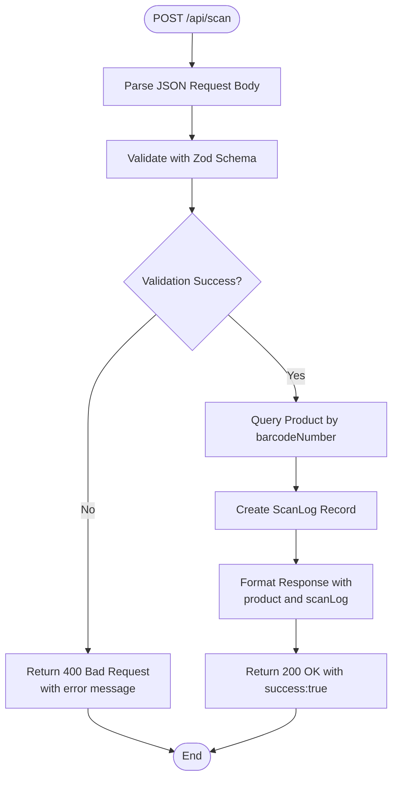
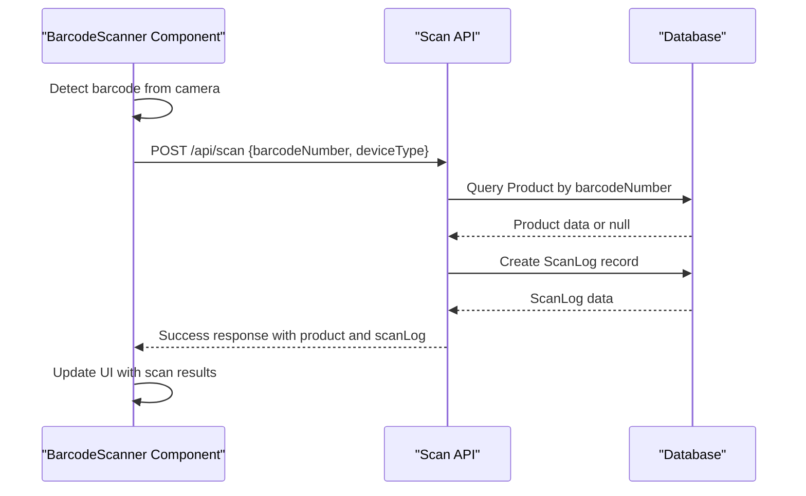

# Scan API

<cite>
**Referenced Files in This Document**
- [route.ts](file://src/app/api/scan/route.ts)
- [scan.ts](file://src/lib/validations/scan.ts)
- [prisma.ts](file://src/lib/prisma.ts)
- [schema.prisma](file://prisma/schema.prisma)
- [barcode-scanner.tsx](file://src/components/scanner/barcode-scanner.tsx)
- [page.tsx](file://src/app/scan/page.tsx)
- [route.ts](file://src/app/api/history/route.ts)
- [utils.ts](file://src/lib/utils.ts)
- [index.ts](file://src/types/index.ts)
</cite>

## Table of Contents
1. [Introduction](#introduction)
2. [Endpoint Definition](#endpoint-definition)
3. [Request Schema](#request-schema)
4. [Response Format](#response-format)
5. [Processing Logic](#processing-logic)
6. [Database Operations](#database-operations)
7. [Validation Rules](#validation-rules)
8. [Error Handling](#error-handling)
9. [Examples](#examples)
10. [Integration Points](#integration-points)
11. [Troubleshooting Guide](#troubleshooting-guide)
12. [Conclusion](#conclusion)

## Introduction

The Scan API endpoint provides barcode scanning functionality for the Barcode Adventure application. This endpoint processes barcode scans and returns product information along with scan log details. The API integrates with a PostgreSQL database through Prisma ORM and supports real-time barcode detection through the frontend scanner component.

## Endpoint Definition

**POST /api/scan**

This endpoint accepts barcode scan requests and performs product lookup while recording scan activity in the database.

**Section sources**
- [route.ts:7-59](file://src/app/api/scan/route.ts#L7-L59)

## Request Schema

The request payload must contain the following fields:

### Required Fields
- `barcodeNumber`: string (1-20 characters)
  - Must be a non-empty string
  - Maximum length: 20 characters
  - Purpose: Unique identifier for the product barcode

### Optional Fields
- `deviceType`: string (up to 100 characters)
  - Values: "mobile", "tablet", or "desktop"
  - Purpose: Identifies the device type used for scanning

**Section sources**
- [scan.ts:3-9](file://src/lib/validations/scan.ts#L3-L9)
- [route.ts:53-60](file://src/components/scanner/barcode-scanner.tsx#L53-L60)

## Response Format

The API returns a standardized response structure with the following format:

```json
{
  "success": true,
  "data": {
    "found": true,
    "product": {
      "id": "string",
      "barcodeNumber": "string",
      "productName": "string",
      "brand": "string|null",
      "category": "string|null",
      "description": "string|null",
      "imageUrl": "string|null",
      "creatorId": "string|null",
      "createdAt": "string (ISO)",
      "updatedAt": "string (ISO)"
    },
    "scanLog": {
      "id": "string",
      "barcodeNumber": "string",
      "productId": "string|null",
      "deviceType": "string|null",
      "scannedAt": "string (ISO)"
    }
  }
}
```

### Response Fields

**Top-level fields:**
- `success`: boolean indicating operation status
- `data`: object containing the scan results

**Data object fields:**
- `found`: boolean indicating if product was found
- `product`: product object (nullable)
- `scanLog`: scan log object

**Product object fields:**
- All fields from the Product model with ISO date strings for timestamps

**ScanLog object fields:**
- All fields from the ScanLog model with ISO date strings for timestamps

**Section sources**
- [route.ts:35-51](file://src/app/api/scan/route.ts#L35-L51)
- [index.ts:1-27](file://src/types/index.ts#L1-L27)

## Processing Logic

The scan endpoint follows a structured processing flow:



**Diagram sources**
- [route.ts:7-59](file://src/app/api/scan/route.ts#L7-L59)

**Section sources**
- [route.ts:7-59](file://src/app/api/scan/route.ts#L7-L59)

## Database Operations

The endpoint performs two primary database operations:

### Product Lookup
- **Operation**: `findUnique` on Product model
- **Filter**: `barcodeNumber` field
- **Purpose**: Retrieve product information for the scanned barcode
- **Result**: Product object or null if not found

### Scan Log Creation
- **Operation**: `create` on ScanLog model
- **Fields**: `barcodeNumber`, `productId`, `deviceType`
- **Purpose**: Record scan activity for analytics and history tracking
- **Timestamp**: Automatically sets `scannedAt` to current time

**Section sources**
- [route.ts:22-33](file://src/app/api/scan/route.ts#L22-L33)
- [schema.prisma:9-37](file://prisma/schema.prisma#L9-L37)

## Validation Rules

The request validation enforces the following rules:

### Barcode Number Validation
- **Required**: Yes (non-empty string)
- **Length**: Minimum 1 character, Maximum 20 characters
- **Type**: Must be a string
- **Error Messages**: 
  - "Barcode number is required" (when empty)
  - "Barcode number too long" (when > 20 characters)

### Device Type Validation
- **Required**: No (optional)
- **Length**: Maximum 100 characters
- **Type**: Must be a string
- **Format**: One of "mobile", "tablet", or "desktop"

**Section sources**
- [scan.ts:3-9](file://src/lib/validations/scan.ts#L3-L9)

## Error Handling

The API implements comprehensive error handling:

### Validation Errors (400 Bad Request)
- Occur when request schema validation fails
- Response includes `success: false` and `error` message
- Error message corresponds to the first validation issue

### Database Errors (500 Internal Server Error)
- Occur during product lookup or scan log creation
- Response includes `success: false` and generic "Internal server error" message
- Error is logged to console for debugging

### Frontend Error Handling
The frontend component handles additional error scenarios:
- Network errors during API calls
- Camera permission denials
- Loading states and user feedback

**Section sources**
- [route.ts:12-17](file://src/app/api/scan/route.ts#L12-L17)
- [route.ts:52-58](file://src/app/api/scan/route.ts#L52-L58)
- [barcode-scanner.tsx:114-119](file://src/components/scanner/barcode-scanner.tsx#L114-L119)

## Examples

### Successful Scan Example

**Request:**
```json
{
  "barcodeNumber": "1234567890128",
  "deviceType": "mobile"
}
```

**Response:**
```json
{
  "success": true,
  "data": {
    "found": true,
    "product": {
      "id": "uuid-string",
      "barcodeNumber": "1234567890128",
      "productName": "Chocolate Bar",
      "brand": "SnackCorp",
      "category": "Candy",
      "description": "Delicious chocolate treat",
      "imageUrl": "https://example.com/image.jpg",
      "creatorId": null,
      "createdAt": "2024-01-15T10:30:00.000Z",
      "updatedAt": "2024-01-15T10:30:00.000Z"
    },
    "scanLog": {
      "id": "uuid-string",
      "barcodeNumber": "1234567890128",
      "productId": "uuid-string",
      "deviceType": "mobile",
      "scannedAt": "2024-01-15T14:22:05.123Z"
    }
  }
}
```

### Not Found Scenario

**Request:**
```json
{
  "barcodeNumber": "9999999999999",
  "deviceType": "desktop"
}
```

**Response:**
```json
{
  "success": true,
  "data": {
    "found": false,
    "product": null,
    "scanLog": {
      "id": "uuid-string",
      "barcodeNumber": "9999999999999",
      "productId": null,
      "deviceType": "desktop",
      "scannedAt": "2024-01-15T14:22:05.123Z"
    }
  }
}
```

### Validation Error Response

**Request:**
```json
{
  "barcodeNumber": "",
  "deviceType": "invalid-device-type"
}
```

**Response:**
```json
{
  "success": false,
  "error": "Barcode number is required"
}
```

**Section sources**
- [route.ts:35-51](file://src/app/api/scan/route.ts#L35-L51)
- [scan.ts:3-9](file://src/lib/validations/scan.ts#L3-L9)

## Integration Points

### Frontend Integration
The API integrates with the barcode scanner component through the following flow:



**Diagram sources**
- [barcode-scanner.tsx:46-85](file://src/components/scanner/barcode-scanner.tsx#L46-L85)
- [route.ts:7-59](file://src/app/api/scan/route.ts#L7-L59)

### History Integration
Scan logs are accessible through the history API endpoint, which provides paginated access to scan records with product information.

**Section sources**
- [route.ts:25-67](file://src/app/api/history/route.ts#L25-L67)

## Troubleshooting Guide

### Common Issues and Solutions

#### 1. Camera Access Denied
**Symptoms**: Error message "Camera access denied. Please allow camera permissions and refresh."
**Causes**: 
- User denied camera permissions
- Browser security restrictions
- Camera already in use by another application

**Solutions**:
- Grant camera permissions in browser settings
- Close other applications using the camera
- Try a different browser or device

#### 2. Barcode Not Found
**Symptoms**: `found: false` in response
**Causes**:
- Invalid or non-existent barcode number
- Product not registered in database
- Barcode format not supported

**Solutions**:
- Verify barcode readability and alignment
- Check barcode format (EAN-13, UPC-A, etc.)
- Register product in the system if missing

#### 3. Network Connectivity Issues
**Symptoms**: Error message "Network error. Please try again."
**Causes**:
- Temporary network connectivity problems
- API endpoint unavailability
- CORS restrictions

**Solutions**:
- Check internet connection
- Retry after a few minutes
- Verify API endpoint accessibility

#### 4. Database Connection Problems
**Symptoms**: Generic "Internal server error" responses
**Causes**:
- Database server unavailable
- Incorrect database credentials
- Migration issues

**Solutions**:
- Check database connectivity
- Verify environment variables
- Review server logs for specific error details

#### 5. Validation Errors
**Symptoms**: Specific error messages for invalid input
**Common Issues**:
- Empty barcodeNumber
- BarcodeNumber exceeding 20 characters
- Invalid deviceType format

**Solutions**:
- Ensure barcodeNumber is present and within 20 characters
- Use valid deviceType values ("mobile", "tablet", "desktop")
- Remove special characters from barcode input

**Section sources**
- [route.ts:12-17](file://src/app/api/scan/route.ts#L12-L17)
- [route.ts:52-58](file://src/app/api/scan/route.ts#L52-L58)
- [barcode-scanner.tsx:114-119](file://src/components/scanner/barcode-scanner.tsx#L114-L119)

## Conclusion

The Scan API provides a robust solution for barcode scanning functionality with comprehensive validation, error handling, and database integration. The endpoint efficiently processes barcode scans, retrieves product information, and maintains detailed scan logs for analytics and history tracking. The implementation follows modern React patterns with proper error handling and user feedback mechanisms.

Key strengths of the implementation include:
- Strong input validation using Zod schemas
- Comprehensive error handling at multiple levels
- Efficient database operations with proper indexing
- Real-time integration with the frontend scanner component
- Extensible design supporting various device types

The API serves as a foundation for the Barcode Adventure application's core scanning functionality while providing clear extension points for future enhancements.