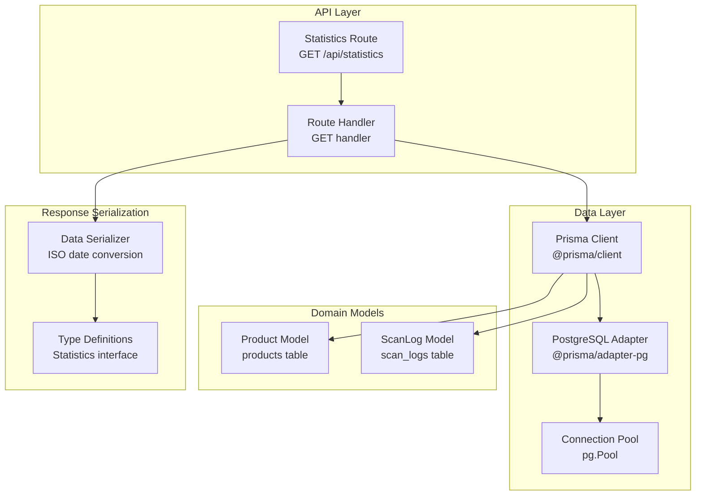
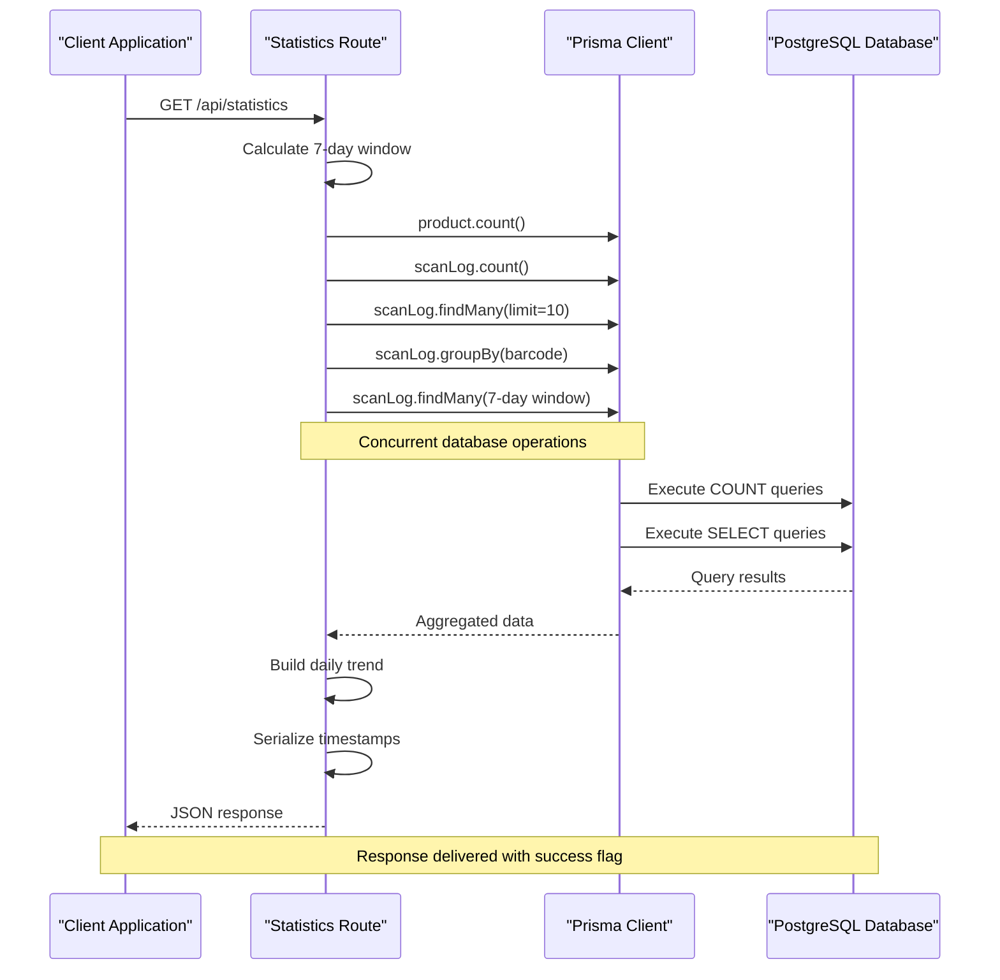
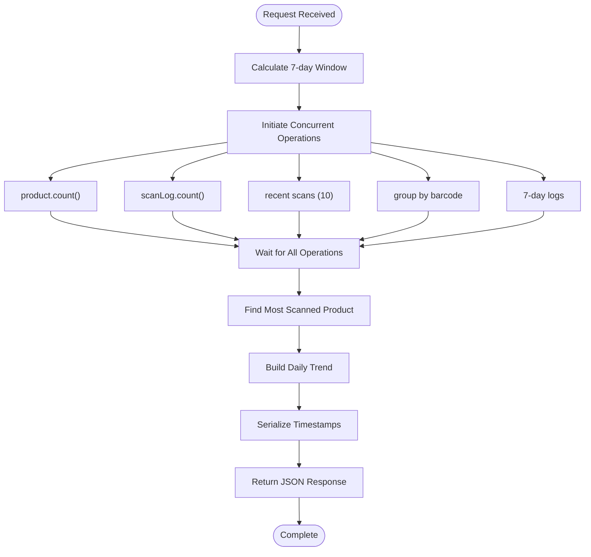
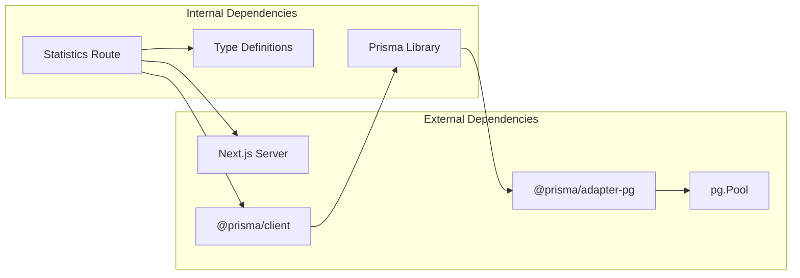

# Statistics API

<cite>
**Referenced Files in This Document**
- [route.ts](file://src/app/api/statistics/route.ts)
- [prisma.ts](file://src/lib/prisma.ts)
- [index.ts](file://src/types/index.ts)
- [schema.prisma](file://prisma/schema.prisma)
- [game-stats.tsx](file://src/components/game/game-stats.tsx)
</cite>

## Table of Contents
1. [Introduction](#introduction)
2. [Project Structure](#project-structure)
3. [Core Components](#core-components)
4. [Architecture Overview](#architecture-overview)
5. [Detailed Component Analysis](#detailed-component-analysis)
6. [Dependency Analysis](#dependency-analysis)
7. [Performance Considerations](#performance-considerations)
8. [Troubleshooting Guide](#troubleshooting-guide)
9. [Conclusion](#conclusion)

## Introduction
This document provides comprehensive API documentation for the Statistics API endpoint that powers usage analytics and reporting data. The GET /api/statistics endpoint delivers aggregated insights including scan counts, product categories, device usage patterns, and time-based trends. It serves as the backbone for the game's global statistics dashboard and supports data-driven visualizations for administrators and power users.

The endpoint is designed to be lightweight yet informative, returning a curated set of metrics that enable real-time monitoring of platform activity while maintaining optimal performance characteristics for production environments.

## Project Structure
The Statistics API is implemented as a Next.js App Router API route with integrated data serialization and error handling. The implementation leverages Prisma ORM for efficient database queries and follows Next.js best practices for server-side rendering and dynamic route handling.

**Diagram sources**
- [route.ts:1-106](file://src/app/api/statistics/route.ts#L1-L106)
- [prisma.ts:1-33](file://src/lib/prisma.ts#L1-L33)
- [schema.prisma:9-37](file://prisma/schema.prisma#L9-L37)

**Section sources**
- [route.ts:1-106](file://src/app/api/statistics/route.ts#L1-L106)
- [prisma.ts:1-33](file://src/lib/prisma.ts#L1-L33)
- [schema.prisma:1-47](file://prisma/schema.prisma#L1-L47)

## Core Components
The Statistics API consists of several interconnected components that work together to deliver comprehensive analytics data:

### Endpoint Definition
The API endpoint is defined as a Next.js App Router route with dynamic route handling disabled to ensure fresh data retrieval on each request. The route exports a GET handler that orchestrates multiple concurrent database queries to gather comprehensive statistics.

### Data Models and Types
The statistics endpoint operates on two primary data models: Product and ScanLog. These models define the structure of analytics data and support various aggregation operations including counting, grouping, and time-series analysis.

### Response Serialization
The API implements robust data serialization that converts database timestamps to ISO format strings, ensuring consistent JSON responses across different client environments and preventing timezone-related parsing issues.

**Section sources**
- [route.ts:5-25](file://src/app/api/statistics/route.ts#L5-L25)
- [index.ts:1-41](file://src/types/index.ts#L1-L41)
- [schema.prisma:9-37](file://prisma/schema.prisma#L9-L37)

## Architecture Overview
The Statistics API follows a layered architecture pattern that separates concerns between data access, business logic, and presentation. The system is designed for scalability and maintainability while ensuring optimal performance for analytics workloads.

**Diagram sources**
- [route.ts:27-97](file://src/app/api/statistics/route.ts#L27-L97)

## Detailed Component Analysis

### Statistics Route Implementation
The Statistics API route implements a sophisticated data collection strategy that performs five concurrent database operations to gather comprehensive analytics data. The route utilizes Next.js dynamic route handling to bypass static generation and ensure fresh data retrieval.

#### Request Processing Flow
The route begins by calculating the seven-day window boundary and immediately initiates concurrent database operations using Promise.all. This approach minimizes total response time while ensuring all required data is available for aggregation.

#### Data Aggregation Strategy
The implementation employs multiple aggregation techniques:
- Simple counting operations for total products and scans
- Advanced grouping operations to identify the most scanned product
- Time-series analysis for daily scan trends over the past week
- Recent activity sampling for immediate user feedback

**Diagram sources**
- [route.ts:27-97](file://src/app/api/statistics/route.ts#L27-L97)

**Section sources**
- [route.ts:27-105](file://src/app/api/statistics/route.ts#L27-L105)

### Database Schema and Relationships
The statistics endpoint relies on a well-designed database schema that supports efficient analytics operations. The schema includes appropriate indexing strategies and foreign key relationships that optimize query performance for analytics workloads.

#### Product Model
The Product model serves as the foundation for product analytics, storing essential metadata including barcode identifiers, product names, brands, categories, and timestamps. The model includes unique constraints on barcode numbers and appropriate indexing for fast lookups.

#### ScanLog Model
The ScanLog model captures all scanning events with comprehensive tracking including barcode numbers, associated product IDs, device types, and precise timestamps. The model supports efficient time-series queries through strategic indexing on both barcode and timestamp fields.

**Section sources**
- [schema.prisma:9-37](file://prisma/schema.prisma#L9-L37)

### Response Format Specification
The Statistics API returns a structured JSON response containing success indicators, data payload, and error information when applicable. The response format is designed for easy consumption by frontend applications and analytics dashboards.

#### Response Structure
The response follows a standardized format with the following key components:
- `success`: Boolean indicator of operation status
- `data`: Analytics payload containing all requested metrics
- `error`: Error message when operation fails

#### Data Payload Components
The data payload includes five primary metrics:
- `totalProducts`: Total count of registered products
- `totalScans`: Total count of all scanning events
- `mostScannedProduct`: Product with highest scan frequency
- `recentScans`: Latest scanning events with product details
- `dailyScanTrend`: Time-series data for the past seven days

**Section sources**
- [route.ts:88-97](file://src/app/api/statistics/route.ts#L88-L97)
- [index.ts:29-35](file://src/types/index.ts#L29-L35)

### Data Serialization and Type Safety
The API implements comprehensive data serialization to ensure consistent timestamp handling and type-safe responses. The serialization process converts database timestamps to ISO format strings, preventing timezone-related parsing issues across different client environments.

#### Serialization Strategy
The implementation includes specialized serializers for both Product and ScanLog entities, converting datetime fields to ISO strings while preserving all other data types. This approach ensures compatibility with JavaScript Date objects and simplifies client-side data processing.

**Section sources**
- [route.ts:7-25](file://src/app/api/statistics/route.ts#L7-L25)
- [index.ts:1-21](file://src/types/index.ts#L1-L21)

## Dependency Analysis
The Statistics API has minimal external dependencies, focusing on core functionality while leveraging established libraries for database connectivity and type safety.

**Diagram sources**
- [route.ts:1-3](file://src/app/api/statistics/route.ts#L1-L3)
- [prisma.ts:1-21](file://src/lib/prisma.ts#L1-L21)

### Database Connectivity
The Prisma library provides robust database connectivity through a connection pool abstraction that manages PostgreSQL connections efficiently. The implementation includes graceful fallback behavior during development and build-time scenarios.

### Type Safety and Validation
The API maintains strong type safety through TypeScript interfaces and Prisma client-generated types. This approach prevents runtime errors and ensures consistent data structures across the application.

**Section sources**
- [prisma.ts:1-33](file://src/lib/prisma.ts#L1-L33)
- [index.ts:1-41](file://src/types/index.ts#L1-L41)

## Performance Considerations
The Statistics API is designed with performance optimization as a primary concern, implementing several strategies to ensure efficient data retrieval and processing.

### Concurrency Strategy
The route utilizes Promise.all to execute multiple database operations concurrently, reducing total response time from potentially hundreds of milliseconds to a single round-trip latency. This approach maximizes throughput while maintaining data consistency.

### Query Optimization
Database queries are optimized for analytics workloads through strategic use of LIMIT clauses, appropriate ORDER BY operations, and targeted SELECT statements. The implementation avoids unnecessary data transfer by selecting only required fields.

### Memory Management
The API implements careful memory management by processing data in batches and avoiding large intermediate data structures. The daily trend calculation uses a simple map-based approach that scales linearly with the number of days in the analysis period.

### Caching Strategy
While the current implementation does not include built-in caching, the endpoint is designed to support caching strategies. The force-dynamic routing setting allows for flexible caching policies at the deployment level without requiring code changes.

**Section sources**
- [route.ts:32-54](file://src/app/api/statistics/route.ts#L32-L54)
- [route.ts:71-86](file://src/app/api/statistics/route.ts#L71-L86)

## Troubleshooting Guide
The Statistics API includes comprehensive error handling and logging mechanisms to facilitate troubleshooting and monitoring of analytics operations.

### Error Handling Patterns
The API implements structured error handling that catches database exceptions, validates input parameters, and returns meaningful error messages. All errors are logged with context information for debugging purposes.

### Common Issues and Solutions
- **Database Connection Failures**: The Prisma client includes fallback behavior for development environments and build-time scenarios
- **Missing Data**: The API gracefully handles cases where analytics data is unavailable or incomplete
- **Performance Degradation**: Monitoring indicates when database queries exceed acceptable thresholds

### Monitoring and Logging
The implementation includes console logging for error conditions and follows standard Next.js error handling patterns. Production deployments should implement additional monitoring through application performance monitoring tools.

**Section sources**
- [route.ts:98-104](file://src/app/api/statistics/route.ts#L98-L104)
- [prisma.ts:11-16](file://src/lib/prisma.ts#L11-L16)

## Conclusion
The Statistics API provides a robust foundation for analytics and reporting capabilities within the Barcode Adventure platform. Its design emphasizes performance, scalability, and maintainability while delivering comprehensive insights into platform usage patterns.

The endpoint successfully balances data richness with performance efficiency, making it suitable for both real-time dashboards and historical analysis. The modular architecture supports future enhancements including additional metrics, filtering capabilities, and advanced aggregation features.

Key strengths of the implementation include its concurrent query strategy, comprehensive type safety, and thoughtful error handling. These features combine to create a reliable analytics endpoint that can serve as the foundation for more advanced reporting and business intelligence capabilities.