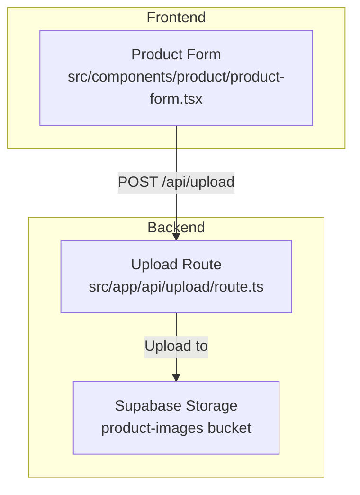
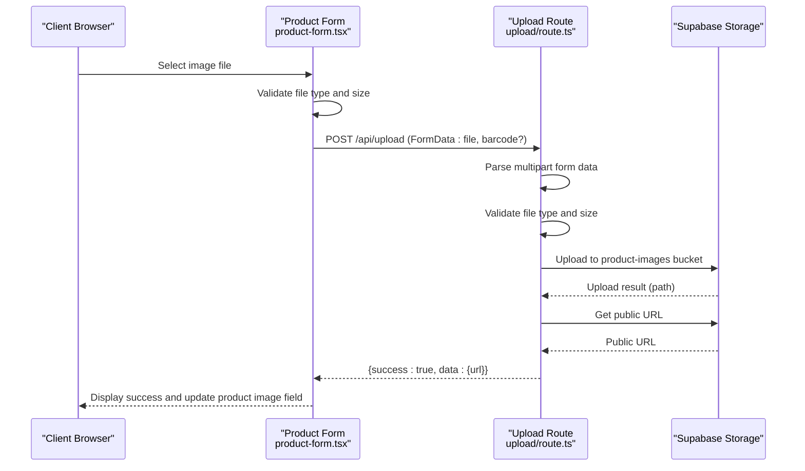
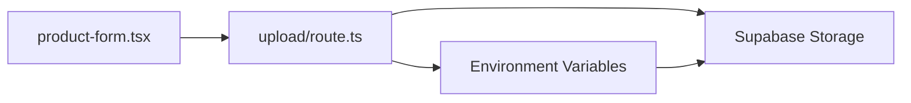

# Upload API

<cite>
**Referenced Files in This Document**
- [src/app/api/upload/route.ts](file://src/app/api/upload/route.ts)
- [src/components/product/product-form.tsx](file://src/components/product/product-form.tsx)
- [SETUP.md](file://SETUP.md)
- [next.config.ts](file://next.config.ts)
- [package.json](file://package.json)
- [setup-supabase.js](file://setup-supabase.js)
</cite>

## Table of Contents
1. [Introduction](#introduction)
2. [Project Structure](#project-structure)
3. [Core Components](#core-components)
4. [Architecture Overview](#architecture-overview)
5. [Detailed Component Analysis](#detailed-component-analysis)
6. [Dependency Analysis](#dependency-analysis)
7. [Performance Considerations](#performance-considerations)
8. [Troubleshooting Guide](#troubleshooting-guide)
9. [Conclusion](#conclusion)

## Introduction
This document provides comprehensive API documentation for the Upload API endpoint, focusing on the POST /api/upload endpoint used for product image uploads. It covers supported file types, size limitations, validation rules, multipart form data handling, file processing workflows, response formats, error handling, security considerations, and integration patterns for product image uploads.

## Project Structure
The Upload API is implemented as a Next.js App Router API route and integrates with the frontend product form component. The backend relies on Supabase Storage for file persistence and Supabase Auth for service role authentication.

**Diagram sources**
- [src/app/api/upload/route.ts:1-77](file://src/app/api/upload/route.ts#L1-L77)
- [src/components/product/product-form.tsx:93-116](file://src/components/product/product-form.tsx#L93-L116)

**Section sources**
- [src/app/api/upload/route.ts:1-77](file://src/app/api/upload/route.ts#L1-L77)
- [src/components/product/product-form.tsx:93-116](file://src/components/product/product-form.tsx#L93-L116)

## Core Components
- Upload API Route: Handles multipart form data, validates file metadata, uploads to Supabase Storage, and returns a public URL.
- Frontend Integration: Product form component prepares FormData and sends requests to the upload endpoint.
- Supabase Storage: Stores uploaded images in the product-images bucket with public access.

Key constants and behaviors:
- Maximum file size: 5 MB
- Allowed MIME types: image/jpeg, image/png, image/webp
- Filename generation: Uses barcode if provided; otherwise generates a UUID-based filename
- Public URL retrieval: Returns a public URL for the uploaded image

**Section sources**
- [src/app/api/upload/route.ts:6-7](file://src/app/api/upload/route.ts#L6-L7)
- [src/app/api/upload/route.ts:42-44](file://src/app/api/upload/route.ts#L42-L44)
- [src/app/api/upload/route.ts:61-63](file://src/app/api/upload/route.ts#L61-L63)
- [src/components/product/product-form.tsx:66-73](file://src/components/product/product-form.tsx#L66-L73)

## Architecture Overview
The upload workflow involves the frontend sending a multipart/form-data request containing the file and optional barcode, the backend validating the request, uploading to Supabase Storage, and returning a public URL.

**Diagram sources**
- [src/components/product/product-form.tsx:93-116](file://src/components/product/product-form.tsx#L93-L116)
- [src/app/api/upload/route.ts:9-76](file://src/app/api/upload/route.ts#L9-L76)

## Detailed Component Analysis

### Upload API Endpoint: POST /api/upload
- Request Method: POST
- Path: /api/upload
- Content-Type: multipart/form-data
- Required Fields:
  - file: Binary file content (image/jpeg, image/png, image/webp)
  - barcode: Optional string used to derive filename when present
- Response Formats:
  - Success: { success: true, data: { url: string } }
  - Error: { success: false, error: string }

Validation Rules:
- File presence: Required
- MIME type: Must be one of image/jpeg, image/png, image/webp
- Size limit: Maximum 5 MB
- Filename: If barcode is provided, filename becomes {barcode}.{ext}; otherwise, a UUID-based filename is generated

Processing Workflow:
1. Parse multipart form data
2. Extract file and optional barcode
3. Validate file presence, type, and size
4. Initialize Supabase client using service role key
5. Determine filename and path
6. Upload file to Supabase Storage bucket "product-images"
7. Retrieve public URL
8. Return success response with public URL

Security Considerations:
- Uses service role key to bypass Row Level Security during upload
- Supabase bucket configured as public for images
- Frontend performs client-side validation to improve UX

Error Handling:
- 400 errors for missing file, invalid type, or oversized file
- 500 errors for storage upload failures
- Generic 500 errors for unexpected exceptions

**Section sources**
- [src/app/api/upload/route.ts:9-76](file://src/app/api/upload/route.ts#L9-L76)
- [src/app/api/upload/route.ts:6-7](file://src/app/api/upload/route.ts#L6-L7)
- [src/app/api/upload/route.ts:42-44](file://src/app/api/upload/route.ts#L42-L44)
- [src/app/api/upload/route.ts:61-63](file://src/app/api/upload/route.ts#L61-L63)

### Frontend Integration: Product Form
- Client-side validation mirrors backend rules
- Builds FormData with file and optional barcode
- Sends request to /api/upload
- Updates product form with returned public URL
- Provides user feedback via toast notifications

Integration Pattern:
- When barcode is known, append barcode to FormData to use as filename
- On success, set the product image URL field to the returned URL
- On failure, show error message and clear preview

**Section sources**
- [src/components/product/product-form.tsx:66-73](file://src/components/product/product-form.tsx#L66-L73)
- [src/components/product/product-form.tsx:93-116](file://src/components/product/product-form.tsx#L93-L116)

### Supabase Storage Configuration
- Bucket: product-images
- Access: Public
- Allowed MIME types: image/jpeg, image/png, image/webp
- File size limit: 5 MB
- Remote patterns: Next.js configured to allow images from Supabase storage URLs

**Section sources**
- [SETUP.md:34-49](file://SETUP.md#L34-L49)
- [next.config.ts:4-12](file://next.config.ts#L4-L12)
- [setup-supabase.js:14-20](file://setup-supabase.js#L14-L20)

## Dependency Analysis
The upload endpoint depends on:
- Next.js runtime for request/response handling
- Supabase SDK for storage operations
- Environment variables for Supabase configuration
- Frontend component for request initiation

**Diagram sources**
- [src/components/product/product-form.tsx:93-116](file://src/components/product/product-form.tsx#L93-L116)
- [src/app/api/upload/route.ts:37-40](file://src/app/api/upload/route.ts#L37-L40)

**Section sources**
- [package.json:24-25](file://package.json#L24-L25)
- [src/app/api/upload/route.ts:37-40](file://src/app/api/upload/route.ts#L37-L40)

## Performance Considerations
- File size limit reduces bandwidth and storage costs
- Client-side validation prevents unnecessary requests
- Public bucket enables efficient CDN delivery of images
- UUID-based filenames prevent conflicts and enable caching

## Troubleshooting Guide
Common Issues and Resolutions:
- File type errors: Ensure image is JPEG, PNG, or WebP
- File too large: Compress or resize images to under 5 MB
- Upload failures: Verify Supabase bucket exists and is public
- CORS/image loading issues: Confirm Next.js remote patterns include Supabase storage URLs
- Authentication problems: Check service role key and bucket policies

**Section sources**
- [SETUP.md:149-152](file://SETUP.md#L149-L152)
- [next.config.ts:4-12](file://next.config.ts#L4-L12)

## Conclusion
The Upload API provides a straightforward mechanism for product image uploads with clear validation rules and responsive error handling. The integration with Supabase Storage ensures reliable, scalable image hosting with public access for seamless frontend rendering. Following the documented patterns and configurations will enable robust product image management within the application.