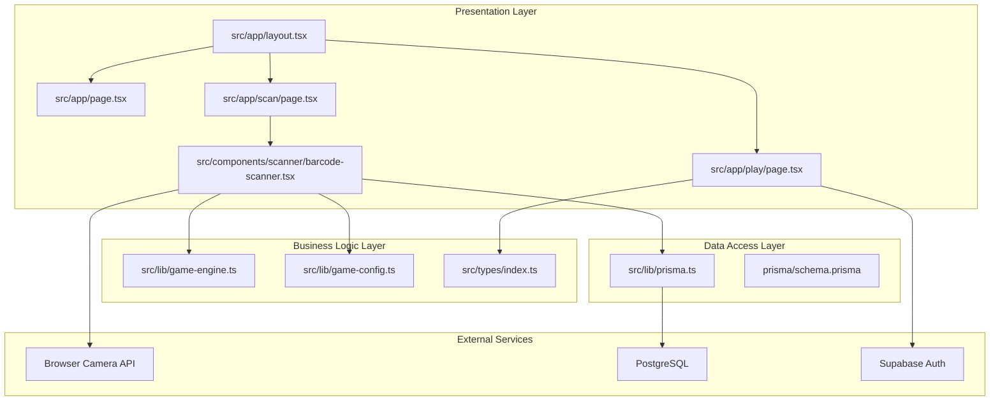
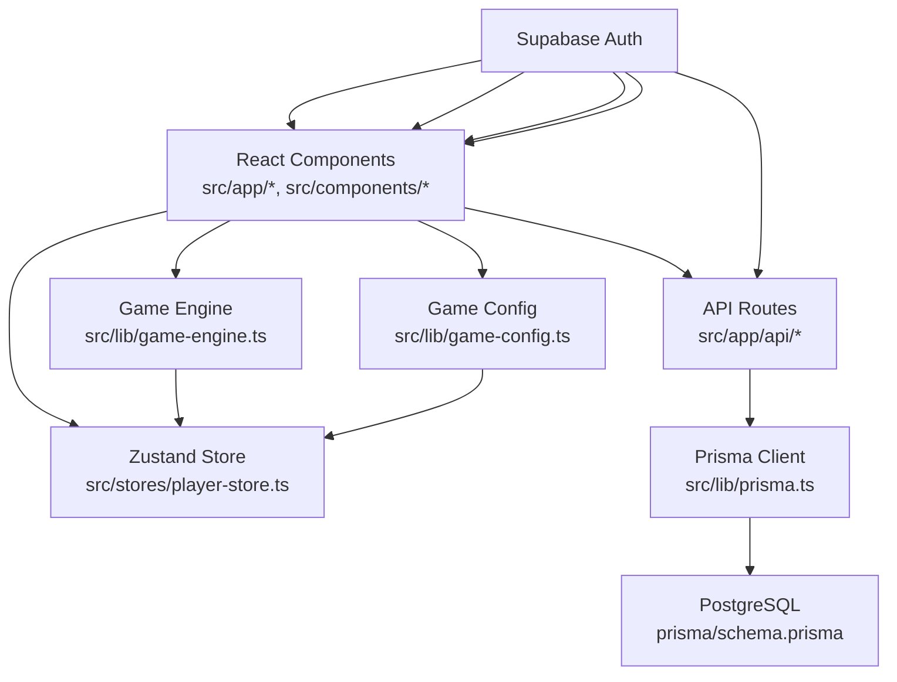
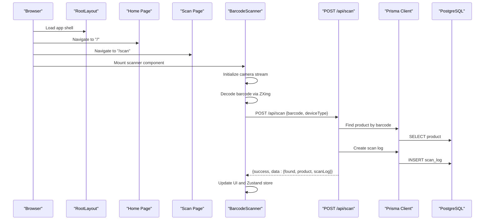
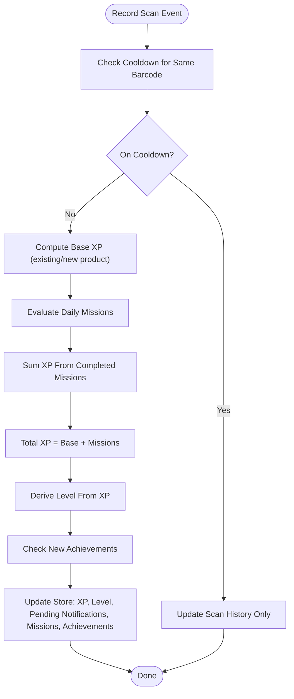
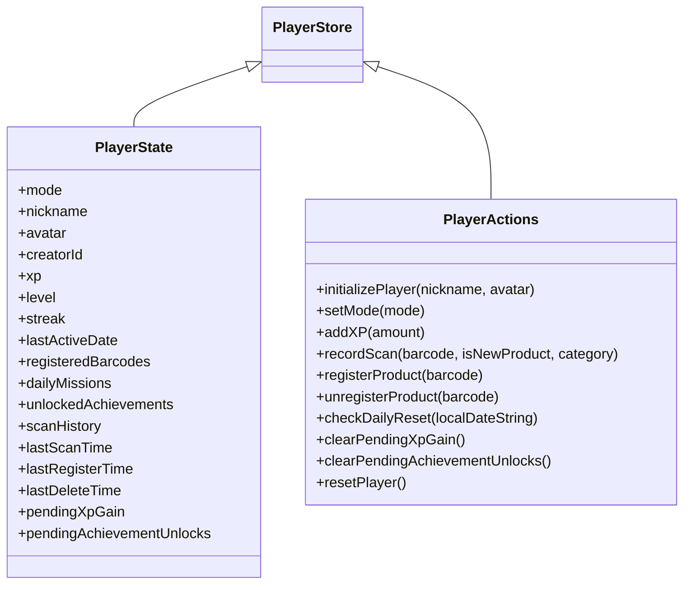
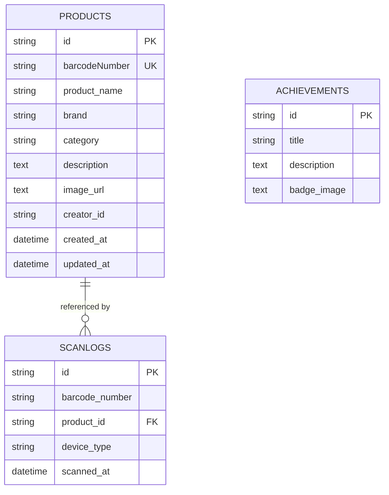
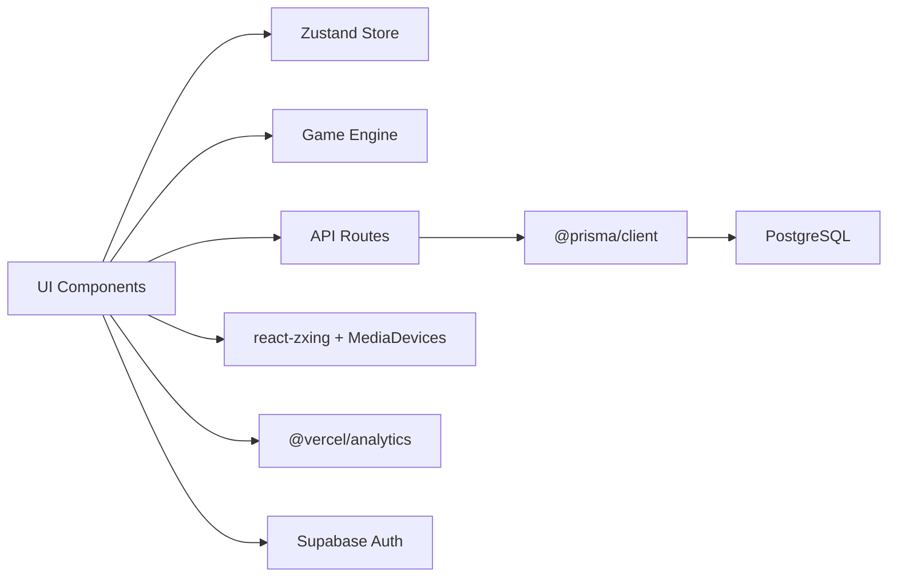

# Architecture & Design

<cite>
**Referenced Files in This Document**
- [README.md](file://README.md)
- [package.json](file://package.json)
- [next.config.ts](file://next.config.ts)
- [src/lib/game-engine.ts](file://src/lib/game-engine.ts)
- [src/lib/game-config.ts](file://src/lib/game-config.ts)
- [src/stores/player-store.ts](file://src/stores/player-store.ts)
- [src/lib/prisma.ts](file://src/lib/prisma.ts)
- [prisma/schema.prisma](file://prisma/schema.prisma)
- [src/app/layout.tsx](file://src/app/layout.tsx)
- [src/app/page.tsx](file://src/app/page.tsx)
- [src/app/scan/page.tsx](file://src/app/scan/page.tsx)
- [src/components/scanner/barcode-scanner.tsx](file://src/components/scanner/barcode-scanner.tsx)
- [src/app/api/scan/route.ts](file://src/app/api/scan/route.ts)
- [src/app/play/page.tsx](file://src/app/play/page.tsx)
- [src/types/index.ts](file://src/types/index.ts)
</cite>

## Table of Contents
1. [Introduction](#introduction)
2. [Project Structure](#project-structure)
3. [Core Components](#core-components)
4. [Architecture Overview](#architecture-overview)
5. [Detailed Component Analysis](#detailed-component-analysis)
6. [Dependency Analysis](#dependency-analysis)
7. [Performance Considerations](#performance-considerations)
8. [Troubleshooting Guide](#troubleshooting-guide)
9. [Conclusion](#conclusion)
10. [Appendices](#appendices)

## Introduction
This document describes the architecture and design of the Barcode Adventure system. It explains how the system applies Clean Architecture principles with clear separation between presentation, business logic, and data layers. It documents the Next.js App Router-based file-system routing, the component hierarchy from React UI to the game engine and Prisma-backed persistence, and the state management strategy using Zustand. It also covers system boundaries, data flows, and integrations with external services such as camera APIs and PostgreSQL via Prisma.

## Project Structure
The project follows Next.js App Router conventions with a layered structure:
- Presentation layer: React components under src/app and src/components
- Business logic layer: Game engine and configuration under src/lib
- Data access layer: Prisma client and schema under prisma and src/lib
- Stores: Reactive state management under src/stores
- Types: Shared TypeScript types under src/types

**Diagram sources**
- [src/app/layout.tsx:1-48](file://src/app/layout.tsx#L1-L48)
- [src/app/page.tsx:1-231](file://src/app/page.tsx#L1-L231)
- [src/app/scan/page.tsx:1-33](file://src/app/scan/page.tsx#L1-L33)
- [src/app/play/page.tsx:1-287](file://src/app/play/page.tsx#L1-L287)
- [src/components/scanner/barcode-scanner.tsx:1-217](file://src/components/scanner/barcode-scanner.tsx#L1-L217)
- [src/lib/game-engine.ts:1-241](file://src/lib/game-engine.ts#L1-L241)
- [src/lib/game-config.ts:1-28](file://src/lib/game-config.ts#L1-L28)
- [src/lib/prisma.ts:1-33](file://src/lib/prisma.ts#L1-L33)
- [prisma/schema.prisma:1-47](file://prisma/schema.prisma#L1-L47)

**Section sources**
- [README.md:1-37](file://README.md#L1-L37)
- [package.json:1-60](file://package.json#L1-L60)
- [next.config.ts:1-16](file://next.config.ts#L1-L16)

## Core Components
- Presentation layer
  - Root layout and metadata: [src/app/layout.tsx:1-48](file://src/app/layout.tsx#L1-L48)
  - Landing/home page with animations and navigation: [src/app/page.tsx:1-231](file://src/app/page.tsx#L1-L231)
  - Scanner page hosting the camera scanner: [src/app/scan/page.tsx:1-33](file://src/app/scan/page.tsx#L1-L33)
  - Game hub page orchestrating tabs, modals, and store subscriptions: [src/app/play/page.tsx:1-287](file://src/app/play/page.tsx#L1-L287)
  - Scanner component integrating camera capture and ZXing decoding: [src/components/scanner/barcode-scanner.tsx:1-217](file://src/components/scanner/barcode-scanner.tsx#L1-L217)

- Business logic layer
  - Game engine: daily missions generation, mission evaluation, achievement checks: [src/lib/game-engine.ts:1-241](file://src/lib/game-engine.ts#L1-L241)
  - Game configuration: XP, cooldowns, UI timings, level formula: [src/lib/game-config.ts:1-28](file://src/lib/game-config.ts#L1-L28)
  - Shared types: Product, ScanLog, ScanResult, Statistics, categories, and mission/achievement models: [src/types/index.ts:1-109](file://src/types/index.ts#L1-L109)

- State management
  - Zustand store: player state, actions, persistence, daily reset, XP/level calculation, and notifications: [src/stores/player-store.ts:1-294](file://src/stores/player-store.ts#L1-L294)

- Data access
  - Prisma client factory with Postgres adapter and build-time safety: [src/lib/prisma.ts:1-33](file://src/lib/prisma.ts#L1-L33)
  - Prisma schema modeling Products, ScanLogs, and Achievements: [prisma/schema.prisma:1-47](file://prisma/schema.prisma#L1-L47)

- API routes
  - Scanner endpoint validating input and returning product/scan log: [src/app/api/scan/route.ts:1-60](file://src/app/api/scan/route.ts#L1-L60)

**Section sources**
- [src/app/layout.tsx:1-48](file://src/app/layout.tsx#L1-L48)
- [src/app/page.tsx:1-231](file://src/app/page.tsx#L1-L231)
- [src/app/scan/page.tsx:1-33](file://src/app/scan/page.tsx#L1-L33)
- [src/app/play/page.tsx:1-287](file://src/app/play/page.tsx#L1-L287)
- [src/components/scanner/barcode-scanner.tsx:1-217](file://src/components/scanner/barcode-scanner.tsx#L1-L217)
- [src/lib/game-engine.ts:1-241](file://src/lib/game-engine.ts#L1-L241)
- [src/lib/game-config.ts:1-28](file://src/lib/game-config.ts#L1-L28)
- [src/stores/player-store.ts:1-294](file://src/stores/player-store.ts#L1-L294)
- [src/lib/prisma.ts:1-33](file://src/lib/prisma.ts#L1-L33)
- [prisma/schema.prisma:1-47](file://prisma/schema.prisma#L1-L47)
- [src/app/api/scan/route.ts:1-60](file://src/app/api/scan/route.ts#L1-L60)
- [src/types/index.ts:1-109](file://src/types/index.ts#L1-L109)

## Architecture Overview
The system adheres to Clean Architecture:
- Presentation layer depends on business logic abstractions and UI components
- Business logic is framework-agnostic and encapsulates game rules
- Data access layer abstracts persistence and is isolated behind Prisma
- External integrations (camera, analytics, auth) are thin adapters

**Diagram sources**
- [src/components/scanner/barcode-scanner.tsx:1-217](file://src/components/scanner/barcode-scanner.tsx#L1-L217)
- [src/app/api/scan/route.ts:1-60](file://src/app/api/scan/route.ts#L1-L60)
- [src/lib/prisma.ts:1-33](file://src/lib/prisma.ts#L1-L33)
- [prisma/schema.prisma:1-47](file://prisma/schema.prisma#L1-L47)
- [src/lib/game-engine.ts:1-241](file://src/lib/game-engine.ts#L1-L241)
- [src/lib/game-config.ts:1-28](file://src/lib/game-config.ts#L1-L28)
- [src/stores/player-store.ts:1-294](file://src/stores/player-store.ts#L1-L294)
- [src/app/layout.tsx:1-48](file://src/app/layout.tsx#L1-L48)

## Detailed Component Analysis

### Presentation Layer: Next.js App Router and File-Based Routing
- Root layout sets metadata, fonts, analytics, and global toast integration: [src/app/layout.tsx:1-48](file://src/app/layout.tsx#L1-L48)
- Landing page with animated hero and navigation to gameplay: [src/app/page.tsx:1-231](file://src/app/page.tsx#L1-L231)
- Scanner page embeds the camera scanner component: [src/app/scan/page.tsx:1-33](file://src/app/scan/page.tsx#L1-L33)
- Game hub page manages tabs, modals, and integrates Supabase auth for Arashu’s mode: [src/app/play/page.tsx:1-287](file://src/app/play/page.tsx#L1-L287)

**Diagram sources**
- [src/app/layout.tsx:1-48](file://src/app/layout.tsx#L1-L48)
- [src/app/page.tsx:1-231](file://src/app/page.tsx#L1-L231)
- [src/app/scan/page.tsx:1-33](file://src/app/scan/page.tsx#L1-L33)
- [src/components/scanner/barcode-scanner.tsx:1-217](file://src/components/scanner/barcode-scanner.tsx#L1-L217)
- [src/app/api/scan/route.ts:1-60](file://src/app/api/scan/route.ts#L1-L60)
- [src/lib/prisma.ts:1-33](file://src/lib/prisma.ts#L1-L33)
- [prisma/schema.prisma:1-47](file://prisma/schema.prisma#L1-L47)

**Section sources**
- [src/app/layout.tsx:1-48](file://src/app/layout.tsx#L1-L48)
- [src/app/page.tsx:1-231](file://src/app/page.tsx#L1-L231)
- [src/app/scan/page.tsx:1-33](file://src/app/scan/page.tsx#L1-L33)
- [src/app/play/page.tsx:1-287](file://src/app/play/page.tsx#L1-L287)

### Business Logic Layer: Game Engine and Configuration
- Game engine defines achievements, mission templates, daily mission generation, mission evaluation, and achievement checks: [src/lib/game-engine.ts:1-241](file://src/lib/game-engine.ts#L1-L241)
- Game configuration centralizes XP values, cooldowns, UI timings, and level progression formula: [src/lib/game-config.ts:1-28](file://src/lib/game-config.ts#L1-L28)
- Shared types define domain models and enumerations used across layers: [src/types/index.ts:1-109](file://src/types/index.ts#L1-L109)

**Diagram sources**
- [src/lib/game-engine.ts:169-200](file://src/lib/game-engine.ts#L169-L200)
- [src/lib/game-engine.ts:206-240](file://src/lib/game-engine.ts#L206-L240)
- [src/stores/player-store.ts:129-181](file://src/stores/player-store.ts#L129-L181)
- [src/lib/game-config.ts:6-27](file://src/lib/game-config.ts#L6-L27)

**Section sources**
- [src/lib/game-engine.ts:1-241](file://src/lib/game-engine.ts#L1-L241)
- [src/lib/game-config.ts:1-28](file://src/lib/game-config.ts#L1-L28)
- [src/types/index.ts:1-109](file://src/types/index.ts#L1-L109)

### State Management: Zustand Store
- Player store encapsulates player state, initialization, XP/level computation, daily reset, and notifications. It persists state locally and integrates with the game engine for mission and achievement updates: [src/stores/player-store.ts:1-294](file://src/stores/player-store.ts#L1-L294)

**Diagram sources**
- [src/stores/player-store.ts:9-45](file://src/stores/player-store.ts#L9-L45)

**Section sources**
- [src/stores/player-store.ts:1-294](file://src/stores/player-store.ts#L1-L294)

### Data Access Layer: Prisma ORM and PostgreSQL
- Prisma client is lazily initialized with a Postgres adapter and guarded against build-time DB absence: [src/lib/prisma.ts:1-33](file://src/lib/prisma.ts#L1-L33)
- Prisma schema defines Products, ScanLogs, and Achievements with appropriate indexes and relations: [prisma/schema.prisma:1-47](file://prisma/schema.prisma#L1-L47)
- Scanner API route validates input, queries product, logs scan, and returns structured data: [src/app/api/scan/route.ts:1-60](file://src/app/api/scan/route.ts#L1-L60)

**Diagram sources**
- [prisma/schema.prisma:9-37](file://prisma/schema.prisma#L9-L37)

**Section sources**
- [src/lib/prisma.ts:1-33](file://src/lib/prisma.ts#L1-L33)
- [prisma/schema.prisma:1-47](file://prisma/schema.prisma#L1-L47)
- [src/app/api/scan/route.ts:1-60](file://src/app/api/scan/route.ts#L1-L60)

### Integration Patterns
- Camera API integration: The scanner component uses react-zxing and the browser MediaDevices API to enumerate cameras and decode barcodes: [src/components/scanner/barcode-scanner.tsx:1-217](file://src/components/scanner/barcode-scanner.tsx#L1-L217)
- Analytics: Vercel Analytics is included in the root layout: [src/app/layout.tsx:1-48](file://src/app/layout.tsx#L1-L48)
- Authentication: Supabase SSR client is used in the game hub for Arashu’s mode session verification: [src/app/play/page.tsx:87-102](file://src/app/play/page.tsx#L87-L102)

**Section sources**
- [src/components/scanner/barcode-scanner.tsx:1-217](file://src/components/scanner/barcode-scanner.tsx#L1-L217)
- [src/app/layout.tsx:1-48](file://src/app/layout.tsx#L1-L48)
- [src/app/play/page.tsx:87-102](file://src/app/play/page.tsx#L87-L102)

## Dependency Analysis
- Internal dependencies
  - Presentation components depend on Zustand store and game engine for behavior
  - API routes depend on Prisma client and validation schemas
  - Game engine and configuration are standalone and reusable
- External dependencies
  - UI libraries: motion, lucide-react, sonner, radix-ui
  - State: zustand with persistence
  - Database: @prisma/client, @prisma/adapter-pg, pg
  - Camera: react-zxing
  - Auth: @supabase/ssr, @supabase/supabase-js
  - Analytics: @vercel/analytics

**Diagram sources**
- [package.json:20-46](file://package.json#L20-L46)
- [src/components/scanner/barcode-scanner.tsx:1-217](file://src/components/scanner/barcode-scanner.tsx#L1-L217)
- [src/app/api/scan/route.ts:1-60](file://src/app/api/scan/route.ts#L1-L60)
- [src/lib/prisma.ts:1-33](file://src/lib/prisma.ts#L1-L33)
- [src/app/layout.tsx:1-48](file://src/app/layout.tsx#L1-L48)
- [src/app/play/page.tsx:87-102](file://src/app/play/page.tsx#L87-L102)

**Section sources**
- [package.json:1-60](file://package.json#L1-L60)

## Performance Considerations
- Camera decoding performance
  - The scanner restricts supported formats and tunes decoding attempts to balance speed and accuracy: [src/components/scanner/barcode-scanner.tsx:87-120](file://src/components/scanner/barcode-scanner.tsx#L87-L120)
- State updates
  - Zustand batched updates minimize re-renders; ensure UI reads only necessary slices of state: [src/stores/player-store.ts:1-294](file://src/stores/player-store.ts#L1-L294)
- Database access
  - Force dynamic routes for API endpoints to avoid static generation overhead; Prisma client is lazily constructed: [src/app/api/scan/route.ts:5-5](file://src/app/api/scan/route.ts#L5-L5)
  - Indexes on barcodeNumber and scannedAt improve lookup performance: [prisma/schema.prisma:22-36](file://prisma/schema.prisma#L22-L36)
- Animations and UX
  - Lightweight animations and minimal reflows; avoid heavy computations in render paths: [src/app/page.tsx:1-231](file://src/app/page.tsx#L1-L231)

[No sources needed since this section provides general guidance]

## Troubleshooting Guide
- Camera permission errors
  - The scanner handles NotAllowedError and disables scanning until permissions are granted: [src/components/scanner/barcode-scanner.tsx:114-119](file://src/components/scanner/barcode-scanner.tsx#L114-L119)
- Network failures during scan
  - Scanner retries and shows user-friendly errors; ensures UI remains responsive: [src/components/scanner/barcode-scanner.tsx:77-84](file://src/components/scanner/barcode-scanner.tsx#L77-L84)
- Database connectivity during build
  - Prisma client returns a no-op client during build when DATABASE_URL is missing; runtime routes handle real DB calls: [src/lib/prisma.ts:11-16](file://src/lib/prisma.ts#L11-L16)
- Supabase session expiry
  - Game hub verifies session and resets player state if expired: [src/app/play/page.tsx:87-102](file://src/app/play/page.tsx#L87-L102)

**Section sources**
- [src/components/scanner/barcode-scanner.tsx:77-119](file://src/components/scanner/barcode-scanner.tsx#L77-L119)
- [src/lib/prisma.ts:11-16](file://src/lib/prisma.ts#L11-L16)
- [src/app/play/page.tsx:87-102](file://src/app/play/page.tsx#L87-L102)

## Conclusion
Barcode Adventure applies Clean Architecture principles with a clear separation of concerns. The Next.js App Router organizes the presentation layer, Zustand manages reactive state, the game engine enforces business rules, and Prisma abstracts data access. Integrations with camera APIs, analytics, and Supabase are thin adapters that keep the core logic portable and testable. The architecture supports scalability through modular components, persistent state, and indexed database models.

[No sources needed since this section summarizes without analyzing specific files]

## Appendices
- Next.js configuration allows remote images from Supabase storage: [next.config.ts:1-16](file://next.config.ts#L1-L16)
- Project dependencies include Prisma, Zustand, react-zxing, Supabase, and analytics: [package.json:20-46](file://package.json#L20-L46)

**Section sources**
- [next.config.ts:1-16](file://next.config.ts#L1-L16)
- [package.json:1-60](file://package.json#L1-L60)