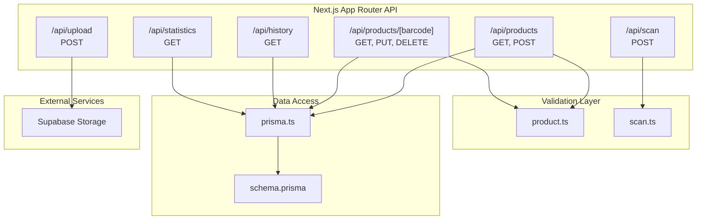
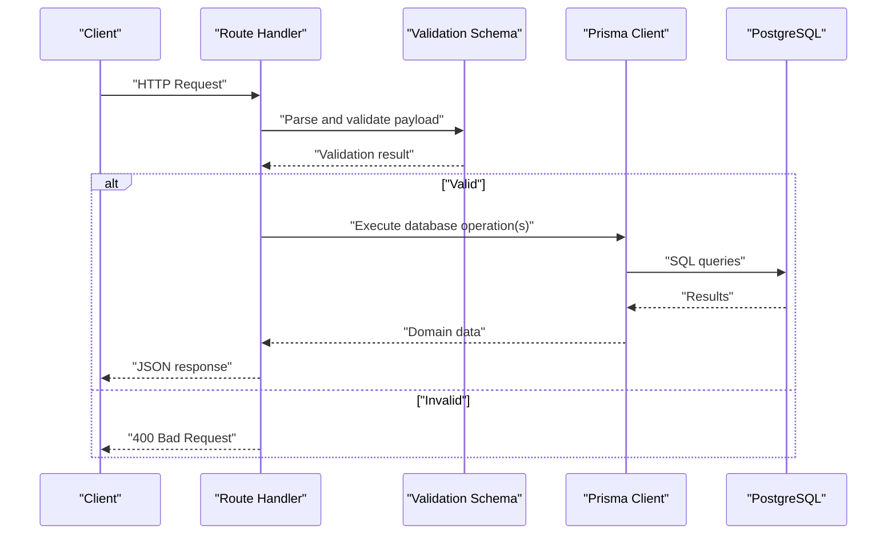
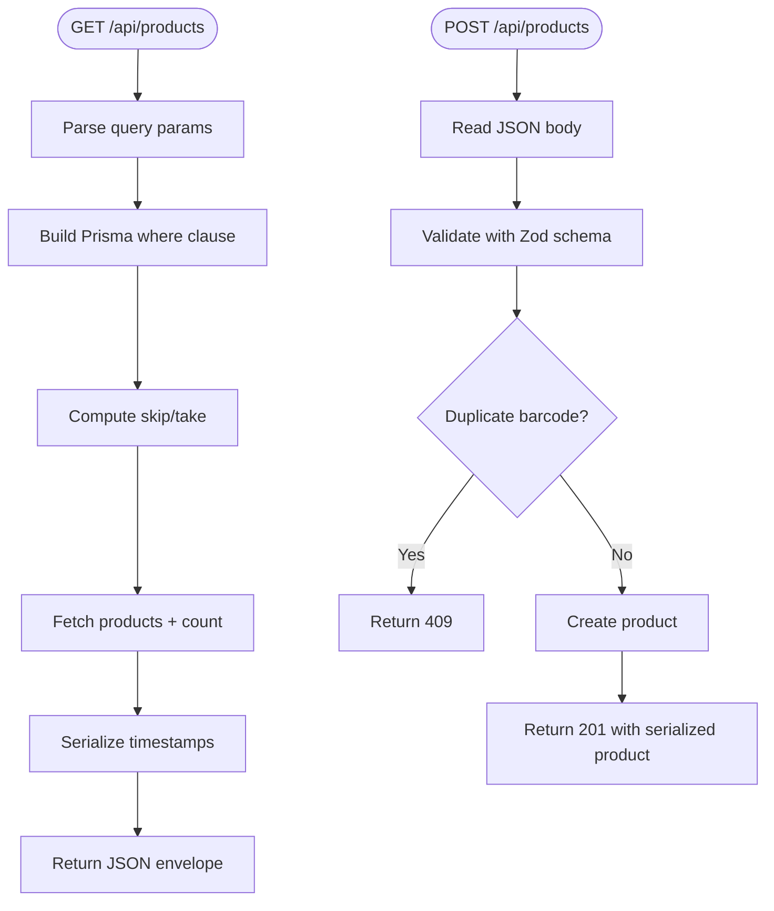
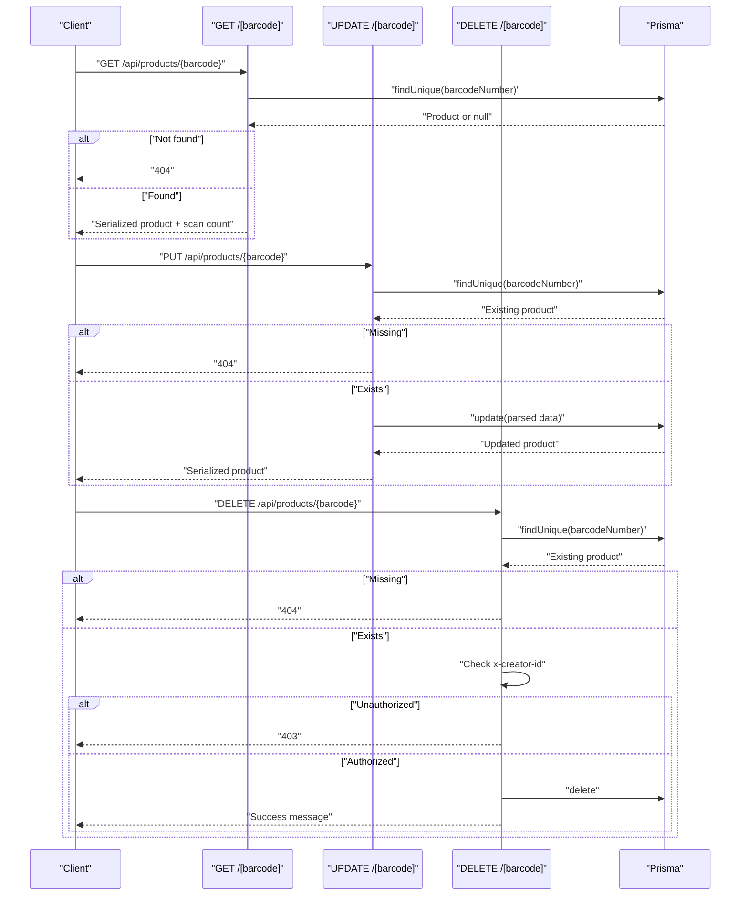
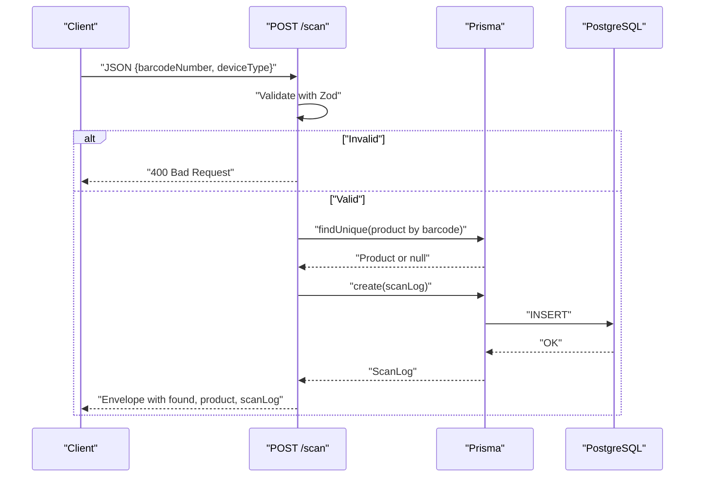
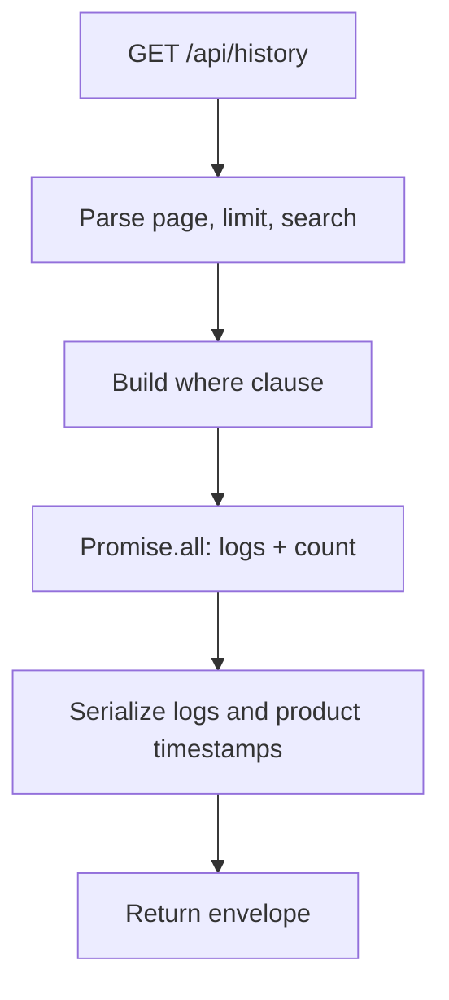
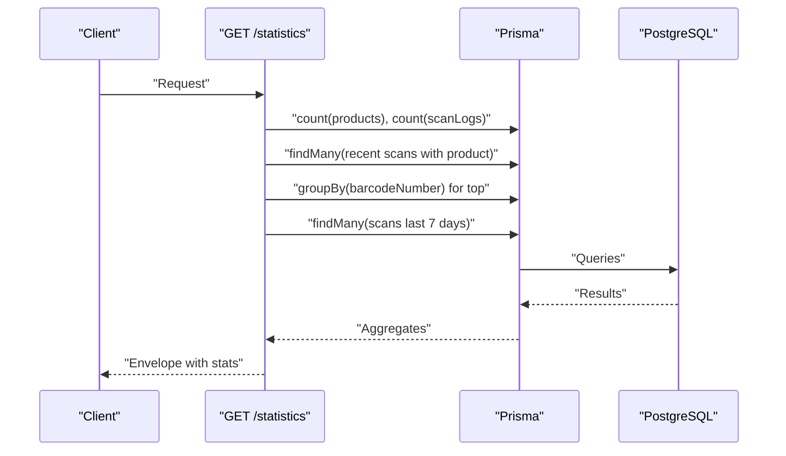
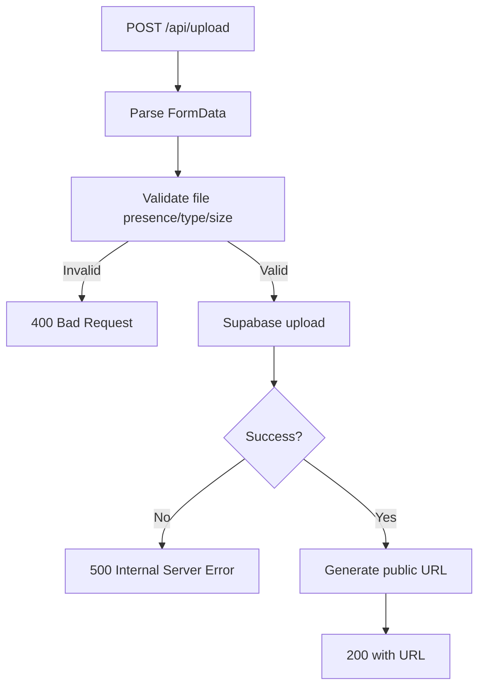
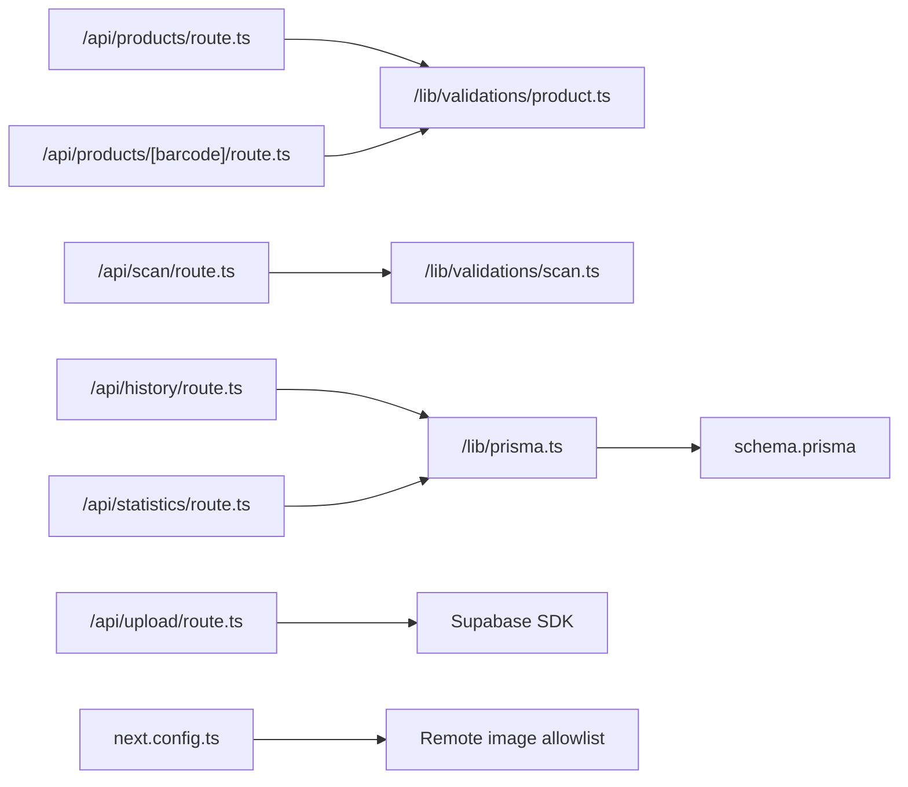

# Backend API Architecture

<cite>
**Referenced Files in This Document**
- [products/route.ts](file://src/app/api/products/route.ts)
- [products/[barcode]/route.ts](file://src/app/api/products/[barcode]/route.ts)
- [history/route.ts](file://src/app/api/history/route.ts)
- [scan/route.ts](file://src/app/api/scan/route.ts)
- [statistics/route.ts](file://src/app/api/statistics/route.ts)
- [upload/route.ts](file://src/app/api/upload/route.ts)
- [product.ts](file://src/lib/validations/product.ts)
- [scan.ts](file://src/lib/validations/scan.ts)
- [prisma.ts](file://src/lib/prisma.ts)
- [schema.prisma](file://prisma/schema.prisma)
- [next.config.ts](file://next.config.ts)
- [package.json](file://package.json)
</cite>

## Table of Contents
1. [Introduction](#introduction)
2. [Project Structure](#project-structure)
3. [Core Components](#core-components)
4. [Architecture Overview](#architecture-overview)
5. [Detailed Component Analysis](#detailed-component-analysis)
6. [Dependency Analysis](#dependency-analysis)
7. [Performance Considerations](#performance-considerations)
8. [Security and Authentication](#security-and-authentication)
9. [API Versioning and Rate Limiting](#api-versioning-and-rate-limiting)
10. [Concurrency and Transaction Management](#concurrency-and-transaction-management)
11. [Troubleshooting Guide](#troubleshooting-guide)
12. [Conclusion](#conclusion)

## Introduction
This document describes the backend API architecture for Barcode Adventure built with Next.js App Router. It covers API route organization, HTTP method handling, request/response patterns, parameter validation, error handling, data flow from routes to database operations, authentication and security considerations, CORS configuration, API versioning strategy, rate limiting, performance optimization, concurrency handling, and transaction management.

## Project Structure
The backend API is organized under Next.js App Router conventions within the src/app/api directory. Each endpoint is a standalone route module exporting HTTP method handlers (GET, POST, PUT, DELETE). Validation schemas reside in src/lib/validations, and database access is handled via Prisma with a PostgreSQL adapter.

**Diagram sources**
- [products/route.ts:1-119](file://src/app/api/products/route.ts#L1-L119)
- [products/[barcode]/route.ts](file://src/app/api/products/[barcode]/route.ts#L1-L126)
- [history/route.ts:1-68](file://src/app/api/history/route.ts#L1-L68)
- [scan/route.ts:1-60](file://src/app/api/scan/route.ts#L1-L60)
- [statistics/route.ts:1-106](file://src/app/api/statistics/route.ts#L1-L106)
- [upload/route.ts:1-77](file://src/app/api/upload/route.ts#L1-L77)
- [product.ts:1-32](file://src/lib/validations/product.ts#L1-L32)
- [scan.ts:1-12](file://src/lib/validations/scan.ts#L1-L12)
- [prisma.ts:1-33](file://src/lib/prisma.ts#L1-L33)
- [schema.prisma:1-47](file://prisma/schema.prisma#L1-L47)

**Section sources**
- [products/route.ts:1-119](file://src/app/api/products/route.ts#L1-L119)
- [products/[barcode]/route.ts](file://src/app/api/products/[barcode]/route.ts#L1-L126)
- [history/route.ts:1-68](file://src/app/api/history/route.ts#L1-L68)
- [scan/route.ts:1-60](file://src/app/api/scan/route.ts#L1-L60)
- [statistics/route.ts:1-106](file://src/app/api/statistics/route.ts#L1-L106)
- [upload/route.ts:1-77](file://src/app/api/upload/route.ts#L1-L77)
- [product.ts:1-32](file://src/lib/validations/product.ts#L1-L32)
- [scan.ts:1-12](file://src/lib/validations/scan.ts#L1-L12)
- [prisma.ts:1-33](file://src/lib/prisma.ts#L1-L33)
- [schema.prisma:1-47](file://prisma/schema.prisma#L1-L47)
- [next.config.ts:1-16](file://next.config.ts#L1-L16)
- [package.json:1-60](file://package.json#L1-L60)

## Core Components
- Product Catalog API: CRUD operations for products with search, pagination, and filtering.
- Product Details API: Retrieve product with scan count and update/delete with authorization checks.
- Scan API: Log barcode scans and optionally fetch associated product metadata.
- History API: Paginated scan history with optional search across product names and barcodes.
- Statistics API: Aggregated metrics including totals, recent scans, most scanned item, and daily trends.
- Upload API: Securely upload product images to Supabase Storage with validation and service role bypass.

Each route exports HTTP method handlers and uses Zod schemas for input validation and standardized JSON responses with a success flag and error messaging.

**Section sources**
- [products/route.ts:1-119](file://src/app/api/products/route.ts#L1-L119)
- [products/[barcode]/route.ts](file://src/app/api/products/[barcode]/route.ts#L1-L126)
- [scan/route.ts:1-60](file://src/app/api/scan/route.ts#L1-L60)
- [history/route.ts:1-68](file://src/app/api/history/route.ts#L1-L68)
- [statistics/route.ts:1-106](file://src/app/api/statistics/route.ts#L1-L106)
- [upload/route.ts:1-77](file://src/app/api/upload/route.ts#L1-L77)

## Architecture Overview
The API follows a layered architecture:
- Route Handlers: Parse queries/bodies, validate inputs, orchestrate business logic, and return structured JSON responses.
- Validation Layer: Zod schemas define strict input contracts for all endpoints.
- Data Access Layer: Prisma client with a PostgreSQL adapter manages database operations.
- External Integrations: Supabase Storage for image uploads.

**Diagram sources**
- [products/route.ts:69-118](file://src/app/api/products/route.ts#L69-L118)
- [products/[barcode]/route.ts](file://src/app/api/products/[barcode]/route.ts#L52-L88)
- [scan/route.ts:7-58](file://src/app/api/scan/route.ts#L7-L58)
- [prisma.ts:8-21](file://src/lib/prisma.ts#L8-L21)
- [schema.prisma:9-37](file://prisma/schema.prisma#L9-L37)

## Detailed Component Analysis

### Product Catalog API (/api/products)
- Methods: GET, POST
- GET supports:
  - Search by keyword across product name, barcode, and brand
  - Category filter
  - Pagination with configurable page and limit (bounded)
  - Barcodes filter via comma-separated list
- POST validates creation payload, prevents duplicates by barcode, and creates a new product
- Responses include a standardized envelope with success flag, data, and pagination metadata

**Diagram sources**
- [products/route.ts:16-67](file://src/app/api/products/route.ts#L16-L67)
- [products/route.ts:69-118](file://src/app/api/products/route.ts#L69-L118)
- [product.ts:9-20](file://src/lib/validations/product.ts#L9-L20)

**Section sources**
- [products/route.ts:1-119](file://src/app/api/products/route.ts#L1-L119)
- [product.ts:1-32](file://src/lib/validations/product.ts#L1-L32)

### Product Details API (/api/products/[barcode])
- Methods: GET, PUT, DELETE
- GET retrieves product with scan count via relation counting
- PUT updates product fields after validating input; ensures product exists
- DELETE enforces authorization via x-creator-id header against stored creatorId; returns success message upon deletion

**Diagram sources**
- [products/[barcode]/route.ts](file://src/app/api/products/[barcode]/route.ts#L18-L50)
- [products/[barcode]/route.ts](file://src/app/api/products/[barcode]/route.ts#L52-L88)
- [products/[barcode]/route.ts](file://src/app/api/products/[barcode]/route.ts#L91-L125)

**Section sources**
- [products/[barcode]/route.ts](file://src/app/api/products/[barcode]/route.ts#L1-L126)

### Scan API (/api/scan)
- Method: POST
- Validates barcode and optional device type
- Looks up product by barcode
- Creates a scan log with optional productId linkage
- Returns whether product was found, product data, and scan log details

**Diagram sources**
- [scan/route.ts:7-58](file://src/app/api/scan/route.ts#L7-L58)
- [scan.ts:3-9](file://src/lib/validations/scan.ts#L3-L9)
- [schema.prisma:26-37](file://prisma/schema.prisma#L26-L37)

**Section sources**
- [scan/route.ts:1-60](file://src/app/api/scan/route.ts#L1-L60)
- [scan.ts:1-12](file://src/lib/validations/scan.ts#L1-L12)

### History API (/api/history)
- Method: GET
- Supports pagination and optional search across barcode and product name
- Returns scan logs with included product metadata and ISO-formatted timestamps

**Diagram sources**
- [history/route.ts:25-67](file://src/app/api/history/route.ts#L25-L67)

**Section sources**
- [history/route.ts:1-68](file://src/app/api/history/route.ts#L1-L68)

### Statistics API (/api/statistics)
- Method: GET
- Computes aggregated metrics:
  - Total product and scan counts
  - Most scanned product via groupBy
  - Recent scans with product inclusion
  - Daily trend over the last 7 days
- Uses parallel queries for performance

**Diagram sources**
- [statistics/route.ts:27-104](file://src/app/api/statistics/route.ts#L27-L104)

**Section sources**
- [statistics/route.ts:1-106](file://src/app/api/statistics/route.ts#L1-L106)

### Upload API (/api/upload)
- Method: POST
- Validates multipart form data:
  - File presence
  - MIME type whitelist
  - Size limit
- Uploads to Supabase Storage using service role key to bypass Row Level Security
- Returns public URL for uploaded image

**Diagram sources**
- [upload/route.ts:9-76](file://src/app/api/upload/route.ts#L9-L76)

**Section sources**
- [upload/route.ts:1-77](file://src/app/api/upload/route.ts#L1-L77)

## Dependency Analysis
- Validation dependencies:
  - Product endpoints depend on product.ts schemas for create/update
  - Scan endpoint depends on scan.ts schema
- Data access dependencies:
  - All endpoints import prisma.ts for PrismaClient initialization
  - Prisma client uses PostgreSQL adapter and a connection string from environment
  - Database schema defines Products and ScanLogs with relations and indexes
- External dependencies:
  - Supabase SDK for storage operations
  - Next.js configuration allows remote images from Supabase domains

**Diagram sources**
- [products/route.ts:1-5](file://src/app/api/products/route.ts#L1-L5)
- [products/[barcode]/route.ts](file://src/app/api/products/[barcode]/route.ts#L1-L4)
- [scan/route.ts:1-3](file://src/app/api/scan/route.ts#L1-L3)
- [history/route.ts:1-3](file://src/app/api/history/route.ts#L1-L3)
- [statistics/route.ts:1-3](file://src/app/api/statistics/route.ts#L1-L3)
- [upload/route.ts:1-4](file://src/app/api/upload/route.ts#L1-L4)
- [prisma.ts:1-33](file://src/lib/prisma.ts#L1-L33)
- [schema.prisma:1-47](file://prisma/schema.prisma#L1-L47)
- [next.config.ts:1-16](file://next.config.ts#L1-L16)

**Section sources**
- [package.json:20-46](file://package.json#L20-L46)
- [prisma.ts:1-33](file://src/lib/prisma.ts#L1-L33)
- [schema.prisma:1-47](file://prisma/schema.prisma#L1-L47)
- [next.config.ts:1-16](file://next.config.ts#L1-L16)

## Performance Considerations
- Parallelization: Several endpoints use Promise.all to fetch data concurrently (e.g., products list and count, history logs and count, statistics aggregates).
- Pagination: Enforced bounds on page and limit prevent excessive loads.
- Indexes: Database schema includes indexes on frequently queried columns (e.g., barcodeNumber, scannedAt).
- Serialization: Timestamps are serialized to ISO strings in responses to avoid timezone ambiguity.
- Lazy Prisma initialization: Prisma client is constructed lazily to avoid build-time database dependencies.

Recommendations:
- Add database indexes for additional commonly filtered fields if needed.
- Consider caching strategies for read-heavy endpoints (e.g., product lists) using Redis or CDN.
- Monitor slow queries and consider query profiling in staging environments.

**Section sources**
- [products/route.ts:42-50](file://src/app/api/products/route.ts#L42-L50)
- [history/route.ts:41-50](file://src/app/api/history/route.ts#L41-L50)
- [statistics/route.ts:32-54](file://src/app/api/statistics/route.ts#L32-L54)
- [schema.prisma:22-36](file://prisma/schema.prisma#L22-L36)
- [prisma.ts:8-21](file://src/lib/prisma.ts#L8-L21)

## Security and Authentication
- Authorization:
  - DELETE /api/products/[barcode] enforces ownership by comparing request header x-creator-id with stored creatorId, returning 403 for mismatch.
- Input Validation:
  - All endpoints use Zod schemas to validate request bodies and query parameters, returning 400 on validation failures.
- CORS:
  - No explicit CORS middleware is present in the API routes. Cross-origin behavior is controlled by Next.js defaults and deployment proxy configuration.
- Image Upload Security:
  - Uploads use Supabase service role key to bypass RLS and enforce file type and size limits.
  - Public URL generation is performed after successful upload.
- Secrets:
  - Database URL and Supabase keys are loaded from environment variables.

Best practices:
- Introduce a shared middleware for CORS and authentication headers if scaling to multiple origins or JWT-based auth.
- Rotate Supabase service role key regularly and restrict bucket policies at the storage level.

**Section sources**
- [products/[barcode]/route.ts](file://src/app/api/products/[barcode]/route.ts#L106-L113)
- [upload/route.ts:36-40](file://src/app/api/upload/route.ts#L36-L40)
- [next.config.ts:4-12](file://next.config.ts#L4-L12)

## API Versioning and Rate Limiting
- Versioning Strategy:
  - Current implementation does not include explicit API versioning in URLs or headers. To adopt versioning, introduce a version prefix (e.g., /api/v1/products) or accept-version header pattern.
- Rate Limiting:
  - No built-in rate limiting is implemented in the current routes. For production, integrate express-rate-limit or equivalent at the edge/proxy layer or use platform-specific rate limiting features.

Recommendations:
- Implement rate limiting per IP or per user identifier.
- Add request throttling for upload endpoints due to potential large payloads.

**Section sources**
- [package.json:16-16](file://package.json#L16-L16)

## Concurrency and Transaction Management
- Concurrency Handling:
  - GET /api/products and GET /api/history use Promise.all to parallelize reads, improving throughput under concurrent load.
  - DELETE /api/products/[barcode] performs existence check followed by mutation; consider wrapping in a database transaction for stronger consistency.
- Transactions:
  - Current implementation executes separate queries for existence checks and mutations. For critical write sequences (e.g., create-or-update with uniqueness guarantees), wrap operations in Prisma transactions to ensure atomicity.
- Data Consistency:
  - Unique constraints in schema (barcodeNumber) help maintain consistency at the database level.
  - Ownership checks (x-creator-id) prevent unauthorized deletions.

Recommendations:
- Wrap multi-step writes (e.g., product creation with optional duplicate check) in transactions.
- Use database-level constraints and unique indexes to prevent race conditions.

**Section sources**
- [products/route.ts:83-93](file://src/app/api/products/route.ts#L83-L93)
- [products/[barcode]/route.ts](file://src/app/api/products/[barcode]/route.ts#L65-L74)
- [schema.prisma:11-11](file://prisma/schema.prisma#L11-L11)

## Troubleshooting Guide
Common issues and resolutions:
- Validation errors (400):
  - Verify request body matches Zod schema for the endpoint.
  - Check query parameters for pagination and filters.
- Not found errors (404):
  - Confirm resource exists by barcode or ID before update/delete operations.
- Duplicate resource (409):
  - Ensure barcode uniqueness before POST to /api/products.
- Unauthorized (403):
  - Ensure x-creator-id header matches stored creatorId for DELETE /api/products/[barcode].
- Internal server errors (500):
  - Review server logs for database connectivity and query errors.
  - Confirm Prisma client initialization and DATABASE_URL configuration.
- Upload failures:
  - Validate file type and size limits.
  - Confirm Supabase service role key and bucket permissions.

Operational checks:
- Confirm Prisma client is initialized only at runtime with force-dynamic routes.
- Verify Next.js image remote patterns allow Supabase storage URLs.

**Section sources**
- [products/route.ts:74-78](file://src/app/api/products/route.ts#L74-L78)
- [products/[barcode]/route.ts](file://src/app/api/products/[barcode]/route.ts#L69-L73)
- [products/[barcode]/route.ts](file://src/app/api/products/[barcode]/route.ts#L108-L112)
- [upload/route.ts:15-34](file://src/app/api/upload/route.ts#L15-L34)
- [prisma.ts:11-16](file://src/lib/prisma.ts#L11-L16)
- [next.config.ts:4-12](file://next.config.ts#L4-L12)

## Conclusion
Barcode Adventure’s backend leverages Next.js App Router to deliver a clean, modular API with strong input validation, standardized responses, and efficient database access via Prisma. The architecture supports concurrent reads, basic authorization checks, and secure image uploads. For production readiness, consider implementing API versioning, rate limiting, transactional writes for critical flows, and centralized middleware for CORS and authentication.