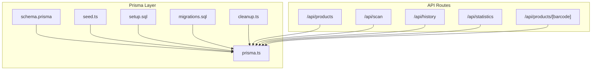
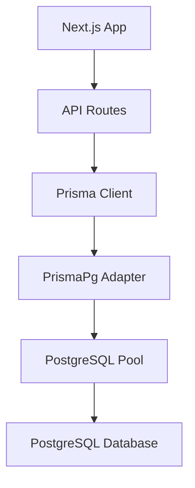
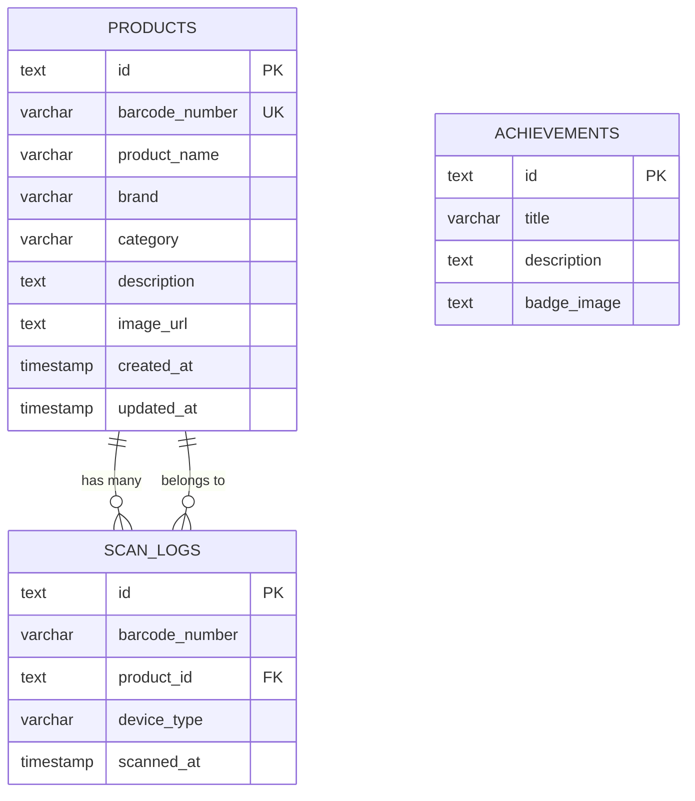
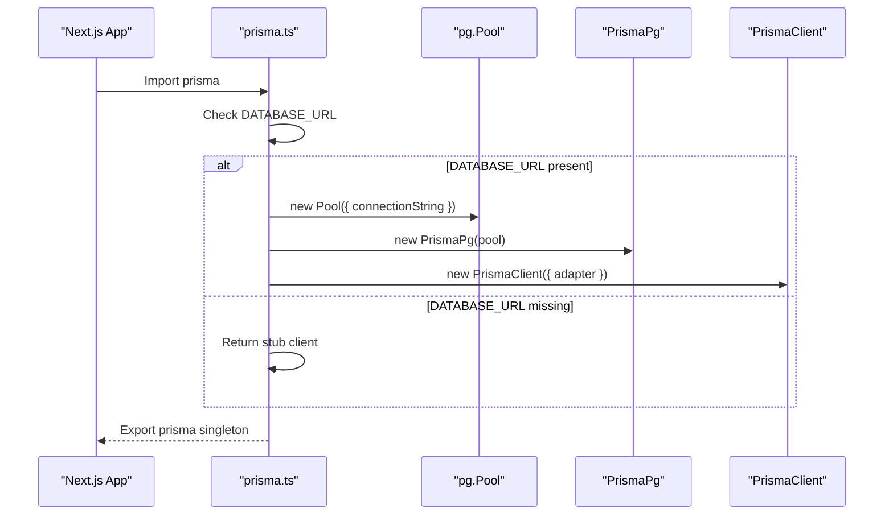
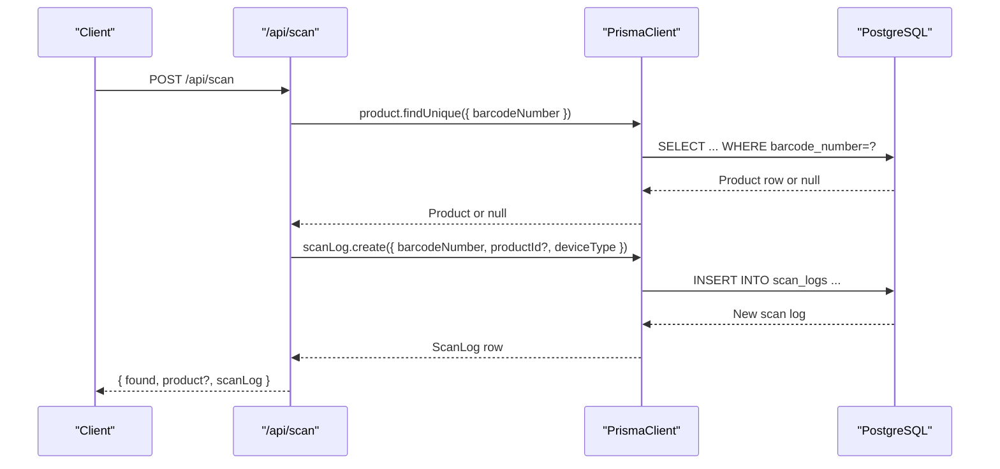
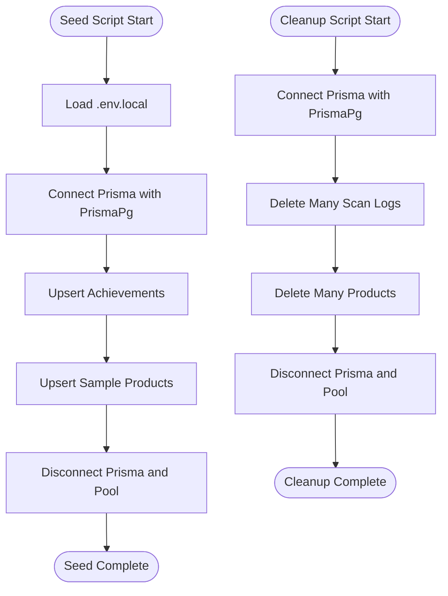
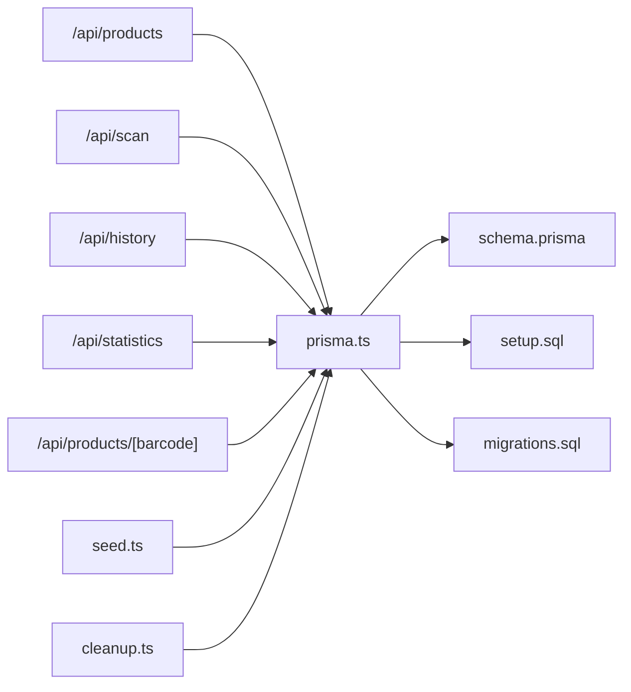

# Data Layer Architecture

<cite>
**Referenced Files in This Document**
- [schema.prisma](file://prisma/schema.prisma)
- [prisma.ts](file://src/lib/prisma.ts)
- [seed.ts](file://prisma/seed.ts)
- [setup.sql](file://prisma/setup.sql)
- [migrations.sql](file://prisma/migrations.sql)
- [cleanup.ts](file://prisma/cleanup.ts)
- [route.ts](file://src/app/api/products/route.ts)
- [route.ts](file://src/app/api/scan/route.ts)
- [route.ts](file://src/app/api/history/route.ts)
- [route.ts](file://src/app/api/statistics/route.ts)
- [route.ts](file://src/app/api/products/[barcode]/route.ts)
</cite>

## Table of Contents
1. [Introduction](#introduction)
2. [Project Structure](#project-structure)
3. [Core Components](#core-components)
4. [Architecture Overview](#architecture-overview)
5. [Detailed Component Analysis](#detailed-component-analysis)
6. [Dependency Analysis](#dependency-analysis)
7. [Performance Considerations](#performance-considerations)
8. [Troubleshooting Guide](#troubleshooting-guide)
9. [Conclusion](#conclusion)
10. [Appendices](#appendices)

## Introduction
This document describes the data layer architecture for Barcode Adventure, focusing on Prisma ORM usage, schema design, model relationships, and database migration strategies. It explains data access patterns, query optimization techniques, and caching strategies. It also covers database connection management, transaction handling, error recovery, data seeding, backup strategies, and production deployment considerations. Finally, it documents how the data layer supports gamification features and maintains data integrity.

## Project Structure
The data layer is organized around:
- Prisma schema defining models and relations
- Prisma client initialization and connection pooling
- API routes implementing CRUD and analytics queries
- SQL scripts for initial setup and migrations
- Seed and cleanup scripts for development lifecycle

**Diagram sources**
- [schema.prisma:1-47](file://prisma/schema.prisma#L1-L47)
- [prisma.ts:1-33](file://src/lib/prisma.ts#L1-L33)
- [seed.ts:1-98](file://prisma/seed.ts#L1-L98)
- [setup.sql:1-61](file://prisma/setup.sql#L1-L61)
- [migrations.sql:1-56](file://prisma/migrations.sql#L1-L56)
- [cleanup.ts:1-34](file://prisma/cleanup.ts#L1-L34)
- [route.ts:1-119](file://src/app/api/products/route.ts#L1-L119)
- [route.ts:1-60](file://src/app/api/scan/route.ts#L1-L60)
- [route.ts:1-68](file://src/app/api/history/route.ts#L1-L68)
- [route.ts:1-106](file://src/app/api/statistics/route.ts#L1-L106)
- [route.ts:1-126](file://src/app/api/products/[barcode]/route.ts#L1-L126)

**Section sources**
- [schema.prisma:1-47](file://prisma/schema.prisma#L1-L47)
- [prisma.ts:1-33](file://src/lib/prisma.ts#L1-L33)
- [seed.ts:1-98](file://prisma/seed.ts#L1-L98)
- [setup.sql:1-61](file://prisma/setup.sql#L1-L61)
- [migrations.sql:1-56](file://prisma/migrations.sql#L1-L56)
- [cleanup.ts:1-34](file://prisma/cleanup.ts#L1-L34)

## Core Components
- Prisma Client: Initialized with a PostgreSQL adapter and connection pool, with a lazy singleton pattern to avoid construction during Next.js builds.
- Models: Product, ScanLog, and Achievement define the domain entities and their relations.
- API Routes: Provide CRUD operations for products, scanning, history, and statistics, leveraging Prisma queries and relations.
- Migration and Setup Scripts: Define schema, indexes, and foreign keys; seed initial data; and support cleanup.

Key responsibilities:
- Data modeling and integrity via Prisma schema and SQL constraints
- Efficient queries with indexes and relation loading
- Safe seeding and cleanup for development environments
- Production-safe client initialization with environment guards

**Section sources**
- [prisma.ts:1-33](file://src/lib/prisma.ts#L1-L33)
- [schema.prisma:9-47](file://prisma/schema.prisma#L9-L47)
- [route.ts:1-119](file://src/app/api/products/route.ts#L1-L119)
- [route.ts:1-60](file://src/app/api/scan/route.ts#L1-L60)
- [route.ts:1-68](file://src/app/api/history/route.ts#L1-L68)
- [route.ts:1-106](file://src/app/api/statistics/route.ts#L1-L106)
- [route.ts:1-126](file://src/app/api/products/[barcode]/route.ts#L1-L126)

## Architecture Overview
The data layer follows a clean separation:
- Prisma schema defines models and relations
- Prisma client encapsulates database connectivity and query execution
- API routes orchestrate requests, apply validation, and return structured responses
- SQL scripts manage schema creation, indexes, and seeds

**Diagram sources**
- [prisma.ts:8-21](file://src/lib/prisma.ts#L8-L21)
- [schema.prisma:1-7](file://prisma/schema.prisma#L1-L7)

## Detailed Component Analysis

### Prisma Schema and Model Relationships
The schema defines three models with explicit mappings and indexes:
- Product: primary entity with unique barcode, timestamps, and relation to ScanLog
- ScanLog: tracks scans with optional product linkage and indexes for barcode and timestamp
- Achievement: static badges for gamification

Model relationships:
- Product has many ScanLog entries (one-to-many)
- ScanLog optionally belongs to Product (many-to-one)

Indexes and constraints:
- Unique index on Product.barcodeNumber
- Additional index on Product.barcodeNumber for fast lookups
- Indexes on ScanLog.barcodeNumber and scannedAt
- Foreign key constraint from ScanLog.productId to Product.id with SET NULL on delete

**Diagram sources**
- [schema.prisma:9-47](file://prisma/schema.prisma#L9-L47)
- [setup.sql:4-39](file://prisma/setup.sql#L4-L39)

**Section sources**
- [schema.prisma:9-47](file://prisma/schema.prisma#L9-L47)
- [setup.sql:34-39](file://prisma/setup.sql#L34-L39)

### Prisma Client Initialization and Connection Management
- Uses PrismaPg adapter with a native PostgreSQL pool
- Lazy initialization prevents client creation during Next.js build phase
- Guard against missing DATABASE_URL by returning a no-op client during build
- Singleton pattern stored in a global variable outside production to prevent hot reloading issues

**Diagram sources**
- [prisma.ts:8-32](file://src/lib/prisma.ts#L8-L32)

**Section sources**
- [prisma.ts:1-33](file://src/lib/prisma.ts#L1-L33)

### Data Access Patterns and Query Optimization
Common patterns observed in API routes:
- Filtering and pagination: Products endpoint supports search, category filtering, and pagination
- Relation loading: History endpoint includes product data for each scan log
- Aggregation and grouping: Statistics endpoint groups scans by barcode and computes trends
- Upsert semantics: Seed script uses upsert to avoid duplicates

Optimization techniques:
- Indexes on frequently queried columns (barcodeNumber, scannedAt)
- Selective field retrieval and serialization to ISO timestamps
- Parallel queries for counts and lists
- Relation inclusion only when needed

**Diagram sources**
- [route.ts:7-59](file://src/app/api/scan/route.ts#L7-L59)
- [schema.prisma:26-37](file://prisma/schema.prisma#L26-L37)

**Section sources**
- [route.ts:16-67](file://src/app/api/products/route.ts#L16-L67)
- [route.ts:25-67](file://src/app/api/history/route.ts#L25-L67)
- [route.ts:27-105](file://src/app/api/statistics/route.ts#L27-L105)
- [route.ts:7-59](file://src/app/api/scan/route.ts#L7-L59)
- [route.ts:18-49](file://src/app/api/products/[barcode]/route.ts#L18-L49)

### Transaction Handling and Error Recovery
- Transactions are not explicitly used in current routes; single operations are executed per request
- Error handling is centralized with try/catch blocks logging errors and returning standardized JSON responses
- Disconnection of Prisma client and pool is handled in seed and cleanup scripts

Recommended enhancements:
- Wrap write-heavy sequences (e.g., scan + XP updates) in explicit transactions
- Implement retry/backoff for transient failures
- Centralize error response formatting

**Section sources**
- [route.ts:60-66](file://src/app/api/products/route.ts#L60-L66)
- [route.ts:52-58](file://src/app/api/scan/route.ts#L52-L58)
- [route.ts:60-66](file://src/app/api/history/route.ts#L60-L66)
- [route.ts:98-104](file://src/app/api/statistics/route.ts#L98-L104)
- [seed.ts:89-97](file://prisma/seed.ts#L89-L97)
- [cleanup.ts:25-33](file://prisma/cleanup.ts#L25-L33)

### Data Seeding and Cleanup
- Seed script initializes achievements and sample products using upsert to avoid duplicates
- Setup SQL script creates tables, indexes, foreign keys, and seeds initial data
- Cleanup script removes scan logs and products for development resets

**Diagram sources**
- [seed.ts:13-97](file://prisma/seed.ts#L13-L97)
- [setup.sql:41-60](file://prisma/setup.sql#L41-L60)
- [cleanup.ts:13-33](file://prisma/cleanup.ts#L13-L33)

**Section sources**
- [seed.ts:1-98](file://prisma/seed.ts#L1-L98)
- [setup.sql:1-61](file://prisma/setup.sql#L1-L61)
- [cleanup.ts:1-34](file://prisma/cleanup.ts#L1-L34)

### Gamification Features and Data Integrity
Gamification relies on:
- Achievement definitions seeded at startup
- Product registration and scanning generating ScanLog entries
- Statistics aggregation for leaderboards and trends

Data integrity mechanisms:
- Unique barcodeNumber in Product
- Foreign key from ScanLog to Product with SET NULL on delete
- Indexes supporting fast lookups and analytics
- Validation in API routes preventing malformed writes

**Section sources**
- [schema.prisma:39-46](file://prisma/schema.prisma#L39-L46)
- [setup.sql:34-39](file://prisma/setup.sql#L34-L39)
- [route.ts:74-93](file://src/app/api/products/route.ts#L74-L93)
- [route.ts:27-105](file://src/app/api/statistics/route.ts#L27-L105)

## Dependency Analysis
The data layer exhibits low coupling and high cohesion:
- API routes depend on Prisma client abstractions
- Prisma client depends on adapter and pool
- SQL scripts define schema and constraints independently of application code

**Diagram sources**
- [prisma.ts:1-33](file://src/lib/prisma.ts#L1-L33)
- [schema.prisma:1-47](file://prisma/schema.prisma#L1-L47)
- [setup.sql:1-61](file://prisma/setup.sql#L1-L61)
- [migrations.sql:1-56](file://prisma/migrations.sql#L1-L56)
- [seed.ts:1-98](file://prisma/seed.ts#L1-L98)
- [cleanup.ts:1-34](file://prisma/cleanup.ts#L1-L34)
- [route.ts:1-119](file://src/app/api/products/route.ts#L1-L119)
- [route.ts:1-60](file://src/app/api/scan/route.ts#L1-L60)
- [route.ts:1-68](file://src/app/api/history/route.ts#L1-L68)
- [route.ts:1-106](file://src/app/api/statistics/route.ts#L1-L106)
- [route.ts:1-126](file://src/app/api/products/[barcode]/route.ts#L1-L126)

**Section sources**
- [prisma.ts:1-33](file://src/lib/prisma.ts#L1-L33)
- [schema.prisma:1-47](file://prisma/schema.prisma#L1-L47)
- [route.ts:1-119](file://src/app/api/products/route.ts#L1-L119)
- [route.ts:1-60](file://src/app/api/scan/route.ts#L1-L60)
- [route.ts:1-68](file://src/app/api/history/route.ts#L1-L68)
- [route.ts:1-106](file://src/app/api/statistics/route.ts#L1-L106)
- [route.ts:1-126](file://src/app/api/products/[barcode]/route.ts#L1-L126)

## Performance Considerations
- Index utilization: Leverage existing indexes on barcodeNumber and scannedAt for filtering and sorting
- Pagination: Apply skip/take consistently to limit result sets
- Relation loading: Use include only when necessary; prefer selective projections
- Aggregation: Use groupBy and count for analytics to minimize round trips
- Connection pooling: Ensure adequate pool sizing and timeouts in production
- Caching: Introduce Redis for frequent reads (e.g., product lookups) and invalidate on write

[No sources needed since this section provides general guidance]

## Troubleshooting Guide
Common issues and resolutions:
- Missing DATABASE_URL: Client returns a stub during build; ensure environment variables are set at runtime
- Connection failures: Verify DATABASE_URL format and network access to the database host
- Duplicate key errors: Use upsert or find-and-create patterns for products
- Slow queries: Confirm indexes exist and analyze query plans; add targeted indexes if needed
- Memory leaks: Ensure Prisma and pool are disconnected after batch operations

**Section sources**
- [prisma.ts:11-16](file://src/lib/prisma.ts#L11-L16)
- [seed.ts:89-97](file://prisma/seed.ts#L89-L97)
- [cleanup.ts:25-33](file://prisma/cleanup.ts#L25-L33)

## Conclusion
The data layer for Barcode Adventure leverages Prisma ORM with a PostgreSQL backend to support product cataloging, scanning, history, and analytics. The schema enforces referential integrity, while indexes optimize common queries. API routes implement robust data access patterns with validation and error handling. Development lifecycle tools (seed, setup, cleanup) streamline onboarding. Production readiness requires explicit transactions, connection tuning, and optional caching strategies.

[No sources needed since this section summarizes without analyzing specific files]

## Appendices

### Appendix A: Database Migration Strategies
- Use Prisma migrations for schema changes; keep generated SQL inspectable
- For manual adjustments, maintain setup.sql and migrations.sql parity
- Back up before destructive migrations; test rollback procedures

**Section sources**
- [migrations.sql:1-56](file://prisma/migrations.sql#L1-L56)
- [setup.sql:1-61](file://prisma/setup.sql#L1-L61)

### Appendix B: Backup and Restore Considerations
- Schedule regular logical backups of the public schema
- Test restore procedures periodically
- Version control migration scripts alongside backups

[No sources needed since this section provides general guidance]