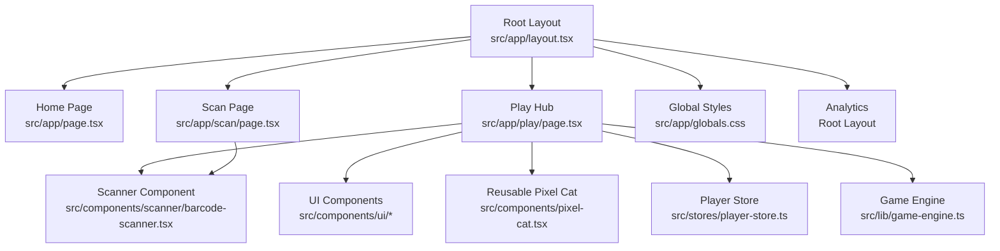
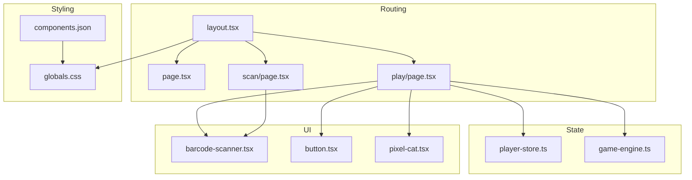
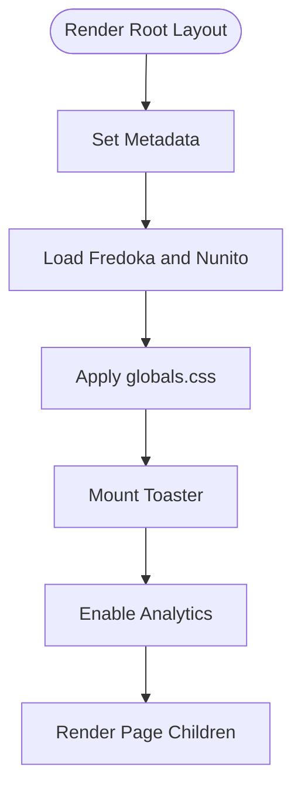
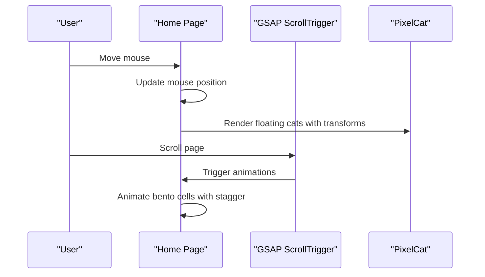
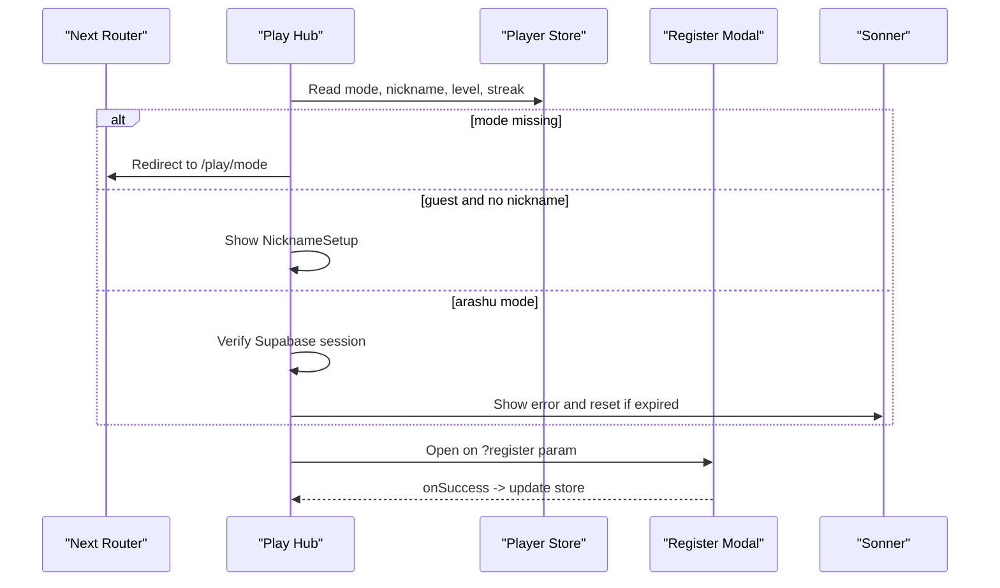
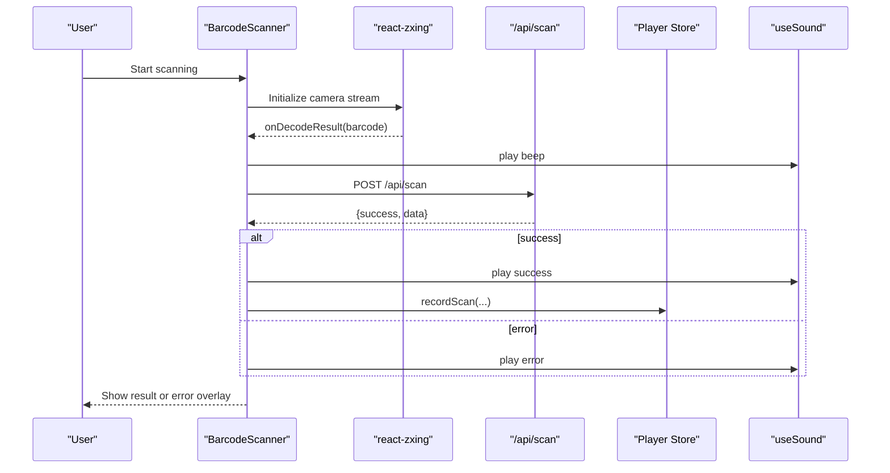
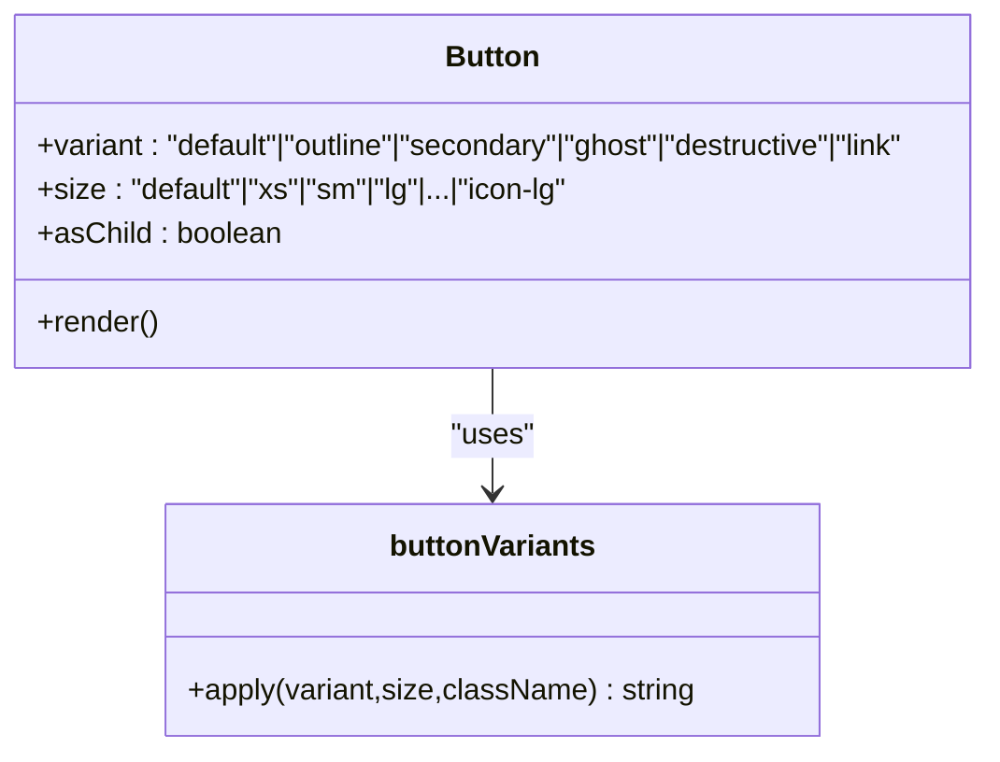
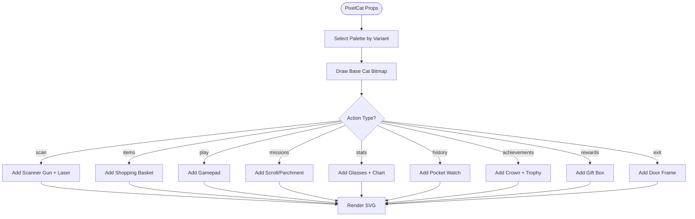
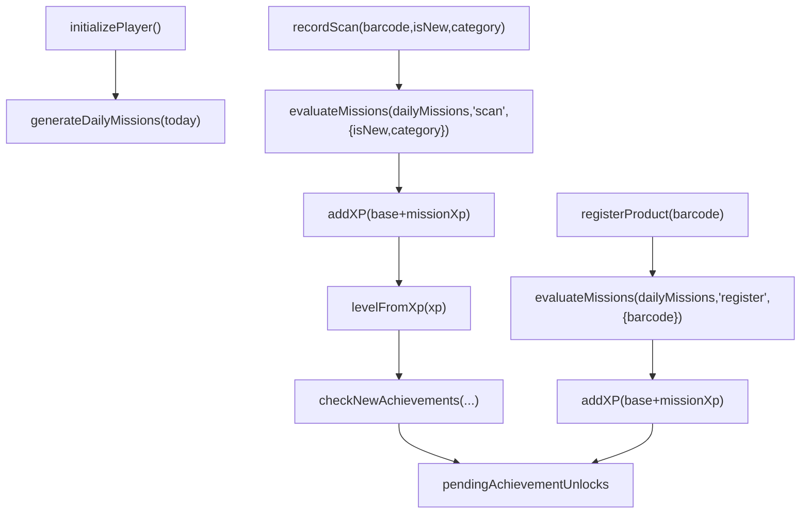
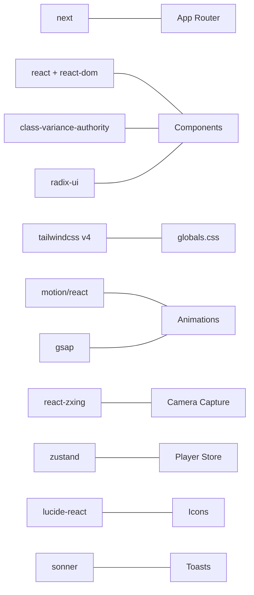

# Frontend Architecture

<cite>
**Referenced Files in This Document**
- [layout.tsx](file://src/app/layout.tsx)
- [page.tsx](file://src/app/page.tsx)
- [next.config.ts](file://next.config.ts)
- [globals.css](file://src/app/globals.css)
- [components.json](file://components.json)
- [button.tsx](file://src/components/ui/button.tsx)
- [pixel-cat.tsx](file://src/components/pixel-cat.tsx)
- [barcode-scanner.tsx](file://src/components/scanner/barcode-scanner.tsx)
- [scan-page.tsx](file://src/app/scan/page.tsx)
- [play-page.tsx](file://src/app/play/page.tsx)
- [player-store.ts](file://src/stores/player-store.ts)
- [game-engine.ts](file://src/lib/game-engine.ts)
- [use-sound.ts](file://src/hooks/use-sound.ts)
- [types/index.ts](file://src/types/index.ts)
- [package.json](file://package.json)
- [tsconfig.json](file://tsconfig.json)
</cite>

## Table of Contents
1. [Introduction](#introduction)
2. [Project Structure](#project-structure)
3. [Core Components](#core-components)
4. [Architecture Overview](#architecture-overview)
5. [Detailed Component Analysis](#detailed-component-analysis)
6. [Dependency Analysis](#dependency-analysis)
7. [Performance Considerations](#performance-considerations)
8. [Troubleshooting Guide](#troubleshooting-guide)
9. [Conclusion](#conclusion)

## Introduction
This document describes the frontend architecture of Barcode Adventure built with Next.js App Router. It covers file-based routing, dynamic routes, component hierarchy from the root layout down to page components and reusable UI components, component composition patterns, state management, styling architecture, responsive design, accessibility, cross-browser compatibility, and real-time-like interactions via animations and sound.

## Project Structure
The application follows Next.js App Router conventions under src/app, with file-based routing and nested layouts. Pages are organized by feature (home, play hub, scanner, product detail), and shared UI components live under src/components. Global styles and fonts are centralized in src/app/globals.css. The project uses shadcn/ui with Radix UI primitives and Tailwind CSS v4.

**Diagram sources**
- [layout.tsx:33-47](file://src/app/layout.tsx#L33-L47)
- [page.tsx:1-231](file://src/app/page.tsx#L1-L231)
- [play-page.tsx:1-287](file://src/app/play/page.tsx#L1-L287)
- [scan-page.tsx:1-33](file://src/app/scan/page.tsx#L1-L33)
- [barcode-scanner.tsx:1-217](file://src/components/scanner/barcode-scanner.tsx#L1-L217)
- [globals.css:1-194](file://src/app/globals.css#L1-L194)

**Section sources**
- [layout.tsx:1-48](file://src/app/layout.tsx#L1-L48)
- [page.tsx:1-231](file://src/app/page.tsx#L1-L231)
- [play-page.tsx:1-287](file://src/app/play/page.tsx#L1-L287)
- [scan-page.tsx:1-33](file://src/app/scan/page.tsx#L1-L33)
- [globals.css:1-194](file://src/app/globals.css#L1-L194)

## Core Components
- Root layout sets global metadata, fonts, analytics, and wraps pages with a Toaster for notifications.
- Home page composes animated hero, interactive bento grid, and parallax effects using Motion and GSAP.
- Play hub orchestrates tabs, modals, session checks, and integrates the player store for game state.
- Scanner component encapsulates camera capture, overlay, loading, and result/error states.
- Reusable UI components use class variance authority for variants and sizes.
- Pixel cat renders SVG-based avatars with per-action overlays and CSS animations.
- Player store manages game state and persists across sessions.
- Game engine defines achievements, daily missions, and evaluation logic.

**Section sources**
- [layout.tsx:21-47](file://src/app/layout.tsx#L21-L47)
- [page.tsx:35-230](file://src/app/page.tsx#L35-L230)
- [play-page.tsx:41-286](file://src/app/play/page.tsx#L41-L286)
- [barcode-scanner.tsx:20-216](file://src/components/scanner/barcode-scanner.tsx#L20-L216)
- [button.tsx:7-67](file://src/components/ui/button.tsx#L7-L67)
- [pixel-cat.tsx:83-476](file://src/components/pixel-cat.tsx#L83-L476)
- [player-store.ts:100-293](file://src/stores/player-store.ts#L100-L293)
- [game-engine.ts:4-240](file://src/lib/game-engine.ts#L4-L240)

## Architecture Overview
The frontend is a client-side React application using Next.js App Router. Routing is file-system based with dynamic segments (e.g., product/[barcode]/page.tsx). State is managed via Zustand with persistence. Animations and micro-interactions are powered by Motion and GSAP. UI primitives are built with shadcn’s design system and Tailwind v4.

**Diagram sources**
- [layout.tsx:33-47](file://src/app/layout.tsx#L33-L47)
- [page.tsx:1-231](file://src/app/page.tsx#L1-L231)
- [play-page.tsx:1-287](file://src/app/play/page.tsx#L1-L287)
- [scan-page.tsx:1-33](file://src/app/scan/page.tsx#L1-L33)
- [player-store.ts:100-293](file://src/stores/player-store.ts#L100-L293)
- [game-engine.ts:137-240](file://src/lib/game-engine.ts#L137-L240)
- [barcode-scanner.tsx:20-216](file://src/components/scanner/barcode-scanner.tsx#L20-L216)
- [button.tsx:44-67](file://src/components/ui/button.tsx#L44-L67)
- [pixel-cat.tsx:83-476](file://src/components/pixel-cat.tsx#L83-L476)
- [globals.css:1-194](file://src/app/globals.css#L1-L194)
- [components.json:1-26](file://components.json#L1-L26)

## Detailed Component Analysis

### Root Layout and Global Styles
- Sets metadata, Google Fonts, global CSS, Toaster, and Analytics.
- Uses Tailwind v4 with CSS variables and custom utilities for brand tokens and animations.
- Provides mesh background and bubbly UI elements.

**Diagram sources**
- [layout.tsx:21-47](file://src/app/layout.tsx#L21-L47)
- [globals.css:1-194](file://src/app/globals.css#L1-L194)

**Section sources**
- [layout.tsx:21-47](file://src/app/layout.tsx#L21-L47)
- [globals.css:8-194](file://src/app/globals.css#L8-L194)

### Home Page Composition and Animations
- Implements mouse parallax for floating items, GSAP scroll-triggered bento grid, and animated hero with spring transitions.
- Uses PixelCat for decorative and interactive elements.

**Diagram sources**
- [page.tsx:35-67](file://src/app/page.tsx#L35-L67)
- [pixel-cat.tsx:83-476](file://src/components/pixel-cat.tsx#L83-L476)

**Section sources**
- [page.tsx:35-230](file://src/app/page.tsx#L35-L230)

### Play Hub: Tabs, Modals, and Lifecycle
- Suspense boundary isolates useSearchParams to handle query params safely.
- Manages game mode, nickname setup, registration modal, and tabbed views.
- Integrates session verification for Arashu mode and exits to reset state.

**Diagram sources**
- [play-page.tsx:23-134](file://src/app/play/page.tsx#L23-L134)
- [player-store.ts:100-293](file://src/stores/player-store.ts#L100-L293)

**Section sources**
- [play-page.tsx:23-286](file://src/app/play/page.tsx#L23-L286)

### Scanner Component: Real-Time Capture and UX
- Integrates react-zxing with ZXing detection, camera constraints, and error handling.
- Supports device switching, loading states, result overlays, and error prompts.
- Plays sounds via hook and records scans in the player store.

**Diagram sources**
- [barcode-scanner.tsx:46-120](file://src/components/scanner/barcode-scanner.tsx#L46-L120)
- [use-sound.ts:53-87](file://src/hooks/use-sound.ts#L53-L87)
- [player-store.ts:129-181](file://src/stores/player-store.ts#L129-L181)

**Section sources**
- [barcode-scanner.tsx:20-216](file://src/components/scanner/barcode-scanner.tsx#L20-L216)
- [use-sound.ts:1-92](file://src/hooks/use-sound.ts#L1-L92)
- [player-store.ts:129-181](file://src/stores/player-store.ts#L129-L181)

### UI Component Library: Button Variants and Sizes
- Uses class-variance-authority to define variant and size combinations with consistent focus, disabled, and icon handling.
- Integrates radix Slot for semantic composition and supports aria-invalid states.

**Diagram sources**
- [button.tsx:7-67](file://src/components/ui/button.tsx#L7-L67)

**Section sources**
- [button.tsx:44-67](file://src/components/ui/button.tsx#L44-L67)

### Pixel Cat: SVG Avatars with Action Overlays
- Renders a pixel-art cat on an SVG canvas with per-variant palettes and per-action accessories.
- Includes CSS animations for ears, eyes, and scanning lasers.

**Diagram sources**
- [pixel-cat.tsx:83-476](file://src/components/pixel-cat.tsx#L83-L476)

**Section sources**
- [pixel-cat.tsx:83-476](file://src/components/pixel-cat.tsx#L83-L476)

### Game State Management: Player Store and Engine
- Zustand store persists state, computes XP/level, evaluates missions, and tracks achievements.
- Game engine generates daily missions deterministically and checks for unlocks.

**Diagram sources**
- [player-store.ts:105-220](file://src/stores/player-store.ts#L105-L220)
- [game-engine.ts:137-240](file://src/lib/game-engine.ts#L137-L240)

**Section sources**
- [player-store.ts:100-293](file://src/stores/player-store.ts#L100-L293)
- [game-engine.ts:137-240](file://src/lib/game-engine.ts#L137-L240)

### Responsive Design Patterns and Accessibility
- Responsive breakpoints and typography leverage Tailwind utilities and custom font stacks.
- Semantic roles and aria-labels are applied to interactive elements (e.g., PixelCat, buttons).
- Focus-visible rings and keyboard-friendly interactions are supported by the UI primitives.

**Section sources**
- [globals.css:107-194](file://src/app/globals.css#L107-L194)
- [button.tsx:44-67](file://src/components/ui/button.tsx#L44-L67)
- [pixel-cat.tsx:420-430](file://src/components/pixel-cat.tsx#L420-L430)

### Cross-Browser Compatibility Considerations
- Next.js Image optimization configured for Supabase storage.
- Audio playback uses both Web Audio API and preloaded audio elements for robustness.
- CSS variables and modern Tailwind features are scoped to maintain compatibility.

**Section sources**
- [next.config.ts:3-15](file://next.config.ts#L3-L15)
- [use-sound.ts:11-17](file://src/hooks/use-sound.ts#L11-L17)

### Real-Time Updates, Animations, and Interactions
- Micro-interactions: hover/active states, focus rings, and transitions on buttons and cards.
- Page animations: Motion for hero entrance, GSAP for scroll-triggered bento grid.
- Scanner feedback: beep on decode, loading spinners, and result/error overlays.
- Persistent state: XP popups and achievement unlocks are triggered from store updates.

**Section sources**
- [page.tsx:129-161](file://src/app/page.tsx#L129-L161)
- [play-page.tsx:155-156](file://src/app/play/page.tsx#L155-L156)
- [barcode-scanner.tsx:141-190](file://src/components/scanner/barcode-scanner.tsx#L141-L190)
- [use-sound.ts:53-87](file://src/hooks/use-sound.ts#L53-L87)

## Dependency Analysis
External libraries include Next.js, React, Tailwind v4, class-variance-authority, radix-slot, motion, gsap, react-zxing, zustand, lucide icons, and shadcn/tailwind.css. The project targets ES2017 and uses bundler module resolution.

**Diagram sources**
- [package.json:20-46](file://package.json#L20-L46)
- [globals.css:1-4](file://src/app/globals.css#L1-L4)
- [components.json:6-12](file://components.json#L6-L12)

**Section sources**
- [package.json:20-46](file://package.json#L20-L46)
- [tsconfig.json:2-23](file://tsconfig.json#L2-L23)

## Performance Considerations
- Prefer lightweight SVG rendering for avatars and icons.
- Defer heavy animations to off-main-thread where possible (GSAP context cleanup).
- Use suspense boundaries for route-level query parsing to avoid blocking.
- Persist store to reduce initialization cost and maintain continuity across sessions.
- Optimize image assets via Next/Image and remote patterns.

## Troubleshooting Guide
- Camera permission denied: The scanner component detects NotAllowedError and displays a guided message; ensure HTTPS and allow camera access.
- Network errors during scan: The scanner falls back to an error overlay and encourages retry.
- Session expiration (Arashu mode): The play hub verifies session validity and resets state if invalid.
- Scroll-trigger animations not firing: Ensure the element is within the viewport and the trigger reference is valid.

**Section sources**
- [barcode-scanner.tsx:114-120](file://src/components/scanner/barcode-scanner.tsx#L114-L120)
- [play-page.tsx:87-102](file://src/app/play/page.tsx#L87-L102)

## Conclusion
Barcode Adventure’s frontend leverages Next.js App Router for structured routing, a cohesive UI component library with shadcn/Tailwind, and a robust state model with Zustand. Animations and micro-interactions enhance engagement, while the scanner component delivers a real-time-like experience. The architecture balances reusability, responsiveness, and accessibility for broad compatibility.