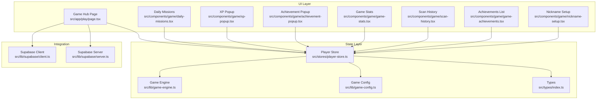
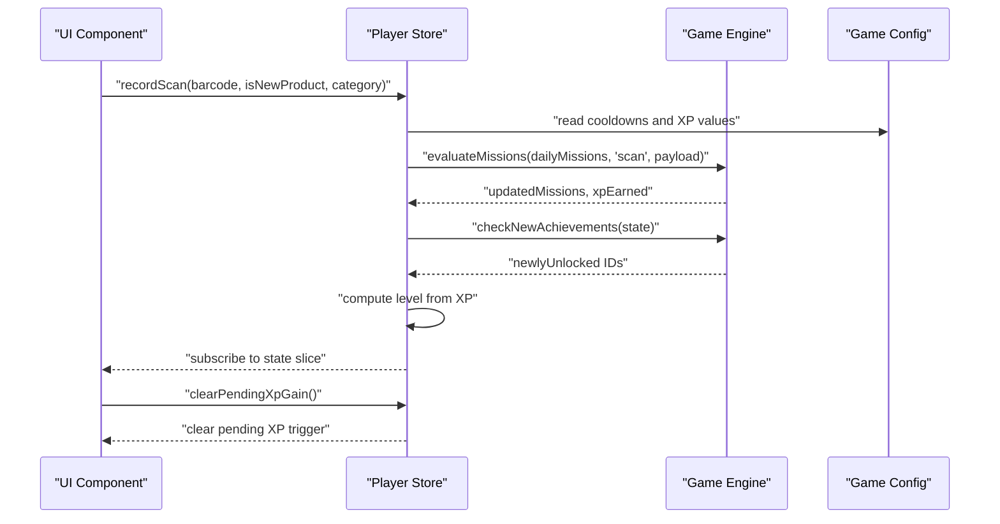
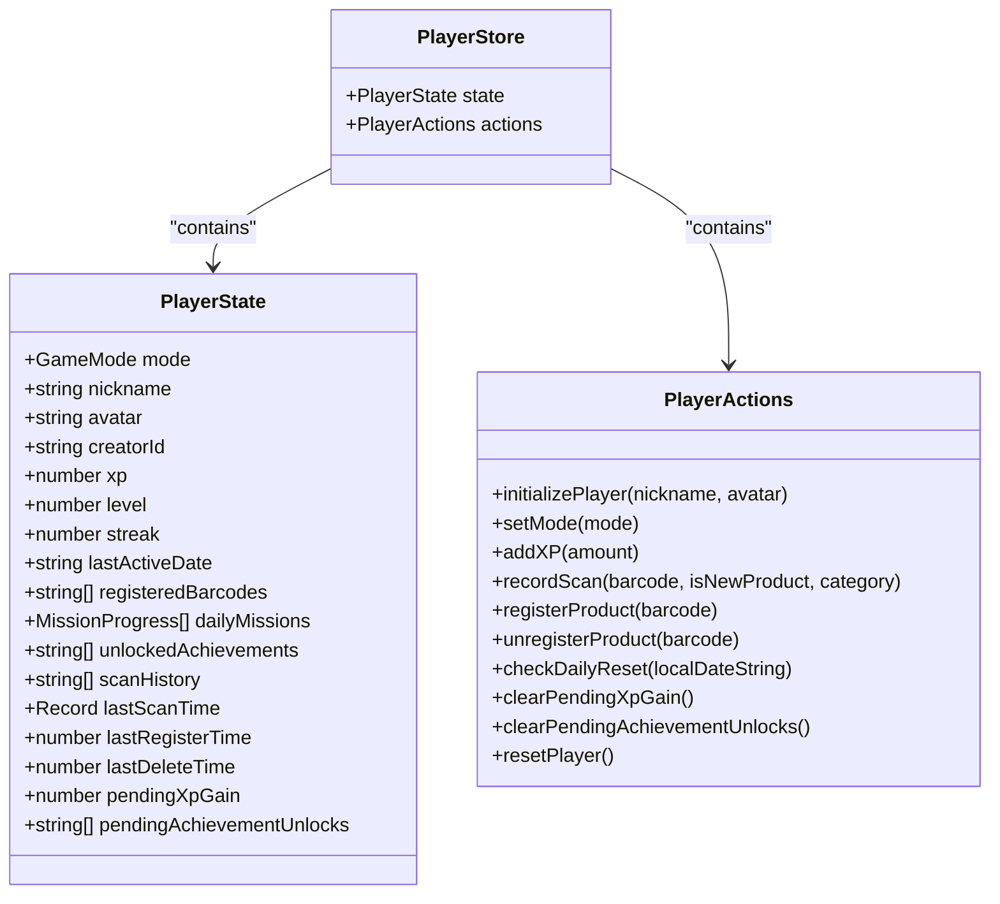
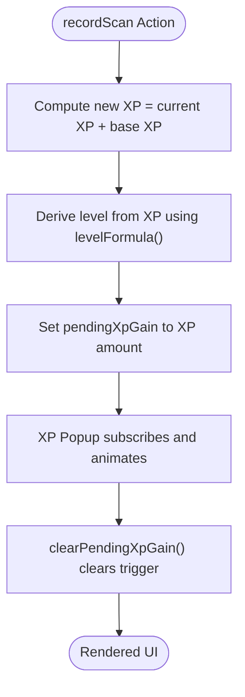
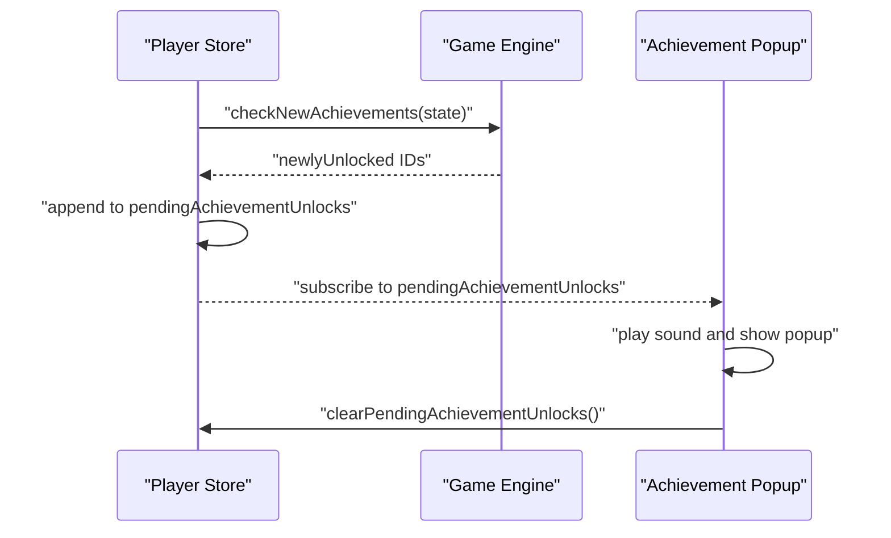
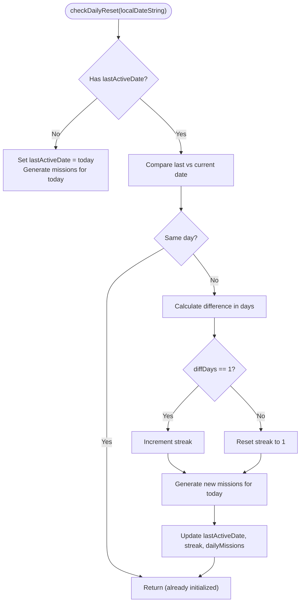
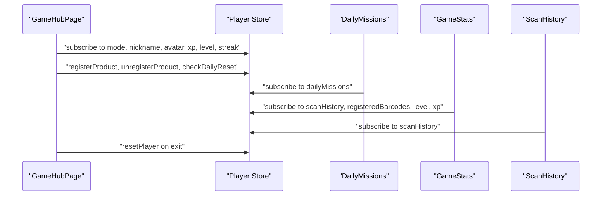
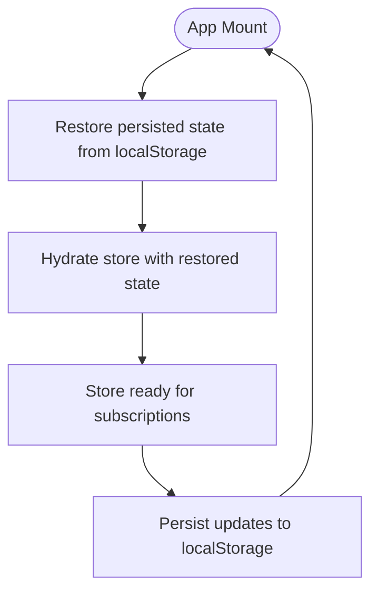
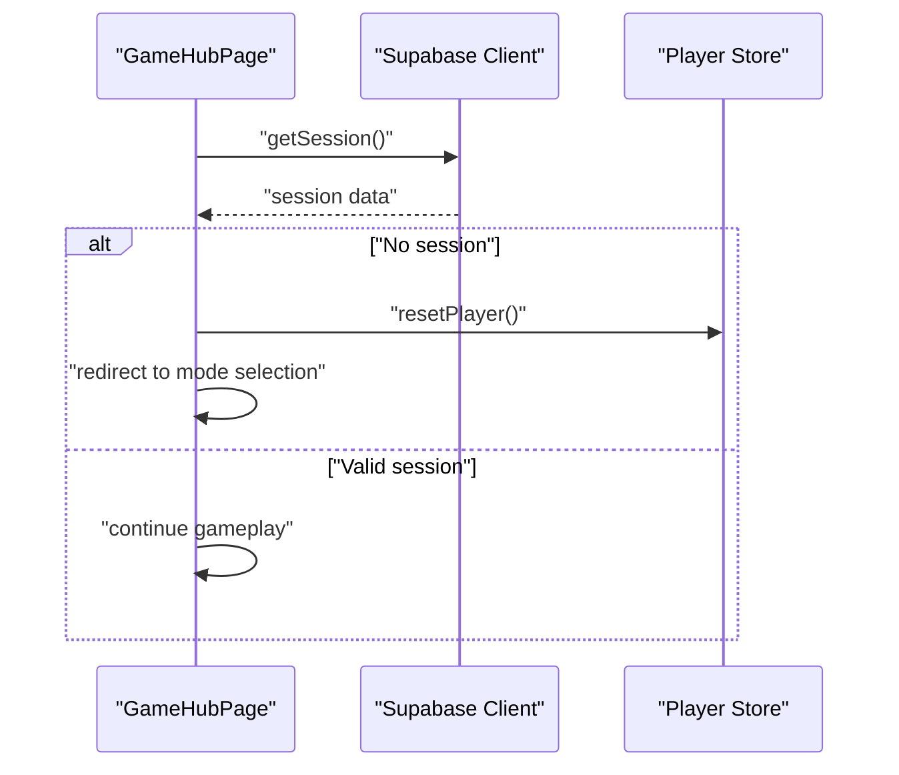
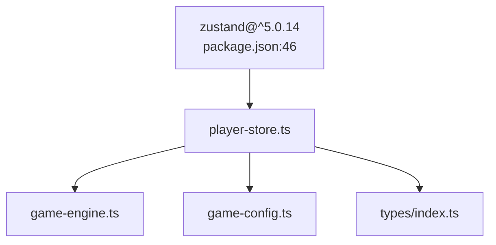

# State Management Architecture

<cite>
**Referenced Files in This Document**
- [player-store.ts](file://src/stores/player-store.ts)
- [game-engine.ts](file://src/lib/game-engine.ts)
- [game-config.ts](file://src/lib/game-config.ts)
- [index.ts](file://src/types/index.ts)
- [page.tsx](file://src/app/play/page.tsx)
- [xp-popup.tsx](file://src/components/game/xp-popup.tsx)
- [achievement-popup.tsx](file://src/components/game/achievement-popup.tsx)
- [daily-missions.tsx](file://src/components/game/daily-missions.tsx)
- [game-stats.tsx](file://src/components/game/game-stats.tsx)
- [scan-history.tsx](file://src/components/game/scan-history.tsx)
- [game-achievements.tsx](file://src/components/game/game-achievements.tsx)
- [nickname-setup.tsx](file://src/components/game/nickname-setup.tsx)
- [client.ts](file://src/lib/supabase/client.ts)
- [server.ts](file://src/lib/supabase/server.ts)
- [package.json](file://package.json)
</cite>

## Table of Contents
1. [Introduction](#introduction)
2. [Project Structure](#project-structure)
3. [Core Components](#core-components)
4. [Architecture Overview](#architecture-overview)
5. [Detailed Component Analysis](#detailed-component-analysis)
6. [Dependency Analysis](#dependency-analysis)
7. [Performance Considerations](#performance-considerations)
8. [Troubleshooting Guide](#troubleshooting-guide)
9. [Conclusion](#conclusion)

## Introduction
This document provides comprehensive state management architecture documentation for Barcode Adventure, focusing on the Zustand-based implementation that powers the game's gamification features. It covers store creation, action dispatching, state subscription patterns, player state architecture (XP tracking, achievement state, mission progress), reactive programming patterns, persistence strategies, hydration from server-side state, and integration between global and local component state. The documentation also explains how the state management supports real-time updates and performance optimizations.

## Project Structure
The state management system centers around a single Zustand store that encapsulates all player-related state and actions. Supporting libraries define game mechanics (missions, achievements), configuration constants, and TypeScript types. UI components subscribe to the store to render reactive updates and trigger actions.

**Diagram sources**
- [player-store.ts:100-294](file://src/stores/player-store.ts#L100-L294)
- [game-engine.ts:1-241](file://src/lib/game-engine.ts#L1-L241)
- [game-config.ts:1-28](file://src/lib/game-config.ts#L1-L28)
- [index.ts:92-109](file://src/types/index.ts#L92-L109)
- [page.tsx:41-287](file://src/app/play/page.tsx#L41-L287)
- [daily-missions.tsx:1-95](file://src/components/game/daily-missions.tsx#L1-L95)
- [xp-popup.tsx:1-51](file://src/components/game/xp-popup.tsx#L1-L51)
- [achievement-popup.tsx:1-97](file://src/components/game/achievement-popup.tsx#L1-L97)
- [game-stats.tsx:1-212](file://src/components/game/game-stats.tsx#L1-L212)
- [scan-history.tsx:1-155](file://src/components/game/scan-history.tsx#L1-L155)
- [game-achievements.tsx:1-88](file://src/components/game/game-achievements.tsx#L1-L88)
- [nickname-setup.tsx:1-114](file://src/components/game/nickname-setup.tsx#L1-L114)
- [client.ts:1-8](file://src/lib/supabase/client.ts#L1-L8)
- [server.ts:1-27](file://src/lib/supabase/server.ts#L1-L27)

**Section sources**
- [player-store.ts:100-294](file://src/stores/player-store.ts#L100-L294)
- [page.tsx:41-287](file://src/app/play/page.tsx#L41-L287)

## Core Components
- Player Store: Centralized state container with typed actions for initializing players, managing XP, recording scans, registering/unregistering products, tracking streaks, generating daily missions, and handling pending UI triggers.
- Game Engine: Provides mission templates, daily mission generation, mission evaluation, and achievement checks.
- Game Config: Defines XP values, cooldowns, UI timing constants, and level progression formula.
- Types: Declares MissionProgress and GameAchievement interfaces used by the store and engine.
- UI Components: Subscribe to the store for rendering and trigger actions via callbacks.

Key responsibilities:
- Store creation and middleware: Uses Zustand with persistence middleware for browser storage.
- Action dispatching: Pure reducers and computed helpers update state immutably.
- Subscription patterns: Components subscribe to specific slices of state using selector functions.
- Reactive updates: UI re-renders automatically when subscribed state changes.

**Section sources**
- [player-store.ts:9-45](file://src/stores/player-store.ts#L9-L45)
- [player-store.ts:100-294](file://src/stores/player-store.ts#L100-L294)
- [game-engine.ts:1-241](file://src/lib/game-engine.ts#L1-L241)
- [game-config.ts:1-28](file://src/lib/game-config.ts#L1-L28)
- [index.ts:92-109](file://src/types/index.ts#L92-L109)

## Architecture Overview
The state architecture follows a unidirectional data flow:
- UI components trigger actions by calling store methods.
- Actions compute derived state (XP levels, streaks, missions) and update the store.
- Components subscribe to relevant state slices and re-render reactively.
- Persistence middleware persists state to browser storage for continuity across sessions.

**Diagram sources**
- [player-store.ts:129-181](file://src/stores/player-store.ts#L129-L181)
- [game-engine.ts:169-200](file://src/lib/game-engine.ts#L169-L200)
- [game-engine.ts:206-240](file://src/lib/game-engine.ts#L206-L240)
- [game-config.ts:6-27](file://src/lib/game-config.ts#L6-L27)

## Detailed Component Analysis

### Player Store Architecture
The store defines a strongly-typed state interface and action methods. It uses Zustand's create with the persist middleware to enable automatic persistence and migration support.

**Diagram sources**
- [player-store.ts:9-45](file://src/stores/player-store.ts#L9-L45)

Key implementation patterns:
- Selector-based subscriptions: Components subscribe to specific state slices to minimize re-renders.
- Computed helpers: Level calculation and XP progression logic encapsulated in pure functions.
- Cooldown enforcement: Prevents repeated XP gains for the same barcode within configured intervals.
- Daily reset logic: Tracks last active date and recalculates streak and missions based on local date.

**Section sources**
- [player-store.ts:78-96](file://src/stores/player-store.ts#L78-L96)
- [player-store.ts:100-294](file://src/stores/player-store.ts#L100-L294)

### XP Tracking and Level Progression
XP is tracked as a cumulative value with a configurable level formula. The store computes the player's level from total XP and exposes a pending XP trigger for UI animations.

**Diagram sources**
- [player-store.ts:123-127](file://src/stores/player-store.ts#L123-L127)
- [game-config.ts:23-25](file://src/lib/game-config.ts#L23-L25)
- [xp-popup.tsx:8-26](file://src/components/game/xp-popup.tsx#L8-L26)

**Section sources**
- [player-store.ts:49-68](file://src/stores/player-store.ts#L49-L68)
- [game-config.ts:23-25](file://src/lib/game-config.ts#L23-L25)
- [xp-popup.tsx:8-26](file://src/components/game/xp-popup.tsx#L8-L26)

### Achievement System
Achievements are evaluated after each significant action. New unlocks are queued and displayed via a dedicated popup component.

**Diagram sources**
- [player-store.ts:162-168](file://src/stores/player-store.ts#L162-L168)
- [game-engine.ts:206-240](file://src/lib/game-engine.ts#L206-L240)
- [achievement-popup.tsx:22-46](file://src/components/game/achievement-popup.tsx#L22-L46)

**Section sources**
- [game-engine.ts:3-53](file://src/lib/game-engine.ts#L3-L53)
- [achievement-popup.tsx:1-97](file://src/components/game/achievement-popup.tsx#L1-L97)

### Daily Missions and Streak Management
Daily missions are generated deterministically based on the current date, ensuring consistent challenges per calendar day. Streaks are calculated from the last active date.

**Diagram sources**
- [player-store.ts:229-270](file://src/stores/player-store.ts#L229-L270)

**Section sources**
- [player-store.ts:229-270](file://src/stores/player-store.ts#L229-L270)
- [game-engine.ts:137-163](file://src/lib/game-engine.ts#L137-L163)

### UI Integration Patterns
Components subscribe to specific state slices and trigger actions through callbacks. This pattern ensures minimal re-renders and predictable updates.

**Diagram sources**
- [page.tsx:41-135](file://src/app/play/page.tsx#L41-L135)
- [daily-missions.tsx:7-94](file://src/components/game/daily-missions.tsx#L7-L94)
- [game-stats.tsx:13-63](file://src/components/game/game-stats.tsx#L13-L63)
- [scan-history.tsx:20-51](file://src/components/game/scan-history.tsx#L20-L51)

**Section sources**
- [page.tsx:41-135](file://src/app/play/page.tsx#L41-L135)
- [daily-missions.tsx:7-94](file://src/components/game/daily-missions.tsx#L7-L94)
- [game-stats.tsx:13-63](file://src/components/game/game-stats.tsx#L13-L63)
- [scan-history.tsx:20-51](file://src/components/game/scan-history.tsx#L20-L51)

### State Persistence and Hydration
The store uses Zustand's persist middleware to save state to browser storage and restore it on subsequent visits. Migration support is included for future schema changes.

**Diagram sources**
- [player-store.ts:284-292](file://src/stores/player-store.ts#L284-L292)

**Section sources**
- [player-store.ts:284-292](file://src/stores/player-store.ts#L284-L292)

### Integration with Supabase Authentication
The application integrates with Supabase for session management, particularly in Arashu's mode. The hub page verifies sessions and resets state if the session expires.

**Diagram sources**
- [page.tsx:87-102](file://src/app/play/page.tsx#L87-L102)
- [client.ts:1-8](file://src/lib/supabase/client.ts#L1-L8)

**Section sources**
- [page.tsx:87-102](file://src/app/play/page.tsx#L87-L102)
- [client.ts:1-8](file://src/lib/supabase/client.ts#L1-L8)

## Dependency Analysis
The state management stack relies on Zustand for state management, with supporting libraries for game logic and configuration. UI components depend on the store for reactive updates.

**Diagram sources**
- [package.json:46](file://package.json#L46)
- [player-store.ts:1-2](file://src/stores/player-store.ts#L1-L2)
- [game-engine.ts:1](file://src/lib/game-engine.ts#L1)
- [game-config.ts:3](file://src/lib/game-config.ts#L3)
- [index.ts:4](file://src/types/index.ts#L4)

**Section sources**
- [package.json:20-46](file://package.json#L20-L46)
- [player-store.ts:1-2](file://src/stores/player-store.ts#L1-L2)

## Performance Considerations
- Selector-based subscriptions: Components subscribe to narrow state slices to avoid unnecessary re-renders.
- Memoization: Derived computations (level, streak) are performed in pure functions to leverage referential equality.
- Cooldown enforcement: Prevents redundant state updates and UI animations for frequent actions.
- Batched updates: Actions update state atomically, reducing intermediate render cycles.
- Local storage persistence: Efficient hydration minimizes server round-trips during initialization.

## Troubleshooting Guide
Common issues and resolutions:
- State not persisting: Verify the persist middleware configuration and browser storage availability.
- Missions not updating: Ensure daily reset runs on mount and uses the correct local date string.
- Achievement popups stuck: Confirm pending achievement queue is cleared after display.
- XP popup not clearing: Check timer cleanup and ensure clearPendingXpGain is called after animation completes.
- Session expiration in Arashu mode: Implement proper session verification and state reset on invalid sessions.

**Section sources**
- [player-store.ts:284-292](file://src/stores/player-store.ts#L284-L292)
- [page.tsx:67-71](file://src/app/play/page.tsx#L67-L71)
- [achievement-popup.tsx:27-46](file://src/components/game/achievement-popup.tsx#L27-L46)
- [xp-popup.tsx:15-26](file://src/components/game/xp-popup.tsx#L15-L26)
- [page.tsx:87-102](file://src/app/play/page.tsx#L87-L102)

## Conclusion
Barcode Adventure's state management leverages Zustand to create a reactive, persistent, and scalable architecture for gamification features. The player store encapsulates core game mechanics—XP tracking, achievements, daily missions, and streaks—while UI components remain decoupled through selective subscriptions. Persistence and migration support ensure continuity across sessions, and integration with Supabase enables secure session management. The resulting system delivers real-time updates, smooth animations, and a robust foundation for future enhancements.