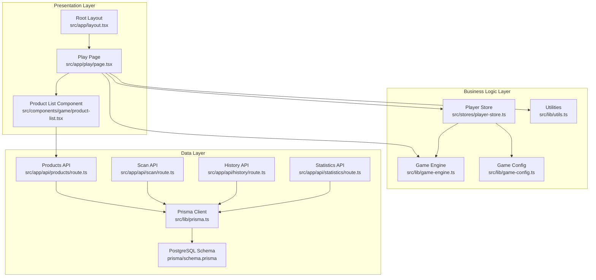
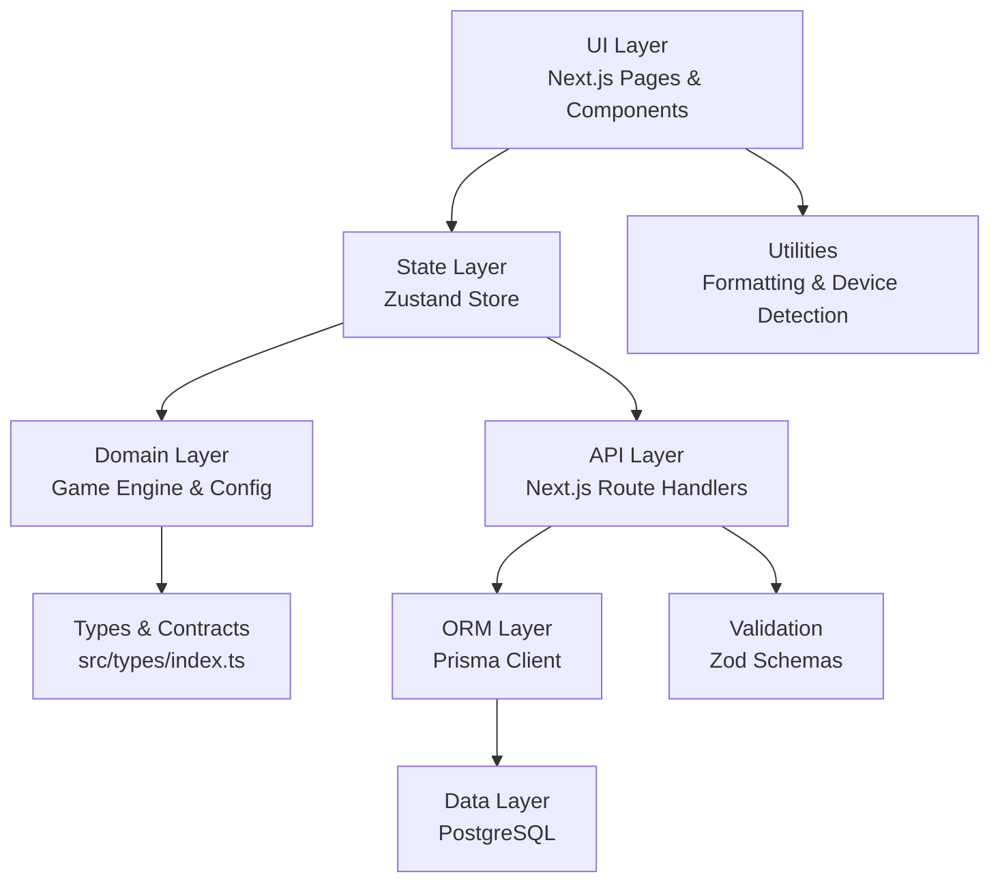
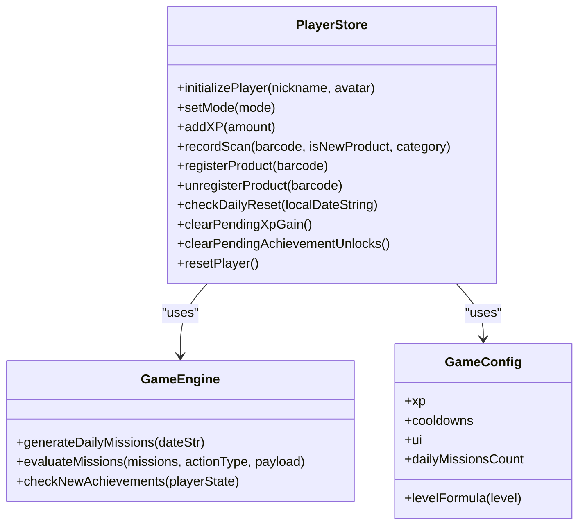
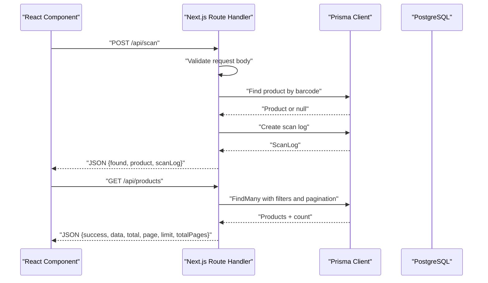
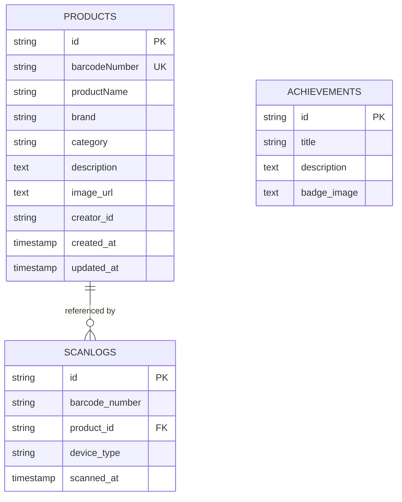
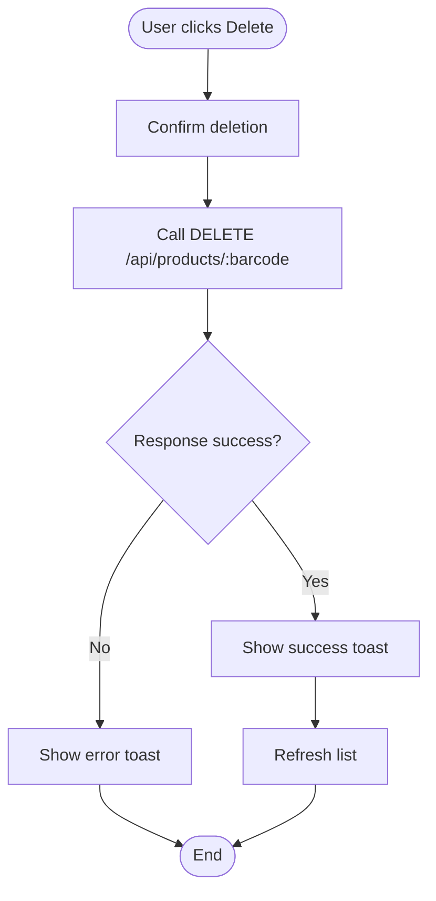
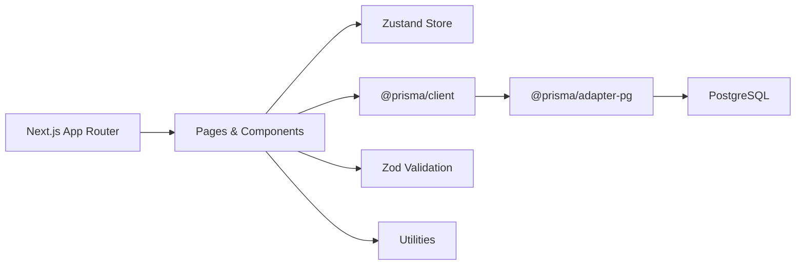

# System Overview

<cite>
**Referenced Files in This Document**
- [README.md](file://README.md)
- [package.json](file://package.json)
- [src/app/layout.tsx](file://src/app/layout.tsx)
- [src/lib/prisma.ts](file://src/lib/prisma.ts)
- [prisma/schema.prisma](file://prisma/schema.prisma)
- [src/stores/player-store.ts](file://src/stores/player-store.ts)
- [src/lib/game-config.ts](file://src/lib/game-config.ts)
- [src/lib/game-engine.ts](file://src/lib/game-engine.ts)
- [src/lib/utils.ts](file://src/lib/utils.ts)
- [src/types/index.ts](file://src/types/index.ts)
- [src/app/play/page.tsx](file://src/app/play/page.tsx)
- [src/components/game/product-list.tsx](file://src/components/game/product-list.tsx)
- [src/app/api/products/route.ts](file://src/app/api/products/route.ts)
- [src/app/api/scan/route.ts](file://src/app/api/scan/route.ts)
- [src/app/api/history/route.ts](file://src/app/api/history/route.ts)
- [src/app/api/statistics/route.ts](file://src/app/api/statistics/route.ts)
</cite>

## Table of Contents
1. [Introduction](#introduction)
2. [Project Structure](#project-structure)
3. [Core Components](#core-components)
4. [Architecture Overview](#architecture-overview)
5. [Detailed Component Analysis](#detailed-component-analysis)
6. [Dependency Analysis](#dependency-analysis)
7. [Performance Considerations](#performance-considerations)
8. [Troubleshooting Guide](#troubleshooting-guide)
9. [Conclusion](#conclusion)

## Introduction
Barcode Adventure is a gamified barcode scanning web application built with Next.js App Router. It combines a modern frontend experience with a PostgreSQL-backed data layer, real-time state management, and a clean separation of concerns across presentation, business logic, and data layers. The system emphasizes:
- Clean Architecture: Clear boundaries between presentation, business logic, and data.
- Technology Stack Integration: Next.js App Router, React components, Prisma ORM, and Zustand state management.
- Gamification: Player progression, daily missions, achievements, and XP mechanics.
- Real-time Data Access: Force-dynamic API routes to ensure runtime database access.

## Project Structure
The repository follows a feature-centric and layer-based organization aligned with Clean Architecture:
- Presentation Layer (Next.js App Router pages and React components)
- Business Logic Layer (Zustand stores, game engine, configuration)
- Data Layer (Prisma ORM, PostgreSQL schema, API routes)

**Diagram sources**
- [src/app/layout.tsx:1-48](file://src/app/layout.tsx#L1-L48)
- [src/app/play/page.tsx:1-287](file://src/app/play/page.tsx#L1-L287)
- [src/components/game/product-list.tsx:1-224](file://src/components/game/product-list.tsx#L1-L224)
- [src/stores/player-store.ts:1-294](file://src/stores/player-store.ts#L1-L294)
- [src/lib/game-engine.ts:1-241](file://src/lib/game-engine.ts#L1-L241)
- [src/lib/game-config.ts:1-28](file://src/lib/game-config.ts#L1-L28)
- [src/lib/utils.ts:1-40](file://src/lib/utils.ts#L1-L40)
- [src/lib/prisma.ts:1-33](file://src/lib/prisma.ts#L1-L33)
- [prisma/schema.prisma:1-47](file://prisma/schema.prisma#L1-L47)
- [src/app/api/products/route.ts:1-119](file://src/app/api/products/route.ts#L1-L119)
- [src/app/api/scan/route.ts:1-60](file://src/app/api/scan/route.ts#L1-L60)
- [src/app/api/history/route.ts:1-68](file://src/app/api/history/route.ts#L1-L68)
- [src/app/api/statistics/route.ts:1-106](file://src/app/api/statistics/route.ts#L1-L106)

**Section sources**
- [README.md:1-37](file://README.md#L1-L37)
- [package.json:1-60](file://package.json#L1-L60)
- [src/app/layout.tsx:1-48](file://src/app/layout.tsx#L1-L48)

## Core Components
- Presentation Layer
  - Root layout initializes fonts, analytics, and toast notifications.
  - Play page orchestrates game hub UI, tabs, modals, and integrates with the player store.
  - Product list component handles filtering, pagination, and deletion via API calls.
- Business Logic Layer
  - Player store encapsulates game state, XP calculation, daily missions, achievements, and persistence.
  - Game engine defines mission templates, evaluation logic, and achievement checks.
  - Game configuration centralizes XP values, cooldowns, UI timings, and level formula.
  - Utilities provide formatting helpers and device detection.
- Data Layer
  - Prisma client abstraction supports Postgres with a runtime adapter and build-time stub.
  - PostgreSQL schema defines Products, ScanLogs, and Achievements entities.
  - API routes expose CRUD and analytics endpoints with validation and serialization.

**Section sources**
- [src/app/layout.tsx:1-48](file://src/app/layout.tsx#L1-L48)
- [src/app/play/page.tsx:1-287](file://src/app/play/page.tsx#L1-L287)
- [src/components/game/product-list.tsx:1-224](file://src/components/game/product-list.tsx#L1-L224)
- [src/stores/player-store.ts:1-294](file://src/stores/player-store.ts#L1-L294)
- [src/lib/game-engine.ts:1-241](file://src/lib/game-engine.ts#L1-L241)
- [src/lib/game-config.ts:1-28](file://src/lib/game-config.ts#L1-L28)
- [src/lib/utils.ts:1-40](file://src/lib/utils.ts#L1-L40)
- [src/lib/prisma.ts:1-33](file://src/lib/prisma.ts#L1-L33)
- [prisma/schema.prisma:1-47](file://prisma/schema.prisma#L1-L47)
- [src/app/api/products/route.ts:1-119](file://src/app/api/products/route.ts#L1-L119)
- [src/app/api/scan/route.ts:1-60](file://src/app/api/scan/route.ts#L1-L60)
- [src/app/api/history/route.ts:1-68](file://src/app/api/history/route.ts#L1-L68)
- [src/app/api/statistics/route.ts:1-106](file://src/app/api/statistics/route.ts#L1-L106)

## Architecture Overview
Clean Architecture Implementation:
- Presentation depends on business logic (React components and pages consume Zustand store actions).
- Business logic depends on domain rules (game engine and configuration).
- Data access is isolated behind API routes and Prisma client abstraction.
- External integrations (PostgreSQL, Supabase, analytics) are encapsulated in libraries and utilities.

**Diagram sources**
- [src/app/play/page.tsx:1-287](file://src/app/play/page.tsx#L1-L287)
- [src/stores/player-store.ts:1-294](file://src/stores/player-store.ts#L1-L294)
- [src/lib/game-engine.ts:1-241](file://src/lib/game-engine.ts#L1-L241)
- [src/lib/game-config.ts:1-28](file://src/lib/game-config.ts#L1-L28)
- [src/types/index.ts:1-109](file://src/types/index.ts#L1-L109)
- [src/app/api/products/route.ts:1-119](file://src/app/api/products/route.ts#L1-L119)
- [src/lib/prisma.ts:1-33](file://src/lib/prisma.ts#L1-L33)
- [prisma/schema.prisma:1-47](file://prisma/schema.prisma#L1-L47)
- [src/lib/utils.ts:1-40](file://src/lib/utils.ts#L1-L40)

## Detailed Component Analysis

### Player Store and Game Engine
The player store manages game state and actions, while the game engine defines mission templates and achievement rules. Together they implement XP progression, daily resets, and reward distribution.

**Diagram sources**
- [src/stores/player-store.ts:1-294](file://src/stores/player-store.ts#L1-L294)
- [src/lib/game-engine.ts:1-241](file://src/lib/game-engine.ts#L1-L241)
- [src/lib/game-config.ts:1-28](file://src/lib/game-config.ts#L1-L28)

**Section sources**
- [src/stores/player-store.ts:1-294](file://src/stores/player-store.ts#L1-L294)
- [src/lib/game-engine.ts:1-241](file://src/lib/game-engine.ts#L1-L241)
- [src/lib/game-config.ts:1-28](file://src/lib/game-config.ts#L1-L28)

### API Workflows: Scan and Product Management
The API routes demonstrate request validation, database operations, and response serialization. They enforce runtime database access and maintain consistent JSON responses.

**Diagram sources**
- [src/app/api/scan/route.ts:1-60](file://src/app/api/scan/route.ts#L1-L60)
- [src/app/api/products/route.ts:1-119](file://src/app/api/products/route.ts#L1-L119)
- [src/lib/prisma.ts:1-33](file://src/lib/prisma.ts#L1-L33)
- [prisma/schema.prisma:1-47](file://prisma/schema.prisma#L1-L47)

**Section sources**
- [src/app/api/scan/route.ts:1-60](file://src/app/api/scan/route.ts#L1-L60)
- [src/app/api/products/route.ts:1-119](file://src/app/api/products/route.ts#L1-L119)
- [src/lib/prisma.ts:1-33](file://src/lib/prisma.ts#L1-L33)
- [prisma/schema.prisma:1-47](file://prisma/schema.prisma#L1-L47)

### Data Model: Products, Scan Logs, and Achievements
The PostgreSQL schema defines core entities and relationships used by the API routes and stores.

**Diagram sources**
- [prisma/schema.prisma:1-47](file://prisma/schema.prisma#L1-L47)

**Section sources**
- [prisma/schema.prisma:1-47](file://prisma/schema.prisma#L1-L47)

### Data Flow: Product Deletion Workflow
The product list component demonstrates filtering, pagination, and deletion via API calls with proper error handling and UI feedback.

**Diagram sources**
- [src/components/game/product-list.tsx:1-224](file://src/components/game/product-list.tsx#L1-L224)
- [src/app/api/products/route.ts:1-119](file://src/app/api/products/route.ts#L1-L119)

**Section sources**
- [src/components/game/product-list.tsx:1-224](file://src/components/game/product-list.tsx#L1-L224)
- [src/app/api/products/route.ts:1-119](file://src/app/api/products/route.ts#L1-L119)

## Dependency Analysis
Technology Stack Integration:
- Next.js App Router: Pages and route handlers under src/app.
- React: Client-side components and hooks.
- Prisma ORM: Type-safe database client with PostgreSQL adapter.
- Zustand: Lightweight state management with persistence.
- Validation: Zod schemas for request parsing.
- Utilities: Tailwind merge, class variance authority, and formatting helpers.

**Diagram sources**
- [package.json:1-60](file://package.json#L1-L60)
- [src/lib/prisma.ts:1-33](file://src/lib/prisma.ts#L1-L33)
- [src/stores/player-store.ts:1-294](file://src/stores/player-store.ts#L1-L294)

**Section sources**
- [package.json:1-60](file://package.json#L1-L60)
- [src/lib/prisma.ts:1-33](file://src/lib/prisma.ts#L1-L33)
- [src/stores/player-store.ts:1-294](file://src/stores/player-store.ts#L1-L294)

## Performance Considerations
- Force-dynamic API routes ensure runtime database access, avoiding build-time database assumptions.
- Prisma client lazy initialization with a build-time stub prevents errors during static generation.
- Pagination and limit enforcement in API endpoints prevent excessive payloads.
- Zustand persistence avoids unnecessary re-renders by storing only essential state.
- Utility functions keep formatting lightweight and consistent.

## Troubleshooting Guide
Common issues and resolutions:
- Database URL not configured: The Prisma client returns a stub during build; ensure runtime DATABASE_URL is present for API calls.
- Validation errors: API routes return structured error messages for malformed requests; verify client payloads match Zod schemas.
- CORS and headers: API endpoints rely on standard Next.js headers; ensure client requests include required headers (e.g., x-creator-id for deletions).
- State persistence: Zustand store persists to localStorage; clear browser storage if migration issues occur.

**Section sources**
- [src/lib/prisma.ts:1-33](file://src/lib/prisma.ts#L1-L33)
- [src/app/api/products/route.ts:1-119](file://src/app/api/products/route.ts#L1-L119)
- [src/stores/player-store.ts:1-294](file://src/stores/player-store.ts#L1-L294)

## Conclusion
Barcode Adventure applies Clean Architecture principles to deliver a cohesive, scalable solution. The separation between presentation, business logic, and data layers enables maintainability and testability. The integration of Next.js App Router, Prisma ORM, and Zustand creates a robust foundation for gamified barcode scanning experiences, with clear system boundaries and predictable data flows.