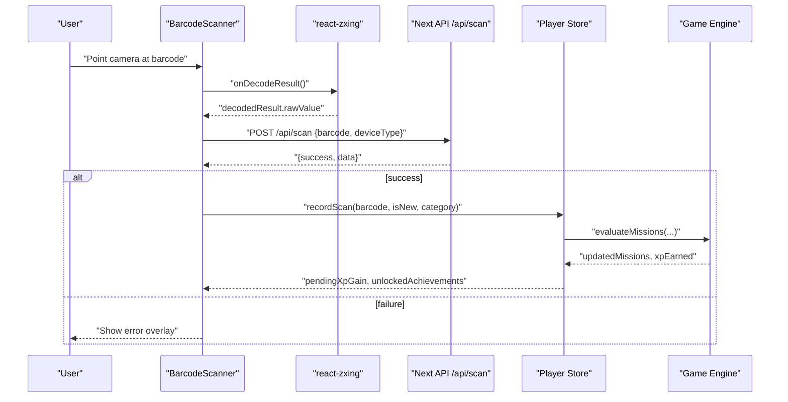
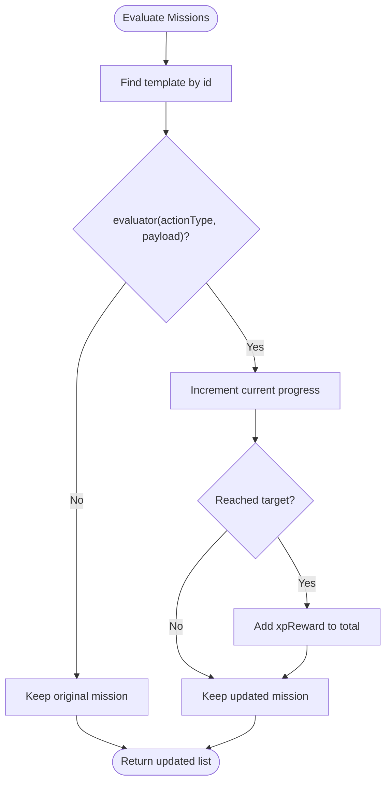
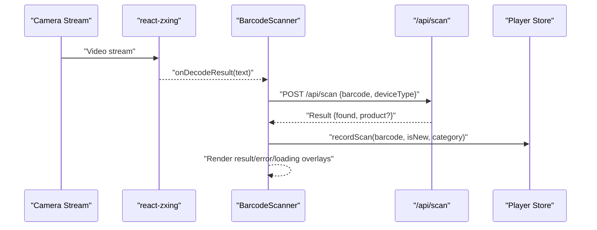
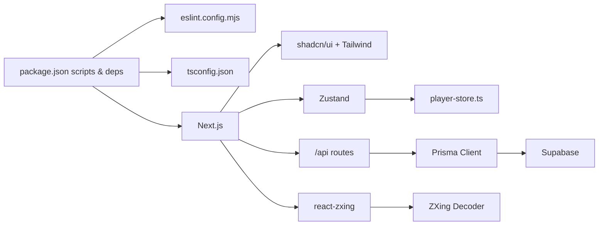

# Contributing Guide

<cite>
**Referenced Files in This Document**
- [README.md](file://README.md)
- [SETUP.md](file://SETUP.md)
- [package.json](file://package.json)
- [eslint.config.mjs](file://eslint.config.mjs)
- [tsconfig.json](file://tsconfig.json)
- [src/lib/game-engine.ts](file://src/lib/game-engine.ts)
- [src/lib/game-config.ts](file://src/lib/game-config.ts)
- [src/stores/player-store.ts](file://src/stores/player-store.ts)
- [src/components/scanner/barcode-scanner.tsx](file://src/components/scanner/barcode-scanner.tsx)
- [src/components/ui/button.tsx](file://src/components/ui/button.tsx)
- [src/components/game/nickname-setup.tsx](file://src/components/game/nickname-setup.tsx)
- [AGENTS.md](file://AGENTS.md)
- [CLAUDE.md](file://CLAUDE.md)
</cite>

## Table of Contents
1. [Introduction](#introduction)
2. [Project Structure](#project-structure)
3. [Core Components](#core-components)
4. [Architecture Overview](#architecture-overview)
5. [Detailed Component Analysis](#detailed-component-analysis)
6. [Dependency Analysis](#dependency-analysis)
7. [Performance Considerations](#performance-considerations)
8. [Troubleshooting Guide](#troubleshooting-guide)
9. [Conclusion](#conclusion)
10. [Appendices](#appendices)

## Introduction
Thank you for considering contributing to Barcode Adventure. This guide consolidates the project’s development standards, tooling, and contribution workflows to help you deliver high-quality changes efficiently. It covers code style, TypeScript best practices, pull request and issue processes, feature development, testing expectations, documentation standards, and collaboration norms.

## Project Structure
Barcode Adventure is a Next.js 16 App Router application written in TypeScript, styled with Tailwind CSS v4 and built with shadcn/ui. It integrates Supabase for authentication, database, and storage, Prisma for ORM, and a custom game engine for gamification. The scanner leverages react-zxing for real-time barcode detection.

```mermaid
graph TB
subgraph "Runtime"
Next["Next.js App Router"]
TS["TypeScript"]
Tailwind["Tailwind CSS v4"]
Radix["Radix UI"]
Motion["Motion (Framer Motion)"]
end
subgraph "State"
Zustand["Zustand Store"]
LocalStorage["Browser Persistence"]
end
subgraph "Gamification"
Engine["Game Engine<br/>Missions & Achievements"]
Config["Game Config<br/>XP, Cooldowns, UI Durations"]
end
subgraph "Scanner"
ZXing["react-zxing"]
Scanner["BarcodeScanner Component"]
end
subgraph "Backend"
Supabase["Supabase Auth/DB/Storage"]
Prisma["Prisma Client"]
API["Next API Routes"]
end
Next --> TS
Next --> Tailwind
Next --> Radix
Next --> Motion
Next --> Zustand
Zustand --> LocalStorage
Next --> Engine
Engine --> Config
Next --> ZXing
ZXing --> Scanner
Next --> API
API --> Prisma
Prisma --> Supabase
```

**Diagram sources**
- [package.json:1-60](file://package.json#L1-L60)
- [src/lib/game-engine.ts:1-241](file://src/lib/game-engine.ts#L1-L241)
- [src/lib/game-config.ts:1-28](file://src/lib/game-config.ts#L1-L28)
- [src/stores/player-store.ts:1-294](file://src/stores/player-store.ts#L1-L294)
- [src/components/scanner/barcode-scanner.tsx:1-217](file://src/components/scanner/barcode-scanner.tsx#L1-L217)

**Section sources**
- [README.md:1-37](file://README.md#L1-L37)
- [SETUP.md:1-152](file://SETUP.md#L1-L152)
- [package.json:1-60](file://package.json#L1-L60)

## Core Components
- Game engine: Defines achievements, daily mission templates, and evaluation logic.
- Game configuration: Centralizes XP gains, cooldowns, UI durations, and level formula.
- Player store: Manages player state, XP/level progression, streaks, daily missions, and achievements.
- Scanner: Real-time barcode capture via react-zxing with overlays and sound feedback.
- UI primitives: Reusable components (e.g., Button) using class variance authority and radix slots.

**Section sources**
- [src/lib/game-engine.ts:1-241](file://src/lib/game-engine.ts#L1-L241)
- [src/lib/game-config.ts:1-28](file://src/lib/game-config.ts#L1-L28)
- [src/stores/player-store.ts:1-294](file://src/stores/player-store.ts#L1-L294)
- [src/components/scanner/barcode-scanner.tsx:1-217](file://src/components/scanner/barcode-scanner.tsx#L1-L217)
- [src/components/ui/button.tsx:1-68](file://src/components/ui/button.tsx#L1-L68)

## Architecture Overview
The application follows a layered architecture:
- Presentation: Next.js pages and components (UI, Scanner, Game UI).
- State: Zustand store with persistence for player progress.
- Business logic: Game engine and configuration modules.
- Data access: Prisma client interacting with Supabase Postgres.
- Scanner pipeline: react-zxing decoding events routed to API endpoints and store updates.



**Diagram sources**
- [src/components/scanner/barcode-scanner.tsx:46-85](file://src/components/scanner/barcode-scanner.tsx#L46-L85)
- [src/stores/player-store.ts:129-181](file://src/stores/player-store.ts#L129-L181)
- [src/lib/game-engine.ts:169-200](file://src/lib/game-engine.ts#L169-L200)

## Detailed Component Analysis

### Game Engine and Configuration
- Achievements: Predefined unlock conditions evaluated against player state.
- Daily Missions: Deterministic selection seeded by date; evaluation uses a pluggable evaluator pattern.
- Configuration: Centralized constants for XP rewards, cooldowns, UI timings, and level calculation.



**Diagram sources**
- [src/lib/game-engine.ts:169-200](file://src/lib/game-engine.ts#L169-L200)

**Section sources**
- [src/lib/game-engine.ts:1-241](file://src/lib/game-engine.ts#L1-L241)
- [src/lib/game-config.ts:1-28](file://src/lib/game-config.ts#L1-L28)

### Player Store and State Management
- Responsibilities: Initialize player, track XP/level, manage streaks, enforce cooldowns, update daily missions, and handle achievement unlocks.
- Persistence: Uses Zustand with localStorage persistence for continuity across sessions.

```mermaid
classDiagram
class PlayerState {
+mode
+nickname
+avatar
+creatorId
+xp
+level
+streak
+lastActiveDate
+registeredBarcodes[]
+dailyMissions[]
+unlockedAchievements[]
+scanHistory[]
+lastScanTime{}
+lastRegisterTime
+lastDeleteTime
+pendingXpGain
+pendingAchievementUnlocks[]
}
class PlayerActions {
+initializePlayer(nickname, avatar)
+setMode(mode)
+addXP(amount)
+recordScan(barcode, isNewProduct, category)
+registerProduct(barcode)
+unregisterProduct(barcode)
+checkDailyReset(localDateString)
+clearPendingXpGain()
+clearPendingAchievementUnlocks()
+resetPlayer()
}
class GameEngine {
+generateDailyMissions(dateStr)
+evaluateMissions(missions, actionType, payload)
+checkNewAchievements(playerState)
}
PlayerState <.. PlayerActions : "actions mutate state"
PlayerActions --> GameEngine : "uses"
```

**Diagram sources**
- [src/stores/player-store.ts:9-45](file://src/stores/player-store.ts#L9-L45)
- [src/stores/player-store.ts:100-294](file://src/stores/player-store.ts#L100-L294)
- [src/lib/game-engine.ts:137-240](file://src/lib/game-engine.ts#L137-L240)

**Section sources**
- [src/stores/player-store.ts:1-294](file://src/stores/player-store.ts#L1-L294)

### Scanner Component
- Integrates react-zxing with constraints for camera selection and decoding formats.
- Provides loading, result, and error overlays; triggers sound feedback; records scans into the store.



**Diagram sources**
- [src/components/scanner/barcode-scanner.tsx:87-120](file://src/components/scanner/barcode-scanner.tsx#L87-L120)
- [src/components/scanner/barcode-scanner.tsx:53-85](file://src/components/scanner/barcode-scanner.tsx#L53-L85)
- [src/stores/player-store.ts:129-181](file://src/stores/player-store.ts#L129-L181)

**Section sources**
- [src/components/scanner/barcode-scanner.tsx:1-217](file://src/components/scanner/barcode-scanner.tsx#L1-L217)

### UI Component Guidelines
- Use the Button primitive for consistent variants and sizes.
- Prefer radix-ui primitives for accessibility and composition.
- Keep component props minimal and typed; avoid inline styles where shared styles exist.

**Section sources**
- [src/components/ui/button.tsx:1-68](file://src/components/ui/button.tsx#L1-L68)

### Agent Skill System Contribution Guidelines
- The project references special agent documentation that emphasizes Next.js version differences and adherence to updated docs.
- Contributions to agent skills should align with the documented conventions and file structure guidance.

**Section sources**
- [AGENTS.md:1-6](file://AGENTS.md#L1-L6)
- [CLAUDE.md:1-2](file://CLAUDE.md#L1-L2)

## Dependency Analysis
- Toolchain: Next.js, TypeScript, ESLint (Next.js configs), Tailwind CSS v4, Prisma.
- Runtime: react-zxing for barcode decoding, Zustand for state, Supabase for auth/storage/db.
- Styling: shadcn/ui primitives with Tailwind utilities.



**Diagram sources**
- [package.json:1-60](file://package.json#L1-L60)
- [eslint.config.mjs:1-19](file://eslint.config.mjs#L1-L19)
- [tsconfig.json:1-35](file://tsconfig.json#L1-L35)
- [src/stores/player-store.ts:1-294](file://src/stores/player-store.ts#L1-L294)
- [src/components/scanner/barcode-scanner.tsx:1-217](file://src/components/scanner/barcode-scanner.tsx#L1-L217)

**Section sources**
- [package.json:1-60](file://package.json#L1-L60)
- [eslint.config.mjs:1-19](file://eslint.config.mjs#L1-L19)
- [tsconfig.json:1-35](file://tsconfig.json#L1-L35)

## Performance Considerations
- Scanner decoding: Limit supported formats to retail barcodes and tune attempts interval for responsiveness.
- State updates: Batch updates in the store to minimize re-renders; leverage computed derived values where appropriate.
- Animations: Use lightweight transitions and avoid heavy GPU work in hot paths.
- Network: Debounce repeated requests and apply cooldowns to prevent redundant API calls.

[No sources needed since this section provides general guidance]

## Troubleshooting Guide
- Camera not working: Ensure HTTPS or localhost; grant permissions; test on Safari on iOS.
- Supabase connection errors: Verify Transaction Pooler port and network allowlisting.
- Admin login failures: Confirm user is created in Supabase Auth and email is confirmed.
- Image uploads: Confirm bucket exists, public access is enabled, and storage policies permit uploads.

**Section sources**
- [SETUP.md:134-152](file://SETUP.md#L134-L152)

## Conclusion
By following this guide, contributors can implement features consistently, maintain code quality, and integrate seamlessly with the existing game engine, scanner, and state management. Focus on clear PR descriptions, tests, and documentation updates to accelerate reviews and reduce regressions.

[No sources needed since this section summarizes without analyzing specific files]

## Appendices

### Code Style Standards and TypeScript Best Practices
- ESLint configuration: Extends Next.js core-web-vitals and TypeScript configs; overrides default ignores to include project files.
- TypeScript strictness: Enabled strict mode, isolated modules, and bundler resolution; path aliases configured.
- Formatting: Use consistent naming, small cohesive functions, and explicit types for props and state.
- Imports: Prefer absolute paths via @/* alias; group external, internal, and sibling imports clearly.

**Section sources**
- [eslint.config.mjs:1-19](file://eslint.config.mjs#L1-L19)
- [tsconfig.json:1-35](file://tsconfig.json#L1-L35)

### Pull Request Process
- Branch naming: Use concise imperative phrasing (e.g., feat(scanner-enhancement), fix(camera-permissions), chore(deps-update)).
- Commit messages: Summarize intent, explain motivation and tradeoffs, link related issues.
- Description: Outline changes, rationale, migration notes, and testing steps.
- Reviews: Expect at least one maintainer approval; address comments promptly and update tests accordingly.

[No sources needed since this section provides general guidance]

### Issue Reporting Guidelines
- Provide reproduction steps, expected vs. actual behavior, environment details (OS, browser, Node version).
- Attach screenshots or short videos for UI issues; include console logs for runtime errors.
- Search existing issues before filing duplicates.

[No sources needed since this section provides general guidance]

### Feature Development Workflow
- Scanner enhancements: Extend supported formats or overlays thoughtfully; ensure accessibility and performance.
- Gamification additions: Define new achievements or missions with clear evaluators; update configuration and tests.
- UI components: Reuse primitives, keep variants minimal, and document behavior and accessibility.

[No sources needed since this section provides general guidance]

### Testing Requirements
- Unit tests: Validate game engine logic (missions, achievements), configuration constants, and store reducers.
- Integration tests: Verify scanner flow from decode to store updates and API responses.
- E2E tests: Cover critical user journeys (scan, register, login, dashboard).

[No sources needed since this section provides general guidance]

### Code Review Processes
- Automated checks: Lint, type checks, and build must pass.
- Human review: Focus on correctness, maintainability, UX, and adherence to style.
- Merge criteria: All checks pass, approvals granted, and conflicts resolved.

[No sources needed since this section provides general guidance]

### Documentation Standards
- Update README/SETUP for environment changes or new features.
- Comment complex logic in game engine and store actions.
- Keep component prop documentation in type definitions and JSDoc where helpful.

[No sources needed since this section provides general guidance]

### Community Guidelines and Maintainer Responsibilities
- Be respectful and inclusive; escalate conflicts constructively.
- Maintainers triage issues, review PRs, enforce standards, and coordinate releases.

[No sources needed since this section provides general guidance]

### Examples
- Good commit message: “feat(scanner): add EAN-8 support and retry logic”
- Branch naming: “fix(scanner-camera-switch)” or “docs(agent-skills-guide)”

[No sources needed since this section provides general guidance]