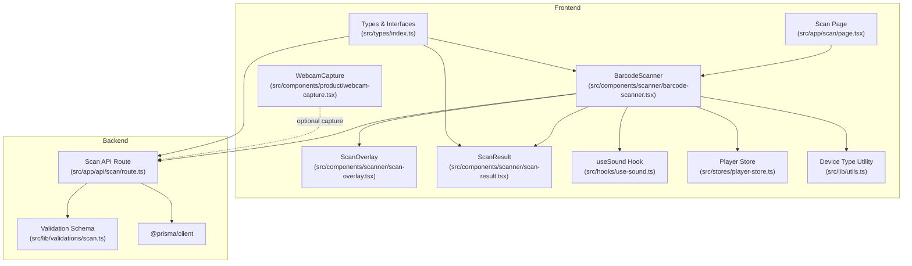
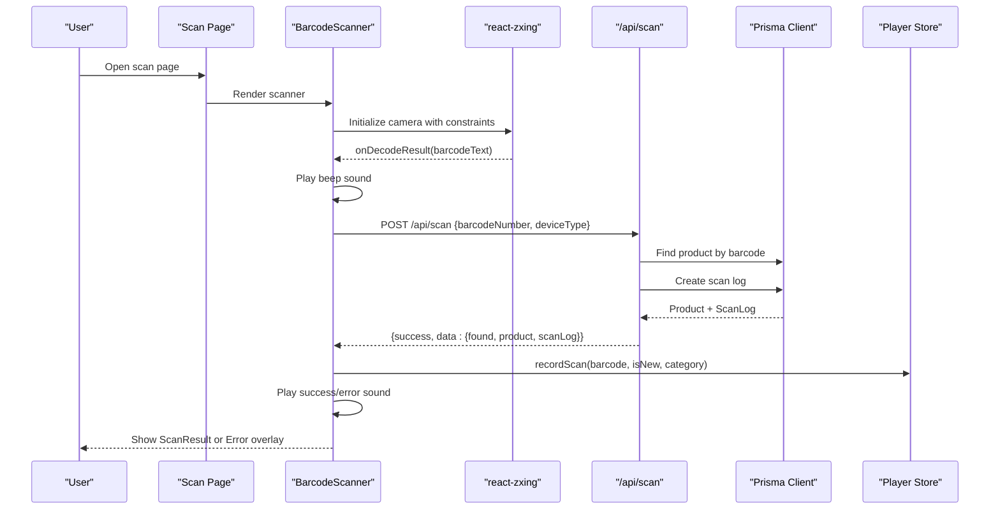
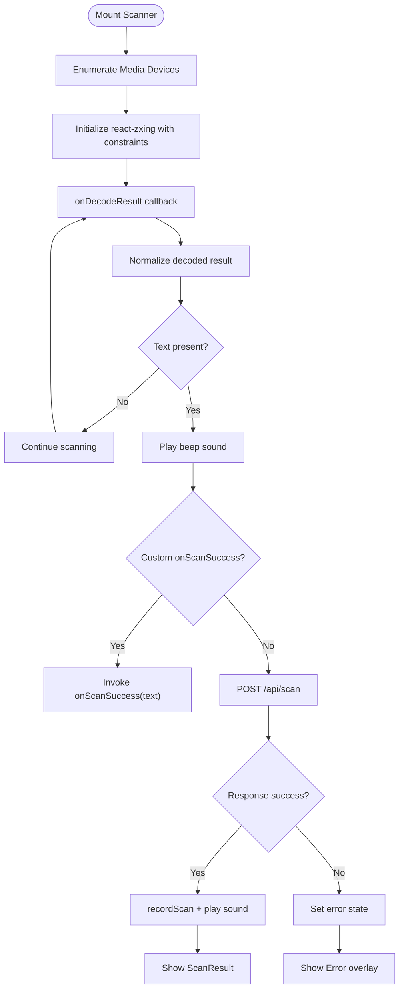
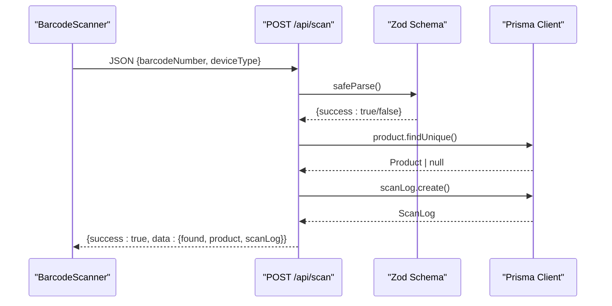
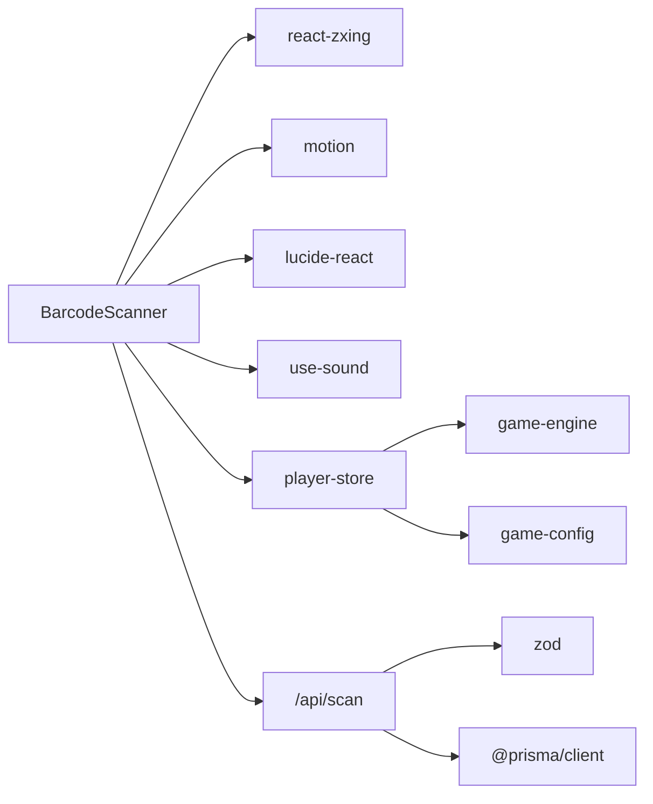

# Barcode Scanning System

<cite>
**Referenced Files in This Document**
- [barcode-scanner.tsx](file://src/components/scanner/barcode-scanner.tsx)
- [scan-overlay.tsx](file://src/components/scanner/scan-overlay.tsx)
- [scan-result.tsx](file://src/components/scanner/scan-result.tsx)
- [webcam-capture.tsx](file://src/components/product/webcam-capture.tsx)
- [page.tsx](file://src/app/scan/page.tsx)
- [route.ts](file://src/app/api/scan/route.ts)
- [utils.ts](file://src/lib/utils.ts)
- [index.ts](file://src/types/index.ts)
- [use-sound.ts](file://src/hooks/use-sound.ts)
- [player-store.ts](file://src/stores/player-store.ts)
- [scan.ts](file://src/lib/validations/scan.ts)
- [game-config.ts](file://src/lib/game-config.ts)
- [package.json](file://package.json)
</cite>

## Table of Contents
1. [Introduction](#introduction)
2. [Project Structure](#project-structure)
3. [Core Components](#core-components)
4. [Architecture Overview](#architecture-overview)
5. [Detailed Component Analysis](#detailed-component-analysis)
6. [Dependency Analysis](#dependency-analysis)
7. [Performance Considerations](#performance-considerations)
8. [Troubleshooting Guide](#troubleshooting-guide)
9. [Conclusion](#conclusion)

## Introduction
This document describes the barcode scanning system built with React and Next.js. It covers real-time camera integration via react-zxing, multi-format barcode detection (EAN-13, EAN-8, UPC-A, UPC-E, Code-128, Code-39), device compatibility handling, and the complete scanning workflow from camera initialization to result processing. It also documents backend integration with the `/api/scan` endpoint, result validation, user feedback mechanisms, camera constraints, performance optimizations, accessibility features, and troubleshooting guidance for common scanning issues and browser compatibility considerations.

## Project Structure
The scanning system is composed of:
- Scanner UI components: a full-screen scanner, scanning overlay, and result overlay
- Page container: the scan page that hosts the scanner
- Backend API: a Next.js route handler that validates requests and queries product data
- Supporting utilities: device type detection, sound effects, player state management, and TypeScript types
- Validation schema: Zod-based input validation for the scan endpoint

**Diagram sources**
- [page.tsx:1-33](file://src/app/scan/page.tsx#L1-L33)
- [barcode-scanner.tsx:1-217](file://src/components/scanner/barcode-scanner.tsx#L1-L217)
- [scan-overlay.tsx:1-69](file://src/components/scanner/scan-overlay.tsx#L1-L69)
- [scan-result.tsx:1-157](file://src/components/scanner/scan-result.tsx#L1-L157)
- [webcam-capture.tsx:1-135](file://src/components/product/webcam-capture.tsx#L1-L135)
- [use-sound.ts:1-92](file://src/hooks/use-sound.ts#L1-L92)
- [player-store.ts:1-294](file://src/stores/player-store.ts#L1-L294)
- [utils.ts:1-40](file://src/lib/utils.ts#L1-L40)
- [index.ts:1-109](file://src/types/index.ts#L1-L109)
- [route.ts:1-60](file://src/app/api/scan/route.ts#L1-L60)
- [scan.ts:1-11](file://src/lib/validations/scan.ts#L1-L11)

**Section sources**
- [page.tsx:1-33](file://src/app/scan/page.tsx#L1-L33)
- [barcode-scanner.tsx:1-217](file://src/components/scanner/barcode-scanner.tsx#L1-L217)
- [route.ts:1-60](file://src/app/api/scan/route.ts#L1-L60)
- [utils.ts:1-40](file://src/lib/utils.ts#L1-L40)
- [index.ts:1-109](file://src/types/index.ts#L1-L109)

## Core Components
- BarcodeScanner: orchestrates camera initialization, decoding, result processing, error handling, device switching, and user feedback
- ScanOverlay: provides visual guidance and scanning hints
- ScanResult: displays product lookup results and actions
- Scan API Route: validates input, queries product data, logs scans, and returns structured results
- useSound: manages audio feedback for scanning events
- Player Store: records scans, evaluates missions, and tracks XP/achievements
- Device Type Utility: detects mobile/tablet/desktop for analytics/logging
- Validation Schema: ensures robust input parsing for the scan endpoint

**Section sources**
- [barcode-scanner.tsx:1-217](file://src/components/scanner/barcode-scanner.tsx#L1-L217)
- [scan-overlay.tsx:1-69](file://src/components/scanner/scan-overlay.tsx#L1-L69)
- [scan-result.tsx:1-157](file://src/components/scanner/scan-result.tsx#L1-L157)
- [route.ts:1-60](file://src/app/api/scan/route.ts#L1-L60)
- [use-sound.ts:1-92](file://src/hooks/use-sound.ts#L1-L92)
- [player-store.ts:1-294](file://src/stores/player-store.ts#L1-L294)
- [utils.ts:1-40](file://src/lib/utils.ts#L1-L40)
- [scan.ts:1-11](file://src/lib/validations/scan.ts#L1-L11)

## Architecture Overview
The scanning workflow integrates frontend camera capture with backend product lookup and game state updates.

**Diagram sources**
- [page.tsx:1-33](file://src/app/scan/page.tsx#L1-L33)
- [barcode-scanner.tsx:46-120](file://src/components/scanner/barcode-scanner.tsx#L46-L120)
- [route.ts:7-51](file://src/app/api/scan/route.ts#L7-L51)
- [player-store.ts:129-180](file://src/stores/player-store.ts#L129-L180)

## Detailed Component Analysis

### BarcodeScanner Component
Responsibilities:
- Initialize camera with react-zxing using optimized constraints
- Limit supported barcode formats to retail standards for performance
- Handle decoding callbacks, loading states, and error conditions
- Integrate with backend via fetch to /api/scan
- Manage device enumeration and camera switching
- Provide visual feedback and user controls

Key behaviors:
- Camera constraints include resolution targets and environment facing mode fallback
- Decoding attempts occur at a high frequency for responsive scanning
- Error handling distinguishes permission denials from other failures
- On successful decode, triggers network request with validated payload
- Updates player store with scan outcome and category for XP evaluation

**Diagram sources**
- [barcode-scanner.tsx:30-120](file://src/components/scanner/barcode-scanner.tsx#L30-L120)

**Section sources**
- [barcode-scanner.tsx:1-217](file://src/components/scanner/barcode-scanner.tsx#L1-L217)
- [use-sound.ts:1-92](file://src/hooks/use-sound.ts#L1-L92)
- [player-store.ts:129-180](file://src/stores/player-store.ts#L129-L180)
- [utils.ts:28-34](file://src/lib/utils.ts#L28-L34)

### ScanOverlay Component
Provides visual scanning guidance:
- Darkened overlay with a centered rectangular scanning window
- Animated corner brackets and a moving scanning line
- Centered hint text and focus instructions

Accessibility considerations:
- Uses motion animations for guidance without relying solely on color
- Clear contrast against dark backgrounds

**Section sources**
- [scan-overlay.tsx:1-69](file://src/components/scanner/scan-overlay.tsx#L1-L69)

### ScanResult Component
Displays outcomes:
- Found case: product image/name/brand/category and actions (scan again, view details)
- Not found case: barcode display and actions (try again, register product)
- Uses motion transitions for smooth appearance/dismissal

**Section sources**
- [scan-result.tsx:1-157](file://src/components/scanner/scan-result.tsx#L1-L157)
- [index.ts:1-27](file://src/types/index.ts#L1-L27)

### Scan API Route
End-to-end request processing:
- Validates incoming payload using Zod schema
- Queries product by barcode
- Creates a scan log with device type
- Returns standardized response with product and scan log metadata

**Diagram sources**
- [route.ts:7-51](file://src/app/api/scan/route.ts#L7-L51)
- [scan.ts:1-11](file://src/lib/validations/scan.ts#L1-L11)

**Section sources**
- [route.ts:1-60](file://src/app/api/scan/route.ts#L1-L60)
- [scan.ts:1-11](file://src/lib/validations/scan.ts#L1-L11)
- [index.ts:1-27](file://src/types/index.ts#L1-L27)

### Player Store Integration
Records scan outcomes and evaluates game mechanics:
- Prevents rapid re-scan of the same barcode via cooldown
- Awards XP differently for new vs existing products
- Evaluates daily missions and checks for new achievements
- Persists state locally for continuity across sessions

**Section sources**
- [player-store.ts:129-180](file://src/stores/player-store.ts#L129-L180)
- [game-config.ts:1-28](file://src/lib/game-config.ts#L1-L28)
- [game-engine.ts:169-200](file://src/lib/game-engine.ts#L169-L200)

### Device Compatibility and Constraints
- Camera constraints specify resolution targets and fallback to environment facing mode when no device ID is set
- Device enumeration enables switching between front/back cameras
- Error handling accounts for permission denials and other media errors

**Section sources**
- [barcode-scanner.tsx:30-44](file://src/components/scanner/barcode-scanner.tsx#L30-L44)
- [barcode-scanner.tsx:87-120](file://src/components/scanner/barcode-scanner.tsx#L87-L120)

### Backend Validation and Data Models
- Zod schema enforces barcode length and optional device type
- Types define product, scan log, and response structures
- API returns normalized timestamps for client-side rendering

**Section sources**
- [scan.ts:1-11](file://src/lib/validations/scan.ts#L1-L11)
- [index.ts:1-27](file://src/types/index.ts#L1-L27)
- [route.ts:35-51](file://src/app/api/scan/route.ts#L35-L51)

## Dependency Analysis
External libraries and integrations:
- react-zxing: camera decoding and barcode detection
- motion: smooth animations for overlays and transitions
- lucide-react: icons for UI affordances
- @prisma/client: database access for product and scan log persistence
- zustand: global game state management
- zod: runtime validation for API inputs

**Diagram sources**
- [package.json:20-46](file://package.json#L20-L46)
- [barcode-scanner.tsx:1-12](file://src/components/scanner/barcode-scanner.tsx#L1-L12)
- [route.ts:1-5](file://src/app/api/scan/route.ts#L1-L5)
- [player-store.ts:1-6](file://src/stores/player-store.ts#L1-L6)

**Section sources**
- [package.json:1-60](file://package.json#L1-L60)

## Performance Considerations
- Format filtering: restricts decoding to EAN-13, EAN-8, UPC-A, UPC-E, Code-128, Code-39 to reduce CPU usage
- Resolution targets: sets ideal and minimum width/height for balanced quality and performance
- Environment facing mode: prioritizes back camera for typical scanning scenarios
- Decoding frequency: reduces time between attempts for snappy responsiveness
- Debounced result processing: prevents duplicate submissions during rapid detections
- Lazy audio loading: preloads sounds on client to avoid blocking first interaction

Recommendations:
- Consider adaptive resolution based on device capabilities
- Add throttling for very noisy environments to reduce false positives
- Implement autofocus and torch toggles when supported by the device

**Section sources**
- [barcode-scanner.tsx:87-120](file://src/components/scanner/barcode-scanner.tsx#L87-L120)
- [use-sound.ts:11-17](file://src/hooks/use-sound.ts#L11-L17)

## Troubleshooting Guide
Common issues and resolutions:
- Camera permission denied
  - Symptom: Error overlay instructing to allow camera permissions
  - Action: Prompt user to enable camera access; refresh after granting permission
  - Reference: [barcode-scanner.tsx:114-119](file://src/components/scanner/barcode-scanner.tsx#L114-L119)
- No camera detected
  - Symptom: Empty device list or inability to enumerate devices
  - Action: Verify device connectivity and browser support; ensure HTTPS in production
  - Reference: [barcode-scanner.tsx:30-36](file://src/components/scanner/barcode-scanner.tsx#L30-L36)
- Device switching not working
  - Symptom: Switch camera button inactive
  - Action: Confirm multiple video devices are present; ensure device IDs are populated
  - Reference: [barcode-scanner.tsx:38-44](file://src/components/scanner/barcode-scanner.tsx#L38-L44)
- Network errors during scan
  - Symptom: Error overlay indicating network failure
  - Action: Retry after checking connectivity; inspect browser console for details
  - Reference: [barcode-scanner.tsx:77-80](file://src/components/scanner/barcode-scanner.tsx#L77-L80)
- Slow or unresponsive scanning
  - Symptom: Delayed recognition or missed barcodes
  - Action: Adjust lighting, move closer/further from barcode; ensure environment facing mode is appropriate
  - Reference: [barcode-scanner.tsx:87-96](file://src/components/scanner/barcode-scanner.tsx#L87-L96)
- Incorrect barcode formats
  - Symptom: Decoder does not recognize certain barcodes
  - Action: Verify barcode format is included in supported formats list
  - Reference: [barcode-scanner.tsx](file://src/components/scanner/barcode-scanner.tsx#L90)
- Backend validation errors
  - Symptom: 400 responses with validation messages
  - Action: Ensure barcodeNumber is present and within length limits; deviceType is optional
  - Reference: [route.ts:12-17](file://src/app/api/scan/route.ts#L12-L17), [scan.ts:3-9](file://src/lib/validations/scan.ts#L3-L9)

Browser compatibility:
- HTTPS required for camera access in modern browsers
- Environment facing mode requires HTTPS in some browsers
- react-zxing relies on browser-native barcode detection APIs; ensure latest browser versions

**Section sources**
- [barcode-scanner.tsx:30-120](file://src/components/scanner/barcode-scanner.tsx#L30-L120)
- [route.ts:12-17](file://src/app/api/scan/route.ts#L12-L17)
- [scan.ts:3-9](file://src/lib/validations/scan.ts#L3-L9)

## Conclusion
The barcode scanning system combines efficient camera integration, precise barcode detection, robust backend validation, and engaging user feedback. Its modular design supports device compatibility, performance tuning, and extensibility for additional formats or workflows. By following the troubleshooting steps and leveraging the documented components, developers can maintain a reliable and accessible scanning experience across diverse devices and environments.