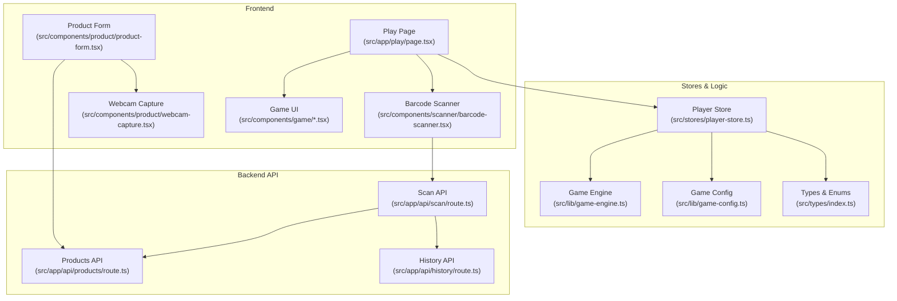
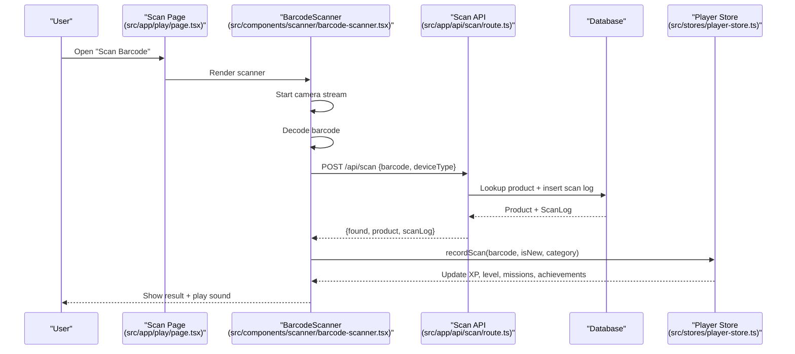
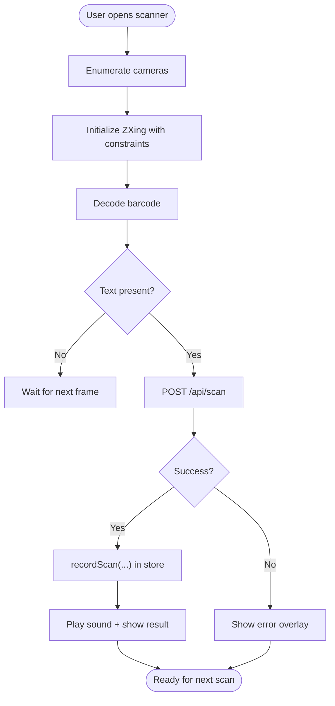
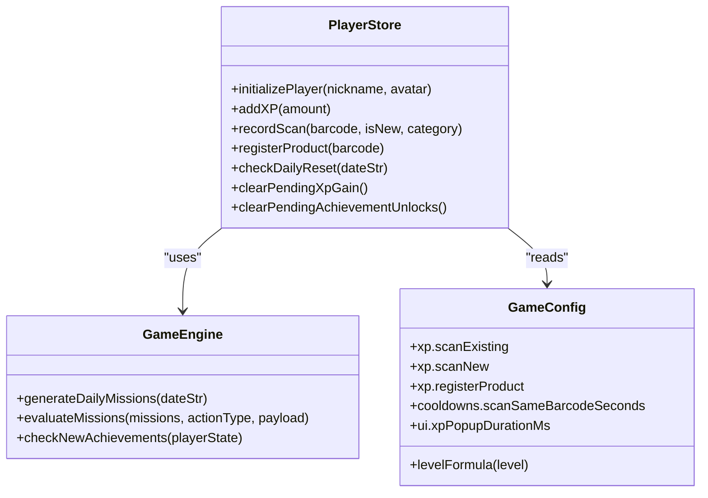
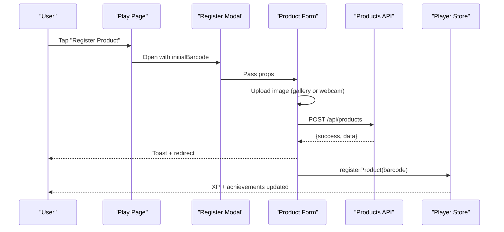
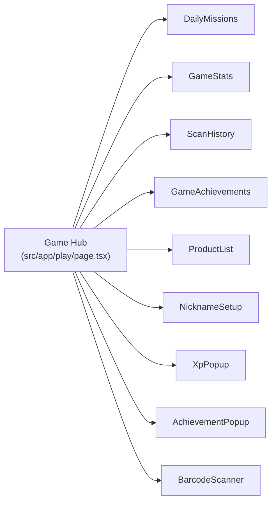
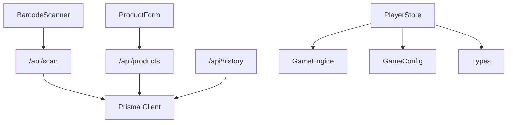

# Core Features

<cite>
**Referenced Files in This Document**
- [README.md](file://README.md)
- [game-engine.ts](file://src/lib/game-engine.ts)
- [game-config.ts](file://src/lib/game-config.ts)
- [player-store.ts](file://src/stores/player-store.ts)
- [index.ts](file://src/types/index.ts)
- [barcode-scanner.tsx](file://src/components/scanner/barcode-scanner.tsx)
- [webcam-capture.tsx](file://src/components/product/webcam-capture.tsx)
- [nickname-setup.tsx](file://src/components/game/nickname-setup.tsx)
- [xp-popup.tsx](file://src/components/game/xp-popup.tsx)
- [achievement-popup.tsx](file://src/components/game/achievement-popup.tsx)
- [route.ts](file://src/app/api/scan/route.ts)
- [route.ts](file://src/app/api/products/route.ts)
- [route.ts](file://src/app/api/history/route.ts)
- [product-form.tsx](file://src/components/product/product-form.tsx)
- [page.tsx](file://src/app/play/page.tsx)
</cite>

## Table of Contents
1. [Introduction](#introduction)
2. [Project Structure](#project-structure)
3. [Core Components](#core-components)
4. [Architecture Overview](#architecture-overview)
5. [Detailed Component Analysis](#detailed-component-analysis)
6. [Dependency Analysis](#dependency-analysis)
7. [Performance Considerations](#performance-considerations)
8. [Troubleshooting Guide](#troubleshooting-guide)
9. [Conclusion](#conclusion)
10. [Appendices](#appendices)

## Introduction
Barcode Adventure is a gamified barcode discovery app built with Next.js. It combines a real-time barcode scanning system, a persistent gamification engine (XP, levels, achievements, daily missions), and product management capabilities. Users can scan barcodes via camera, receive instant results, gain XP, unlock achievements, and manage products in the catalog. The frontend components integrate tightly with Zustand stores and Next.js API routes backed by a database.

## Project Structure
The project follows a feature-based structure under src/, with clear separation of:
- Frontend pages and components
- Stores and game logic
- Backend API routes
- Types and constants
- Assets and UI primitives

**Diagram sources**
- [page.tsx:1-287](file://src/app/play/page.tsx#L1-L287)
- [barcode-scanner.tsx:1-217](file://src/components/scanner/barcode-scanner.tsx#L1-L217)
- [product-form.tsx:1-374](file://src/components/product/product-form.tsx#L1-L374)
- [webcam-capture.tsx:1-135](file://src/components/product/webcam-capture.tsx#L1-L135)
- [player-store.ts:1-294](file://src/stores/player-store.ts#L1-L294)
- [game-engine.ts:1-241](file://src/lib/game-engine.ts#L1-L241)
- [game-config.ts:1-28](file://src/lib/game-config.ts#L1-L28)
- [index.ts:1-109](file://src/types/index.ts#L1-L109)
- [route.ts:1-60](file://src/app/api/scan/route.ts#L1-L60)
- [route.ts:1-119](file://src/app/api/products/route.ts#L1-L119)
- [route.ts:1-68](file://src/app/api/history/route.ts#L1-L68)

**Section sources**
- [README.md:1-37](file://README.md#L1-L37)
- [page.tsx:1-287](file://src/app/play/page.tsx#L1-L287)

## Core Components
- Real-time barcode scanning: Uses a camera stream with decoding, network lookup, and immediate feedback.
- Gamification engine: Defines achievements, daily missions, XP rewards, and leveling mechanics.
- Product management: CRUD for products, image upload, and registration from scan results.
- Player state: Centralized store managing XP, levels, streaks, missions, achievements, and cooldowns.
- Backend APIs: Scan lookup, product CRUD, and scan history retrieval.

**Section sources**
- [barcode-scanner.tsx:1-217](file://src/components/scanner/barcode-scanner.tsx#L1-L217)
- [game-engine.ts:1-241](file://src/lib/game-engine.ts#L1-L241)
- [game-config.ts:1-28](file://src/lib/game-config.ts#L1-L28)
- [player-store.ts:1-294](file://src/stores/player-store.ts#L1-L294)
- [route.ts:1-60](file://src/app/api/scan/route.ts#L1-L60)
- [route.ts:1-119](file://src/app/api/products/route.ts#L1-L119)
- [route.ts:1-68](file://src/app/api/history/route.ts#L1-L68)

## Architecture Overview
The app is a client-driven SPA with a Zustand store orchestrating game state and user actions. Scanning triggers an API call to look up product info and log scans. Product registration uses a form that posts to the products API. Achievements and XP updates are computed locally and surfaced via animated popups.

**Diagram sources**
- [page.tsx:222-227](file://src/app/play/page.tsx#L222-L227)
- [barcode-scanner.tsx:46-85](file://src/components/scanner/barcode-scanner.tsx#L46-L85)
- [route.ts:7-51](file://src/app/api/scan/route.ts#L7-L51)
- [player-store.ts:129-181](file://src/stores/player-store.ts#L129-L181)

## Detailed Component Analysis

### Real-Time Barcode Scanning System
- Camera integration: Uses a media device enumeration hook to detect cameras and switches between front/back. Constraints include resolution and facing mode.
- Decoding pipeline: Leverages a ZXing-based library to decode EAN/UPC variants with aggressive decoding attempts and skew correction.
- Network lookup: On successful decode, sends barcode and device type to the scan API endpoint.
- Result handling: Updates player state with XP and mission checks, plays sound effects, and renders success/error overlays.

**Diagram sources**
- [barcode-scanner.tsx:30-120](file://src/components/scanner/barcode-scanner.tsx#L30-L120)
- [route.ts:7-51](file://src/app/api/scan/route.ts#L7-L51)
- [player-store.ts:129-181](file://src/stores/player-store.ts#L129-L181)

**Section sources**
- [barcode-scanner.tsx:1-217](file://src/components/scanner/barcode-scanner.tsx#L1-L217)
- [route.ts:1-60](file://src/app/api/scan/route.ts#L1-L60)

### Gamification Engine (XP, Levels, Achievements, Daily Missions)
- Achievements: Predefined list with IDs, titles, descriptions, and emojis. New unlocks are detected based on player stats.
- Daily missions: Deterministic selection seeded by the current date. Evaluators match action types and optional payload criteria (e.g., category, time window).
- XP and leveling: Fixed XP per action; XP thresholds derived from a configurable formula. Level is recomputed after XP changes.
- Store actions: recordScan, registerProduct, addXP, checkDailyReset, and state clearing for UI animations.

**Diagram sources**
- [player-store.ts:100-294](file://src/stores/player-store.ts#L100-L294)
- [game-engine.ts:137-240](file://src/lib/game-engine.ts#L137-L240)
- [game-config.ts:6-27](file://src/lib/game-config.ts#L6-L27)

**Section sources**
- [game-engine.ts:1-241](file://src/lib/game-engine.ts#L1-L241)
- [game-config.ts:1-28](file://src/lib/game-config.ts#L1-L28)
- [player-store.ts:1-294](file://src/stores/player-store.ts#L1-L294)

### Product Management Capabilities
- Registration flow: From scan result, user can open the register modal with prefilled barcode. The form supports image upload and webcam capture.
- Image capture: Dedicated webcam modal captures frames to blobs and uploads via the upload endpoint.
- Product CRUD: Products API supports listing with filters, creation with validation, and update operations.
- Integration: After successful registration, the store is updated to reflect XP and achievements.

**Diagram sources**
- [page.tsx:112-121](file://src/app/play/page.tsx#L112-L121)
- [product-form.tsx:88-167](file://src/components/product/product-form.tsx#L88-L167)
- [route.ts:69-118](file://src/app/api/products/route.ts#L69-L118)
- [player-store.ts:183-220](file://src/stores/player-store.ts#L183-L220)

**Section sources**
- [product-form.tsx:1-374](file://src/components/product/product-form.tsx#L1-L374)
- [webcam-capture.tsx:1-135](file://src/components/product/webcam-capture.tsx#L1-L135)
- [route.ts:1-119](file://src/app/api/products/route.ts#L1-L119)
- [player-store.ts:183-220](file://src/stores/player-store.ts#L183-L220)

### User Interface Components
- Game hub: Tabs for missions, stats, history, achievements, and products. Integrates with the player store for XP, level, streak, and daily resets.
- Character setup: Guest mode onboarding with nickname and avatar selection.
- Popups: XP popup animates when XP is gained; achievement popup displays unlocked badges with sounds and visuals.
- Scanner UI: Overlay, loading spinner, error overlay, and camera switch button.

**Diagram sources**
- [page.tsx:41-287](file://src/app/play/page.tsx#L41-L287)
- [nickname-setup.tsx:1-114](file://src/components/game/nickname-setup.tsx#L1-L114)
- [xp-popup.tsx:1-51](file://src/components/game/xp-popup.tsx#L1-L51)
- [achievement-popup.tsx:1-97](file://src/components/game/achievement-popup.tsx#L1-L97)
- [barcode-scanner.tsx:128-217](file://src/components/scanner/barcode-scanner.tsx#L128-L217)

**Section sources**
- [page.tsx:1-287](file://src/app/play/page.tsx#L1-L287)
- [nickname-setup.tsx:1-114](file://src/components/game/nickname-setup.tsx#L1-L114)
- [xp-popup.tsx:1-51](file://src/components/game/xp-popup.tsx#L1-L51)
- [achievement-popup.tsx:1-97](file://src/components/game/achievement-popup.tsx#L1-L97)

## Dependency Analysis
- Frontend depends on:
  - Zustand store for state and side effects
  - Game engine for deterministic mission generation and achievement checks
  - Game config for XP values, cooldowns, and UI durations
  - Types for product, scan log, categories, and mission progress
- Backend depends on:
  - Prisma client for database operations
  - Validation schemas for request parsing
- Scanner relies on:
  - MediaDevices API for camera access
  - ZXing-based decoding library for barcode recognition

**Diagram sources**
- [barcode-scanner.tsx:53-61](file://src/components/scanner/barcode-scanner.tsx#L53-L61)
- [product-form.tsx:134-148](file://src/components/product/product-form.tsx#L134-L148)
- [route.ts:1-60](file://src/app/api/scan/route.ts#L1-L60)
- [route.ts:1-119](file://src/app/api/products/route.ts#L1-L119)
- [route.ts:1-68](file://src/app/api/history/route.ts#L1-L68)
- [player-store.ts:1-294](file://src/stores/player-store.ts#L1-L294)
- [game-engine.ts:1-241](file://src/lib/game-engine.ts#L1-L241)
- [game-config.ts:1-28](file://src/lib/game-config.ts#L1-L28)
- [index.ts:1-109](file://src/types/index.ts#L1-L109)

**Section sources**
- [player-store.ts:1-294](file://src/stores/player-store.ts#L1-L294)
- [game-engine.ts:1-241](file://src/lib/game-engine.ts#L1-L241)
- [game-config.ts:1-28](file://src/lib/game-config.ts#L1-L28)
- [index.ts:1-109](file://src/types/index.ts#L1-L109)
- [route.ts:1-60](file://src/app/api/scan/route.ts#L1-L60)
- [route.ts:1-119](file://src/app/api/products/route.ts#L1-L119)
- [route.ts:1-68](file://src/app/api/history/route.ts#L1-L68)

## Performance Considerations
- Camera constraints: Resolution and minimum width/height reduce heavy decoding on low-end devices.
- Decoding frequency: Controlled timeBetweenDecodingAttempts to balance responsiveness and CPU usage.
- Cooldowns: Prevent redundant XP and repeated scans of the same barcode within a short period.
- UI animations: Short durations for XP and achievement popups minimize blocking and keep the experience snappy.
- Pagination: History and product listings support pagination to avoid large payloads.

[No sources needed since this section provides general guidance]

## Troubleshooting Guide
- Camera permission denied: The scanner detects a specific permission error and disables scanning with an actionable message.
- Network errors during scan: Fallback error overlay with retry option; ensure the backend is reachable.
- Duplicate product registration: API returns a conflict when a barcode already exists; form highlights the field and shows a toast.
- Session expiry (Arashu mode): The hub periodically verifies session validity and redirects to mode selection if missing.

**Section sources**
- [barcode-scanner.tsx:114-119](file://src/components/scanner/barcode-scanner.tsx#L114-L119)
- [route.ts:52-58](file://src/app/api/scan/route.ts#L52-L58)
- [route.ts:88-93](file://src/app/api/products/route.ts#L88-L93)
- [page.tsx:87-102](file://src/app/play/page.tsx#L87-L102)

## Conclusion
Barcode Adventure integrates real-time barcode scanning, a robust gamification system, and product management into a cohesive user experience. The frontend components communicate seamlessly with the Zustand store and Next.js API routes, enabling smooth workflows from scanning to XP gains, mission progression, and product registration. The modular design allows for easy extension of categories, missions, and UI elements.

[No sources needed since this section summarizes without analyzing specific files]

## Appendices

### Feature Workflows and Examples
- Scanning workflow
  - Open “Scan Barcode” from the game hub.
  - Allow camera access when prompted.
  - Point at a barcode; the scanner decodes and queries the backend.
  - Receive result, XP gain, and potential achievement unlock.
  - Example path: [page.tsx:222-227](file://src/app/play/page.tsx#L222-L227), [barcode-scanner.tsx:46-85](file://src/components/scanner/barcode-scanner.tsx#L46-L85), [route.ts:7-51](file://src/app/api/scan/route.ts#L7-L51), [player-store.ts:129-181](file://src/stores/player-store.ts#L129-L181)

- Registering a product
  - From the scanner result, choose “Register Product.”
  - Fill the form; optionally capture an image via webcam.
  - Submit to create the product; XP is awarded and achievements rechecked.
  - Example path: [page.tsx:112-121](file://src/app/play/page.tsx#L112-L121), [product-form.tsx:88-167](file://src/components/product/product-form.tsx#L88-L167), [route.ts:69-118](file://src/app/api/products/route.ts#L69-L118), [player-store.ts:183-220](file://src/stores/player-store.ts#L183-L220)

- Managing daily missions and achievements
  - Open the “Missions” tab to view and track progress.
  - Achievements appear as popups with themed visuals and sounds.
  - Example path: [game-engine.ts:137-240](file://src/lib/game-engine.ts#L137-L240), [xp-popup.tsx:15-26](file://src/components/game/xp-popup.tsx#L15-L26), [achievement-popup.tsx:22-46](file://src/components/game/achievement-popup.tsx#L22-L46)

- Viewing scan history
  - Navigate to the “History” tab to review past scans with product details.
  - Example path: [route.ts:25-60](file://src/app/api/history/route.ts#L25-L60), [page.tsx:270-272](file://src/app/play/page.tsx#L270-L272)