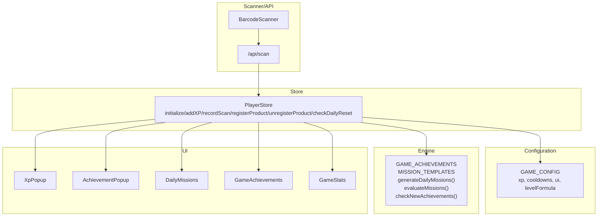
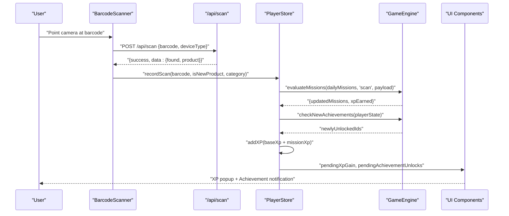
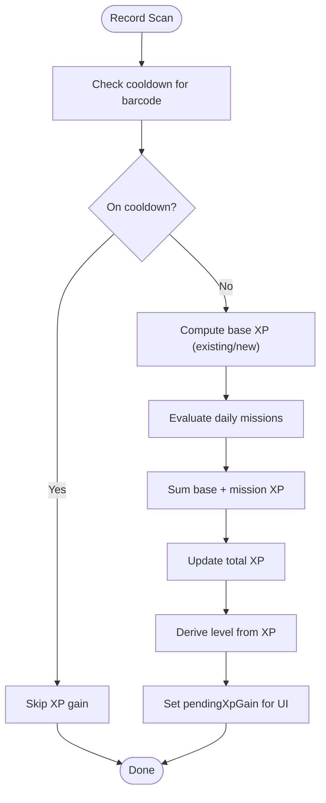
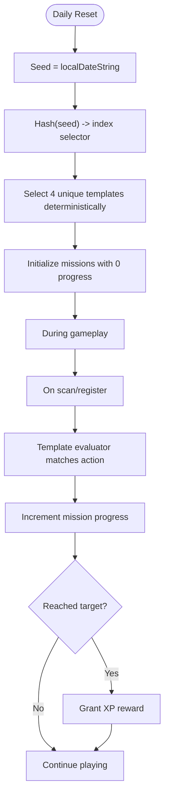
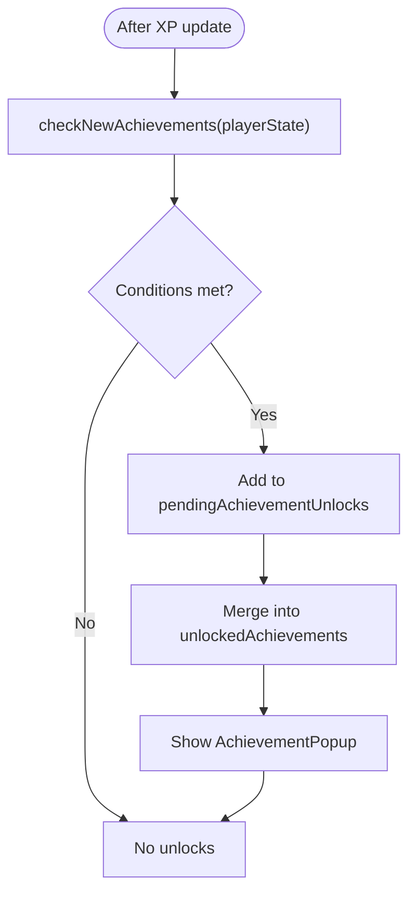
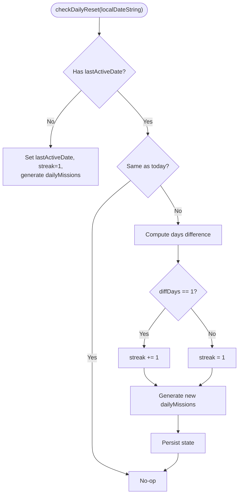
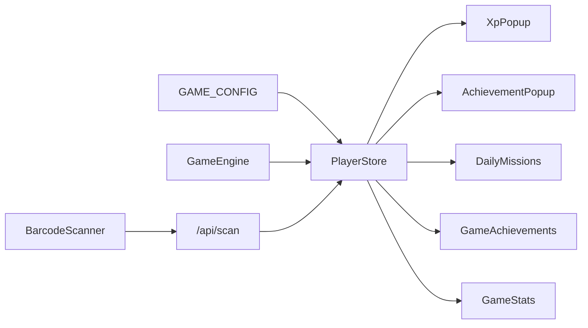

# Gamification Engine

<cite>
**Referenced Files in This Document**
- [game-engine.ts](file://src/lib/game-engine.ts)
- [player-store.ts](file://src/stores/player-store.ts)
- [game-config.ts](file://src/lib/game-config.ts)
- [xp-popup.tsx](file://src/components/game/xp-popup.tsx)
- [achievement-popup.tsx](file://src/components/game/achievement-popup.tsx)
- [daily-missions.tsx](file://src/components/game/daily-missions.tsx)
- [game-achievements.tsx](file://src/components/game/game-achievements.tsx)
- [game-stats.tsx](file://src/components/game/game-stats.tsx)
- [use-sound.ts](file://src/hooks/use-sound.ts)
- [index.ts](file://src/types/index.ts)
- [page.tsx](file://src/app/play/page.tsx)
- [barcode-scanner.tsx](file://src/components/scanner/barcode-scanner.tsx)
- [route.ts](file://src/app/api/scan/route.ts)
</cite>

## Table of Contents
1. [Introduction](#introduction)
2. [Project Structure](#project-structure)
3. [Core Components](#core-components)
4. [Architecture Overview](#architecture-overview)
5. [Detailed Component Analysis](#detailed-component-analysis)
6. [Dependency Analysis](#dependency-analysis)
7. [Performance Considerations](#performance-considerations)
8. [Troubleshooting Guide](#troubleshooting-guide)
9. [Conclusion](#conclusion)

## Introduction
This document describes the gamification engine that powers user engagement through XP systems, achievements, and daily missions. It explains XP calculation algorithms, level progression curves, achievement unlock criteria, and mission generation logic. It also documents the integration between player state management and gamification triggers, visual feedback systems (XP popups, achievement notifications, progress indicators), and the configuration system enabling customizable difficulty and reward structures. Implementation details for streak tracking, bonus multipliers, and social features are included.

## Project Structure
The gamification system spans several layers:
- Configuration: centralized game constants and formulas
- Engine: mission templates, evaluation, and achievement checks
- Store: persistent player state and actions
- UI: visual feedback components and mission/achievement displays
- Scanner/API: integration points that trigger gamification events

**Diagram sources**
- [game-config.ts:6-27](file://src/lib/game-config.ts#L6-L27)
- [game-engine.ts:4-240](file://src/lib/game-engine.ts#L4-L240)
- [player-store.ts:100-293](file://src/stores/player-store.ts#L100-L293)
- [xp-popup.tsx:8-50](file://src/components/game/xp-popup.tsx#L8-L50)
- [achievement-popup.tsx:22-96](file://src/components/game/achievement-popup.tsx#L22-L96)
- [daily-missions.tsx:7-94](file://src/components/game/daily-missions.tsx#L7-L94)
- [game-achievements.tsx:20-87](file://src/components/game/game-achievements.tsx#L20-L87)
- [game-stats.tsx:13-211](file://src/components/game/game-stats.tsx#L13-L211)
- [barcode-scanner.tsx:20-85](file://src/components/scanner/barcode-scanner.tsx#L20-L85)
- [route.ts:7-59](file://src/app/api/scan/route.ts#L7-L59)

**Section sources**
- [game-config.ts:6-27](file://src/lib/game-config.ts#L6-L27)
- [game-engine.ts:4-240](file://src/lib/game-engine.ts#L4-L240)
- [player-store.ts:100-293](file://src/stores/player-store.ts#L100-L293)
- [xp-popup.tsx:8-50](file://src/components/game/xp-popup.tsx#L8-L50)
- [achievement-popup.tsx:22-96](file://src/components/game/achievement-popup.tsx#L22-L96)
- [daily-missions.tsx:7-94](file://src/components/game/daily-missions.tsx#L7-L94)
- [game-achievements.tsx:20-87](file://src/components/game/game-achievements.tsx#L20-L87)
- [game-stats.tsx:13-211](file://src/components/game/game-stats.tsx#L13-L211)
- [barcode-scanner.tsx:20-85](file://src/components/scanner/barcode-scanner.tsx#L20-L85)
- [route.ts:7-59](file://src/app/api/scan/route.ts#L7-L59)

## Core Components
- Game configuration defines XP rewards, cooldowns, UI timing, level formula, and daily mission count.
- Game engine provides mission templates, deterministic daily mission generation, mission evaluation, and achievement checks.
- Player store manages persistent state, XP/level calculations, streak tracking, daily reset logic, and triggers visual feedback.
- UI components render XP popups, achievement notifications, daily missions, achievements, and stats.
- Scanner and API integrate real actions into the gamification pipeline.

Key implementation references:
- Configuration: [game-config.ts:6-27](file://src/lib/game-config.ts#L6-L27)
- Achievements: [game-engine.ts:4-53](file://src/lib/game-engine.ts#L4-L53)
- Mission templates: [game-engine.ts:70-131](file://src/lib/game-engine.ts#L70-L131)
- Daily mission generation: [game-engine.ts:137-163](file://src/lib/game-engine.ts#L137-L163)
- Mission evaluation: [game-engine.ts:169-200](file://src/lib/game-engine.ts#L169-L200)
- Achievement checks: [game-engine.ts:206-240](file://src/lib/game-engine.ts#L206-L240)
- Player store actions: [player-store.ts:100-293](file://src/stores/player-store.ts#L100-L293)
- XP popup: [xp-popup.tsx:8-50](file://src/components/game/xp-popup.tsx#L8-L50)
- Achievement popup: [achievement-popup.tsx:22-96](file://src/components/game/achievement-popup.tsx#L22-L96)
- Daily missions UI: [daily-missions.tsx:7-94](file://src/components/game/daily-missions.tsx#L7-L94)
- Achievements UI: [game-achievements.tsx:20-87](file://src/components/game/game-achievements.tsx#L20-L87)
- Stats UI: [game-stats.tsx:13-211](file://src/components/game/game-stats.tsx#L13-L211)
- Scanner integration: [barcode-scanner.tsx:68-72](file://src/components/scanner/barcode-scanner.tsx#L68-L72)
- API integration: [route.ts:35-51](file://src/app/api/scan/route.ts#L35-L51)

**Section sources**
- [game-config.ts:6-27](file://src/lib/game-config.ts#L6-L27)
- [game-engine.ts:4-240](file://src/lib/game-engine.ts#L4-L240)
- [player-store.ts:100-293](file://src/stores/player-store.ts#L100-L293)
- [xp-popup.tsx:8-50](file://src/components/game/xp-popup.tsx#L8-L50)
- [achievement-popup.tsx:22-96](file://src/components/game/achievement-popup.tsx#L22-L96)
- [daily-missions.tsx:7-94](file://src/components/game/daily-missions.tsx#L7-L94)
- [game-achievements.tsx:20-87](file://src/components/game/game-achievements.tsx#L20-L87)
- [game-stats.tsx:13-211](file://src/components/game/game-stats.tsx#L13-L211)
- [barcode-scanner.tsx:68-72](file://src/components/scanner/barcode-scanner.tsx#L68-L72)
- [route.ts:35-51](file://src/app/api/scan/route.ts#L35-L51)

## Architecture Overview
The gamification pipeline connects scanner actions to state updates and visual feedback:
- Scanner captures a barcode and posts to the scan API.
- API responds with lookup results and logs the scan.
- Player store records the scan, evaluates missions, checks achievements, updates XP/level, and sets pending UI triggers.
- UI components consume pending state to show XP popups and achievement notifications.

**Diagram sources**
- [barcode-scanner.tsx:53-72](file://src/components/scanner/barcode-scanner.tsx#L53-L72)
- [route.ts:35-51](file://src/app/api/scan/route.ts#L35-L51)
- [player-store.ts:129-180](file://src/stores/player-store.ts#L129-L180)
- [game-engine.ts:169-200](file://src/lib/game-engine.ts#L169-L200)
- [game-engine.ts:206-240](file://src/lib/game-engine.ts#L206-L240)
- [xp-popup.tsx:15-26](file://src/components/game/xp-popup.tsx#L15-L26)
- [achievement-popup.tsx:29-42](file://src/components/game/achievement-popup.tsx#L29-L42)

## Detailed Component Analysis

### XP Calculation and Level Progression
- XP rewards:
  - Scanning existing product: configured constant
  - Scanning new product: configured constant
  - Registering product: configured constant
- Cooldowns prevent repeated XP for the same barcode within a short timeframe.
- Level progression uses a configurable level formula to compute cumulative XP per level and derive level from total XP.
- Pending XP is exposed to UI via a dedicated field to drive animations.

Implementation references:
- XP constants and cooldowns: [game-config.ts:7-16](file://src/lib/game-config.ts#L7-L16)
- Level formula: [game-config.ts:23-25](file://src/lib/game-config.ts#L23-L25)
- XP accumulation and level derivation: [player-store.ts:49-68](file://src/stores/player-store.ts#L49-L68)
- Add XP action: [player-store.ts:123-127](file://src/stores/player-store.ts#L123-L127)
- Pending XP UI: [xp-popup.tsx:8-26](file://src/components/game/xp-popup.tsx#L8-L26)

**Diagram sources**
- [player-store.ts:129-180](file://src/stores/player-store.ts#L129-L180)
- [game-engine.ts:169-200](file://src/lib/game-engine.ts#L169-L200)
- [game-config.ts:7-16](file://src/lib/game-config.ts#L7-L16)
- [game-config.ts:23-25](file://src/lib/game-config.ts#L23-L25)

**Section sources**
- [game-config.ts:7-16](file://src/lib/game-config.ts#L7-L16)
- [game-config.ts:23-25](file://src/lib/game-config.ts#L23-L25)
- [player-store.ts:49-68](file://src/stores/player-store.ts#L49-L68)
- [player-store.ts:123-180](file://src/stores/player-store.ts#L123-L180)
- [xp-popup.tsx:8-26](file://src/components/game/xp-popup.tsx#L8-L26)

### Daily Missions System
- Deterministic daily mission generation seeded by the local date string ensures identical missions per calendar day.
- Mission templates define targets, XP rewards, and evaluators that match action types and optional payload criteria (e.g., category, time windows).
- Active missions are evaluated on each relevant action; completion grants XP and updates progress.

Implementation references:
- Mission templates: [game-engine.ts:70-131](file://src/lib/game-engine.ts#L70-L131)
- Daily generation: [game-engine.ts:137-163](file://src/lib/game-engine.ts#L137-L163)
- Evaluation: [game-engine.ts:169-200](file://src/lib/game-engine.ts#L169-L200)
- Store integration: [player-store.ts:150-179](file://src/stores/player-store.ts#L150-L179)
- UI rendering: [daily-missions.tsx:27-91](file://src/components/game/daily-missions.tsx#L27-L91)

**Diagram sources**
- [game-engine.ts:137-163](file://src/lib/game-engine.ts#L137-L163)
- [game-engine.ts:169-200](file://src/lib/game-engine.ts#L169-L200)
- [player-store.ts:150-179](file://src/stores/player-store.ts#L150-L179)

**Section sources**
- [game-engine.ts:70-131](file://src/lib/game-engine.ts#L70-L131)
- [game-engine.ts:137-163](file://src/lib/game-engine.ts#L137-L163)
- [game-engine.ts:169-200](file://src/lib/game-engine.ts#L169-L200)
- [player-store.ts:150-179](file://src/stores/player-store.ts#L150-L179)
- [daily-missions.tsx:27-91](file://src/components/game/daily-missions.tsx#L27-L91)

### Achievement System
- Predefined achievements with IDs, titles, descriptions, and emojis.
- Unlock conditions check totals (scans, registrations), level thresholds, and streak milestones.
- Newly unlocked achievements are queued for UI presentation and persisted in state.

Implementation references:
- Achievements list: [game-engine.ts:4-53](file://src/lib/game-engine.ts#L4-L53)
- Unlock checks: [game-engine.ts:206-240](file://src/lib/game-engine.ts#L206-L240)
- Store integration: [player-store.ts:162-178](file://src/stores/player-store.ts#L162-L178)
- Achievement popup: [achievement-popup.tsx:22-96](file://src/components/game/achievement-popup.tsx#L22-L96)
- Achievements display: [game-achievements.tsx:20-87](file://src/components/game/game-achievements.tsx#L20-L87)

**Diagram sources**
- [game-engine.ts:206-240](file://src/lib/game-engine.ts#L206-L240)
- [player-store.ts:162-178](file://src/stores/player-store.ts#L162-L178)
- [achievement-popup.tsx:22-96](file://src/components/game/achievement-popup.tsx#L22-L96)

**Section sources**
- [game-engine.ts:4-53](file://src/lib/game-engine.ts#L4-L53)
- [game-engine.ts:206-240](file://src/lib/game-engine.ts#L206-L240)
- [player-store.ts:162-178](file://src/stores/player-store.ts#L162-L178)
- [achievement-popup.tsx:22-96](file://src/components/game/achievement-popup.tsx#L22-L96)
- [game-achievements.tsx:20-87](file://src/components/game/game-achievements.tsx#L20-L87)

### Streak Tracking and Social Features
- Streak increments when the previous day was less than 24 hours ago; otherwise resets to 1.
- Daily missions regenerate each day based on local date.
- Social elements include streak display and shared global stats.

Implementation references:
- Streak and daily reset: [player-store.ts:229-269](file://src/stores/player-store.ts#L229-L269)
- UI streak display: [page.tsx:205-209](file://src/app/play/page.tsx#L205-L209)
- Stats UI: [game-stats.tsx:138-208](file://src/components/game/game-stats.tsx#L138-L208)

**Diagram sources**
- [player-store.ts:229-269](file://src/stores/player-store.ts#L229-L269)

**Section sources**
- [player-store.ts:229-269](file://src/stores/player-store.ts#L229-L269)
- [page.tsx:205-209](file://src/app/play/page.tsx#L205-L209)
- [game-stats.tsx:138-208](file://src/components/game/game-stats.tsx#L138-L208)

### Visual Feedback Systems
- XP Popup: Appears when pendingXpGain > 0, auto-clears after a configured duration.
- Achievement Popup: Plays a sound and displays animated badge when a new achievement is queued.
- Daily Missions: Progress bars and completion indicators.
- Achievements: Locked/unlocked badges with PixelCat variants.
- Stats: Global and personal metrics with animated loading states.

Implementation references:
- XP popup: [xp-popup.tsx:8-50](file://src/components/game/xp-popup.tsx#L8-L50)
- Achievement popup: [achievement-popup.tsx:22-96](file://src/components/game/achievement-popup.tsx#L22-L96)
- Daily missions: [daily-missions.tsx:7-94](file://src/components/game/daily-missions.tsx#L7-L94)
- Achievements: [game-achievements.tsx:20-87](file://src/components/game/game-achievements.tsx#L20-L87)
- Stats: [game-stats.tsx:13-211](file://src/components/game/game-stats.tsx#L13-L211)
- Sound effects: [use-sound.ts:53-87](file://src/hooks/use-sound.ts#L53-L87)

**Section sources**
- [xp-popup.tsx:8-50](file://src/components/game/xp-popup.tsx#L8-L50)
- [achievement-popup.tsx:22-96](file://src/components/game/achievement-popup.tsx#L22-L96)
- [daily-missions.tsx:7-94](file://src/components/game/daily-missions.tsx#L7-L94)
- [game-achievements.tsx:20-87](file://src/components/game/game-achievements.tsx#L20-L87)
- [game-stats.tsx:13-211](file://src/components/game/game-stats.tsx#L13-L211)
- [use-sound.ts:53-87](file://src/hooks/use-sound.ts#L53-L87)

### Game Configuration System
- Centralized configuration enables customization of:
  - XP rewards for scans and registrations
  - Cooldowns for actions
  - UI animation durations
  - Level progression formula
  - Number of daily missions

Implementation references:
- Configuration: [game-config.ts:6-27](file://src/lib/game-config.ts#L6-L27)
- Types: [index.ts:92-107](file://src/types/index.ts#L92-L107)

**Section sources**
- [game-config.ts:6-27](file://src/lib/game-config.ts#L6-L27)
- [index.ts:92-107](file://src/types/index.ts#L92-L107)

## Dependency Analysis
The gamification engine exhibits clear separation of concerns:
- Configuration is consumed by both the engine and store.
- The store orchestrates state transitions and delegates evaluation to the engine.
- UI components depend on store state and configuration for rendering and timing.
- Scanner and API act as external triggers feeding actions into the store.

**Diagram sources**
- [game-config.ts:6-27](file://src/lib/game-config.ts#L6-L27)
- [game-engine.ts:4-240](file://src/lib/game-engine.ts#L4-L240)
- [player-store.ts:100-293](file://src/stores/player-store.ts#L100-L293)
- [xp-popup.tsx:8-50](file://src/components/game/xp-popup.tsx#L8-L50)
- [achievement-popup.tsx:22-96](file://src/components/game/achievement-popup.tsx#L22-L96)
- [daily-missions.tsx:7-94](file://src/components/game/daily-missions.tsx#L7-L94)
- [game-achievements.tsx:20-87](file://src/components/game/game-achievements.tsx#L20-L87)
- [game-stats.tsx:13-211](file://src/components/game/game-stats.tsx#L13-L211)
- [barcode-scanner.tsx:20-85](file://src/components/scanner/barcode-scanner.tsx#L20-L85)
- [route.ts:7-59](file://src/app/api/scan/route.ts#L7-L59)

**Section sources**
- [game-config.ts:6-27](file://src/lib/game-config.ts#L6-L27)
- [game-engine.ts:4-240](file://src/lib/game-engine.ts#L4-L240)
- [player-store.ts:100-293](file://src/stores/player-store.ts#L100-L293)
- [xp-popup.tsx:8-50](file://src/components/game/xp-popup.tsx#L8-L50)
- [achievement-popup.tsx:22-96](file://src/components/game/achievement-popup.tsx#L22-L96)
- [daily-missions.tsx:7-94](file://src/components/game/daily-missions.tsx#L7-L94)
- [game-achievements.tsx:20-87](file://src/components/game/game-achievements.tsx#L20-L87)
- [game-stats.tsx:13-211](file://src/components/game/game-stats.tsx#L13-L211)
- [barcode-scanner.tsx:20-85](file://src/components/scanner/barcode-scanner.tsx#L20-L85)
- [route.ts:7-59](file://src/app/api/scan/route.ts#L7-L59)

## Performance Considerations
- Deterministic mission generation uses lightweight hashing and array splicing; complexity is acceptable for small template sets.
- Mission evaluation maps over active missions; keep daily mission counts reasonable to avoid heavy loops.
- Level computation iteratively sums XP per level; a safety cap prevents excessive iterations.
- UI timers clear pending state automatically; ensure durations align with perceived UX needs.
- Scanner throttling and format constraints reduce unnecessary decoding attempts.

[No sources needed since this section provides general guidance]

## Troubleshooting Guide
Common issues and resolutions:
- XP not increasing after scan:
  - Verify cooldowns and that the same barcode is not on cooldown.
  - Confirm base XP values and mission XP contributions.
  - References: [player-store.ts:133-144](file://src/stores/player-store.ts#L133-L144), [game-config.ts:7-16](file://src/lib/game-config.ts#L7-L16)
- Missions not progressing:
  - Ensure action type and payload match template evaluators.
  - Confirm daily missions were regenerated for the current date.
  - References: [game-engine.ts:169-200](file://src/lib/game-engine.ts#L169-L200), [player-store.ts:229-269](file://src/stores/player-store.ts#L229-L269)
- Achievements not unlocking:
  - Check unlock conditions and that IDs are present in the achievements list.
  - Verify pending achievement queue and persistence.
  - References: [game-engine.ts:206-240](file://src/lib/game-engine.ts#L206-L240), [achievement-popup.tsx:27-42](file://src/components/game/achievement-popup.tsx#L27-L42)
- Streak resets unexpectedly:
  - Validate date parsing and difference computations.
  - Ensure daily reset runs on mount with local date string.
  - References: [player-store.ts:245-261](file://src/stores/player-store.ts#L245-L261), [page.tsx:67-71](file://src/app/play/page.tsx#L67-L71)
- Visual feedback not appearing:
  - Confirm pending state fields are being set/cleared.
  - Adjust UI durations to match configuration.
  - References: [xp-popup.tsx:15-26](file://src/components/game/xp-popup.tsx#L15-L26), [achievement-popup.tsx:29-42](file://src/components/game/achievement-popup.tsx#L29-L42), [game-config.ts:17-22](file://src/lib/game-config.ts#L17-L22)

**Section sources**
- [player-store.ts:133-144](file://src/stores/player-store.ts#L133-L144)
- [game-config.ts:7-16](file://src/lib/game-config.ts#L7-L16)
- [game-engine.ts:169-200](file://src/lib/game-engine.ts#L169-L200)
- [player-store.ts:229-269](file://src/stores/player-store.ts#L229-L269)
- [game-engine.ts:206-240](file://src/lib/game-engine.ts#L206-L240)
- [achievement-popup.tsx:27-42](file://src/components/game/achievement-popup.tsx#L27-L42)
- [player-store.ts:245-261](file://src/stores/player-store.ts#L245-L261)
- [page.tsx:67-71](file://src/app/play/page.tsx#L67-L71)
- [xp-popup.tsx:15-26](file://src/components/game/xp-popup.tsx#L15-L26)
- [achievement-popup.tsx:29-42](file://src/components/game/achievement-popup.tsx#L29-L42)
- [game-config.ts:17-22](file://src/lib/game-config.ts#L17-L22)

## Conclusion
The gamification engine integrates tightly with player state and UI to deliver immediate, meaningful feedback. XP and level progression are configurable and robust, daily missions are deterministic and varied, and achievements provide long-term goals. Streak tracking and social cues reinforce continuity and engagement. The modular design supports easy customization of rewards, difficulty, and visuals.

[No sources needed since this section summarizes without analyzing specific files]