# Product Management

<cite>
**Referenced Files in This Document**
- [product-form.tsx](file://src/components/product/product-form.tsx)
- [webcam-capture.tsx](file://src/components/product/webcam-capture.tsx)
- [route.ts](file://src/app/api/products/route.ts)
- [route.ts](file://src/app/api/products/[barcode]/route.ts)
- [route.ts](file://src/app/api/scan/route.ts)
- [route.ts](file://src/app/api/upload/route.ts)
- [page.tsx](file://src/app/scan/page.tsx)
- [barcode-scanner.tsx](file://src/components/scanner/barcode-scanner.tsx)
- [register-product-modal.tsx](file://src/components/game/register-product-modal.tsx)
- [prisma.ts](file://src/lib/prisma.ts)
- [product.ts](file://src/lib/validations/product.ts)
- [scan.ts](file://src/lib/validations/scan.ts)
- [index.ts](file://src/types/index.ts)
- [product-list.tsx](file://src/components/game/product-list.tsx)
- [page.tsx](file://src/app/product/[barcode]/page.tsx)
</cite>

## Table of Contents
1. [Introduction](#introduction)
2. [Project Structure](#project-structure)
3. [Core Components](#core-components)
4. [Architecture Overview](#architecture-overview)
5. [Detailed Component Analysis](#detailed-component-analysis)
6. [Dependency Analysis](#dependency-analysis)
7. [Performance Considerations](#performance-considerations)
8. [Troubleshooting Guide](#troubleshooting-guide)
9. [Conclusion](#conclusion)

## Introduction
This document describes the product management system that supports product data entry, validation, retrieval, and administration. It covers the product form interface with webcam capture for image uploads, barcode validation, category management, CRUD operations, barcode scanning integration, search and filtering, image handling, and data validation rules. It also documents categorization, duplicate detection, and bulk operations.

## Project Structure
The product management system spans UI components, API routes, validation schemas, and shared types. Key areas:
- UI: Product form, webcam capture, barcode scanner, registration modal, and product list
- API: Products CRUD endpoints, scan endpoint, and image upload endpoint
- Validation: Zod schemas for product create/update and scan requests
- Types: Shared Product and Scan types, categories, and constants
- Persistence: Prisma client with PostgreSQL adapter

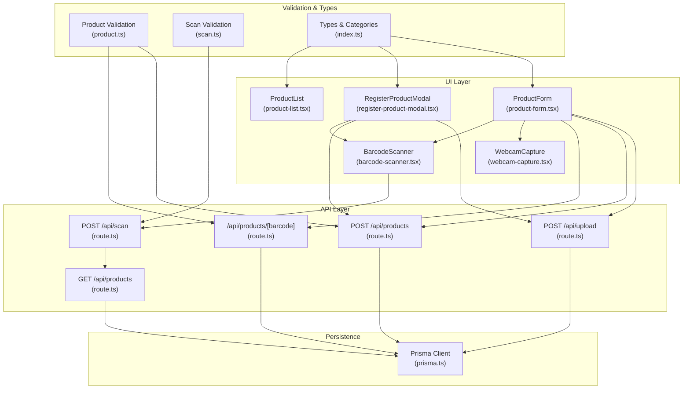

**Diagram sources**
- [product-form.tsx:30-374](file://src/components/product/product-form.tsx#L30-L374)
- [webcam-capture.tsx:11-135](file://src/components/product/webcam-capture.tsx#L11-L135)
- [route.ts:16-118](file://src/app/api/products/route.ts#L16-L118)
- [route.ts:18-125](file://src/app/api/products/[barcode]/route.ts#L18-L125)
- [route.ts:7-59](file://src/app/api/scan/route.ts#L7-L59)
- [route.ts:9-76](file://src/app/api/upload/route.ts#L9-L76)
- [barcode-scanner.tsx:20-216](file://src/components/scanner/barcode-scanner.tsx#L20-L216)
- [register-product-modal.tsx:20-284](file://src/components/game/register-product-modal.tsx#L20-L284)
- [product-list.tsx:37-192](file://src/components/game/product-list.tsx#L37-L192)
- [prisma.ts:8-32](file://src/lib/prisma.ts#L8-L32)
- [product.ts:1-32](file://src/lib/validations/product.ts#L1-L32)
- [scan.ts:1-12](file://src/lib/validations/scan.ts#L1-L12)
- [index.ts:1-109](file://src/types/index.ts#L1-L109)

**Section sources**
- [product-form.tsx:30-374](file://src/components/product/product-form.tsx#L30-L374)
- [route.ts:16-118](file://src/app/api/products/route.ts#L16-L118)
- [route.ts:18-125](file://src/app/api/products/[barcode]/route.ts#L18-L125)
- [route.ts:7-59](file://src/app/api/scan/route.ts#L7-L59)
- [route.ts:9-76](file://src/app/api/upload/route.ts#L9-L76)
- [prisma.ts:8-32](file://src/lib/prisma.ts#L8-L32)
- [product.ts:1-32](file://src/lib/validations/product.ts#L1-L32)
- [scan.ts:1-12](file://src/lib/validations/scan.ts#L1-L12)
- [index.ts:51-90](file://src/types/index.ts#L51-L90)

## Core Components
- ProductForm: Manages product creation/editing, validation, image upload via gallery or webcam, and submission to backend APIs.
- WebcamCapture: Provides camera access, snapshot capture, and returns captured images to parent components.
- BarcodeScanner: Integrates real-time barcode scanning with camera permission handling and scan result presentation.
- RegisterProductModal: Alternative entry path for admins to register products with optional barcode scanning and photo capture.
- ProductList: Fetches paginated, searchable, and filterable product lists with delete capability.
- API Routes: Provide CRUD endpoints for products, single-product lookup, scan logging, and image storage.
- Validation Schemas: Enforce strict input validation for product creation/update and scan requests.
- Types & Categories: Define Product shape, categories, emojis, and color mappings.

**Section sources**
- [product-form.tsx:30-374](file://src/components/product/product-form.tsx#L30-L374)
- [webcam-capture.tsx:11-135](file://src/components/product/webcam-capture.tsx#L11-L135)
- [barcode-scanner.tsx:20-216](file://src/components/scanner/barcode-scanner.tsx#L20-L216)
- [register-product-modal.tsx:20-284](file://src/components/game/register-product-modal.tsx#L20-L284)
- [product-list.tsx:37-192](file://src/components/game/product-list.tsx#L37-L192)
- [route.ts:16-118](file://src/app/api/products/route.ts#L16-L118)
- [route.ts:18-125](file://src/app/api/products/[barcode]/route.ts#L18-L125)
- [route.ts:7-59](file://src/app/api/scan/route.ts#L7-L59)
- [route.ts:9-76](file://src/app/api/upload/route.ts#L9-L76)
- [product.ts:1-32](file://src/lib/validations/product.ts#L1-L32)
- [scan.ts:1-12](file://src/lib/validations/scan.ts#L1-L12)
- [index.ts:1-109](file://src/types/index.ts#L1-L109)

## Architecture Overview
The system follows a layered architecture:
- UI layer: React components with client-side state and effects
- API layer: Next.js App Router API handlers
- Validation layer: Zod schemas for request parsing and validation
- Persistence layer: Prisma ORM with PostgreSQL adapter
- Storage layer: Supabase Storage for product images

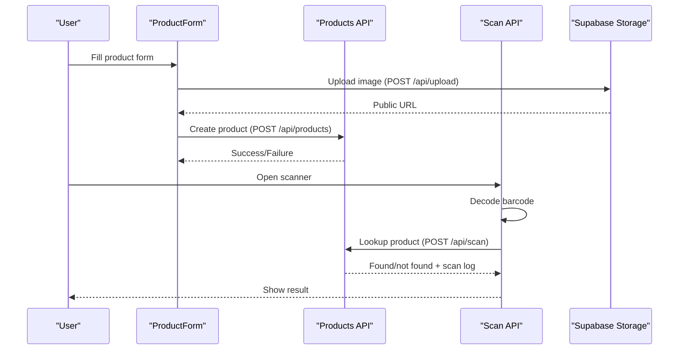

**Diagram sources**
- [product-form.tsx:93-116](file://src/components/product/product-form.tsx#L93-L116)
- [route.ts:9-76](file://src/app/api/upload/route.ts#L9-L76)
- [route.ts:69-118](file://src/app/api/products/route.ts#L69-L118)
- [route.ts:7-59](file://src/app/api/scan/route.ts#L7-L59)
- [barcode-scanner.tsx:46-85](file://src/components/scanner/barcode-scanner.tsx#L46-L85)

## Detailed Component Analysis

### Product Form Interface and Workflows
- Fields: Barcode (required, validated), Product Name (required), Brand, Category (dropdown), Description, Image Preview.
- Validation: Client-side and server-side validation ensures non-empty, valid barcode characters, and acceptable image types/sizes.
- Image Handling: Gallery upload and webcam capture integrate seamlessly; previews update immediately; uploads attach optional barcode metadata.
- Submission: Create vs edit modes submit to appropriate endpoints; errors surfaced via toast notifications and inline field errors.

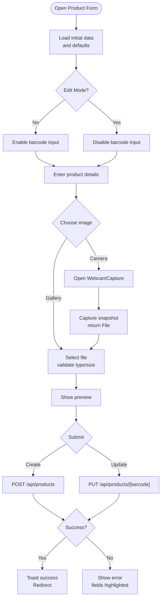

**Diagram sources**
- [product-form.tsx:30-167](file://src/components/product/product-form.tsx#L30-L167)
- [webcam-capture.tsx:11-80](file://src/components/product/webcam-capture.tsx#L11-L80)
- [route.ts:9-76](file://src/app/api/upload/route.ts#L9-L76)
- [route.ts:69-118](file://src/app/api/products/route.ts#L69-L118)
- [route.ts:52-88](file://src/app/api/products/[barcode]/route.ts#L52-L88)

**Section sources**
- [product-form.tsx:30-374](file://src/components/product/product-form.tsx#L30-L374)
- [webcam-capture.tsx:11-135](file://src/components/product/webcam-capture.tsx#L11-L135)
- [route.ts:9-76](file://src/app/api/upload/route.ts#L9-L76)

### Webcam Capture Integration
- Initializes camera stream with facing mode selection.
- Captures frames to canvas and converts to JPEG Blob.
- Returns File to parent component for upload and preview.

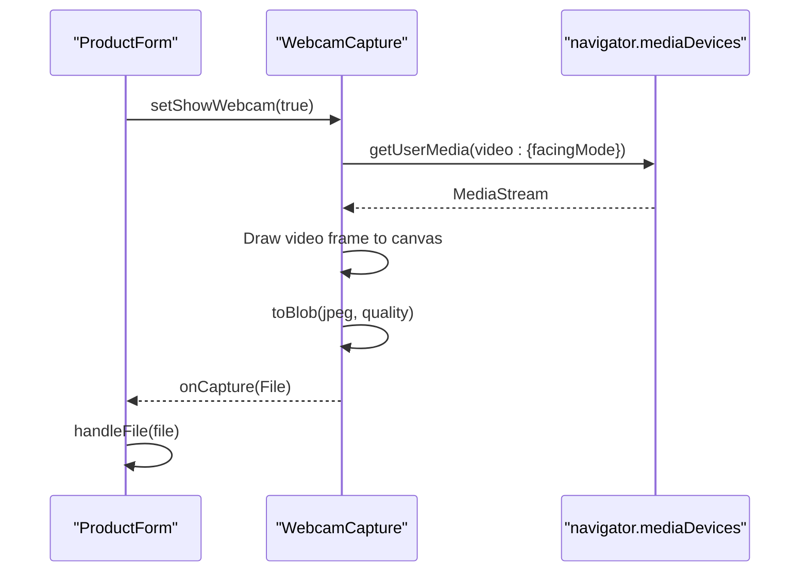

**Diagram sources**
- [product-form.tsx:88-91](file://src/components/product/product-form.tsx#L88-L91)
- [webcam-capture.tsx:18-76](file://src/components/product/webcam-capture.tsx#L18-L76)

**Section sources**
- [webcam-capture.tsx:11-135](file://src/components/product/webcam-capture.tsx#L11-L135)
- [product-form.tsx:88-116](file://src/components/product/product-form.tsx#L88-L116)

### Barcode Scanning Integration
- Real-time decoding using react-zxing with optimized constraints and supported formats.
- On decode, posts to scan API with device type and displays result overlay.
- Supports camera switching and permission error handling.

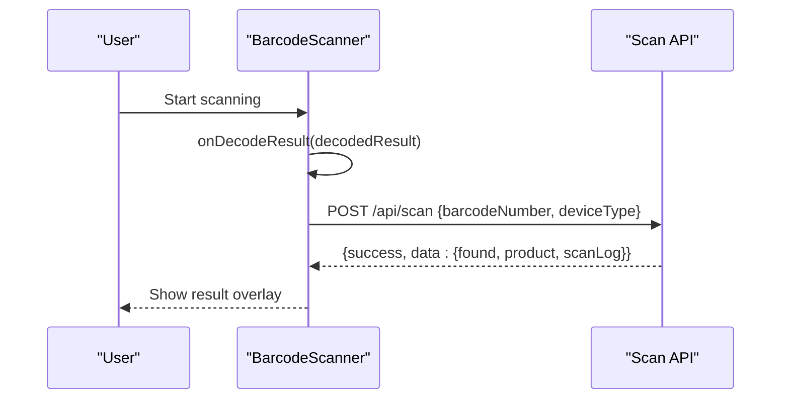

**Diagram sources**
- [barcode-scanner.tsx:87-120](file://src/components/scanner/barcode-scanner.tsx#L87-L120)
- [route.ts:7-59](file://src/app/api/scan/route.ts#L7-L59)

**Section sources**
- [barcode-scanner.tsx:20-216](file://src/components/scanner/barcode-scanner.tsx#L20-L216)
- [page.tsx:8-32](file://src/app/scan/page.tsx#L8-L32)
- [route.ts:7-59](file://src/app/api/scan/route.ts#L7-L59)

### Product CRUD Operations
- Create: Validates payload, checks duplicate barcode, persists product, returns serialized data.
- Retrieve: Paginated list with search and category filters; single product by barcode with scan count.
- Update: Validates partial updates, ensures product exists, applies changes.
- Delete: Requires creator authorization header; deletes product and returns success.

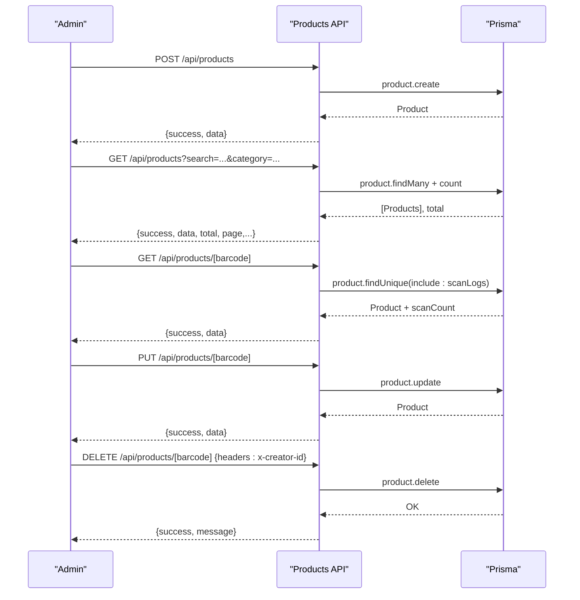

**Diagram sources**
- [route.ts:69-118](file://src/app/api/products/route.ts#L69-L118)
- [route.ts:18-125](file://src/app/api/products/[barcode]/route.ts#L18-L125)

**Section sources**
- [route.ts:16-118](file://src/app/api/products/route.ts#L16-L118)
- [route.ts:18-125](file://src/app/api/products/[barcode]/route.ts#L18-L125)

### Search and Filtering
- GET /api/products supports:
  - search: free-text search across product name, barcode, and brand
  - category: case-insensitive category filter
  - pagination: page and limit with enforced bounds
  - barcodes: batch lookup by comma-separated barcode list

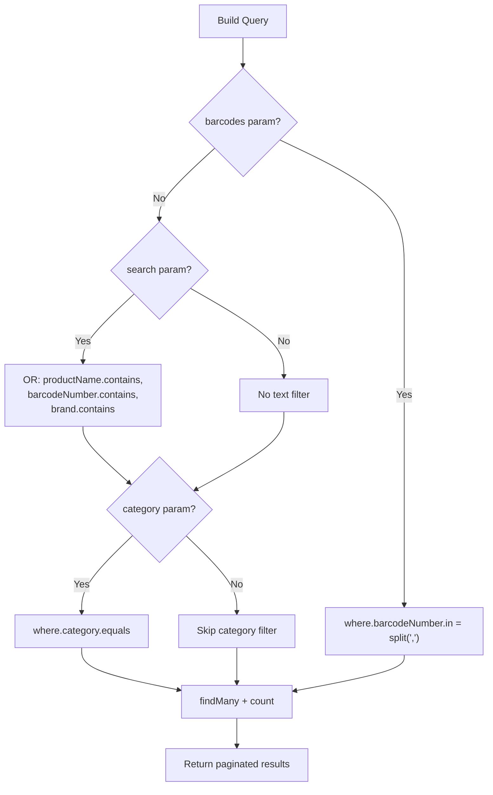

**Diagram sources**
- [route.ts:16-67](file://src/app/api/products/route.ts#L16-L67)

**Section sources**
- [route.ts:16-67](file://src/app/api/products/route.ts#L16-L67)
- [product-list.tsx:37-67](file://src/components/game/product-list.tsx#L37-L67)

### Image Handling and Storage
- Supported formats: JPEG, PNG, WebP; max size 5MB.
- Upload endpoint accepts multipart/form-data with optional barcode metadata.
- Uses Supabase Storage with service role key; generates public URL.
- ProductForm and RegisterProductModal both leverage this endpoint.

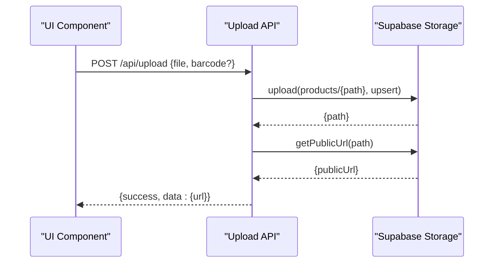

**Diagram sources**
- [route.ts:9-76](file://src/app/api/upload/route.ts#L9-L76)
- [product-form.tsx:93-116](file://src/components/product/product-form.tsx#L93-L116)
- [register-product-modal.tsx:56-66](file://src/components/game/register-product-modal.tsx#L56-L66)

**Section sources**
- [route.ts:9-76](file://src/app/api/upload/route.ts#L9-L76)
- [product-form.tsx:65-116](file://src/components/product/product-form.tsx#L65-L116)
- [register-product-modal.tsx:41-94](file://src/components/game/register-product-modal.tsx#L41-L94)

### Data Validation Rules
- Product Creation: Barcode length and character set, product name limits, optional nullable fields, valid image URL.
- Product Update: Same as create minus barcode (immutable).
- Scan Request: Barcode length and device type.

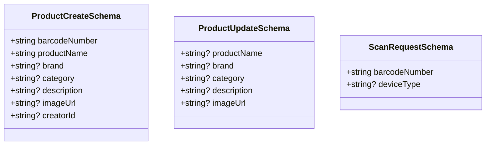

**Diagram sources**
- [product.ts:9-28](file://src/lib/validations/product.ts#L9-L28)
- [scan.ts:3-9](file://src/lib/validations/scan.ts#L3-L9)

**Section sources**
- [product.ts:1-32](file://src/lib/validations/product.ts#L1-L32)
- [scan.ts:1-12](file://src/lib/validations/scan.ts#L1-L12)

### Product Categorization and Duplicate Detection
- Categories: Predefined list with emojis and colors for UI rendering.
- Duplicate Detection: During create, backend queries existing barcode; returns conflict if found.

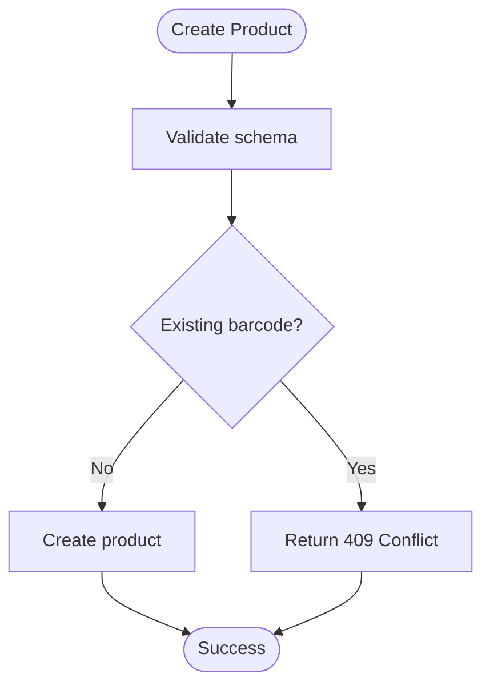

**Diagram sources**
- [route.ts:83-93](file://src/app/api/products/route.ts#L83-L93)
- [index.ts:51-90](file://src/types/index.ts#L51-L90)

**Section sources**
- [route.ts:83-93](file://src/app/api/products/route.ts#L83-L93)
- [index.ts:51-90](file://src/types/index.ts#L51-L90)

### Bulk Operations
- Batch Lookup: GET /api/products supports barcodes parameter to fetch multiple products efficiently.
- Pagination: Consistent page/limit handling across list operations.

**Section sources**
- [route.ts:25-30](file://src/app/api/products/route.ts#L25-L30)
- [route.ts:21-23](file://src/app/api/products/route.ts#L21-L23)

## Dependency Analysis
- UI depends on:
  - Validation schemas for controlled forms
  - API routes for persistence and lookups
  - Types for strong typing
- API routes depend on:
  - Prisma client for database operations
  - Zod schemas for request validation
  - Supabase client for image storage
- Persistence:
  - Prisma client with PostgreSQL adapter; guarded against build-time DB absence

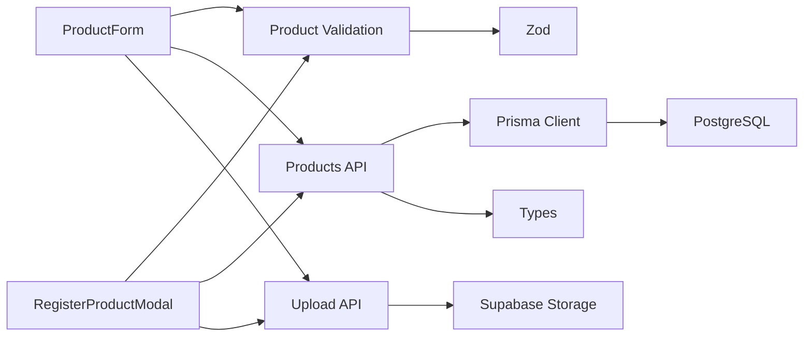

**Diagram sources**
- [product-form.tsx:30-374](file://src/components/product/product-form.tsx#L30-L374)
- [register-product-modal.tsx:20-284](file://src/components/game/register-product-modal.tsx#L20-L284)
- [route.ts:16-118](file://src/app/api/products/route.ts#L16-L118)
- [route.ts:9-76](file://src/app/api/upload/route.ts#L9-L76)
- [prisma.ts:8-32](file://src/lib/prisma.ts#L8-L32)
- [product.ts:1-32](file://src/lib/validations/product.ts#L1-L32)
- [index.ts:1-109](file://src/types/index.ts#L1-L109)

**Section sources**
- [product-form.tsx:30-374](file://src/components/product/product-form.tsx#L30-L374)
- [register-product-modal.tsx:20-284](file://src/components/game/register-product-modal.tsx#L20-L284)
- [route.ts:16-118](file://src/app/api/products/route.ts#L16-L118)
- [route.ts:9-76](file://src/app/api/upload/route.ts#L9-L76)
- [prisma.ts:8-32](file://src/lib/prisma.ts#L8-L32)
- [product.ts:1-32](file://src/lib/validations/product.ts#L1-L32)
- [index.ts:1-109](file://src/types/index.ts#L1-L109)

## Performance Considerations
- Client-side validation reduces unnecessary network requests.
- Image upload validates type and size before upload to minimize wasted bandwidth.
- Scan API decodes barcodes quickly with optimized constraints; loading overlays prevent repeated submissions.
- Pagination limits reduce payload sizes for product listings.
- Supabase storage leverages CDN for efficient image delivery.

## Troubleshooting Guide
- Camera Access Denied: Scanner displays permission error and pauses scanning; user must allow camera permissions.
- Upload Failures: Type or size validation errors; ensure JPEG/PNG/WebP under 5MB.
- Duplicate Barcode: Creation returns conflict; choose another barcode or edit existing.
- Network Errors: Scanner and form components surface generic network errors; retry after checking connectivity.
- Authorization for Deletion: Deleting requires matching creator ID header; ensure session context is correct.

**Section sources**
- [barcode-scanner.tsx:114-119](file://src/components/scanner/barcode-scanner.tsx#L114-L119)
- [route.ts:22-34](file://src/app/api/upload/route.ts#L22-L34)
- [route.ts:88-93](file://src/app/api/products/route.ts#L88-L93)
- [route.ts:106-113](file://src/app/api/products/[barcode]/route.ts#L106-L113)

## Conclusion
The product management system integrates robust validation, flexible entry paths (manual and scanning), reliable persistence, and efficient search/filtering. The webcam and barcode scanning experiences are designed for simplicity and reliability, while the CRUD APIs support safe, audited operations with clear error feedback.