# User Interface Components

<cite>
**Referenced Files in This Document**
- [button.tsx](file://src/components/ui/button.tsx)
- [card.tsx](file://src/components/ui/card.tsx)
- [input.tsx](file://src/components/ui/input.tsx)
- [dialog.tsx](file://src/components/ui/dialog.tsx)
- [select.tsx](file://src/components/ui/select.tsx)
- [table.tsx](file://src/components/ui/table.tsx)
- [alert.tsx](file://src/components/ui/alert.tsx)
- [badge.tsx](file://src/components/ui/badge.tsx)
- [label.tsx](file://src/components/ui/label.tsx)
- [separator.tsx](file://src/components/ui/separator.tsx)
- [sonner.tsx](file://src/components/ui/sonner.tsx)
- [textarea.tsx](file://src/components/ui/textarea.tsx)
- [pixel-cat.tsx](file://src/components/pixel-cat.tsx)
- [globals.css](file://src/app/globals.css)
- [utils.ts](file://src/lib/utils.ts)
- [package.json](file://package.json)
</cite>

## Table of Contents
1. [Introduction](#introduction)
2. [Project Structure](#project-structure)
3. [Core Components](#core-components)
4. [Architecture Overview](#architecture-overview)
5. [Detailed Component Analysis](#detailed-component-analysis)
6. [Dependency Analysis](#dependency-analysis)
7. [Performance Considerations](#performance-considerations)
8. [Troubleshooting Guide](#troubleshooting-guide)
9. [Conclusion](#conclusion)
10. [Appendices](#appendices)

## Introduction
This document describes the reusable UI component library used across the application. It covers the design system built on Tailwind CSS, component composition patterns, and accessibility features. It documents standard components (buttons, cards, inputs, dialogs, selects, tables) and custom components (PixelCat), along with their props, variants, usage patterns, and integration examples. Guidance is included for customization, theme integration, and responsive design.

## Project Structure
The UI components live under src/components/ui and are complemented by global styles and shared utilities. The design system leverages Tailwind v4, shadcn, and custom CSS variables for theming.

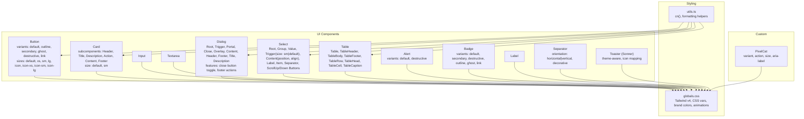

**Diagram sources**
- [button.tsx:1-68](file://src/components/ui/button.tsx#L1-L68)
- [card.tsx:1-104](file://src/components/ui/card.tsx#L1-L104)
- [input.tsx:1-20](file://src/components/ui/input.tsx#L1-L20)
- [dialog.tsx:1-169](file://src/components/ui/dialog.tsx#L1-L169)
- [select.tsx:1-193](file://src/components/ui/select.tsx#L1-L193)
- [table.tsx:1-117](file://src/components/ui/table.tsx#L1-L117)
- [alert.tsx:1-77](file://src/components/ui/alert.tsx#L1-L77)
- [badge.tsx:1-50](file://src/components/ui/badge.tsx#L1-L50)
- [label.tsx:1-25](file://src/components/ui/label.tsx#L1-L25)
- [separator.tsx:1-29](file://src/components/ui/separator.tsx#L1-L29)
- [sonner.tsx:1-50](file://src/components/ui/sonner.tsx#L1-L50)
- [pixel-cat.tsx:1-477](file://src/components/pixel-cat.tsx#L1-L477)
- [globals.css:1-194](file://src/app/globals.css#L1-L194)
- [utils.ts:1-40](file://src/lib/utils.ts#L1-L40)

**Section sources**
- [globals.css:1-194](file://src/app/globals.css#L1-L194)
- [utils.ts:1-40](file://src/lib/utils.ts#L1-L40)

## Core Components
This section summarizes the primary UI components, their variants, sizes, and key props.

- Button
  - Variants: default, outline, secondary, ghost, destructive, link
  - Sizes: default, xs, sm, lg, icon, icon-xs, icon-sm, icon-lg
  - Props: className, variant, size, asChild, plus native button attributes
  - Accessibility: focus-visible ring, aria-invalid support, pointer-events disabled state
  - Composition: Uses Slot for asChild pattern; data-* attributes for slot/variant/size

- Card
  - Subcomponents: Card, CardHeader, CardTitle, CardDescription, CardAction, CardContent, CardFooter
  - Size: default, sm
  - Props: className, size (Card), plus native div attributes
  - Composition: Uses CSS custom properties (--card-spacing) and data-size for spacing

- Input
  - Props: className, type, plus native input attributes
  - Accessibility: focus-visible ring, disabled state, aria-invalid support

- Textarea
  - Props: className, plus native textarea attributes
  - Accessibility: focus-visible ring, disabled state, aria-invalid support

- Dialog
  - Root components: Root, Trigger, Portal, Close, Overlay, Content, Header, Footer, Title, Description
  - Props: Content accepts showCloseButton; Footer accepts showCloseButton
  - Features: Animated open/close transitions, optional close button, portal rendering

- Select
  - Root components: Root, Group, Value, Trigger (size: sm|default), Content (position, align), Label, Item, Separator, ScrollUpButton, ScrollDownButton
  - Props: Trigger size, Content position and align, Footer showCloseButton
  - Features: Popper vs item-aligned positioning, scroll buttons, item indicators

- Table
  - Components: Table, TableHeader, TableBody, TableFooter, TableRow, TableHead, TableCell, TableCaption
  - Props: className, plus native table element attributes
  - Features: Container with horizontal scrolling, hover/selected states

- Alert
  - Variants: default, destructive
  - Props: className, variant, plus native div attributes
  - Composition: Supports AlertAction and links within description

- Badge
  - Variants: default, secondary, destructive, outline, ghost, link
  - Props: className, variant, asChild, plus native span attributes
  - Composition: Uses Slot for asChild pattern; data-variant

- Label
  - Props: className, plus native label attributes
  - Features: Disabled state styling via group-data and peer

- Separator
  - Props: className, orientation (horizontal|vertical), decorative, plus native separator attributes

- Toaster (Sonner)
  - Props: ToasterProps, theme-aware, icon mapping, CSS variable styling
  - Features: Uses next-themes for theme detection

**Section sources**
- [button.tsx:44-67](file://src/components/ui/button.tsx#L44-L67)
- [card.tsx:5-21](file://src/components/ui/card.tsx#L5-L21)
- [input.tsx:5-19](file://src/components/ui/input.tsx#L5-L19)
- [textarea.tsx:5-18](file://src/components/ui/textarea.tsx#L5-L18)
- [dialog.tsx:10-168](file://src/components/ui/dialog.tsx#L10-L168)
- [select.tsx:9-192](file://src/components/ui/select.tsx#L9-L192)
- [table.tsx:7-116](file://src/components/ui/table.tsx#L7-L116)
- [alert.tsx:22-35](file://src/components/ui/alert.tsx#L22-L35)
- [badge.tsx:30-47](file://src/components/ui/badge.tsx#L30-L47)
- [label.tsx:8-22](file://src/components/ui/label.tsx#L8-L22)
- [separator.tsx:8-26](file://src/components/ui/separator.tsx#L8-L26)
- [sonner.tsx:7-47](file://src/components/ui/sonner.tsx#L7-L47)

## Architecture Overview
The component library follows a consistent architecture:
- Design tokens and theme variables are centralized in globals.css using Tailwind v4 custom properties and oklch color spaces.
- Utilities in utils.ts provide a single cn() function for merging Tailwind classes and helper functions for formatting and device detection.
- Components use class-variance-authority (cva) for variant-driven styling and radix-ui primitives for accessible base behaviors.
- Custom components like PixelCat render SVG bitmaps with CSS animations.

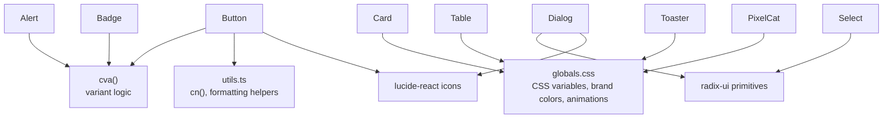

**Diagram sources**
- [globals.css:1-194](file://src/app/globals.css#L1-L194)
- [utils.ts:1-6](file://src/lib/utils.ts#L1-L6)
- [button.tsx:2-42](file://src/components/ui/button.tsx#L2-L42)
- [dialog.tsx:3-8](file://src/components/ui/dialog.tsx#L3-L8)
- [select.tsx:3-7](file://src/components/ui/select.tsx#L3-L7)
- [table.tsx:5](file://src/components/ui/table.tsx#L5)
- [alert.tsx:6-20](file://src/components/ui/alert.tsx#L6-L20)
- [badge.tsx:7-28](file://src/components/ui/badge.tsx#L7-L28)
- [sonner.tsx:3-47](file://src/components/ui/sonner.tsx#L3-L47)
- [pixel-cat.tsx:43](file://src/components/pixel-cat.tsx#L43)

## Detailed Component Analysis

### Button
- Purpose: Primary interactive element with multiple visual variants and sizes.
- Variants and sizes: Defined via cva with Tailwind utility classes; includes default, outline, secondary, ghost, destructive, link and sizes from xs to lg and icon variants.
- Accessibility: Focus-visible ring, disabled pointer-events, aria-invalid styling.
- Composition: asChild uses Radix Slot to wrap anchor or button elements; data-slot/data-variant/data-size attributes for testing/styling hooks.

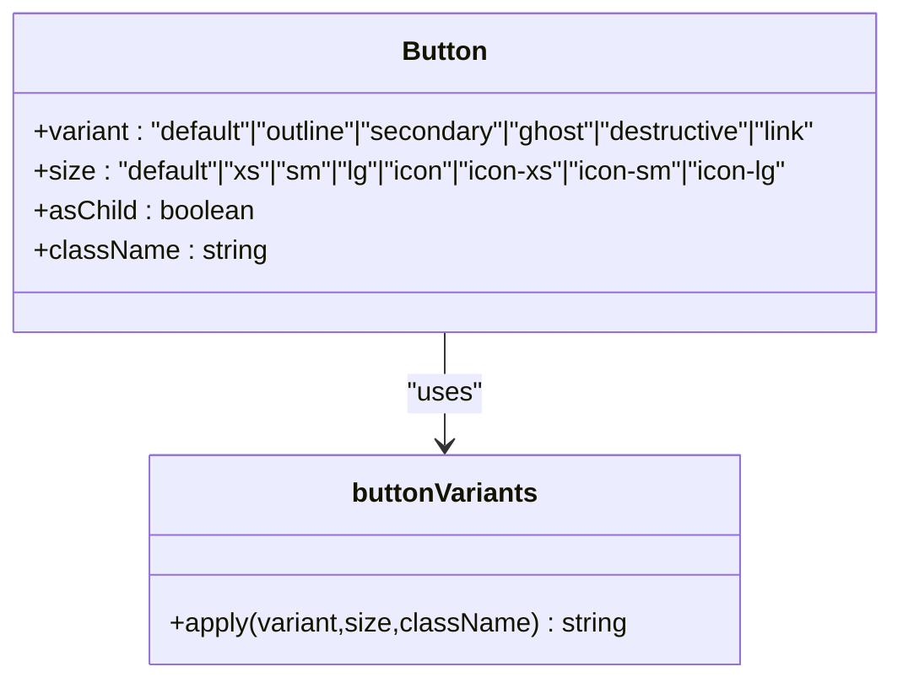

**Diagram sources**
- [button.tsx:7-42](file://src/components/ui/button.tsx#L7-L42)
- [button.tsx:44-67](file://src/components/ui/button.tsx#L44-L67)

**Section sources**
- [button.tsx:7-42](file://src/components/ui/button.tsx#L7-L42)
- [button.tsx:44-67](file://src/components/ui/button.tsx#L44-L67)

### Card
- Purpose: Container with header/title/description/action/content/footer slots and optional small size.
- Spacing: Uses CSS custom property --card-spacing with data-size for responsive spacing.
- Composition: Multiple subcomponents coordinate via data-slot attributes and grid layout.

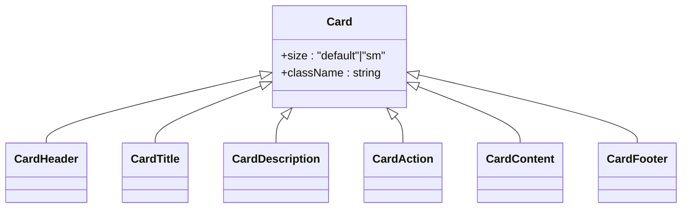

**Diagram sources**
- [card.tsx:5-21](file://src/components/ui/card.tsx#L5-L21)
- [card.tsx:23-34](file://src/components/ui/card.tsx#L23-L34)
- [card.tsx:36-47](file://src/components/ui/card.tsx#L36-L47)
- [card.tsx:49-57](file://src/components/ui/card.tsx#L49-L57)
- [card.tsx:59-70](file://src/components/ui/card.tsx#L59-L70)
- [card.tsx:72-80](file://src/components/ui/card.tsx#L72-L80)
- [card.tsx:82-93](file://src/components/ui/card.tsx#L82-L93)

**Section sources**
- [card.tsx:5-21](file://src/components/ui/card.tsx#L5-L21)
- [card.tsx:23-93](file://src/components/ui/card.tsx#L23-L93)

### Inputs and Text Fields
- Input: Standard text input with focus-visible ring, disabled state, and aria-invalid support.
- Textarea: Multi-line text area with similar focus/disabled/aria-invalid behavior.

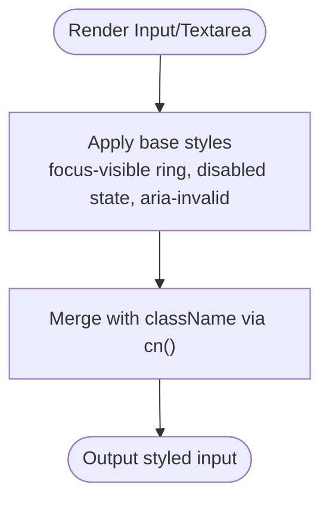

**Diagram sources**
- [input.tsx:5-19](file://src/components/ui/input.tsx#L5-L19)
- [textarea.tsx:5-18](file://src/components/ui/textarea.tsx#L5-L18)
- [utils.ts:4-6](file://src/lib/utils.ts#L4-L6)

**Section sources**
- [input.tsx:5-19](file://src/components/ui/input.tsx#L5-L19)
- [textarea.tsx:5-18](file://src/components/ui/textarea.tsx#L5-L18)
- [utils.ts:4-6](file://src/lib/utils.ts#L4-L6)

### Dialog
- Purpose: Modal overlay with animated content, optional close button, and structured header/footer.
- Composition: Uses Radix Dialog primitives; Content optionally renders a close button; Footer supports explicit close action.

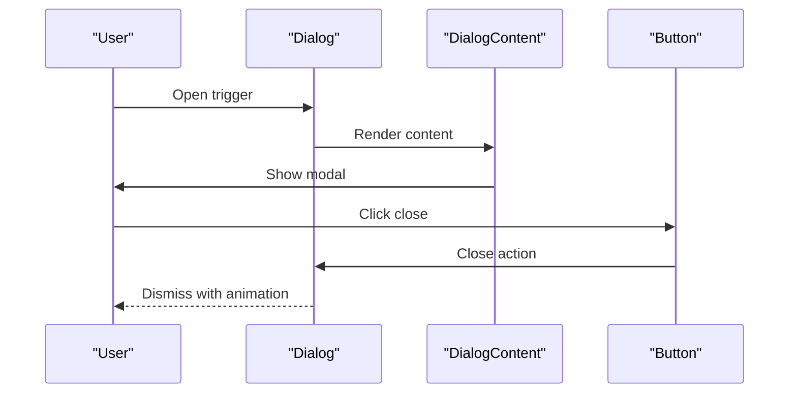

**Diagram sources**
- [dialog.tsx:10-86](file://src/components/ui/dialog.tsx#L10-L86)

**Section sources**
- [dialog.tsx:10-86](file://src/components/ui/dialog.tsx#L10-L86)

### Select
- Purpose: Accessible dropdown with grouped items, value indicator, and scrollable viewport.
- Variants: Trigger size (sm|default), Content position (item-aligned|popper), align option.
- Composition: Uses Radix Select primitives; includes scroll up/down buttons and item indicators.

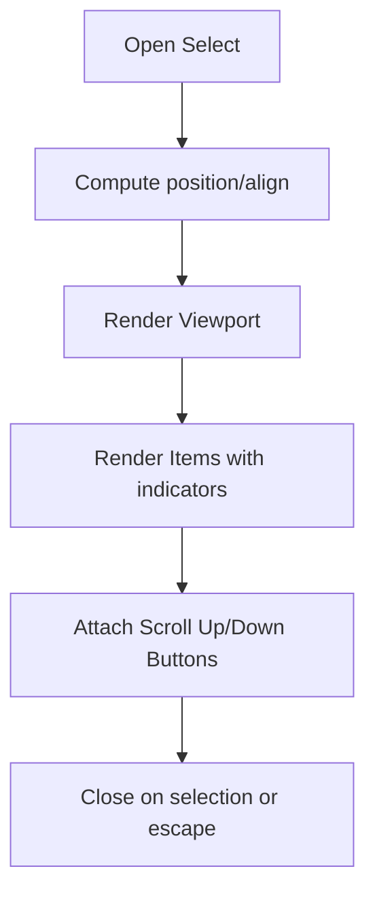

**Diagram sources**
- [select.tsx:60-91](file://src/components/ui/select.tsx#L60-L91)
- [select.tsx:106-128](file://src/components/ui/select.tsx#L106-L128)
- [select.tsx:143-179](file://src/components/ui/select.tsx#L143-L179)

**Section sources**
- [select.tsx:34-91](file://src/components/ui/select.tsx#L34-L91)
- [select.tsx:106-179](file://src/components/ui/select.tsx#L106-L179)

### Table
- Purpose: Responsive table with horizontal scrolling container and hover/selected states.
- Composition: Wrapper div for overflow, native table elements mapped to subcomponents.

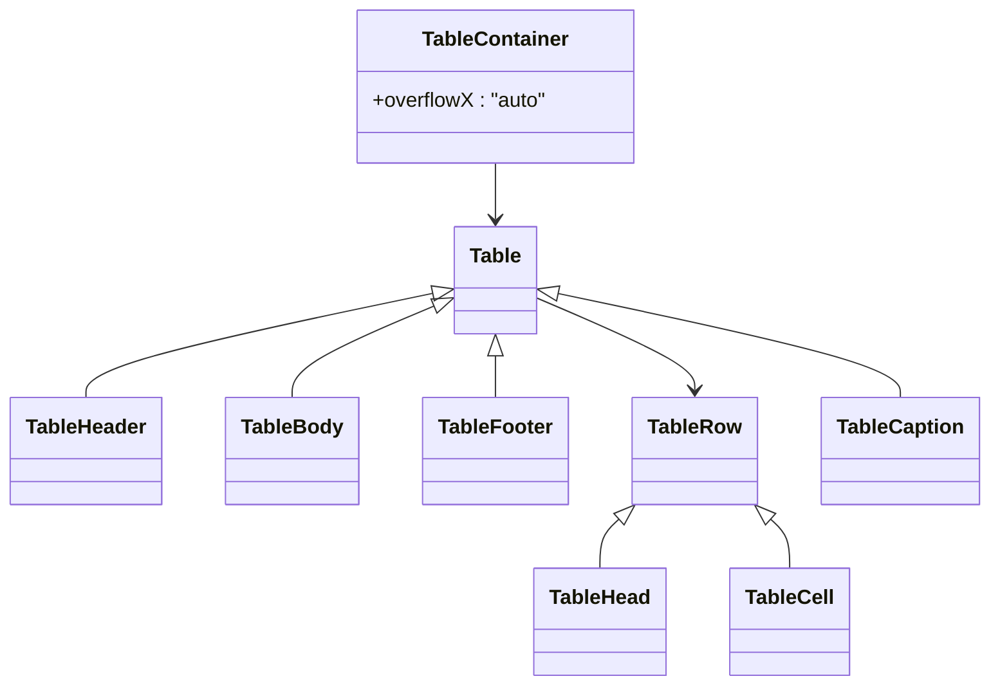

**Diagram sources**
- [table.tsx:7-20](file://src/components/ui/table.tsx#L7-L20)
- [table.tsx:22-116](file://src/components/ui/table.tsx#L22-L116)

**Section sources**
- [table.tsx:7-116](file://src/components/ui/table.tsx#L7-L116)

### Alerts and Badges
- Alert: Variant-driven styling with optional action slot and link styling within description.
- Badge: Variant-driven tag with asChild support for semantic markup.

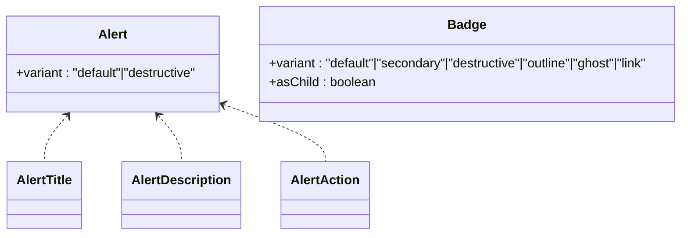

**Diagram sources**
- [alert.tsx:22-35](file://src/components/ui/alert.tsx#L22-L35)
- [alert.tsx:37-74](file://src/components/ui/alert.tsx#L37-L74)
- [badge.tsx:30-47](file://src/components/ui/badge.tsx#L30-L47)

**Section sources**
- [alert.tsx:22-74](file://src/components/ui/alert.tsx#L22-L74)
- [badge.tsx:30-47](file://src/components/ui/badge.tsx#L30-L47)

### Labels and Separators
- Label: Styled label with disabled state handling via group-data and peer utilities.
- Separator: Orientation-aware separator with decorative flag.

**Section sources**
- [label.tsx:8-22](file://src/components/ui/label.tsx#L8-L22)
- [separator.tsx:8-26](file://src/components/ui/separator.tsx#L8-L26)

### Notifications (Toaster)
- Purpose: Theme-aware toast notifications with icon mapping and CSS variable styling.
- Integration: Consumes next-themes for theme detection and applies design tokens.

**Section sources**
- [sonner.tsx:7-47](file://src/components/ui/sonner.tsx#L7-L47)

### PixelCat (Custom Component)
- Purpose: Pixel-art avatar with variant palettes and action overlays.
- Types:
  - CatVariantId: calico, gray, cyan, pink, black, tabby, guest-smiling, arashu-smiling
  - CatActionId: none, scan, items, play, missions, stats, history, achievements, rewards, exit
- Props:
  - variant: CatVariantId
  - action: CatActionId
  - size: number (default 64)
  - className: string
  - aria-label: string
- Rendering:
  - Base bitmap drawn on a 24x24 grid with offsets.
  - Action overlays (e.g., scanner gun, glasses, crown) painted on top.
  - SVG output with per-pixel rects and CSS animations for ears, eyes, and laser pulses.
- Accessibility:
  - Role="img", aria-label fallback to palette label.

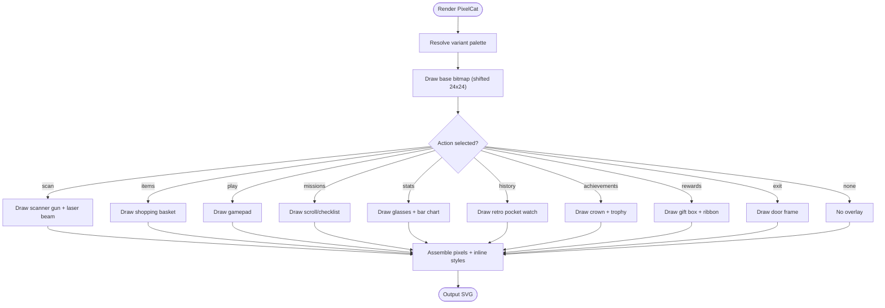

**Diagram sources**
- [pixel-cat.tsx:5-43](file://src/components/pixel-cat.tsx#L5-L43)
- [pixel-cat.tsx:75-89](file://src/components/pixel-cat.tsx#L75-L89)
- [pixel-cat.tsx:83-476](file://src/components/pixel-cat.tsx#L83-L476)

**Section sources**
- [pixel-cat.tsx:5-43](file://src/components/pixel-cat.tsx#L5-L43)
- [pixel-cat.tsx:75-89](file://src/components/pixel-cat.tsx#L75-L89)
- [pixel-cat.tsx:83-476](file://src/components/pixel-cat.tsx#L83-L476)

## Dependency Analysis
External libraries and their roles:
- Tailwind CSS v4: Utility-first styling and design tokens
- class-variance-authority: Variant-based component styling
- radix-ui: Accessible UI primitives (Dialog, Select, Label, Separator)
- lucide-react: Icons for UI elements
- next-themes: Theme switching for toasts
- sonner: Notification system with theme integration
- tailwind-merge + clsx: Robust class merging

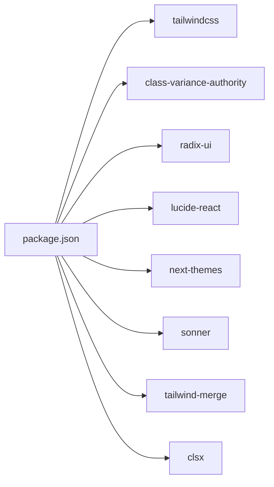

**Diagram sources**
- [package.json:20-46](file://package.json#L20-L46)

**Section sources**
- [package.json:20-46](file://package.json#L20-L46)

## Performance Considerations
- Prefer variant props over dynamic class concatenation to leverage Tailwind’s static analysis.
- Use asChild patterns (Slot) judiciously to avoid unnecessary DOM wrappers.
- Keep SVG overlays minimal; PixelCat composes per-pixel rects—limit size and avoid frequent re-renders.
- Defer heavy animations to CSS where possible; ensure smooth 60fps by avoiding layout thrashing.
- Use responsive breakpoints and container queries where appropriate to reduce repaint costs.

## Troubleshooting Guide
- Focus rings not visible:
  - Ensure focus-visible ring utilities are present and theme variables are defined.
  - Verify Tailwind layers and CSS variables are loaded.
- Disabled state not applying:
  - Confirm disabled:pointer-events-none and opacity utilities are included.
  - Check aria-invalid classes if validation feedback is expected.
- Dialog/Select not animating:
  - Ensure Radix UI portals and animations are enabled.
  - Verify CSS custom properties for transitions and backdrop filters.
- Toaster not themed:
  - Confirm next-themes is initialized and theme variable overrides are applied.
- PixelCat not rendering:
  - Validate size prop and viewBox; ensure inline styles are not stripped by SSR environments.

**Section sources**
- [globals.css:1-194](file://src/app/globals.css#L1-L194)
- [button.tsx:7-42](file://src/components/ui/button.tsx#L7-L42)
- [dialog.tsx:34-86](file://src/components/ui/dialog.tsx#L34-L86)
- [select.tsx:60-91](file://src/components/ui/select.tsx#L60-L91)
- [sonner.tsx:7-47](file://src/components/ui/sonner.tsx#L7-L47)
- [pixel-cat.tsx:420-476](file://src/components/pixel-cat.tsx#L420-L476)

## Conclusion
The UI component library combines Tailwind v4, shadcn-inspired design tokens, and radix-ui primitives to deliver accessible, consistent, and customizable components. Variant-driven styling, composition patterns, and a cohesive theme enable rapid development while maintaining visual coherence. Custom components like PixelCat demonstrate advanced rendering techniques and animation integration.

## Appendices

### Design System and Theming
- Color system: Brand colors (cyan, pink, mint, yellow) and semantic tokens (primary, secondary, muted, destructive) defined via oklch CSS variables.
- Typography: Fredoka for headings, Nunito for body text; custom font imports.
- Animations: Utility classes for floating and pop-in effects; component-specific animations for PixelCat.
- Dark mode: Fallback palette with reduced luminance; custom variant selector ensures consistent targeting.

**Section sources**
- [globals.css:8-118](file://src/app/globals.css#L8-L118)
- [globals.css:120-194](file://src/app/globals.css#L120-L194)

### Component Customization Guidelines
- Variants and sizes: Extend cva configurations in existing components or introduce new ones with clear naming.
- Theme integration: Use CSS variables for colors and radii; avoid hardcoded hex values.
- Accessibility: Maintain focus-visible outlines, aria-invalid states, and semantic HTML; test with screen readers.
- Responsive patterns: Prefer container queries and data-* attributes for adaptive layouts.

### Integration Examples
- Button groups: Use icon sizing and group-aware rounded corners via data attributes.
- Cards with actions: Place CardAction in CardHeader grid area for alignment.
- Dialog footers: Conditionally show close button in Footer based on context.
- Select menus: Choose item-aligned vs popper based on layout needs; add scroll buttons for long lists.
- Tables: Wrap in container for horizontal scrolling; apply hover/selected states consistently.