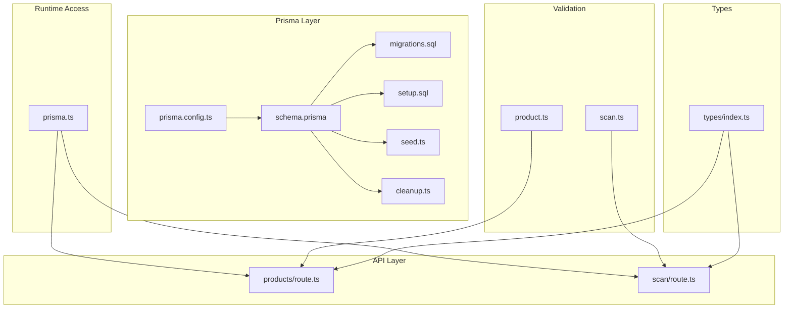
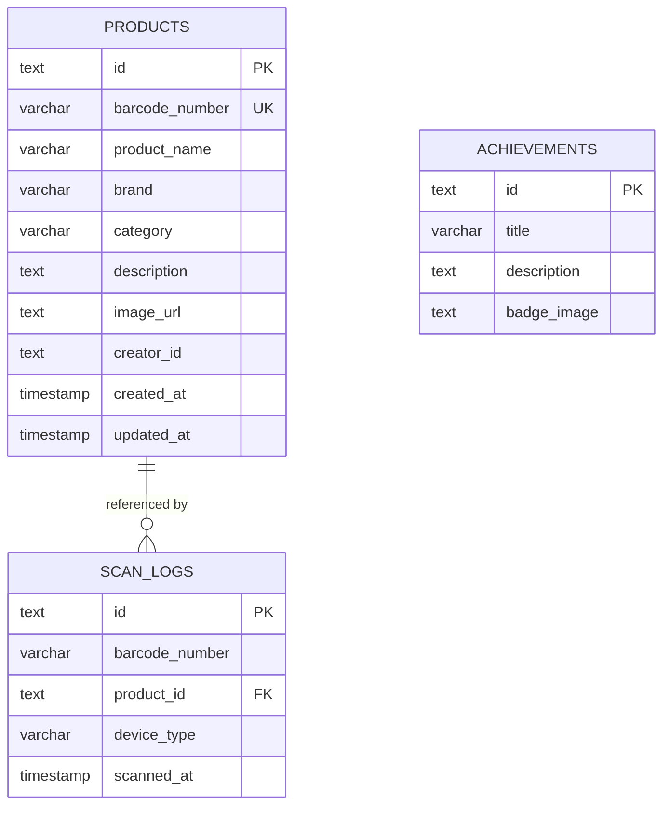
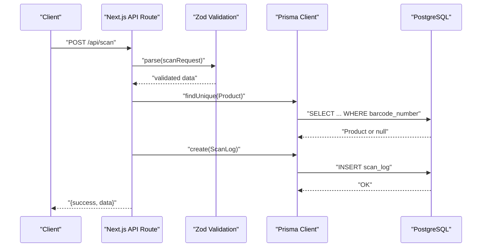
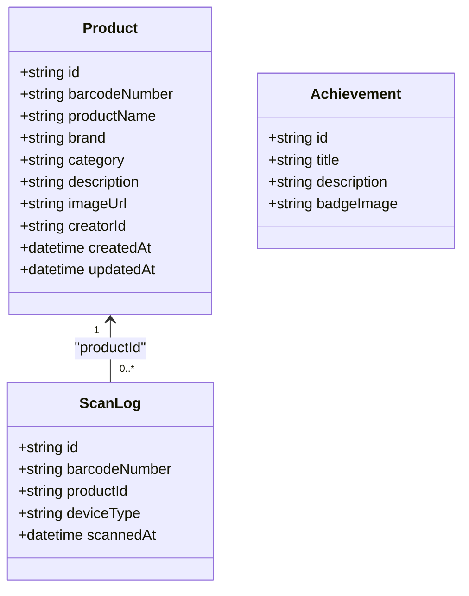
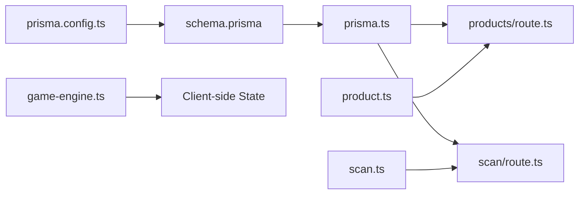

# Database Design

<cite>
**Referenced Files in This Document**
- [schema.prisma](file://prisma/schema.prisma)
- [migrations.sql](file://prisma/migrations.sql)
- [setup.sql](file://prisma/setup.sql)
- [seed.ts](file://prisma/seed.ts)
- [cleanup.ts](file://prisma/cleanup.ts)
- [prisma.config.ts](file://prisma.config.ts)
- [prisma.ts](file://src/lib/prisma.ts)
- [product.ts](file://src/lib/validations/product.ts)
- [scan.ts](file://src/lib/validations/scan.ts)
- [route.ts](file://src/app/api/products/route.ts)
- [route.ts](file://src/app/api/scan/route.ts)
- [game-engine.ts](file://src/lib/game-engine.ts)
- [index.ts](file://src/types/index.ts)
</cite>

## Table of Contents
1. [Introduction](#introduction)
2. [Project Structure](#project-structure)
3. [Core Components](#core-components)
4. [Architecture Overview](#architecture-overview)
5. [Detailed Component Analysis](#detailed-component-analysis)
6. [Dependency Analysis](#dependency-analysis)
7. [Performance Considerations](#performance-considerations)
8. [Troubleshooting Guide](#troubleshooting-guide)
9. [Conclusion](#conclusion)
10. [Appendices](#appendices)

## Introduction
This document describes the Barcode Adventure database schema and data model, focusing on the Product, ScanLog, and Achievement entities. It explains field definitions, data types, constraints, primary and foreign keys, indexing strategies, and referential integrity. It also documents Prisma ORM configuration, migration and seeding setup, and practical data access patterns used by the application. Finally, it outlines performance considerations, maintenance procedures, and common query examples.

## Project Structure
The database design is defined via Prisma schema and SQL scripts, with runtime access managed through a Next.js-friendly Prisma client wrapper. API routes handle CRUD and scanning operations, while validation schemas enforce business constraints at the edge.

**Diagram sources**
- [schema.prisma:1-47](file://prisma/schema.prisma#L1-L47)
- [migrations.sql:1-56](file://prisma/migrations.sql#L1-L56)
- [setup.sql:1-61](file://prisma/setup.sql#L1-L61)
- [seed.ts:1-98](file://prisma/seed.ts#L1-L98)
- [cleanup.ts:1-34](file://prisma/cleanup.ts#L1-L34)
- [prisma.config.ts:1-13](file://prisma.config.ts#L1-L13)
- [prisma.ts:1-33](file://src/lib/prisma.ts#L1-L33)
- [route.ts:1-119](file://src/app/api/products/route.ts#L1-L119)
- [route.ts:1-60](file://src/app/api/scan/route.ts#L1-L60)
- [product.ts:1-32](file://src/lib/validations/product.ts#L1-L32)
- [scan.ts:1-12](file://src/lib/validations/scan.ts#L1-L12)
- [index.ts:1-109](file://src/types/index.ts#L1-L109)

**Section sources**
- [schema.prisma:1-47](file://prisma/schema.prisma#L1-L47)
- [prisma.ts:1-33](file://src/lib/prisma.ts#L1-L33)

## Core Components
This section defines the three core entities and their relationships.

- Product
  - Purpose: Stores product metadata keyed by barcode.
  - Fields: id, barcodeNumber, productName, brand, category, description, imageUrl, creatorId, createdAt, updatedAt.
  - Constraints: Unique barcodeNumber; UUID primary key; indexes on barcodeNumber for fast lookup.
- ScanLog
  - Purpose: Records each barcode scan event with optional linkage to a Product.
  - Fields: id, barcodeNumber, productId, deviceType, scannedAt.
  - Constraints: Optional productId referencing Product.id with SET NULL on delete; indexes on barcodeNumber and scannedAt.
- Achievement
  - Purpose: Defines unlockable achievements for players.
  - Fields: id, title, description, badgeImage.
  - Constraints: Standard UUID primary key; no foreign keys.

**Diagram sources**
- [schema.prisma:9-46](file://prisma/schema.prisma#L9-L46)
- [migrations.sql:6-39](file://prisma/migrations.sql#L6-L39)

**Section sources**
- [schema.prisma:9-46](file://prisma/schema.prisma#L9-L46)
- [migrations.sql:6-39](file://prisma/migrations.sql#L6-L39)
- [index.ts:1-49](file://src/types/index.ts#L1-L49)

## Architecture Overview
The application uses Prisma ORM with a PostgreSQL adapter. The Prisma client is lazily initialized at runtime to support Next.js builds. API routes validate inputs, query the database, and return normalized JSON responses. Seeding and cleanup scripts manage initial data and test environments.

**Diagram sources**
- [route.ts:1-60](file://src/app/api/scan/route.ts#L1-L60)
- [scan.ts:1-12](file://src/lib/validations/scan.ts#L1-L12)
- [prisma.ts:1-33](file://src/lib/prisma.ts#L1-L33)

**Section sources**
- [prisma.ts:1-33](file://src/lib/prisma.ts#L1-L33)
- [route.ts:1-60](file://src/app/api/scan/route.ts#L1-L60)

## Detailed Component Analysis

### Product Entity
- Identity and Keys
  - id: UUID primary key.
  - barcodeNumber: Unique, indexed, validated to length and character set.
- Attributes
  - productName, brand, category, description, imageUrl, creatorId.
- Indexing
  - Unique constraint and index on barcodeNumber for fast lookups.
- Business Rules
  - Creation endpoint enforces uniqueness of barcodeNumber.
  - Optional fields allow partial product registration.
- Data Types
  - String fields mapped to VARCHAR with specific limits; timestamps default to current time.

**Section sources**
- [schema.prisma:9-24](file://prisma/schema.prisma#L9-L24)
- [migrations.sql:6-18](file://prisma/migrations.sql#L6-L18)
- [product.ts:3-20](file://src/lib/validations/product.ts#L3-L20)
- [route.ts:84-93](file://src/app/api/products/route.ts#L84-L93)

### ScanLog Entity
- Identity and Keys
  - id: UUID primary key.
- Attributes
  - barcodeNumber: Tracks the scanned identifier.
  - productId: Optional foreign key to Product.id; ON DELETE SET NULL preserves logs when a product is removed.
  - deviceType: Optional device classification.
  - scannedAt: Timestamp with default current time.
- Indexing
  - Indexes on barcodeNumber and scannedAt to optimize scans and time-series queries.
- Referential Integrity
  - Foreign key constraint ensures referential integrity with Product; deletion policy is SET NULL.

**Section sources**
- [schema.prisma:26-37](file://prisma/schema.prisma#L26-L37)
- [migrations.sql:21-29](file://prisma/migrations.sql#L21-L29)
- [migrations.sql:54-54](file://prisma/migrations.sql#L54-L54)

### Achievement Entity
- Identity and Keys
  - id: UUID primary key.
- Attributes
  - title, description, badgeImage.
- Notes
  - No foreign keys; used for player progress and UI badges.

**Section sources**
- [schema.prisma:39-46](file://prisma/schema.prisma#L39-L46)
- [migrations.sql:31-39](file://prisma/migrations.sql#L31-L39)

### Relationship Model
- Product and ScanLog
  - One-to-many: A Product can have zero or many ScanLogs.
  - Foreign key relationship with SET NULL on Product delete.
- Achievement
  - Independent entity; used by client-side logic and game engine.

**Diagram sources**
- [schema.prisma:9-46](file://prisma/schema.prisma#L9-L46)
- [index.ts:1-49](file://src/types/index.ts#L1-L49)

**Section sources**
- [schema.prisma:26-37](file://prisma/schema.prisma#L26-L37)
- [migrations.sql:54-54](file://prisma/migrations.sql#L54-L54)

## Dependency Analysis
- Prisma Client Initialization
  - Uses PrismaPg adapter with a Postgres connection pool.
  - Guardrails prevent instantiation during build when DATABASE_URL is missing.
- API Routes
  - Products: Filtering, pagination, and uniqueness checks.
  - Scan: Lookup product by barcodeNumber and record scan log.
- Validation
  - Zod schemas validate request payloads before database operations.
- Game Engine
  - Achievement and mission evaluation logic relies on client-side state aggregation.

**Diagram sources**
- [prisma.config.ts:1-13](file://prisma.config.ts#L1-L13)
- [schema.prisma:1-47](file://prisma/schema.prisma#L1-L47)
- [prisma.ts:1-33](file://src/lib/prisma.ts#L1-L33)
- [route.ts:1-119](file://src/app/api/products/route.ts#L1-L119)
- [route.ts:1-60](file://src/app/api/scan/route.ts#L1-L60)
- [product.ts:1-32](file://src/lib/validations/product.ts#L1-L32)
- [scan.ts:1-12](file://src/lib/validations/scan.ts#L1-L12)
- [game-engine.ts:1-241](file://src/lib/game-engine.ts#L1-L241)

**Section sources**
- [prisma.ts:1-33](file://src/lib/prisma.ts#L1-L33)
- [route.ts:1-119](file://src/app/api/products/route.ts#L1-L119)
- [route.ts:1-60](file://src/app/api/scan/route.ts#L1-L60)
- [product.ts:1-32](file://src/lib/validations/product.ts#L1-L32)
- [scan.ts:1-12](file://src/lib/validations/scan.ts#L1-L12)
- [game-engine.ts:1-241](file://src/lib/game-engine.ts#L1-L241)

## Performance Considerations
- Indexing Strategy
  - Products: Unique barcodeNumber and a secondary index to accelerate lookups.
  - ScanLogs: Index on barcodeNumber for quick scans; index on scannedAt for time-series analytics.
- Query Patterns
  - Products: Filtering by barcode, name, brand, category; paginated retrieval ordered by creation time.
  - ScanLog: Upsert-like behavior via productId nullability; efficient by-product scanning.
- Data Growth
  - ScanLog is append-heavy; consider partitioning or retention policies for historical data.
- Concurrency
  - Unique barcodeNumber constraint prevents race conditions on product creation.
- Network and Latency
  - Lazy Prisma initialization avoids unnecessary connections during static builds.

**Section sources**
- [migrations.sql:41-51](file://prisma/migrations.sql#L41-L51)
- [route.ts:26-50](file://src/app/api/products/route.ts#L26-L50)
- [route.ts:22-33](file://src/app/api/scan/route.ts#L22-L33)
- [prisma.ts:11-16](file://src/lib/prisma.ts#L11-L16)

## Troubleshooting Guide
- Database Not Configured During Build
  - Symptom: Warning about DATABASE_URL placeholder and stub client returned.
  - Resolution: Ensure DATABASE_URL is present in environment; runtime routes will function normally.
- Seed Failures
  - Symptoms: Errors during seeding or missing achievements/products.
  - Resolution: Verify DATABASE_URL; ensure migrations are applied; re-run seed script.
- Cleanup Operations
  - Use cleanup script to remove scan logs and products for testing/resetting.
- Common API Errors
  - Products: Duplicate barcode returns conflict; validation errors return structured messages.
  - Scan: Malformed barcode triggers validation error; otherwise successful logging.

**Section sources**
- [prisma.ts:11-16](file://src/lib/prisma.ts#L11-L16)
- [seed.ts:13-97](file://prisma/seed.ts#L13-L97)
- [cleanup.ts:13-33](file://prisma/cleanup.ts#L13-L33)
- [route.ts:74-93](file://src/app/api/products/route.ts#L74-L93)
- [route.ts:12-17](file://src/app/api/scan/route.ts#L12-L17)

## Conclusion
The Barcode Adventure database design centers on a clean, normalized schema with deliberate indexing and referential integrity. Prisma ORM and SQL scripts provide a robust foundation for development, testing, and production. The API routes and validation schemas enforce business rules, while the game engine manages player progression independently of the database.

## Appendices

### A. Field Definitions and Constraints
- Product
  - id: UUID, PK
  - barcodeNumber: VARCHAR(20), UNIQUE, Indexed
  - productName: VARCHAR(255)
  - brand: VARCHAR(255), Nullable
  - category: VARCHAR(255), Nullable
  - description: TEXT, Nullable
  - imageUrl: TEXT, Nullable
  - creatorId: VARCHAR(255), Nullable
  - createdAt/updatedAt: TIMESTAMP, Defaults
- ScanLog
  - id: UUID, PK
  - barcodeNumber: VARCHAR(20), Indexed
  - productId: TEXT, FK(products.id) ON DELETE SET NULL
  - deviceType: VARCHAR(100), Nullable
  - scannedAt: TIMESTAMP, DEFAULT NOW()
- Achievement
  - id: UUID, PK
  - title: VARCHAR(255)
  - description: TEXT, Nullable
  - badgeImage: TEXT, Nullable

**Section sources**
- [schema.prisma:9-46](file://prisma/schema.prisma#L9-L46)
- [migrations.sql:6-39](file://prisma/migrations.sql#L6-L39)

### B. Prisma ORM Configuration
- Provider and Datasource
  - Provider: PostgreSQL
  - Datasource URL sourced from environment via prisma.config.ts
- Client Initialization
  - PrismaPg adapter with connection pooling
  - Lazy initialization with fallback to stub client during build
- Migration and Setup
  - Automatic migrations via Prisma schema
  - SQL scripts for manual setup and seeding

**Section sources**
- [schema.prisma:5-7](file://prisma/schema.prisma#L5-L7)
- [prisma.config.ts:8-12](file://prisma.config.ts#L8-L12)
- [prisma.ts:8-21](file://src/lib/prisma.ts#L8-L21)
- [setup.sql:1-61](file://prisma/setup.sql#L1-L61)

### C. Sample Data Structures
- Product
  - Example fields: barcodeNumber, productName, brand, category, description, imageUrl, creatorId, timestamps.
- ScanLog
  - Example fields: barcodeNumber, productId, deviceType, scannedAt.
- Achievement
  - Example fields: title, description, badgeImage.

**Section sources**
- [index.ts:1-49](file://src/types/index.ts#L1-L49)
- [seed.ts:35-84](file://prisma/seed.ts#L35-L84)

### D. Common Queries and Access Patterns
- Fetch Products
  - Filter by barcode list or text search across name, barcode, brand.
  - Paginate with page and limit parameters.
- Create Product
  - Validate input; ensure barcodeNumber uniqueness; insert product.
- Scan Product
  - Lookup product by barcodeNumber; create scan log with optional productId.
- Achievement Evaluation
  - Client-side logic evaluates player state against predefined achievements.

**Section sources**
- [route.ts:16-67](file://src/app/api/products/route.ts#L16-L67)
- [route.ts:69-118](file://src/app/api/products/route.ts#L69-L118)
- [route.ts:7-59](file://src/app/api/scan/route.ts#L7-L59)
- [game-engine.ts:206-240](file://src/lib/game-engine.ts#L206-L240)