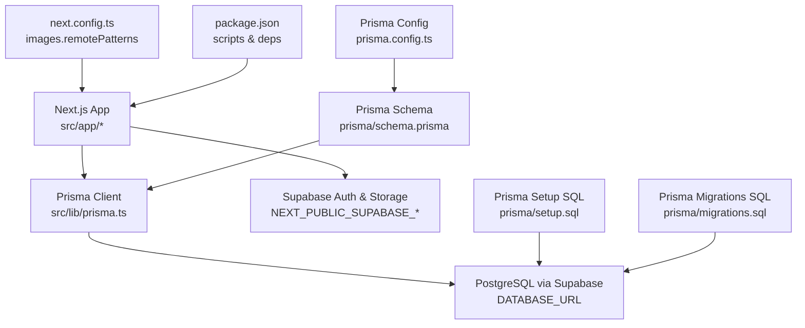
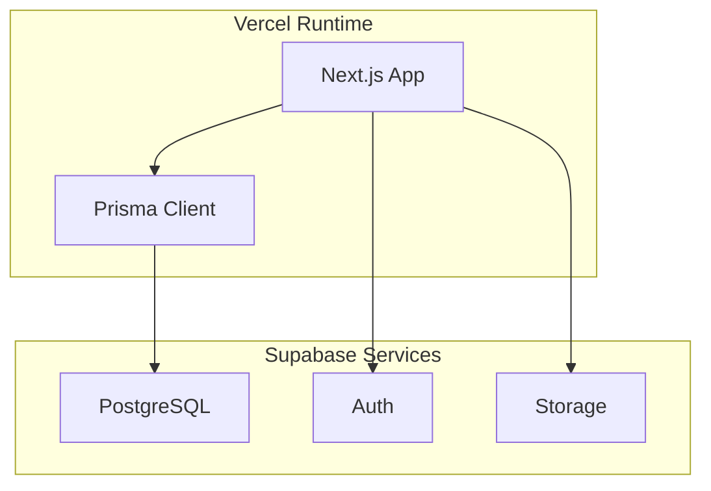
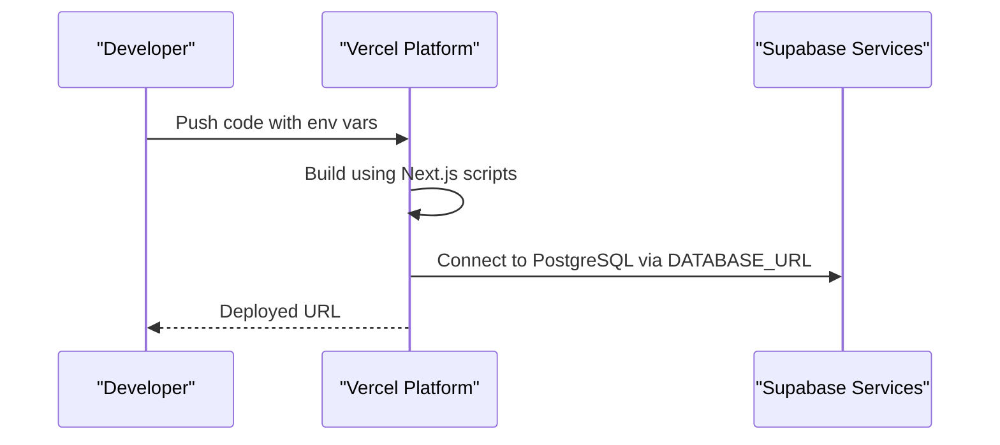
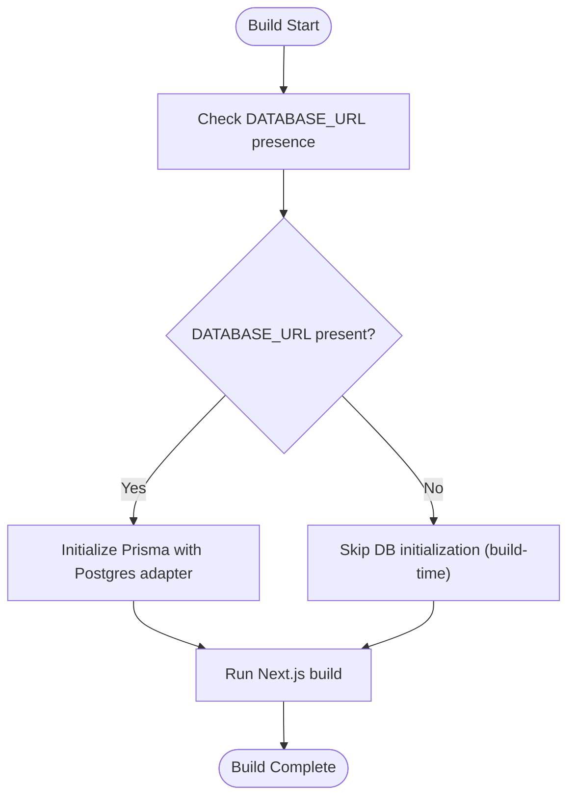
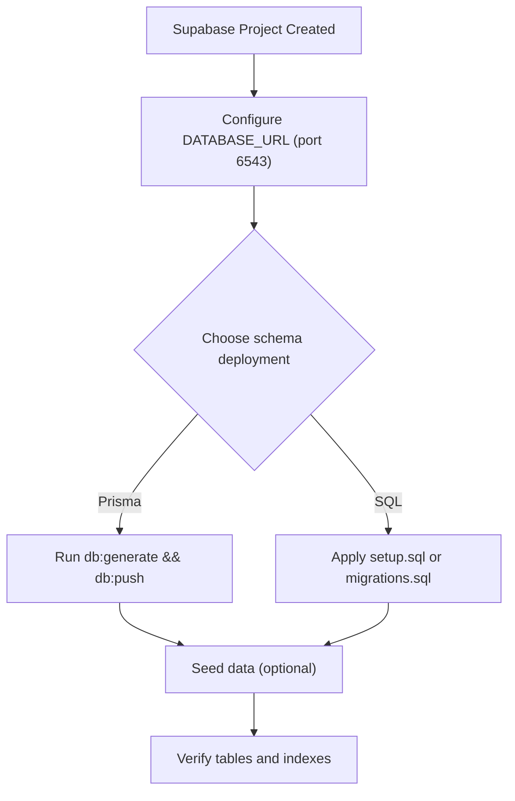
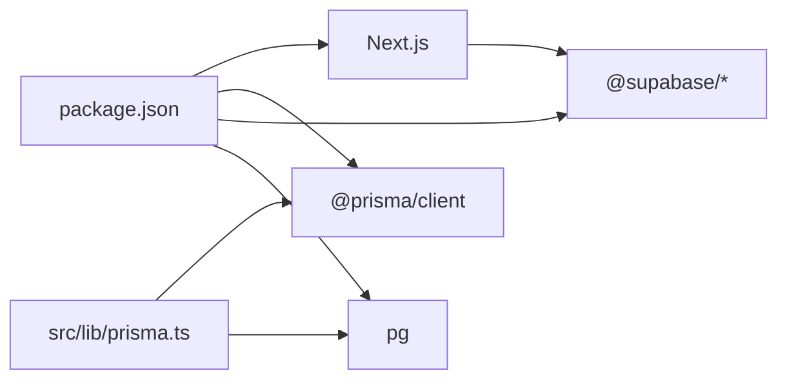

# Deployment & DevOps

<cite>
**Referenced Files in This Document**
- [package.json](file://package.json)
- [next.config.ts](file://next.config.ts)
- [prisma/schema.prisma](file://prisma/schema.prisma)
- [prisma/setup.sql](file://prisma/setup.sql)
- [prisma/migrations.sql](file://prisma/migrations.sql)
- [prisma.config.ts](file://prisma.config.ts)
- [src/lib/prisma.ts](file://src/lib/prisma.ts)
- [README.md](file://README.md)
- [SETUP.md](file://SETUP.md)
</cite>

## Table of Contents
1. [Introduction](#introduction)
2. [Project Structure](#project-structure)
3. [Core Components](#core-components)
4. [Architecture Overview](#architecture-overview)
5. [Detailed Component Analysis](#detailed-component-analysis)
6. [Dependency Analysis](#dependency-analysis)
7. [Performance Considerations](#performance-considerations)
8. [Troubleshooting Guide](#troubleshooting-guide)
9. [Conclusion](#conclusion)
10. [Appendices](#appendices)

## Introduction
This document provides comprehensive deployment and DevOps guidance for Barcode Adventure. It covers Vercel deployment, environment variable configuration, production build optimization, database provisioning with PostgreSQL via Supabase, Prisma migration and seeding strategies, environment-specific configuration management, CI/CD pipeline setup, automated testing integration, release management, monitoring and logging, performance optimization, scaling considerations, troubleshooting, rollback procedures, maintenance tasks, security best practices, SSL certificate management, and CDN configuration.

## Project Structure
Barcode Adventure is a Next.js 16 application using the App Router. The repository includes:
- Application code under src/
- Prisma schema and SQL assets under prisma/
- Build and runtime configuration under next.config.ts
- Package scripts and dependencies under package.json
- Setup and operational guidance under README.md and SETUP.md

Key deployment-relevant areas:
- Next.js configuration for image optimization and remote image patterns
- Prisma client initialization with Postgres adapter and runtime-only DB usage
- Supabase integration for authentication, storage, and database connectivity
- Scripts for generating, migrating, pushing, and seeding the database

**Diagram sources**
- [next.config.ts:1-16](file://next.config.ts#L1-L16)
- [src/lib/prisma.ts:1-33](file://src/lib/prisma.ts#L1-L33)
- [prisma/schema.prisma:1-47](file://prisma/schema.prisma#L1-L47)
- [prisma/setup.sql:1-61](file://prisma/setup.sql#L1-L61)
- [prisma/migrations.sql:1-56](file://prisma/migrations.sql#L1-L56)
- [prisma.config.ts:1-12](file://prisma.config.ts#L1-L12)
- [package.json:1-60](file://package.json#L1-L60)

**Section sources**
- [README.md:1-37](file://README.md#L1-L37)
- [SETUP.md:1-152](file://SETUP.md#L1-L152)
- [next.config.ts:1-16](file://next.config.ts#L1-L16)
- [package.json:1-60](file://package.json#L1-L60)

## Core Components
- Next.js build and runtime: The application uses Next.js 16 with App Router. Production builds are optimized and served via Vercel.
- Prisma ORM: Uses Prisma v7 with an explicit Postgres adapter. The client is lazily initialized at runtime and disabled during static builds when DATABASE_URL is not present.
- Supabase integration: Authentication, storage, and database connectivity are handled via Supabase. Environment variables for Supabase keys and database URL are required.
- Image optimization: Remote image patterns are configured to allow images from Supabase storage.

**Section sources**
- [package.json:1-60](file://package.json#L1-L60)
- [src/lib/prisma.ts:1-33](file://src/lib/prisma.ts#L1-L33)
- [next.config.ts:1-16](file://next.config.ts#L1-L16)
- [SETUP.md:53-62](file://SETUP.md#L53-L62)

## Architecture Overview
The deployment architecture centers around Vercel hosting with Supabase-managed PostgreSQL and Supabase services for Auth and Storage. Prisma manages database client interactions with a Postgres adapter.

**Diagram sources**
- [src/lib/prisma.ts:1-33](file://src/lib/prisma.ts#L1-L33)
- [SETUP.md:53-62](file://SETUP.md#L53-L62)

## Detailed Component Analysis

### Vercel Deployment
- Deployment method: Recommended to deploy via Vercel’s platform as indicated in the project’s README.
- Environment variables: Configure NEXT_PUBLIC_SUPABASE_URL, NEXT_PUBLIC_SUPABASE_ANON_KEY, and DATABASE_URL in Vercel’s project settings.
- Build and start scripts: Use the standard Next.js scripts for building and starting the application.
- Image optimization: The remotePatterns configuration allows serving images from Supabase storage.

**Diagram sources**
- [README.md:32-36](file://README.md#L32-L36)
- [SETUP.md:53-62](file://SETUP.md#L53-L62)
- [next.config.ts:4-12](file://next.config.ts#L4-L12)

**Section sources**
- [README.md:32-36](file://README.md#L32-L36)
- [SETUP.md:53-62](file://SETUP.md#L53-L62)
- [next.config.ts:4-12](file://next.config.ts#L4-L12)

### Environment Variable Configuration
- Required variables:
  - NEXT_PUBLIC_SUPABASE_URL: Supabase project URL
  - NEXT_PUBLIC_SUPABASE_ANON_KEY: Public anonymous key
  - DATABASE_URL: Supabase Postgres connection string using Transaction Pooler port 6543
- Local development: Use .env.local for local runs.
- Production: Set variables in Vercel project settings.

**Section sources**
- [SETUP.md:53-62](file://SETUP.md#L53-L62)
- [prisma.config.ts:5-6](file://prisma.config.ts#L5-L6)

### Production Build Optimization
- Next.js build: Use the standard build script to produce optimized artifacts.
- Image optimization: Configure remotePatterns to allow Supabase-hosted images.
- Static generation: The Prisma client is intentionally disabled during build-time when DATABASE_URL is missing, ensuring builds succeed without a live database.

**Diagram sources**
- [src/lib/prisma.ts:8-21](file://src/lib/prisma.ts#L8-L21)

**Section sources**
- [package.json:5-16](file://package.json#L5-L16)
- [next.config.ts:4-12](file://next.config.ts#L4-L12)
- [src/lib/prisma.ts:8-21](file://src/lib/prisma.ts#L8-L21)

### Database Provisioning (PostgreSQL via Supabase)
- Provisioning: Create a Supabase project and configure the database.
- Connection string: Use the Transaction Pooler port 6543 in DATABASE_URL.
- Schema creation: Two approaches are available:
  - Prisma schema push: Use the db:push script to apply schema to Supabase.
  - SQL scripts: Apply setup.sql or migrations.sql to initialize tables and indexes.
- Seeding: Use the db:seed script to populate initial data.

**Diagram sources**
- [SETUP.md:66-79](file://SETUP.md#L66-L79)
- [prisma/schema.prisma:1-47](file://prisma/schema.prisma#L1-L47)
- [prisma/setup.sql:1-61](file://prisma/setup.sql#L1-L61)
- [prisma/migrations.sql:1-56](file://prisma/migrations.sql#L1-L56)

**Section sources**
- [SETUP.md:66-79](file://SETUP.md#L66-L79)
- [SETUP.md:26-31](file://SETUP.md#L26-L31)
- [prisma/schema.prisma:1-47](file://prisma/schema.prisma#L1-L47)
- [prisma/setup.sql:1-61](file://prisma/setup.sql#L1-L61)
- [prisma/migrations.sql:1-56](file://prisma/migrations.sql#L1-L56)

### Prisma Migration Deployment
- Development workflow: Use Prisma migrate or db push depending on desired change management.
- Production readiness: Prefer schema.sql-based migrations for deterministic deployments.
- Configuration: prisma.config.ts loads .env.local to resolve DATABASE_URL for local tooling.

**Section sources**
- [SETUP.md:70-78](file://SETUP.md#L70-L78)
- [prisma.config.ts:1-12](file://prisma.config.ts#L1-L12)

### Environment-Specific Configuration Management
- Local vs. production: Use .env.local for local development and Vercel project settings for production.
- Supabase keys: NEXT_PUBLIC_SUPABASE_URL and NEXT_PUBLIC_SUPABASE_ANON_KEY are required for frontend access.
- Database URL: DATABASE_URL must point to Supabase Postgres with Transaction Pooler.

**Section sources**
- [SETUP.md:53-62](file://SETUP.md#L53-L62)

### CI/CD Pipeline Setup
- Trigger: Connect the repository to Vercel and enable automatic deployments from selected branches.
- Stages:
  - Install dependencies
  - Build application
  - Optional: Run tests
  - Deploy to Vercel preview/production
- Secrets: Store Supabase and database secrets in Vercel’s environment variables.
- Branch rules: Configure branch protection and preview deployments for pull requests.

[No sources needed since this section provides general guidance]

### Automated Testing Integration
- Unit/integration tests: Add test scripts and runners to package.json and integrate with CI.
- Database tests: Use isolated test databases or Supabase test instances.
- Linting: Integrate ESLint checks in CI.

**Section sources**
- [package.json:9-16](file://package.json#L9-L16)

### Release Management Processes
- Versioning: Manage semantic versioning via tags or release branches.
- Rollouts: Use Vercel’s preview deployments for staging and production deploys for release.
- Rollback: Re-deploy previous successful commit or tag if issues arise.

[No sources needed since this section provides general guidance]

### Monitoring and Logging Configuration
- Application logs: Enable Vercel logs and review build/runtime errors.
- Database metrics: Monitor Supabase database performance and connection pool usage.
- Analytics: Integrate analytics if needed for user behavior insights.

[No sources needed since this section provides general guidance]

### Performance Optimization for Production
- Image optimization: Leverage Next.js image optimization and remotePatterns for Supabase images.
- Build optimization: Use Next.js production build defaults.
- Database tuning: Ensure proper indexing and consider connection pooling via Supabase Transaction Pooler.

**Section sources**
- [next.config.ts:4-12](file://next.config.ts#L4-L12)

### Scaling Considerations
- Horizontal scaling: Vercel scales automatically; ensure database connections are efficient.
- Database scaling: Use Supabase’s managed PostgreSQL scaling options.
- CDN: Serve images from Supabase storage via configured remotePatterns.

**Section sources**
- [SETUP.md:34-50](file://SETUP.md#L34-L50)
- [next.config.ts:4-12](file://next.config.ts#L4-L12)

## Dependency Analysis
The deployment relies on:
- Next.js for SSR/SSG and routing
- Prisma client with Postgres adapter for database operations
- Supabase for Auth, Storage, and Postgres connectivity
- Vercel for hosting and environment variable management

**Diagram sources**
- [package.json:20-47](file://package.json#L20-L47)
- [src/lib/prisma.ts:1-33](file://src/lib/prisma.ts#L1-L33)

**Section sources**
- [package.json:20-47](file://package.json#L20-L47)
- [src/lib/prisma.ts:1-33](file://src/lib/prisma.ts#L1-L33)

## Performance Considerations
- Optimize image loading by serving from Supabase storage and configuring remotePatterns.
- Minimize unnecessary database queries; leverage Prisma client efficiently.
- Use Vercel’s edge caching and static generation where appropriate.

**Section sources**
- [next.config.ts:4-12](file://next.config.ts#L4-L12)

## Troubleshooting Guide
Common deployment issues and resolutions:
- Camera not working: Requires HTTPS or localhost; grant camera permissions; on iOS use Safari.
- Supabase connection error: Verify DATABASE_URL uses Transaction Pooler port 6543 and that your IP is not blocked.
- Admin login fails: Ensure user is created in Supabase Auth and email is confirmed.
- Images not uploading: Confirm bucket exists, is public, and storage policies allow uploads.
- Prisma client during build: If DATABASE_URL is missing, the client is intentionally disabled during build-time.

**Section sources**
- [SETUP.md:134-152](file://SETUP.md#L134-L152)
- [src/lib/prisma.ts:11-16](file://src/lib/prisma.ts#L11-L16)

## Conclusion
Barcode Adventure can be deployed efficiently on Vercel with Supabase-managed PostgreSQL and Supabase services. By following the environment variable configuration, database provisioning steps, and production build optimization outlined here, teams can achieve reliable deployments, scalable performance, and secure operations.

## Appendices

### Appendix A: Environment Variables Reference
- NEXT_PUBLIC_SUPABASE_URL: Supabase project URL
- NEXT_PUBLIC_SUPABASE_ANON_KEY: Public anonymous key
- DATABASE_URL: Supabase Postgres connection string using Transaction Pooler port 6543

**Section sources**
- [SETUP.md:53-62](file://SETUP.md#L53-L62)

### Appendix B: Database Initialization Checklist
- Create Supabase project
- Retrieve Supabase keys and DATABASE_URL
- Run db:generate and db:push (or apply setup.sql/migrations.sql)
- Seed data if needed

**Section sources**
- [SETUP.md:66-79](file://SETUP.md#L66-L79)

### Appendix C: Security Best Practices
- Use HTTPS for camera and image access
- Restrict Supabase storage policies appropriately
- Rotate Supabase keys and manage secrets securely in Vercel
- Monitor database and application logs regularly

**Section sources**
- [SETUP.md:134-152](file://SETUP.md#L134-L152)