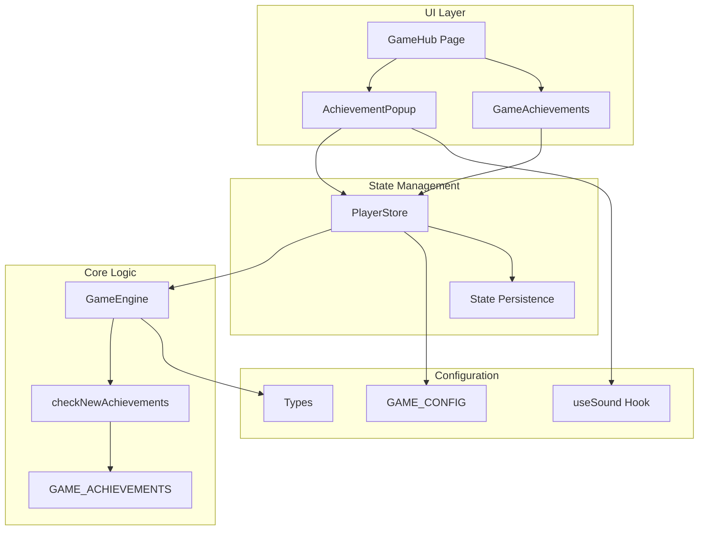
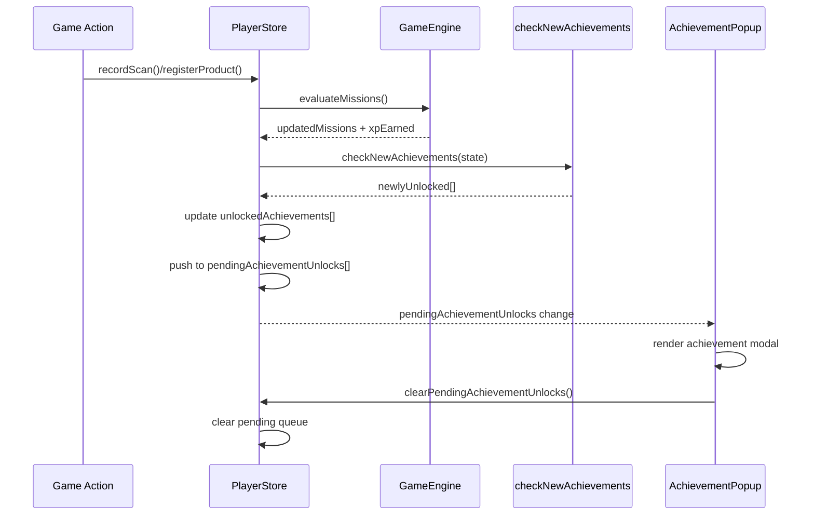
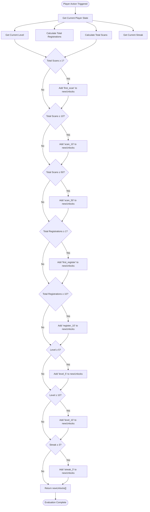
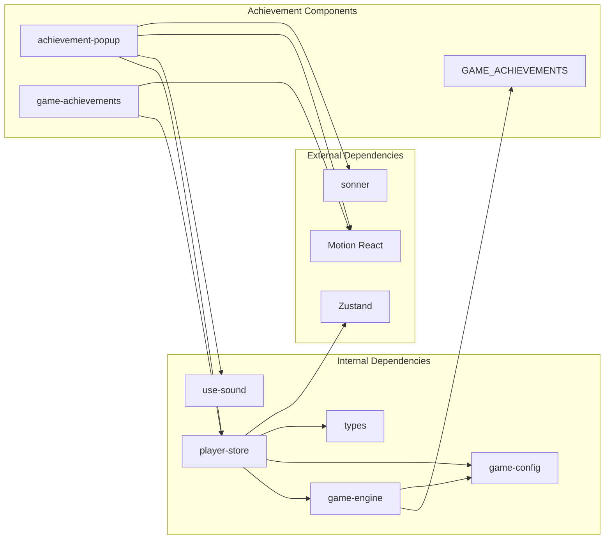

# Achievement System

<cite>
**Referenced Files in This Document**
- [achievement-popup.tsx](file://src/components/game/achievement-popup.tsx)
- [game-achievements.tsx](file://src/components/game/game-achievements.tsx)
- [player-store.ts](file://src/stores/player-store.ts)
- [game-engine.ts](file://src/lib/game-engine.ts)
- [game-config.ts](file://src/lib/game-config.ts)
- [index.ts](file://src/types/index.ts)
- [use-sound.ts](file://src/hooks/use-sound.ts)
- [page.tsx](file://src/app/play/page.tsx)
</cite>

## Table of Contents
1. [Introduction](#introduction)
2. [Project Structure](#project-structure)
3. [Core Components](#core-components)
4. [Architecture Overview](#architecture-overview)
5. [Detailed Component Analysis](#detailed-component-analysis)
6. [Dependency Analysis](#dependency-analysis)
7. [Performance Considerations](#performance-considerations)
8. [Troubleshooting Guide](#troubleshooting-guide)
9. [Conclusion](#conclusion)

## Introduction
This document provides comprehensive documentation for the achievement system architecture and implementation in the Barcode Adventure game. The system tracks player progress across multiple categories including scanning milestones, registration achievements, level-based unlocks, and streak achievements. It features a robust evaluation mechanism, persistent state management, and an engaging popup notification system with audio feedback.

The achievement system is designed around a clean separation of concerns: predefined achievement definitions, evaluation logic, state management, and presentation components. This modular approach ensures maintainability and extensibility while providing immediate feedback to players upon achieving milestones.

## Project Structure
The achievement system spans several key areas of the application:

**Diagram sources**
- [achievement-popup.tsx:1-97](file://src/components/game/achievement-popup.tsx#L1-L97)
- [game-achievements.tsx:1-88](file://src/components/game/game-achievements.tsx#L1-L88)
- [player-store.ts:1-294](file://src/stores/player-store.ts#L1-L294)
- [game-engine.ts:1-241](file://src/lib/game-engine.ts#L1-L241)

**Section sources**
- [achievement-popup.tsx:1-97](file://src/components/game/achievement-popup.tsx#L1-L97)
- [game-achievements.tsx:1-88](file://src/components/game/game-achievements.tsx#L1-L88)
- [player-store.ts:1-294](file://src/stores/player-store.ts#L1-L294)
- [game-engine.ts:1-241](file://src/lib/game-engine.ts#L1-L241)

## Core Components
The achievement system consists of four primary components working in concert:

### Achievement Definitions
The system defines eight distinct achievements covering different gameplay aspects:
- **Scanning Milestones**: First contact, Barcodian Hunter (10 scans), Master Tracker (50 scans)
- **Registration Achievements**: Product Creator (first registration), Factory Owner (10 registrations)
- **Level-Based Unlocks**: Rising Star (level 5), Legendary Hunter (level 10)
- **Streak Achievements**: Loyal Hunter (3-day streak)

### Evaluation Engine
The `checkNewAchievements` function serves as the central evaluation mechanism, assessing player state against predefined criteria and returning newly unlocked achievement IDs.

### State Management
The PlayerStore maintains achievement-related state including unlocked achievements, pending unlocks, and integration points with the broader game state.

### Presentation Layer
Two UI components provide different views of achievement progress: a comprehensive achievements list and a focused unlock notification popup.

**Section sources**
- [game-engine.ts:4-53](file://src/lib/game-engine.ts#L4-L53)
- [game-engine.ts:206-240](file://src/lib/game-engine.ts#L206-L240)
- [player-store.ts:9-28](file://src/stores/player-store.ts#L9-L28)
- [achievement-popup.tsx:22-96](file://src/components/game/achievement-popup.tsx#L22-L96)

## Architecture Overview
The achievement system follows a reactive architecture pattern with clear data flow:

**Diagram sources**
- [player-store.ts:129-181](file://src/stores/player-store.ts#L129-L181)
- [player-store.ts:183-220](file://src/stores/player-store.ts#L183-L220)
- [game-engine.ts:206-240](file://src/lib/game-engine.ts#L206-L240)
- [achievement-popup.tsx:22-48](file://src/components/game/achievement-popup.tsx#L22-L48)

## Detailed Component Analysis

### Achievement Definitions and Categories
The system organizes achievements into four distinct categories with specific threshold requirements:

#### Scanning Milestones
- **First Contact** (`first_scan`): Unlocked after the first barcode scan
- **Barcodian Hunter** (`scan_10`): Unlocked after 10 total scans
- **Master Tracker** (`scan_50`): Unlocked after 50 total scans

#### Registration Achievements
- **Product Creator** (`first_register`): Unlocked after registering the first product
- **Factory Owner** (`register_10`): Unlocked after registering 10 products

#### Level-Based Unlocks
- **Rising Star** (`level_5`): Unlocked when reaching Player Level 5
- **Legendary Hunter** (`level_10`): Unlocked when reaching Player Level 10

#### Streak Achievements
- **Loyal Hunter** (`streak_3`): Unlocked when maintaining a 3-day daily scan streak

Each achievement includes metadata for display: unique ID, title, description, and emoji icon.

**Section sources**
- [game-engine.ts:4-53](file://src/lib/game-engine.ts#L4-L53)
- [game-engine.ts:206-240](file://src/lib/game-engine.ts#L206-L240)

### Achievement Evaluation Logic
The evaluation process occurs during gameplay actions and follows a systematic approach:

**Diagram sources**
- [game-engine.ts:206-240](file://src/lib/game-engine.ts#L206-L240)

**Section sources**
- [game-engine.ts:206-240](file://src/lib/game-engine.ts#L206-L240)

### State Management Implementation
The PlayerStore manages achievement state through a comprehensive state machine:

#### State Properties
- `unlockedAchievements`: Array of achievement IDs already earned
- `pendingAchievementUnlocks`: Queue of newly unlocked achievements awaiting notification
- Integration with XP system for combined progression feedback

#### Action Integration
Achievement evaluation is integrated into core gameplay actions:
- **Scan Actions**: Trigger evaluation after XP calculation and mission updates
- **Registration Actions**: Trigger evaluation after successful product registration
- **Level Updates**: Automatic evaluation during level progression

#### Persistence Strategy
Achievement state persists across sessions using Zustand middleware, ensuring players retain their progress even after browser refreshes.

**Section sources**
- [player-store.ts:9-28](file://src/stores/player-store.ts#L9-L28)
- [player-store.ts:129-181](file://src/stores/player-store.ts#L129-L181)
- [player-store.ts:183-220](file://src/stores/player-store.ts#L183-L220)

### Popup Notification System
The achievement notification system provides immediate, engaging feedback:

#### Visual Design
- **Spring Animation**: Smooth entrance and exit animations using Framer Motion
- **Pixel Cat Integration**: Custom animated pixel cat characters representing achievement badges
- **Golden Theme**: Distinctive yellow/gold color scheme for visual prominence
- **Decorative Elements**: Animated sparkles and layered pixel cat elements

#### Audio Feedback
The system includes sophisticated audio feedback:
- **Achievement Unlock Tone**: Multi-note melody (C5, E5, G5, C6) indicating successful achievement
- **Sound Hook**: Reusable audio system supporting multiple sound types
- **Preloading**: Audio assets loaded on client initialization for responsive feedback

#### Interaction Flow
1. **Trigger Detection**: New achievement detected in pending queue
2. **Audio Cue**: Achievement sound plays immediately
3. **Visual Display**: Modal appears with achievement details
4. **Manual Dismissal**: Player can close the modal to continue playing
5. **State Cleanup**: Pending queue cleared and state synchronized

**Section sources**
- [achievement-popup.tsx:22-96](file://src/components/game/achievement-popup.tsx#L22-L96)
- [use-sound.ts:53-87](file://src/hooks/use-sound.ts#L53-L87)

### Achievement List Interface
The achievements list provides comprehensive progress tracking:

#### Display Features
- **Grid Layout**: Responsive two-column grid for optimal mobile/desktop experience
- **Progress Indicators**: Completion percentage and individual achievement status
- **Animated Entries**: Sequential fade-in animations for visual appeal
- **Status Differentiation**: Distinct styling for locked vs. unlocked achievements

#### Visual Elements
- **Pixel Cat Badges**: Custom pixel art representations for each achievement type
- **Color Coding**: Achievement-specific color schemes based on badge variants
- **Grayscale Lock**: Locked achievements displayed in grayscale with reduced opacity

**Section sources**
- [game-achievements.tsx:20-87](file://src/components/game/game-achievements.tsx#L20-L87)

## Dependency Analysis
The achievement system exhibits clean dependency relationships:

**Diagram sources**
- [achievement-popup.tsx:1-97](file://src/components/game/achievement-popup.tsx#L1-L97)
- [game-achievements.tsx:1-88](file://src/components/game/game-achievements.tsx#L1-L88)
- [player-store.ts:1-294](file://src/stores/player-store.ts#L1-L294)
- [game-engine.ts:1-241](file://src/lib/game-engine.ts#L1-L241)

**Section sources**
- [achievement-popup.tsx:1-97](file://src/components/game/achievement-popup.tsx#L1-L97)
- [game-achievements.tsx:1-88](file://src/components/game/game-achievements.tsx#L1-L88)
- [player-store.ts:1-294](file://src/stores/player-store.ts#L1-L294)
- [game-engine.ts:1-241](file://src/lib/game-engine.ts#L1-L241)

## Performance Considerations
The achievement system is designed with performance optimization in mind:

### Evaluation Efficiency
- **Single Pass Evaluation**: Achievements evaluated in O(n) time with n=8 predefined achievements
- **Early Termination**: No redundant checks once all conditions are assessed
- **Set Operations**: O(1) lookup for existing achievement verification

### Memory Management
- **Minimal State**: Achievement state stored as simple arrays of IDs
- **Efficient Queuing**: FIFO queue for pending unlocks prevents memory accumulation
- **Lazy Loading**: Audio assets preloaded only when needed

### Rendering Optimization
- **Conditional Rendering**: Achievement popup only renders when pending unlocks exist
- **Animation Primitives**: Hardware-accelerated animations using Motion
- **Component Memoization**: React.memo patterns prevent unnecessary re-renders

## Troubleshooting Guide

### Common Issues and Solutions

#### Achievement Not Unlocking
**Symptoms**: Player achieves milestone but no notification appears
**Causes**: 
- Achievement already unlocked (duplicate prevention)
- Invalid achievement ID in pending queue
- State synchronization delays

**Solutions**:
- Verify achievement ID exists in GAME_ACHIEVEMENTS
- Check unlockedAchievements array for existing entries
- Ensure pendingAchievementUnlocks queue is properly managed

#### Popup Not Displaying
**Symptoms**: Achievement unlocked but modal doesn't appear
**Causes**:
- Audio system initialization failure
- State not updating correctly
- Component mounting issues

**Solutions**:
- Verify use-sound hook initialization
- Check PlayerStore state updates
- Ensure component is properly mounted in GameHub

#### State Persistence Problems
**Symptoms**: Achievements lost after page refresh
**Causes**:
- Zustand persistence middleware issues
- Storage quota exceeded
- Migration failures

**Solutions**:
- Verify localStorage availability
- Check migration function implementation
- Review persistence configuration

**Section sources**
- [achievement-popup.tsx:37-42](file://src/components/game/achievement-popup.tsx#L37-L42)
- [player-store.ts:276-278](file://src/stores/player-store.ts#L276-L278)
- [use-sound.ts:11-17](file://src/hooks/use-sound.ts#L11-L17)

## Conclusion
The achievement system demonstrates a well-architected solution for gamification in the Barcode Adventure game. Its modular design, comprehensive evaluation logic, and engaging presentation components create a cohesive player progression experience.

Key strengths include:
- **Clean Separation of Concerns**: Clear boundaries between evaluation, state management, and presentation
- **Extensible Architecture**: Easy addition of new achievement types and categories
- **Performance Optimization**: Efficient evaluation and rendering mechanisms
- **Player Engagement**: Immediate feedback through visual and audio cues
- **Persistence Strategy**: Reliable state management across sessions

The system successfully balances simplicity with functionality, providing meaningful progression markers while maintaining excellent performance characteristics. Future enhancements could include dynamic achievement generation, social sharing capabilities, and more granular achievement tracking metrics.