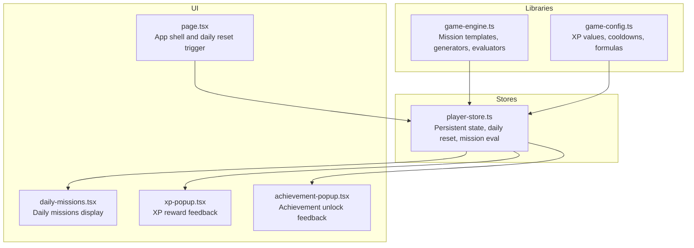
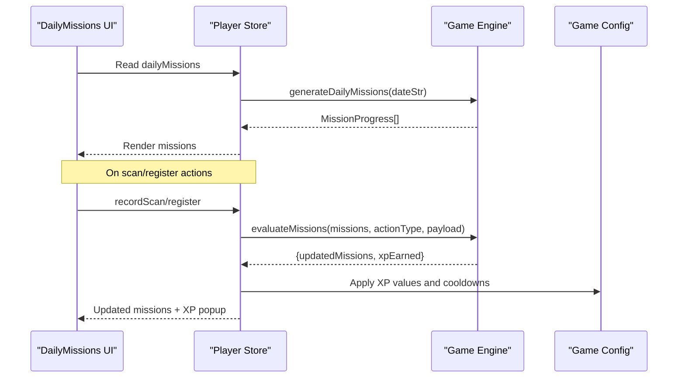
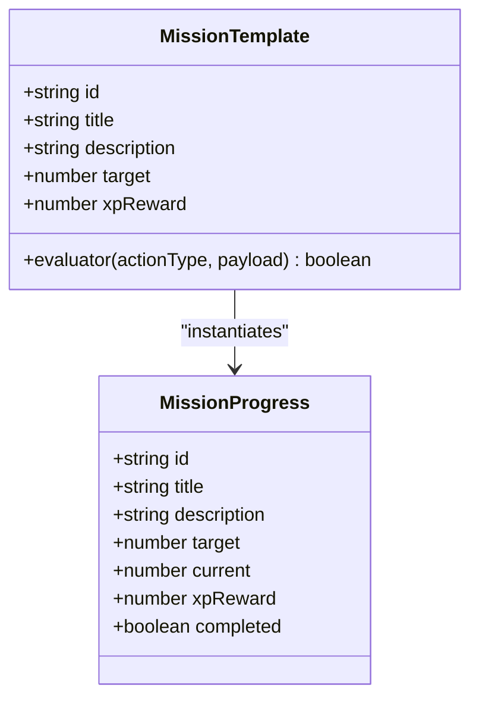
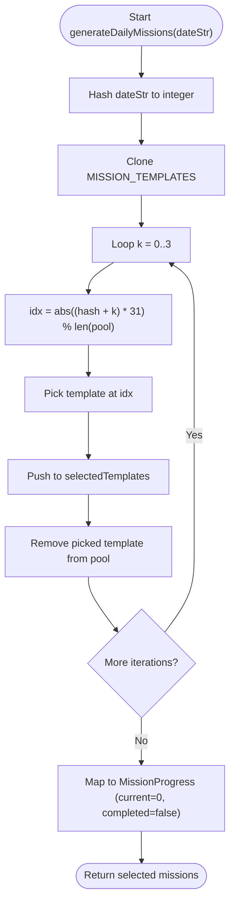
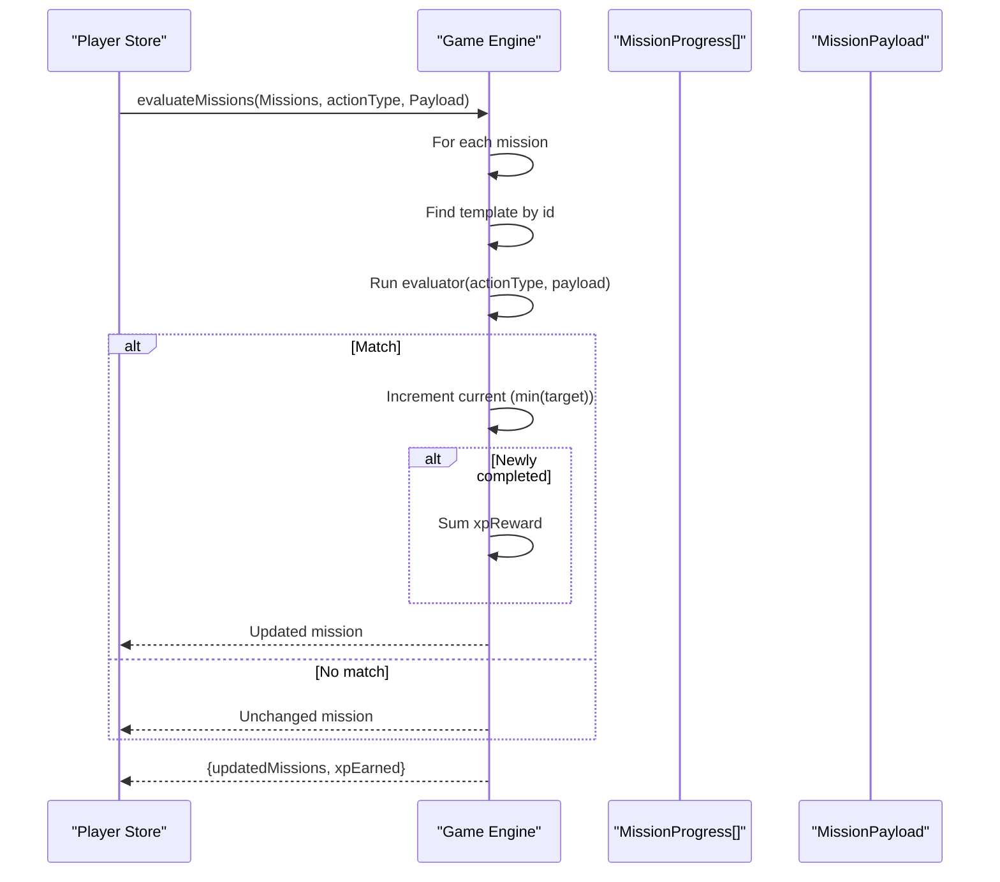
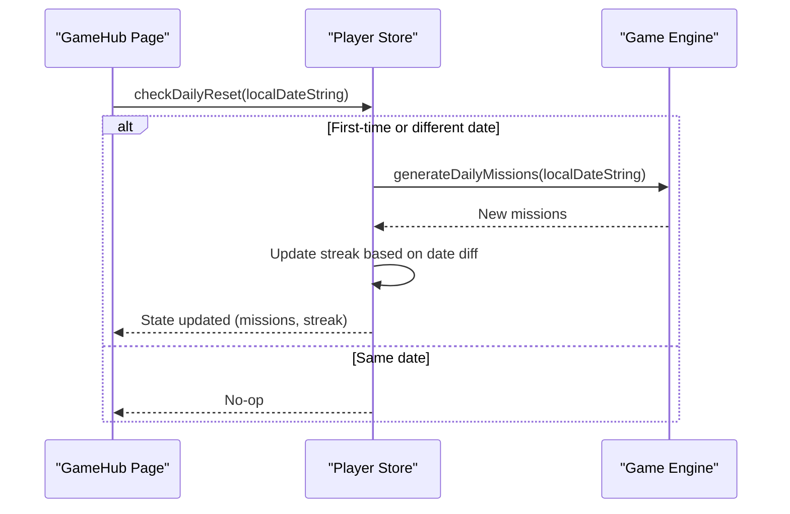
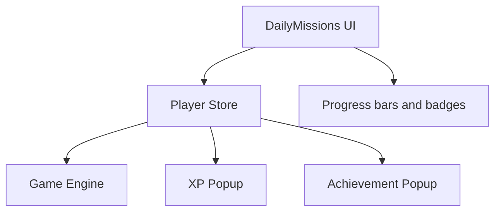
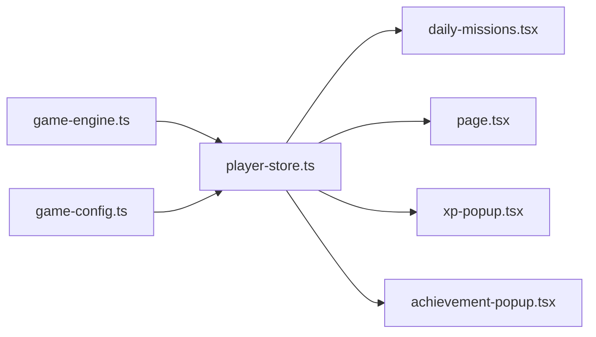

# Daily Missions

<cite>
**Referenced Files in This Document**
- [game-engine.ts](file://src/lib/game-engine.ts)
- [daily-missions.tsx](file://src/components/game/daily-missions.tsx)
- [player-store.ts](file://src/stores/player-store.ts)
- [index.ts](file://src/types/index.ts)
- [page.tsx](file://src/app/play/page.tsx)
- [game-config.ts](file://src/lib/game-config.ts)
- [xp-popup.tsx](file://src/components/game/xp-popup.tsx)
- [achievement-popup.tsx](file://src/components/game/achievement-popup.tsx)
</cite>

## Table of Contents
1. [Introduction](#introduction)
2. [Project Structure](#project-structure)
3. [Core Components](#core-components)
4. [Architecture Overview](#architecture-overview)
5. [Detailed Component Analysis](#detailed-component-analysis)
6. [Dependency Analysis](#dependency-analysis)
7. [Performance Considerations](#performance-considerations)
8. [Troubleshooting Guide](#troubleshooting-guide)
9. [Conclusion](#conclusion)

## Introduction
This document explains the daily mission generation and evaluation system. It covers how mission templates are defined, how missions are generated deterministically using date-based seeding, how mission progress is evaluated and tracked, and how completion rewards are handled. It also documents mission reset mechanisms, player progress persistence, and UI integration for displaying and tracking missions.

## Project Structure
The daily mission system spans several modules:
- Mission templates and evaluators live in the game engine library.
- The player store manages persistent state, triggers daily resets, and integrates mission evaluation into gameplay actions.
- The UI renders daily missions and displays progress and rewards.
- Configuration defines XP values and cooldowns used during evaluation.

**Diagram sources**
- [game-engine.ts:133-241](file://src/lib/game-engine.ts#L133-L241)
- [player-store.ts:1-294](file://src/stores/player-store.ts#L1-L294)
- [daily-missions.tsx:1-95](file://src/components/game/daily-missions.tsx#L1-L95)
- [page.tsx:41-287](file://src/app/play/page.tsx#L41-L287)
- [game-config.ts:1-28](file://src/lib/game-config.ts#L1-L28)
- [xp-popup.tsx:1-50](file://src/components/game/xp-popup.tsx#L1-L50)
- [achievement-popup.tsx](file://src/components/game/achievement-popup.tsx)

**Section sources**
- [game-engine.ts:1-241](file://src/lib/game-engine.ts#L1-L241)
- [player-store.ts:1-294](file://src/stores/player-store.ts#L1-L294)
- [daily-missions.tsx:1-95](file://src/components/game/daily-missions.tsx#L1-L95)
- [page.tsx:41-287](file://src/app/play/page.tsx#L41-L287)
- [game-config.ts:1-28](file://src/lib/game-config.ts#L1-L28)
- [xp-popup.tsx:1-50](file://src/components/game/xp-popup.tsx#L1-L50)
- [achievement-popup.tsx](file://src/components/game/achievement-popup.tsx)

## Core Components
- Mission template system: Defines mission metadata, targets, rewards, and evaluator functions.
- Deterministic mission generator: Produces a consistent set of 4 missions per calendar day using a date-based hash.
- Mission evaluator: Increments progress for active missions when actions match their evaluator criteria.
- Player store: Persists state, triggers daily reset, and integrates mission evaluation into scan/register actions.
- UI: Renders mission cards, progress bars, and XP rewards; coordinates with popups for feedback.

**Section sources**
- [game-engine.ts:55-163](file://src/lib/game-engine.ts#L55-L163)
- [player-store.ts:100-294](file://src/stores/player-store.ts#L100-L294)
- [daily-missions.tsx:7-95](file://src/components/game/daily-missions.tsx#L7-L95)

## Architecture Overview
The daily mission system follows a clean separation of concerns:
- Templates define mission semantics and evaluation logic.
- The generator selects a deterministic subset of templates each day.
- The evaluator updates mission progress and computes XP rewards.
- The store persists state and orchestrates daily resets and action-side evaluations.
- The UI renders the current missions and provides feedback.

**Diagram sources**
- [game-engine.ts:133-200](file://src/lib/game-engine.ts#L133-L200)
- [player-store.ts:129-220](file://src/stores/player-store.ts#L129-L220)
- [daily-missions.tsx:7-95](file://src/components/game/daily-missions.tsx#L7-L95)
- [game-config.ts:6-27](file://src/lib/game-config.ts#L6-L27)

## Detailed Component Analysis

### Mission Template System
- MissionTemplate defines the structure for each mission: id, title, description, target, xpReward, and an evaluator function.
- Evaluator functions receive the action type and a payload, returning true when the action contributes to progress.
- Example evaluators include:
  - Scanning any product.
  - Registering a product.
  - Scanning products in specific categories (e.g., Drink/Dairy, Snack/Candy/Biscuit).
  - Scanning within a time window (e.g., Early Bird).
- Targets are numeric thresholds; progress increments by 1 per matching action until the target is reached.

**Diagram sources**
- [game-engine.ts:55-106](file://src/lib/game-engine.ts#L55-L106)
- [index.ts:92-100](file://src/types/index.ts#L92-L100)

**Section sources**
- [game-engine.ts:55-106](file://src/lib/game-engine.ts#L55-L106)
- [index.ts:92-100](file://src/types/index.ts#L92-L100)

### Deterministic Mission Generation (Date-Based Seeding)
- The generator hashes the input date string to produce a deterministic index selector.
- From a shuffled copy of the template pool, it deterministically selects 4 unique templates using arithmetic on the hash and iteration index.
- The resulting MissionProgress instances are initialized with zero progress and uncompleted state.

**Diagram sources**
- [game-engine.ts:133-163](file://src/lib/game-engine.ts#L133-L163)

**Section sources**
- [game-engine.ts:133-163](file://src/lib/game-engine.ts#L133-L163)

### Mission Evaluation Logic and Progress Tracking
- The evaluator iterates active missions and skips completed ones.
- For each active mission, it finds the corresponding template and runs the evaluator with the action type and payload.
- If the evaluator returns true, progress increments by 1 up to the target; newly completed missions grant XP rewards.
- The function returns the updated missions list and the total XP earned from newly completed missions.

**Diagram sources**
- [game-engine.ts:169-200](file://src/lib/game-engine.ts#L169-L200)

**Section sources**
- [game-engine.ts:169-200](file://src/lib/game-engine.ts#L169-L200)

### Mission Types and Examples
- Scanning targets: e.g., “Daily Scanner” requires scanning 5 barcodes of any product.
- Category-specific challenges: e.g., “Stay Hydrated” requires scanning a product in Drink or Dairy; “Snack Break” requires Snack, Candy, or Biscuit.
- Time-based missions: e.g., “Early Bird” requires scanning within a specific time window.
- Registration goals: e.g., “New Discoveries” requires registering 3 new products to the database.

These are defined in the mission template list and evaluated by their respective evaluator functions.

**Section sources**
- [game-engine.ts:70-116](file://src/lib/game-engine.ts#L70-L116)

### Mission Reset Mechanisms and Player Progress Persistence
- Daily reset is triggered by the app shell when the local date string changes.
- The store calculates the difference between the last active date and the current date to update streaks and replace daily missions.
- The store persists state to local storage using a zustand middleware, ensuring missions, XP, level, streak, and other stats survive reloads.

**Diagram sources**
- [page.tsx:67-71](file://src/app/play/page.tsx#L67-L71)
- [player-store.ts:229-270](file://src/stores/player-store.ts#L229-L270)
- [game-engine.ts:133-163](file://src/lib/game-engine.ts#L133-L163)

**Section sources**
- [page.tsx:67-71](file://src/app/play/page.tsx#L67-L71)
- [player-store.ts:229-270](file://src/stores/player-store.ts#L229-L270)

### UI Integration for Mission Display and Tracking
- The DailyMissions component reads the current missions from the store and renders a grid of mission cards.
- Each card shows title, description, progress bar, and XP reward badge. Completed missions are visually distinct.
- The app shell triggers daily reset checks on mount, ensuring missions refresh at midnight in the local timezone.
- XP and achievement popups provide immediate feedback when missions complete or achievements unlock.

**Diagram sources**
- [daily-missions.tsx:7-95](file://src/components/game/daily-missions.tsx#L7-L95)
- [player-store.ts:100-294](file://src/stores/player-store.ts#L100-L294)
- [xp-popup.tsx:1-50](file://src/components/game/xp-popup.tsx#L1-L50)
- [achievement-popup.tsx](file://src/components/game/achievement-popup.tsx)

**Section sources**
- [daily-missions.tsx:7-95](file://src/components/game/daily-missions.tsx#L7-L95)
- [page.tsx:264-282](file://src/app/play/page.tsx#L264-L282)
- [xp-popup.tsx:1-50](file://src/components/game/xp-popup.tsx#L1-L50)

## Dependency Analysis
- game-engine.ts depends on the mission template list and exports the generator and evaluator functions.
- player-store.ts depends on game-engine.ts for mission generation and evaluation, and on game-config.ts for XP values and cooldowns.
- UI components depend on the store for state and on game-config.ts for UI timing constants.

**Diagram sources**
- [game-engine.ts:1-241](file://src/lib/game-engine.ts#L1-L241)
- [player-store.ts:1-294](file://src/stores/player-store.ts#L1-L294)
- [daily-missions.tsx:1-95](file://src/components/game/daily-missions.tsx#L1-L95)
- [page.tsx:41-287](file://src/app/play/page.tsx#L41-L287)
- [game-config.ts:1-28](file://src/lib/game-config.ts#L1-L28)
- [xp-popup.tsx:1-50](file://src/components/game/xp-popup.tsx#L1-L50)
- [achievement-popup.tsx](file://src/components/game/achievement-popup.tsx)

**Section sources**
- [game-engine.ts:1-241](file://src/lib/game-engine.ts#L1-L241)
- [player-store.ts:1-294](file://src/stores/player-store.ts#L1-L294)
- [daily-missions.tsx:1-95](file://src/components/game/daily-missions.tsx#L1-L95)
- [page.tsx:41-287](file://src/app/play/page.tsx#L41-L287)
- [game-config.ts:1-28](file://src/lib/game-config.ts#L1-L28)
- [xp-popup.tsx:1-50](file://src/components/game/xp-popup.tsx#L1-L50)
- [achievement-popup.tsx](file://src/components/game/achievement-popup.tsx)

## Performance Considerations
- Deterministic selection uses a lightweight hash and modular arithmetic, ensuring O(1) per template selection and minimal overhead.
- Evaluation loops over active missions; with a small fixed count (4), this remains efficient.
- UI rendering uses memoized keys and animations; keep payload sizes small to avoid unnecessary re-renders.

## Troubleshooting Guide
- Missions not updating after midnight:
  - Ensure the app shell triggers daily reset on mount and that the local date string changes.
  - Verify the store’s daily reset logic and that the date comparison accounts for local time zone differences.
- Missions appear identical across days:
  - Confirm the date string passed to the generator reflects the local date and is consistent across sessions.
- XP not awarded:
  - Check that the action type and payload match the mission evaluator and that the action is not on cooldown.
  - Verify XP values and cooldowns in the configuration.
- UI not reflecting progress:
  - Confirm the store updates dailyMissions after evaluation and that the UI subscribes to the store.

**Section sources**
- [page.tsx:67-71](file://src/app/play/page.tsx#L67-L71)
- [player-store.ts:129-220](file://src/stores/player-store.ts#L129-L220)
- [game-config.ts:6-27](file://src/lib/game-config.ts#L6-L27)

## Conclusion
The daily mission system combines a robust template-driven design with deterministic generation and efficient evaluation. It integrates tightly with the player store for persistence and resets, and with the UI for clear progress tracking and rewarding feedback. The system is extensible: adding new mission templates and evaluators is straightforward, and the generator ensures variety while maintaining consistency per calendar day.