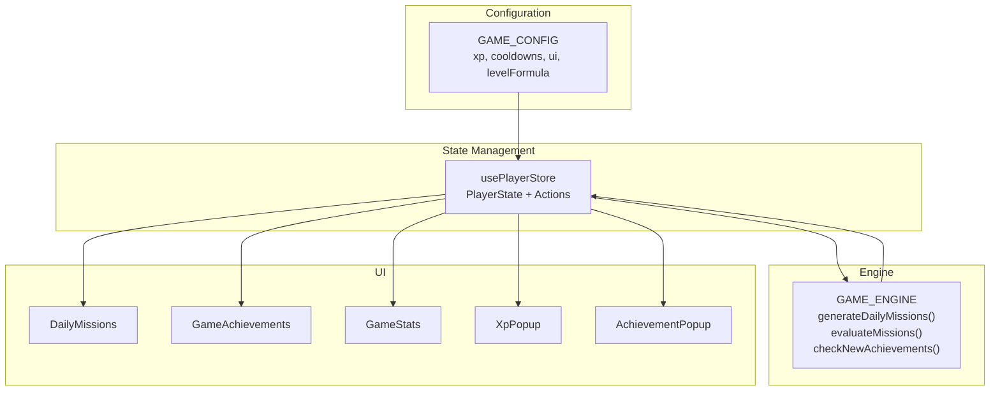
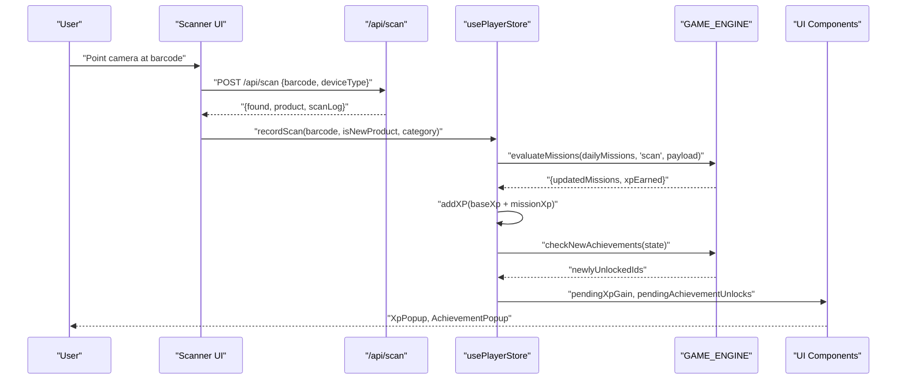
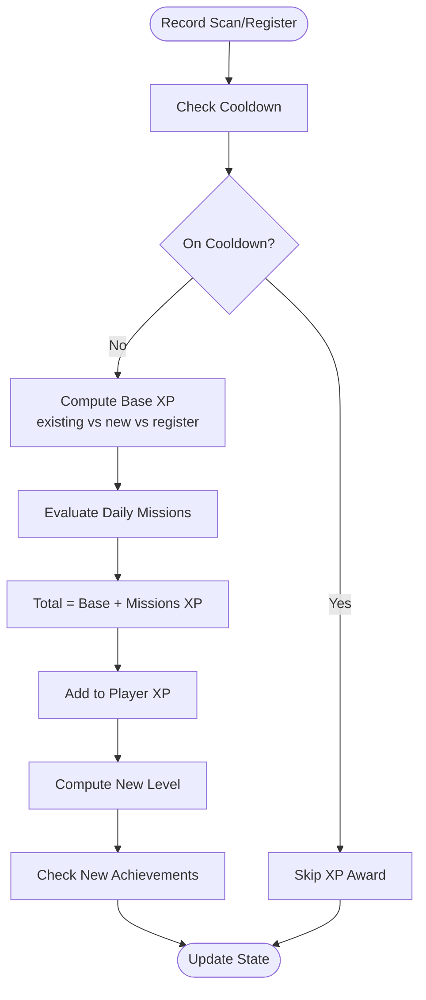
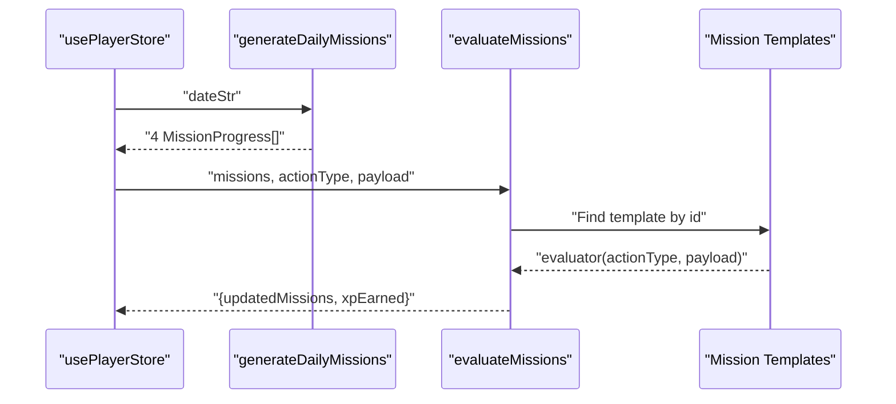
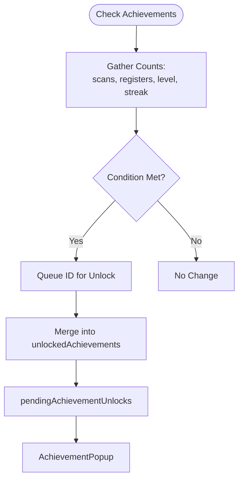
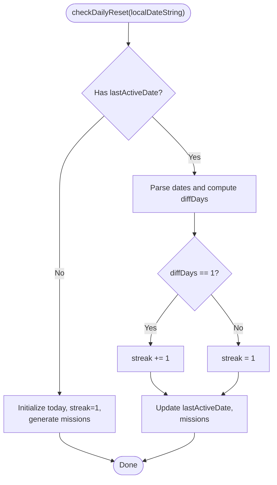
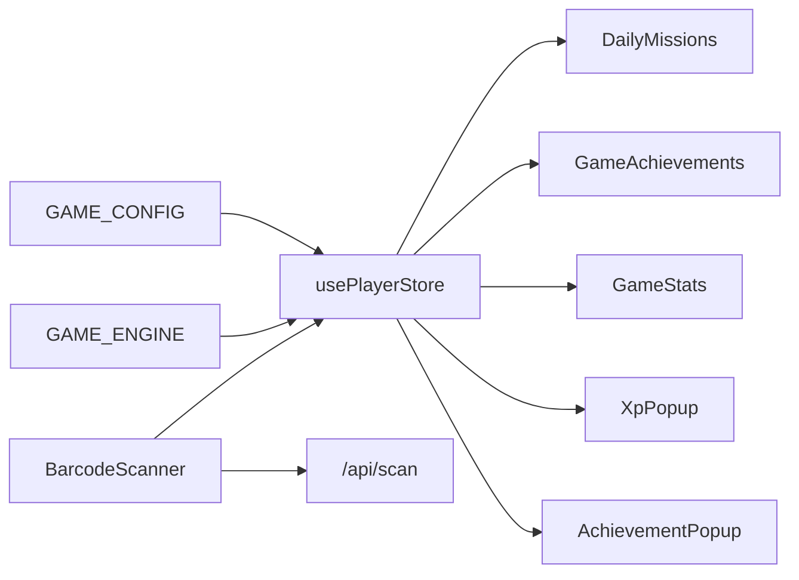

# Game Mechanics

<cite>
**Referenced Files in This Document**
- [game-engine.ts](file://src/lib/game-engine.ts)
- [player-store.ts](file://src/stores/player-store.ts)
- [game-config.ts](file://src/lib/game-config.ts)
- [daily-missions.tsx](file://src/components/game/daily-missions.tsx)
- [game-achievements.tsx](file://src/components/game/game-achievements.tsx)
- [xp-popup.tsx](file://src/components/game/xp-popup.tsx)
- [achievement-popup.tsx](file://src/components/game/achievement-popup.tsx)
- [game-stats.tsx](file://src/components/game/game-stats.tsx)
- [page.tsx](file://src/app/play/page.tsx)
- [barcode-scanner.tsx](file://src/components/scanner/barcode-scanner.tsx)
- [route.ts](file://src/app/api/scan/route.ts)
- [index.ts](file://src/types/index.ts)
</cite>

## Table of Contents
1. [Introduction](#introduction)
2. [Project Structure](#project-structure)
3. [Core Components](#core-components)
4. [Architecture Overview](#architecture-overview)
5. [Detailed Component Analysis](#detailed-component-analysis)
6. [Dependency Analysis](#dependency-analysis)
7. [Performance Considerations](#performance-considerations)
8. [Troubleshooting Guide](#troubleshooting-guide)
9. [Conclusion](#conclusion)
10. [Appendices](#appendices)

## Introduction
This document explains the gamification system in Barcode Adventure, covering XP calculation, level progression, daily missions, achievements, streak tracking, and state management. It also documents the integration with the main application flow, balancing parameters, and UX optimization techniques for real-time updates.

## Project Structure
The gamification system spans several layers:
- Configuration and constants define XP values, cooldowns, UI timing, and level formula.
- A central store manages player state and orchestrates XP, missions, achievements, and streaks.
- Engine functions encapsulate mission evaluation, achievement checks, and daily mission generation.
- UI components render progress, popups, and badges.



**Diagram sources**
- [game-config.ts:6-27](file://src/lib/game-config.ts#L6-L27)
- [player-store.ts:99-293](file://src/stores/player-store.ts#L99-L293)
- [game-engine.ts:137-240](file://src/lib/game-engine.ts#L137-L240)
- [daily-missions.tsx:7-94](file://src/components/game/daily-missions.tsx#L7-L94)
- [game-achievements.tsx:20-87](file://src/components/game/game-achievements.tsx#L20-L87)
- [game-stats.tsx:13-211](file://src/components/game/game-stats.tsx#L13-L211)
- [xp-popup.tsx:8-50](file://src/components/game/xp-popup.tsx#L8-L50)
- [achievement-popup.tsx:22-96](file://src/components/game/achievement-popup.tsx#L22-L96)

**Section sources**
- [game-config.ts:6-27](file://src/lib/game-config.ts#L6-L27)
- [player-store.ts:99-293](file://src/stores/player-store.ts#L99-L293)
- [game-engine.ts:137-240](file://src/lib/game-engine.ts#L137-L240)
- [daily-missions.tsx:7-94](file://src/components/game/daily-missions.tsx#L7-L94)
- [game-achievements.tsx:20-87](file://src/components/game/game-achievements.tsx#L20-L87)
- [game-stats.tsx:13-211](file://src/components/game/game-stats.tsx#L13-L211)
- [xp-popup.tsx:8-50](file://src/components/game/xp-popup.tsx#L8-L50)
- [achievement-popup.tsx:22-96](file://src/components/game/achievement-popup.tsx#L22-L96)

## Core Components
- XP and leveling:
  - Base XP values: scanning existing product, scanning new product, registering a product.
  - Cooldowns prevent repeated XP gains for the same barcode within a short timeframe.
  - Level progression uses a configurable level formula to compute XP required per level.
- Daily missions:
  - Deterministic mission generation based on local date string ensures identical missions per calendar day.
  - Mission templates define targets, rewards, and evaluators keyed by action type and payload.
- Achievements:
  - Predefined achievement list with unlock conditions based on scan counts, registrations, levels, and streaks.
- Streak tracking:
  - Local date comparison determines incremental or reset streak behavior.
- UI feedback:
  - XP popup and achievement popup provide immediate, animated feedback with configurable durations.

**Section sources**
- [game-config.ts:6-27](file://src/lib/game-config.ts#L6-L27)
- [player-store.ts:49-68](file://src/stores/player-store.ts#L49-L68)
- [player-store.ts:129-270](file://src/stores/player-store.ts#L129-L270)
- [game-engine.ts:4-53](file://src/lib/game-engine.ts#L4-L53)
- [game-engine.ts:137-163](file://src/lib/game-engine.ts#L137-L163)
- [game-engine.ts:169-200](file://src/lib/game-engine.ts#L169-L200)
- [game-engine.ts:206-240](file://src/lib/game-engine.ts#L206-L240)

## Architecture Overview
The gamification pipeline integrates scanning actions with state updates and UI notifications.



**Diagram sources**
- [barcode-scanner.tsx:46-85](file://src/components/scanner/barcode-scanner.tsx#L46-L85)
- [route.ts:7-59](file://src/app/api/scan/route.ts#L7-L59)
- [player-store.ts:129-181](file://src/stores/player-store.ts#L129-L181)
- [game-engine.ts:169-200](file://src/lib/game-engine.ts#L169-L200)
- [game-engine.ts:206-240](file://src/lib/game-engine.ts#L206-L240)
- [xp-popup.tsx:8-50](file://src/components/game/xp-popup.tsx#L8-L50)
- [achievement-popup.tsx:22-96](file://src/components/game/achievement-popup.tsx#L22-L96)

## Detailed Component Analysis

### XP Calculation and Level Progression
- Base XP:
  - Scanning existing product: configured constant.
  - Scanning new product: higher configured constant.
  - Registering a product: configured constant.
- Cooldown:
  - Prevents repeated XP for the same barcode within a configured window.
- Level computation:
  - Cumulative XP to reach level N is computed by summing the level formula from 2 to N.
  - Level is derived by iterating until cumulative XP meets threshold.



**Diagram sources**
- [player-store.ts:123-181](file://src/stores/player-store.ts#L123-L181)
- [player-store.ts:49-68](file://src/stores/player-store.ts#L49-L68)
- [game-config.ts:6-27](file://src/lib/game-config.ts#L6-L27)
- [game-engine.ts:169-200](file://src/lib/game-engine.ts#L169-L200)
- [game-engine.ts:206-240](file://src/lib/game-engine.ts#L206-L240)

**Section sources**
- [game-config.ts:6-27](file://src/lib/game-config.ts#L6-L27)
- [player-store.ts:49-68](file://src/stores/player-store.ts#L49-L68)
- [player-store.ts:123-181](file://src/stores/player-store.ts#L123-L181)

### Daily Mission Generation and Evaluation
- Generation:
  - Uses a date-string hash to deterministically select four unique mission templates per day.
- Evaluation:
  - Iterates active missions and increments progress when the evaluator returns true for the action type and payload.
  - Awards XP only for newly completed missions.



**Diagram sources**
- [game-engine.ts:137-163](file://src/lib/game-engine.ts#L137-L163)
- [game-engine.ts:169-200](file://src/lib/game-engine.ts#L169-L200)
- [daily-missions.tsx:7-94](file://src/components/game/daily-missions.tsx#L7-L94)

**Section sources**
- [game-engine.ts:70-131](file://src/lib/game-engine.ts#L70-L131)
- [game-engine.ts:137-163](file://src/lib/game-engine.ts#L137-L163)
- [game-engine.ts:169-200](file://src/lib/game-engine.ts#L169-L200)
- [daily-missions.tsx:27-90](file://src/components/game/daily-missions.tsx#L27-L90)

### Achievement System Design
- Achievement list:
  - Predefined with IDs, titles, descriptions, and emojis.
- Unlock conditions:
  - First scan, scan thresholds, first registration, registration thresholds, level milestones, and streak milestone.
- UI:
  - GameAchievements renders badges with variant/action mapping.
  - AchievementPopup animates unlocks and plays sound.



**Diagram sources**
- [game-engine.ts:4-53](file://src/lib/game-engine.ts#L4-L53)
- [game-engine.ts:206-240](file://src/lib/game-engine.ts#L206-L240)
- [game-achievements.tsx:20-87](file://src/components/game/game-achievements.tsx#L20-L87)
- [achievement-popup.tsx:22-96](file://src/components/game/achievement-popup.tsx#L22-L96)

**Section sources**
- [game-engine.ts:4-53](file://src/lib/game-engine.ts#L4-L53)
- [game-engine.ts:206-240](file://src/lib/game-engine.ts#L206-L240)
- [game-achievements.tsx:20-87](file://src/components/game/game-achievements.tsx#L20-L87)
- [achievement-popup.tsx:22-96](file://src/components/game/achievement-popup.tsx#L22-L96)

### Streak Tracking System
- Daily reset:
  - Compares last active date with current local date to compute difference in days.
- Streak logic:
  - If difference is 1 day, increment streak.
  - If difference is greater than 1 day, reset streak to 1.
- UI:
  - Streak is shown in the profile header and used in achievement checks.



**Diagram sources**
- [player-store.ts:229-270](file://src/stores/player-store.ts#L229-L270)

**Section sources**
- [player-store.ts:229-270](file://src/stores/player-store.ts#L229-L270)

### State Management and Application Integration
- Store shape:
  - Tracks XP, level, streak, daily missions, unlocked achievements, scan history, and pending UI triggers.
- Actions:
  - Initialize player, add XP, record scan, register/unregister product, daily reset, clear pending triggers, and reset player.
- Integration:
  - GameHub page initializes daily reset on mount, handles mode transitions, and mounts popups.
  - Scanner records scan events and triggers state updates.

```mermaid
classDiagram
class PlayerState {
+mode
+nickname
+avatar
+creatorId
+xp
+level
+streak
+lastActiveDate
+registeredBarcodes[]
+dailyMissions[]
+unlockedAchievements[]
+scanHistory[]
+lastScanTime{}
+lastRegisterTime
+lastDeleteTime
+pendingXpGain
+pendingAchievementUnlocks[]
}
class PlayerActions {
+initializePlayer(nickname, avatar)
+setMode(mode)
+addXP(amount)
+recordScan(barcode, isNewProduct, category)
+registerProduct(barcode)
+unregisterProduct(barcode)
+checkDailyReset(localDateString)
+clearPendingXpGain()
+clearPendingAchievementUnlocks()
+resetPlayer()
}
class usePlayerStore {
+PlayerState
+PlayerActions
}
usePlayerStore --> PlayerState : "manages"
usePlayerStore --> PlayerActions : "provides"
```

**Diagram sources**
- [player-store.ts:9-45](file://src/stores/player-store.ts#L9-L45)
- [player-store.ts:100-293](file://src/stores/player-store.ts#L100-L293)

**Section sources**
- [player-store.ts:9-45](file://src/stores/player-store.ts#L9-L45)
- [page.tsx:41-135](file://src/app/play/page.tsx#L41-L135)
- [barcode-scanner.tsx:67-72](file://src/components/scanner/barcode-scanner.tsx#L67-L72)

## Dependency Analysis
- Engine depends on configuration for XP values and level formula.
- Store depends on engine for mission evaluation and achievement checks.
- UI components depend on store state and configuration for rendering and animations.
- Scanner depends on store to record scans and on API for product lookup.



**Diagram sources**
- [game-config.ts:6-27](file://src/lib/game-config.ts#L6-L27)
- [player-store.ts:100-293](file://src/stores/player-store.ts#L100-L293)
- [game-engine.ts:137-240](file://src/lib/game-engine.ts#L137-L240)
- [daily-missions.tsx:7-94](file://src/components/game/daily-missions.tsx#L7-L94)
- [game-achievements.tsx:20-87](file://src/components/game/game-achievements.tsx#L20-L87)
- [game-stats.tsx:13-211](file://src/components/game/game-stats.tsx#L13-L211)
- [xp-popup.tsx:8-50](file://src/components/game/xp-popup.tsx#L8-L50)
- [achievement-popup.tsx:22-96](file://src/components/game/achievement-popup.tsx#L22-L96)
- [barcode-scanner.tsx:20-85](file://src/components/scanner/barcode-scanner.tsx#L20-L85)
- [route.ts:7-59](file://src/app/api/scan/route.ts#L7-L59)

**Section sources**
- [game-config.ts:6-27](file://src/lib/game-config.ts#L6-L27)
- [player-store.ts:100-293](file://src/stores/player-store.ts#L100-L293)
- [game-engine.ts:137-240](file://src/lib/game-engine.ts#L137-L240)
- [daily-missions.tsx:7-94](file://src/components/game/daily-missions.tsx#L7-L94)
- [game-achievements.tsx:20-87](file://src/components/game/game-achievements.tsx#L20-L87)
- [game-stats.tsx:13-211](file://src/components/game/game-stats.tsx#L13-L211)
- [xp-popup.tsx:8-50](file://src/components/game/xp-popup.tsx#L8-L50)
- [achievement-popup.tsx:22-96](file://src/components/game/achievement-popup.tsx#L22-L96)
- [barcode-scanner.tsx:20-85](file://src/components/scanner/barcode-scanner.tsx#L20-L85)
- [route.ts:7-59](file://src/app/api/scan/route.ts#L7-L59)

## Performance Considerations
- Real-time updates:
  - Use minimal re-renders by updating only affected state slices (XP, level, missions, achievements).
  - Debounce UI triggers (e.g., XP popup) with timers to avoid flicker.
- Mission evaluation:
  - Single pass over active missions with early completion detection reduces cost.
- Streak computation:
  - Date parsing and difference calculation are O(1); keep timezone conversion localized to avoid heavy computations.
- UI animations:
  - Motion library animations are lightweight; ensure durations align with configuration to prevent perceived lag.
- Network:
  - Scanner API calls are minimal and occur only on successful decode; product lookup is offloaded to backend.

[No sources needed since this section provides general guidance]

## Troubleshooting Guide
- XP not increasing after scanning:
  - Verify cooldown is not active for the same barcode.
  - Confirm action type and payload passed to mission evaluator match expectations.
- Missions not completing:
  - Ensure the evaluator’s action type and payload keys match the recorded event.
  - Check that mission templates are present and mission IDs are consistent.
- Achievements not unlocking:
  - Confirm counters (scans, registers, level, streak) meet thresholds.
  - Ensure achievement IDs are present in the predefined list.
- Streak resets unexpectedly:
  - Validate local date string format and timezone handling.
  - Confirm daily reset runs on mount and after mode transitions.
- Popups not appearing:
  - Check pending state flags and UI component mounting order.
  - Verify animation durations and clearing logic.

**Section sources**
- [player-store.ts:129-181](file://src/stores/player-store.ts#L129-L181)
- [game-engine.ts:169-200](file://src/lib/game-engine.ts#L169-L200)
- [game-engine.ts:206-240](file://src/lib/game-engine.ts#L206-L240)
- [player-store.ts:229-270](file://src/stores/player-store.ts#L229-L270)
- [xp-popup.tsx:8-50](file://src/components/game/xp-popup.tsx#L8-L50)
- [achievement-popup.tsx:22-96](file://src/components/game/achievement-popup.tsx#L22-L96)

## Conclusion
Barcode Adventure’s gamification system combines deterministic daily missions, scalable XP and leveling, and a robust achievement framework. The store-driven architecture ensures real-time responsiveness, while UI popups deliver immediate feedback. Configuration-driven parameters enable easy balancing and tuning.

[No sources needed since this section summarizes without analyzing specific files]

## Appendices

### Balancing Parameters and Formulas
- XP values:
  - Scanning existing product: configured constant.
  - Scanning new product: configured constant.
  - Registering a product: configured constant.
- Cooldowns:
  - Scan same barcode: configured seconds.
  - Register product: configured seconds.
  - Delete product: configured seconds.
- Level formula:
  - Computes XP required to reach a given level using a linear-in-level function.
- Daily missions:
  - Number of daily missions: configured count.

**Section sources**
- [game-config.ts:6-27](file://src/lib/game-config.ts#L6-L27)

### Example Mission Types and Rewards
- Scan any product: target 5, XP reward per completion.
- Register new products: target 3, XP reward per completion.
- Category-specific scans:
  - Drink/Dairy: target 1, XP reward per completion.
  - Snack/Candy/Biscuit: target 1, XP reward per completion.
- Time-based scans:
  - Early bird (5:00–9:00 AM): target 1, XP reward per completion.
  - Night owl (8:00 PM–11:59 PM): target 1, XP reward per completion.

**Section sources**
- [game-engine.ts:70-131](file://src/lib/game-engine.ts#L70-L131)

### Achievement Categories and Milestones
- Scanning milestones:
  - First contact: first scan.
  - Barcodian hunter: 10 scans.
  - Master tracker: 50 scans.
- Registration milestones:
  - Product creator: first registration.
  - Factory owner: 10 registrations.
- Level milestones:
  - Rising star: level 5.
  - Legendary hunter: level 10.
- Streak milestone:
  - Loyal hunter: 3-day streak.

**Section sources**
- [game-engine.ts:4-53](file://src/lib/game-engine.ts#L4-L53)
- [game-engine.ts:206-240](file://src/lib/game-engine.ts#L206-L240)

### Data Models Used by Gamification
- MissionProgress:
  - Fields include id, title, description, target, current, xpReward, completed.
- GameAchievement:
  - Fields include id, title, description, emoji.
- PlayerState:
  - Includes XP, level, streak, daily missions, unlocked achievements, scan history, and pending UI flags.

**Section sources**
- [index.ts:92-107](file://src/types/index.ts#L92-L107)
- [player-store.ts:9-28](file://src/stores/player-store.ts#L9-L28)