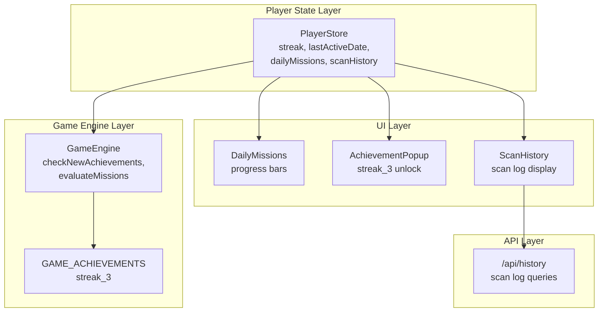
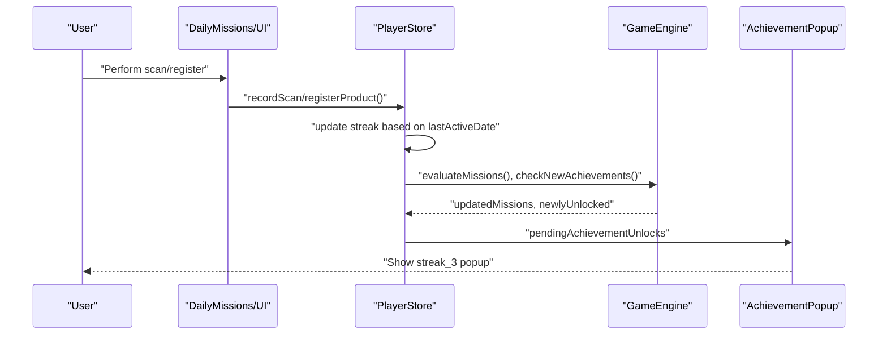
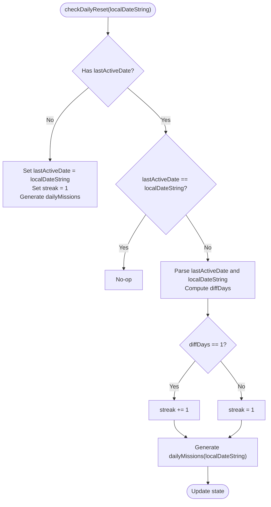
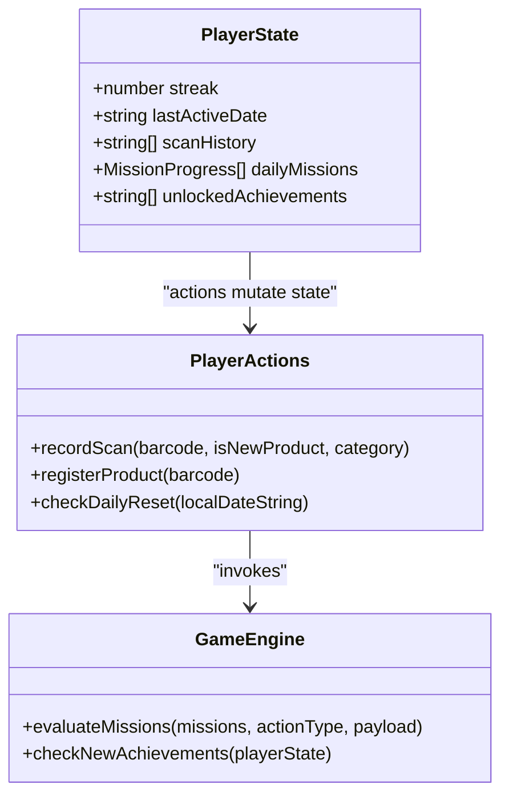
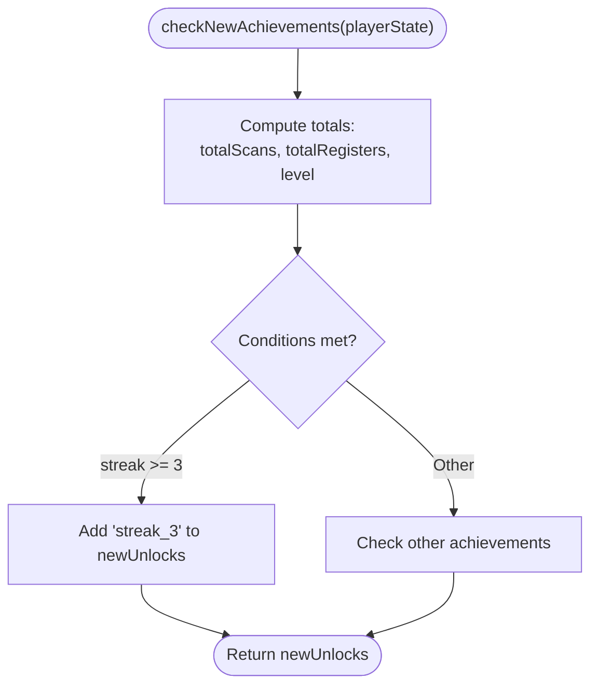
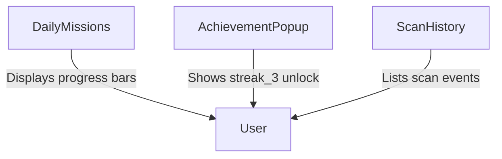
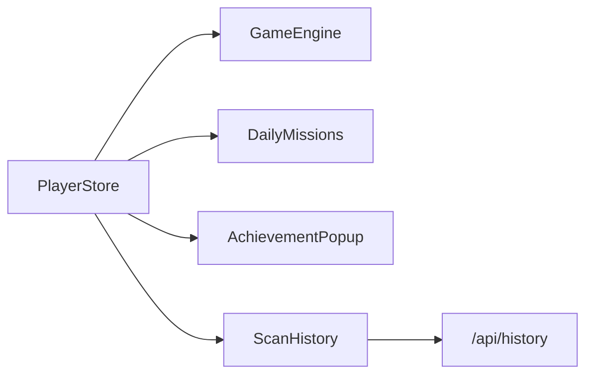

# Streak Tracking

<cite>
**Referenced Files in This Document**
- [player-store.ts](file://src/stores/player-store.ts)
- [game-engine.ts](file://src/lib/game-engine.ts)
- [game-config.ts](file://src/lib/game-config.ts)
- [scan-history.tsx](file://src/components/game/scan-history.tsx)
- [achievement-popup.tsx](file://src/components/game/achievement-popup.tsx)
- [daily-missions.tsx](file://src/components/game/daily-missions.tsx)
- [route.ts](file://src/app/api/history/route.ts)
- [index.ts](file://src/types/index.ts)
</cite>

## Table of Contents
1. [Introduction](#introduction)
2. [Project Structure](#project-structure)
3. [Core Components](#core-components)
4. [Architecture Overview](#architecture-overview)
5. [Detailed Component Analysis](#detailed-component-analysis)
6. [Dependency Analysis](#dependency-analysis)
7. [Performance Considerations](#performance-considerations)
8. [Troubleshooting Guide](#troubleshooting-guide)
9. [Conclusion](#conclusion)

## Introduction
This document explains the streak tracking system and daily activity monitoring in the Barcode Adventure game. It covers streak calculation algorithms, date-based continuity checks, streak reset conditions, streak types, integration with scan history and player state, and achievement triggers for streak milestones. It also documents UI representations of streak progress, edge cases like timezone handling, offline tracking, and streak recovery mechanisms.

## Project Structure
The streak tracking system spans several layers:
- Player state management: maintains streak, last active date, daily missions, and scan history
- Game engine: defines achievements and evaluates daily missions
- UI components: display streak progress, daily missions, and achievement unlocks
- API routes: support scan history queries and persistence

**Diagram sources**
- [player-store.ts:1-294](file://src/stores/player-store.ts#L1-L294)
- [game-engine.ts:1-241](file://src/lib/game-engine.ts#L1-L241)
- [daily-missions.tsx:1-94](file://src/components/game/daily-missions.tsx#L1-L94)
- [achievement-popup.tsx:1-97](file://src/components/game/achievement-popup.tsx#L1-L97)
- [scan-history.tsx:1-155](file://src/components/game/scan-history.tsx#L1-L155)
- [route.ts:1-68](file://src/app/api/history/route.ts#L1-L68)

**Section sources**
- [player-store.ts:1-294](file://src/stores/player-store.ts#L1-L294)
- [game-engine.ts:1-241](file://src/lib/game-engine.ts#L1-L241)
- [daily-missions.tsx:1-94](file://src/components/game/daily-missions.tsx#L1-L94)
- [achievement-popup.tsx:1-97](file://src/components/game/achievement-popup.tsx#L1-L97)
- [scan-history.tsx:1-155](file://src/components/game/scan-history.tsx#L1-L155)
- [route.ts:1-68](file://src/app/api/history/route.ts#L1-L68)

## Core Components
- PlayerStore: central state for streak, lastActiveDate, dailyMissions, and scanHistory; provides actions to record scans and manage daily resets
- GameEngine: defines achievements and evaluation logic for daily missions; includes streak_3 achievement trigger
- UI components: DailyMissions displays progress; AchievementPopup shows streak_3 unlock; ScanHistory lists scan events
- API route: /api/history supports querying scan logs for analytics and history views

Key responsibilities:
- Streak calculation: compare lastActiveDate with current local date to compute continuity
- Daily reset: generate new daily missions and update streak based on date difference
- Achievement triggers: checkNewAchievements includes streak_3 condition
- UI representation: progress bars and popups reflect streak and milestones

**Section sources**
- [player-store.ts:9-28](file://src/stores/player-store.ts#L9-L28)
- [player-store.ts:229-270](file://src/stores/player-store.ts#L229-L270)
- [game-engine.ts:47-53](file://src/lib/game-engine.ts#L47-L53)
- [game-engine.ts:206-240](file://src/lib/game-engine.ts#L206-L240)
- [daily-missions.tsx:7-94](file://src/components/game/daily-missions.tsx#L7-L94)
- [achievement-popup.tsx:22-97](file://src/components/game/achievement-popup.tsx#L22-L97)
- [route.ts:25-67](file://src/app/api/history/route.ts#L25-L67)

## Architecture Overview
The streak system integrates player actions, state updates, and UI feedback:

**Diagram sources**
- [player-store.ts:129-181](file://src/stores/player-store.ts#L129-L181)
- [player-store.ts:183-220](file://src/stores/player-store.ts#L183-L220)
- [game-engine.ts:169-200](file://src/lib/game-engine.ts#L169-L200)
- [game-engine.ts:206-240](file://src/lib/game-engine.ts#L206-L240)
- [achievement-popup.tsx:22-97](file://src/components/game/achievement-popup.tsx#L22-L97)

## Detailed Component Analysis

### Streak Calculation and Reset Logic
The streak is computed using the lastActiveDate stored in PlayerStore and the current local date string passed to checkDailyReset. The algorithm:
- If lastActiveDate is null, initialize streak to 1 and generate daily missions for the current date
- If lastActiveDate equals current date, skip reset
- Otherwise parse dates and compute difference in days
- If difference is exactly 1 day, increment streak
- If difference is greater than 1 day, reset streak to 1
- Generate new daily missions for the current date

Boundary conditions:
- Same-day continuity: streak increments
- Multi-day gap: streak resets to 1
- First-time initialization: streak starts at 1

**Diagram sources**
- [player-store.ts:229-270](file://src/stores/player-store.ts#L229-L270)

**Section sources**
- [player-store.ts:229-270](file://src/stores/player-store.ts#L229-L270)

### Streak Types and Tracking Mechanisms
- Daily scanning streak: tracked via streak counter and lastActiveDate; incremented when scanning occurs within 24 hours of the previous day
- Registration streak: not separately tracked; registration actions contribute to XP and achievements but do not directly affect streak

Integration points:
- PlayerStore.recordScan updates streak based on lastActiveDate
- PlayerStore.registerProduct does not modify streak directly
- Achievement trigger streak_3 depends on streak >= 3

**Section sources**
- [player-store.ts:129-181](file://src/stores/player-store.ts#L129-L181)
- [player-store.ts:183-220](file://src/stores/player-store.ts#L183-L220)
- [game-engine.ts:47-53](file://src/lib/game-engine.ts#L47-L53)
- [game-engine.ts:206-240](file://src/lib/game-engine.ts#L206-L240)

### Integration with Scan History and Player State
- PlayerStore maintains scanHistory as a full list; UI components slice to display recent entries
- recordScan appends to scanHistory and triggers mission evaluation and achievement checks
- checkDailyReset ensures daily missions and streak align with local date boundaries

**Diagram sources**
- [player-store.ts:9-28](file://src/stores/player-store.ts#L9-L28)
- [player-store.ts:32-43](file://src/stores/player-store.ts#L32-L43)
- [game-engine.ts:169-200](file://src/lib/game-engine.ts#L169-L200)
- [game-engine.ts:206-240](file://src/lib/game-engine.ts#L206-L240)

**Section sources**
- [player-store.ts:9-28](file://src/stores/player-store.ts#L9-L28)
- [player-store.ts:129-181](file://src/stores/player-store.ts#L129-L181)
- [player-store.ts:183-220](file://src/stores/player-store.ts#L183-L220)
- [player-store.ts:229-270](file://src/stores/player-store.ts#L229-L270)

### Achievement Triggers for Streak Milestones
The streak_3 achievement is triggered when streak >= 3. It is evaluated alongside other achievements during recordScan and registerProduct.

**Diagram sources**
- [game-engine.ts:206-240](file://src/lib/game-engine.ts#L206-L240)

**Section sources**
- [game-engine.ts:47-53](file://src/lib/game-engine.ts#L47-L53)
- [game-engine.ts:206-240](file://src/lib/game-engine.ts#L206-L240)

### UI Representation of Streak Progress
- DailyMissions displays current missions with progress bars and XP rewards; it reflects the daily reset mechanism
- AchievementPopup shows unlocked achievements including streak_3 with associated visuals
- ScanHistory lists scan events; it does not directly show streak but contributes to streak continuity

**Diagram sources**
- [daily-missions.tsx:7-94](file://src/components/game/daily-missions.tsx#L7-L94)
- [achievement-popup.tsx:22-97](file://src/components/game/achievement-popup.tsx#L22-L97)
- [scan-history.tsx:20-155](file://src/components/game/scan-history.tsx#L20-L155)

**Section sources**
- [daily-missions.tsx:7-94](file://src/components/game/daily-missions.tsx#L7-L94)
- [achievement-popup.tsx:22-97](file://src/components/game/achievement-popup.tsx#L22-L97)
- [scan-history.tsx:20-155](file://src/components/game/scan-history.tsx#L20-L155)

### Edge Cases and Recovery Mechanisms
- Timezone handling: dates are compared using local date strings (YYYY-MM-DD) derived from the client’s local time, ensuring streak resets align with the user’s local calendar
- Offline tracking: streak continuity relies on the lastActiveDate persisted in PlayerStore; if offline, the streak remains unchanged until the next online session triggers checkDailyReset
- Streak recovery: if a user misses a day, streak resets to 1 on the next checkDailyReset; they can rebuild streak by scanning on consecutive days

**Section sources**
- [player-store.ts:106](file://src/stores/player-store.ts#L106)
- [player-store.ts:229-270](file://src/stores/player-store.ts#L229-L270)

## Dependency Analysis
The streak system depends on:
- PlayerStore for state and actions
- GameEngine for mission evaluation and achievement checks
- UI components for displaying progress and unlocks
- API route for historical scan log queries

**Diagram sources**
- [player-store.ts:1-294](file://src/stores/player-store.ts#L1-L294)
- [game-engine.ts:1-241](file://src/lib/game-engine.ts#L1-L241)
- [daily-missions.tsx:1-94](file://src/components/game/daily-missions.tsx#L1-L94)
- [achievement-popup.tsx:1-97](file://src/components/game/achievement-popup.tsx#L1-L97)
- [scan-history.tsx:1-155](file://src/components/game/scan-history.tsx#L1-L155)
- [route.ts:1-68](file://src/app/api/history/route.ts#L1-L68)

**Section sources**
- [player-store.ts:1-294](file://src/stores/player-store.ts#L1-L294)
- [game-engine.ts:1-241](file://src/lib/game-engine.ts#L1-L241)
- [daily-missions.tsx:1-94](file://src/components/game/daily-missions.tsx#L1-L94)
- [achievement-popup.tsx:1-97](file://src/components/game/achievement-popup.tsx#L1-L97)
- [scan-history.tsx:1-155](file://src/components/game/scan-history.tsx#L1-L155)
- [route.ts:1-68](file://src/app/api/history/route.ts#L1-L68)

## Performance Considerations
- Streak computation is O(1) per checkDailyReset invocation
- Mission evaluation is O(n) where n is the number of daily missions
- Achievement checks are O(1) plus set membership checks for existing unlocks
- UI rendering of scan history scales with the number of unique scanned barcodes

## Troubleshooting Guide
Common issues and resolutions:
- Streak not incrementing: ensure checkDailyReset is invoked with the current local date string; verify lastActiveDate is present
- Streak resets unexpectedly: confirm that diffDays logic is based on local date strings; verify no date parsing errors
- Achievement not unlocking: verify streak meets threshold and unlockedAchievements does not already contain the id
- UI not reflecting streak: confirm DailyMissions and AchievementPopup are subscribed to PlayerStore state

**Section sources**
- [player-store.ts:229-270](file://src/stores/player-store.ts#L229-L270)
- [game-engine.ts:206-240](file://src/lib/game-engine.ts#L206-L240)
- [achievement-popup.tsx:22-97](file://src/components/game/achievement-popup.tsx#L22-L97)

## Conclusion
The streak tracking system uses a simple yet robust date-based continuity model aligned with the user’s local calendar. It integrates seamlessly with daily missions and achievements, providing clear UI feedback for streak milestones. The design accommodates offline scenarios and offers straightforward recovery paths for missed days.