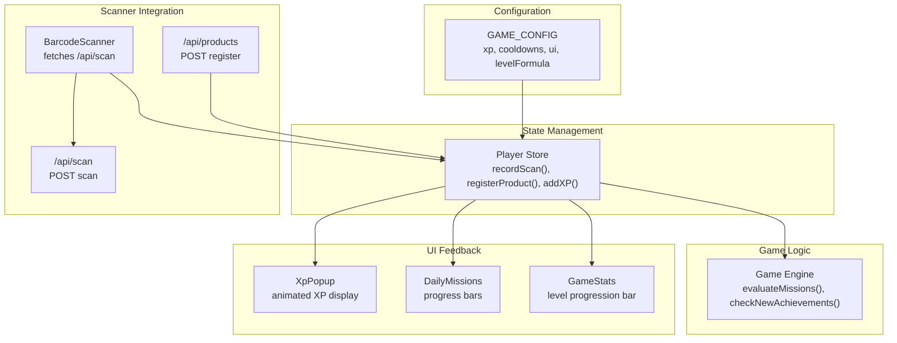
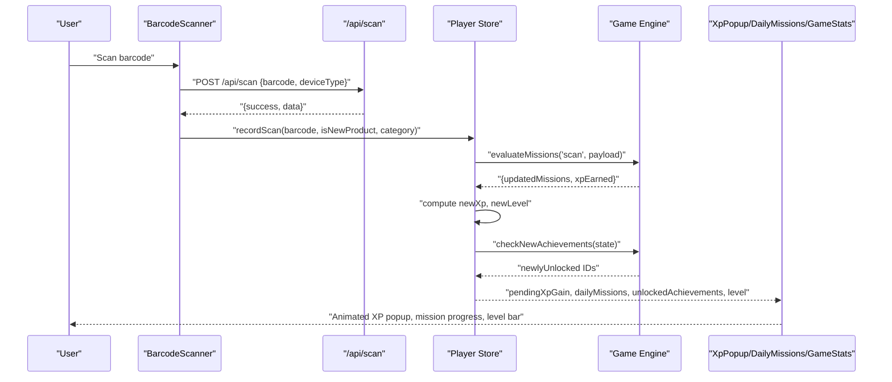
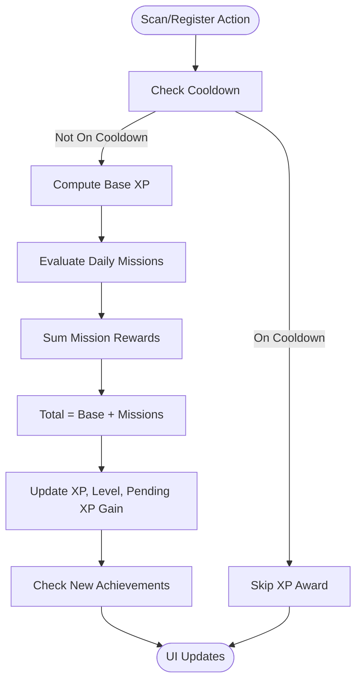
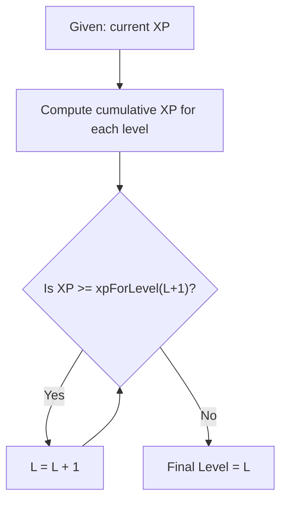
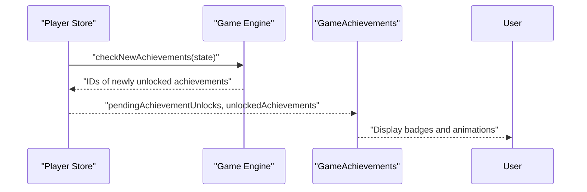
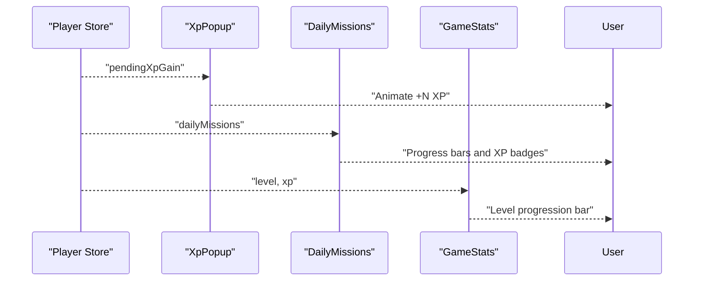
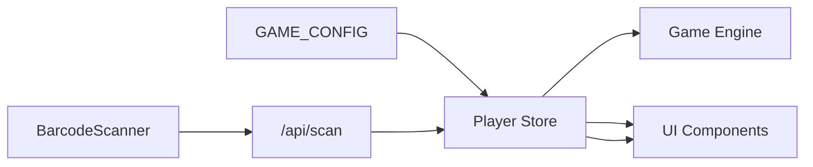

# XP System & Leveling

<cite>
**Referenced Files in This Document**
- [game-config.ts](file://src/lib/game-config.ts)
- [player-store.ts](file://src/stores/player-store.ts)
- [game-engine.ts](file://src/lib/game-engine.ts)
- [xp-popup.tsx](file://src/components/game/xp-popup.tsx)
- [daily-missions.tsx](file://src/components/game/daily-missions.tsx)
- [game-stats.tsx](file://src/components/game/game-stats.tsx)
- [barcode-scanner.tsx](file://src/components/scanner/barcode-scanner.tsx)
- [route.ts](file://src/app/api/scan/route.ts)
- [route.ts](file://src/app/api/products/route.ts)
- [index.ts](file://src/types/index.ts)
</cite>

## Table of Contents
1. [Introduction](#introduction)
2. [Project Structure](#project-structure)
3. [Core Components](#core-components)
4. [Architecture Overview](#architecture-overview)
5. [Detailed Component Analysis](#detailed-component-analysis)
6. [Dependency Analysis](#dependency-analysis)
7. [Performance Considerations](#performance-considerations)
8. [Troubleshooting Guide](#troubleshooting-guide)
9. [Conclusion](#conclusion)

## Introduction
This document explains the XP calculation and leveling system in the application. It covers how XP is awarded for scanning and registering products, how daily missions contribute additional XP, and how levels are calculated using a configurable progression formula. It also documents the user feedback mechanisms for XP gains and level-ups, and provides guidance on balancing challenge and progression.

## Project Structure
The XP and leveling system spans several layers:
- Configuration defines base XP values, cooldowns, UI timing, and the level progression formula.
- The player store manages state, applies XP awards, checks achievements, and computes levels.
- Game engine handles daily mission evaluation and achievement unlocks.
- UI components render XP popups, daily missions progress, and level progression visuals.
- Scanner triggers XP events and coordinates with the backend to record scans.



**Diagram sources**
- [game-config.ts:6-27](file://src/lib/game-config.ts#L6-L27)
- [player-store.ts:129-220](file://src/stores/player-store.ts#L129-L220)
- [game-engine.ts:169-200](file://src/lib/game-engine.ts#L169-L200)
- [xp-popup.tsx:8-26](file://src/components/game/xp-popup.tsx#L8-L26)
- [daily-missions.tsx:7-94](file://src/components/game/daily-missions.tsx#L7-L94)
- [game-stats.tsx:13-212](file://src/components/game/game-stats.tsx#L13-L212)
- [barcode-scanner.tsx:46-85](file://src/components/scanner/barcode-scanner.tsx#L46-L85)
- [route.ts:7-59](file://src/app/api/scan/route.ts#L7-L59)
- [route.ts:69-118](file://src/app/api/products/route.ts#L69-L118)

**Section sources**
- [game-config.ts:6-27](file://src/lib/game-config.ts#L6-L27)
- [player-store.ts:129-220](file://src/stores/player-store.ts#L129-L220)
- [game-engine.ts:169-200](file://src/lib/game-engine.ts#L169-L200)
- [xp-popup.tsx:8-26](file://src/components/game/xp-popup.tsx#L8-L26)
- [daily-missions.tsx:7-94](file://src/components/game/daily-missions.tsx#L7-L94)
- [game-stats.tsx:13-212](file://src/components/game/game-stats.tsx#L13-L212)
- [barcode-scanner.tsx:46-85](file://src/components/scanner/barcode-scanner.tsx#L46-L85)
- [route.ts:7-59](file://src/app/api/scan/route.ts#L7-L59)
- [route.ts:69-118](file://src/app/api/products/route.ts#L69-L118)

## Core Components
- GAME_CONFIG: Centralizes XP award values, cooldowns, UI timing, and the level progression formula.
- Player Store: Implements XP award logic, level computation, daily mission evaluation, achievement checks, and state persistence.
- Game Engine: Provides mission templates, daily mission generation, mission evaluation, and achievement unlock checks.
- UI Components: Render XP popups, daily missions progress, and level progression visuals.

Key responsibilities:
- XP award mechanics for scanning (existing vs. new product) and product registration.
- Daily missions that add bonus XP upon completion.
- Level progression computed from cumulative XP using a configurable formula.
- Real-time user feedback via animated XP popup and progress indicators.

**Section sources**
- [game-config.ts:6-27](file://src/lib/game-config.ts#L6-L27)
- [player-store.ts:129-220](file://src/stores/player-store.ts#L129-L220)
- [game-engine.ts:169-200](file://src/lib/game-engine.ts#L169-L200)
- [xp-popup.tsx:8-26](file://src/components/game/xp-popup.tsx#L8-L26)
- [daily-missions.tsx:7-94](file://src/components/game/daily-missions.tsx#L7-L94)
- [game-stats.tsx:13-212](file://src/components/game/game-stats.tsx#L13-L212)

## Architecture Overview
The XP system follows a reactive architecture:
- Scanner triggers a scan event, which calls the backend to record the scan and then invokes the player store to award XP.
- The player store computes new XP, checks for level-ups, evaluates daily missions, and checks for new achievements.
- UI components subscribe to the store to display XP popups, mission progress, and level progression.



**Diagram sources**
- [barcode-scanner.tsx:46-85](file://src/components/scanner/barcode-scanner.tsx#L46-L85)
- [route.ts:7-59](file://src/app/api/scan/route.ts#L7-L59)
- [player-store.ts:129-181](file://src/stores/player-store.ts#L129-L181)
- [game-engine.ts:169-200](file://src/lib/game-engine.ts#L169-L200)
- [xp-popup.tsx:8-26](file://src/components/game/xp-popup.tsx#L8-L26)
- [daily-missions.tsx:7-94](file://src/components/game/daily-missions.tsx#L7-L94)
- [game-stats.tsx:13-212](file://src/components/game/game-stats.tsx#L13-L212)

## Detailed Component Analysis

### XP Award Mechanisms
- Scanning:
  - Existing product: base XP is defined in configuration.
  - New product: higher base XP is defined in configuration.
  - Cooldown prevents repeated XP for the same barcode within a configured window.
- Registering a product: base XP is defined in configuration.
- Daily missions: completing mission templates grants additional XP rewards.



**Diagram sources**
- [player-store.ts:129-181](file://src/stores/player-store.ts#L129-L181)
- [player-store.ts:183-220](file://src/stores/player-store.ts#L183-L220)
- [game-engine.ts:169-200](file://src/lib/game-engine.ts#L169-L200)

**Section sources**
- [game-config.ts:7-16](file://src/lib/game-config.ts#L7-L16)
- [player-store.ts:129-181](file://src/stores/player-store.ts#L129-L181)
- [player-store.ts:183-220](file://src/stores/player-store.ts#L183-L220)
- [game-engine.ts:169-200](file://src/lib/game-engine.ts#L169-L200)

### Bonus Multipliers and Daily Missions
- Daily missions are generated deterministically from a date seed and include:
  - General scanning targets.
  - Registration targets.
  - Category-specific scanning goals.
  - Time-based scanning opportunities.
- Completing a mission yields XP rewards that are added to the base XP.

```mermaid
classDiagram
class MissionTemplate {
+string id
+string title
+string description
+number target
+number xpReward
+evaluator(actionType, payload) boolean
}
class MissionProgress {
+string id
+string title
+string description
+number target
+number current
+number xpReward
+boolean completed
}
class GameEngine {
+generateDailyMissions(dateStr) MissionProgress[]
+evaluateMissions(missions, actionType, payload) {updatedMissions, xpEarned}
+checkNewAchievements(playerState) string[]
}
GameEngine --> MissionTemplate : "uses"
GameEngine --> MissionProgress : "produces"
```

**Diagram sources**
- [game-engine.ts:55-131](file://src/lib/game-engine.ts#L55-L131)
- [game-engine.ts:137-200](file://src/lib/game-engine.ts#L137-L200)
- [index.ts:92-107](file://src/types/index.ts#L92-L107)

**Section sources**
- [game-engine.ts:55-131](file://src/lib/game-engine.ts#L55-L131)
- [game-engine.ts:137-200](file://src/lib/game-engine.ts#L137-L200)
- [index.ts:92-107](file://src/types/index.ts#L92-L107)

### Leveling System and Progression Curves
- Level progression uses a configurable formula that determines how much XP is required to advance from level L to L+1.
- Cumulative XP required to reach level N is computed by summing the per-level XP requirements.
- Level is derived from current XP by iterating until cumulative XP exceeds threshold.



**Diagram sources**
- [player-store.ts:49-68](file://src/stores/player-store.ts#L49-L68)
- [game-config.ts:23-25](file://src/lib/game-config.ts#L23-L25)

**Section sources**
- [player-store.ts:49-68](file://src/stores/player-store.ts#L49-L68)
- [game-config.ts:23-25](file://src/lib/game-config.ts#L23-L25)

### Reward Distribution and Achievement System
- Achievements are unlocked based on:
  - First scan, reaching milestones in scans, first registration, registration milestones, level thresholds, and streaks.
- Newly unlocked achievements are tracked and displayed in the achievements UI.



**Diagram sources**
- [player-store.ts:162-168](file://src/stores/player-store.ts#L162-L168)
- [game-engine.ts:206-240](file://src/lib/game-engine.ts#L206-L240)
- [game-stats.tsx:13-212](file://src/components/game/game-stats.tsx#L13-L212)

**Section sources**
- [game-engine.ts:206-240](file://src/lib/game-engine.ts#L206-L240)
- [game-stats.tsx:13-212](file://src/components/game/game-stats.tsx#L13-L212)

### User Feedback Mechanisms
- Animated XP Popup: Displays the XP gained after a scan or registration for a configured duration.
- Daily Missions UI: Shows progress bars and XP rewards for each mission.
- Level Progression Bar: Visual indicator of current XP toward the next level.



**Diagram sources**
- [player-store.ts:174](file://src/stores/player-store.ts#L174)
- [xp-popup.tsx:8-26](file://src/components/game/xp-popup.tsx#L8-L26)
- [daily-missions.tsx:7-94](file://src/components/game/daily-missions.tsx#L7-L94)
- [game-stats.tsx:175-207](file://src/components/game/game-stats.tsx#L175-L207)

**Section sources**
- [xp-popup.tsx:8-26](file://src/components/game/xp-popup.tsx#L8-L26)
- [daily-missions.tsx:7-94](file://src/components/game/daily-missions.tsx#L7-L94)
- [game-stats.tsx:175-207](file://src/components/game/game-stats.tsx#L175-L207)

## Dependency Analysis
The XP system exhibits low coupling and high cohesion:
- Configuration centralizes constants and formulas.
- Player store encapsulates state transitions and computations.
- Game engine encapsulates mission and achievement logic.
- UI components depend on store subscriptions for rendering.



**Diagram sources**
- [game-config.ts:6-27](file://src/lib/game-config.ts#L6-L27)
- [player-store.ts:129-220](file://src/stores/player-store.ts#L129-L220)
- [game-engine.ts:169-200](file://src/lib/game-engine.ts#L169-L200)
- [barcode-scanner.tsx:46-85](file://src/components/scanner/barcode-scanner.tsx#L46-L85)
- [route.ts:7-59](file://src/app/api/scan/route.ts#L7-L59)

**Section sources**
- [game-config.ts:6-27](file://src/lib/game-config.ts#L6-L27)
- [player-store.ts:129-220](file://src/stores/player-store.ts#L129-L220)
- [game-engine.ts:169-200](file://src/lib/game-engine.ts#L169-L200)
- [barcode-scanner.tsx:46-85](file://src/components/scanner/barcode-scanner.tsx#L46-L85)
- [route.ts:7-59](file://src/app/api/scan/route.ts#L7-L59)

## Performance Considerations
- Real-time XP updates:
  - Use minimal re-renders by updating only affected store slices (XP, level, pending XP gain).
  - Debounce or batch UI updates for rapid successive scans to prevent excessive animations.
- Cooldown enforcement:
  - Prevents spam and reduces unnecessary computations.
- Mission evaluation:
  - Keep mission templates small and evaluators efficient; avoid heavy computations in evaluators.
- UI animations:
  - Configure durations and easing to balance responsiveness and perceived performance.
- Persistence:
  - Store persists state to reduce reload costs; ensure migrations remain lightweight.

[No sources needed since this section provides general guidance]

## Troubleshooting Guide
Common issues and resolutions:
- XP not increasing after scans:
  - Verify cooldown is not active for the scanned barcode.
  - Confirm the scanner calls the player store’s recordScan with correct parameters.
- Missions not progressing:
  - Ensure mission evaluator conditions match action payload (e.g., category casing).
  - Check that daily missions are regenerated for the current date.
- Level not advancing:
  - Confirm cumulative XP calculation aligns with the configured level formula.
  - Verify the level derivation logic does not exceed safety caps.
- UI delays:
  - Adjust XP popup duration and ensure timers are cleared on unmount.
  - Confirm pending XP gain is cleared after the configured duration.

**Section sources**
- [player-store.ts:133-144](file://src/stores/player-store.ts#L133-L144)
- [game-engine.ts:169-200](file://src/lib/game-engine.ts#L169-L200)
- [player-store.ts:49-68](file://src/stores/player-store.ts#L49-L68)
- [xp-popup.tsx:15-26](file://src/components/game/xp-popup.tsx#L15-L26)

## Conclusion
The XP and leveling system is modular, configurable, and user-centric. Base XP values, cooldowns, and the level formula are centralized for easy tuning. Daily missions and achievements provide varied progression paths, while UI feedback ensures immediate recognition of accomplishments. The architecture supports real-time updates with performance-conscious design choices.