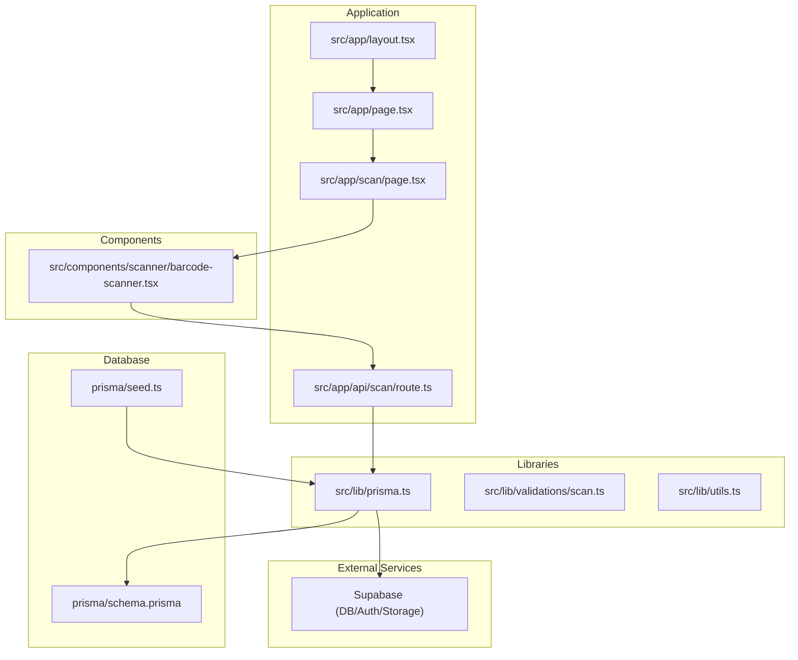
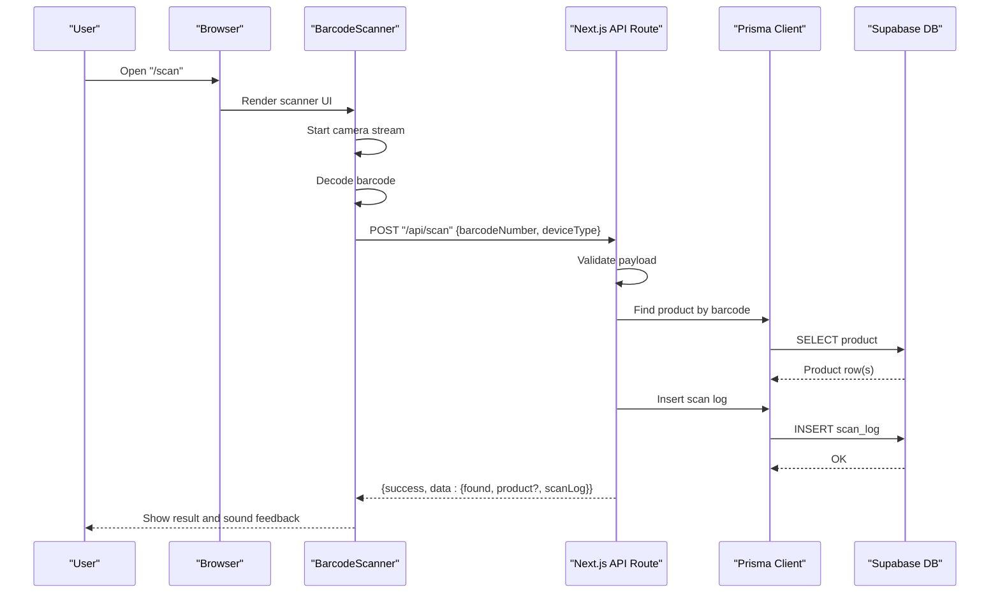
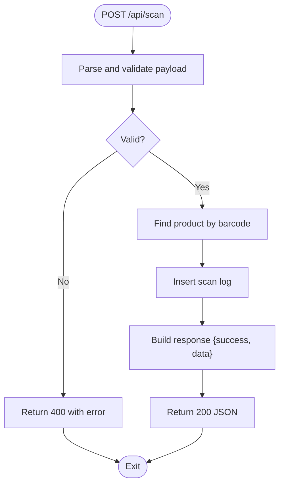
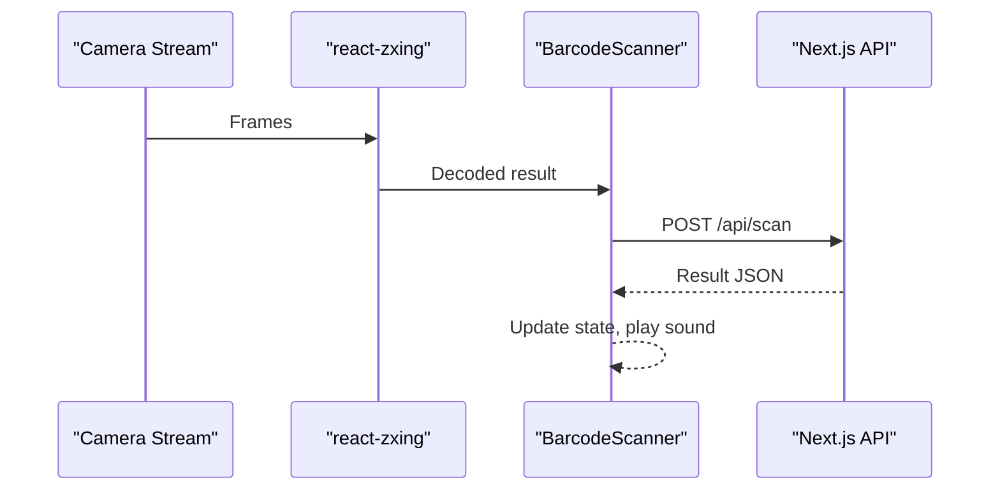
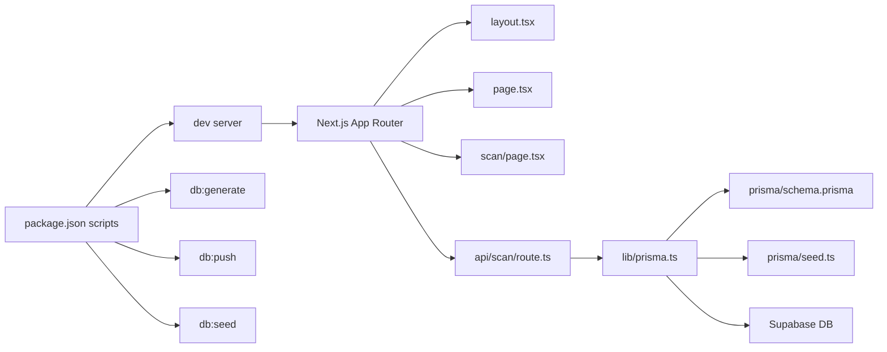
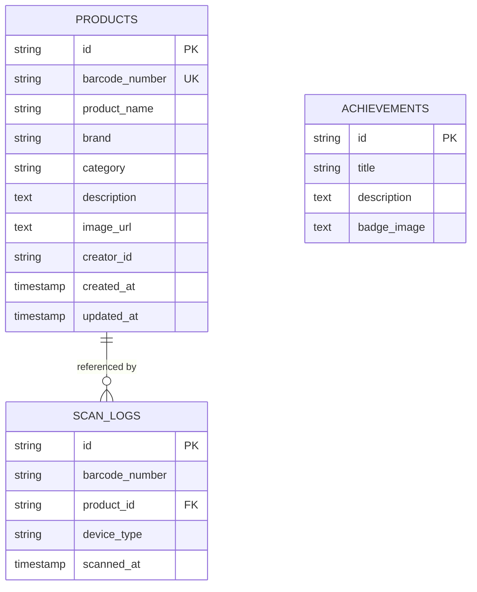

# Getting Started

<cite>
**Referenced Files in This Document**
- [README.md](file://README.md)
- [SETUP.md](file://SETUP.md)
- [package.json](file://package.json)
- [next.config.ts](file://next.config.ts)
- [prisma/schema.prisma](file://prisma/schema.prisma)
- [src/lib/prisma.ts](file://src/lib/prisma.ts)
- [src/app/layout.tsx](file://src/app/layout.tsx)
- [src/app/page.tsx](file://src/app/page.tsx)
- [src/app/scan/page.tsx](file://src/app/scan/page.tsx)
- [src/components/scanner/barcode-scanner.tsx](file://src/components/scanner/barcode-scanner.tsx)
- [src/app/api/scan/route.ts](file://src/app/api/scan/route.ts)
- [src/lib/validations/scan.ts](file://src/lib/validations/scan.ts)
- [src/lib/utils.ts](file://src/lib/utils.ts)
- [prisma/seed.ts](file://prisma/seed.ts)
</cite>

## Table of Contents
1. [Introduction](#introduction)
2. [Project Structure](#project-structure)
3. [Core Components](#core-components)
4. [Architecture Overview](#architecture-overview)
5. [Detailed Component Analysis](#detailed-component-analysis)
6. [Dependency Analysis](#dependency-analysis)
7. [Performance Considerations](#performance-considerations)
8. [Troubleshooting Guide](#troubleshooting-guide)
9. [Conclusion](#conclusion)
10. [Appendices](#appendices)

## Introduction
This guide helps you install, configure, and run the Barcode Adventure project locally. You will set up Node.js, configure a Supabase backend (including database, authentication, and storage), initialize the database schema with Prisma, seed sample data, and start the Next.js development server. It also covers first-time user scenarios to explore the landing page, navigate to the scanner interface, and perform your first barcode scan.

## Project Structure
The project follows a modern Next.js 15 App Router structure with TypeScript, Prisma ORM, and Supabase for database, authentication, and storage. Key areas:
- Application pages and API routes under src/app
- Shared UI components under src/components
- Prisma schema and seed logic under prisma
- Supabase integration and database client under src/lib
- Global styles and metadata under src/app/layout.tsx

**Diagram sources**
- [src/app/layout.tsx:1-48](file://src/app/layout.tsx#L1-L48)
- [src/app/page.tsx:1-231](file://src/app/page.tsx#L1-L231)
- [src/app/scan/page.tsx:1-33](file://src/app/scan/page.tsx#L1-L33)
- [src/components/scanner/barcode-scanner.tsx:1-217](file://src/components/scanner/barcode-scanner.tsx#L1-L217)
- [src/app/api/scan/route.ts:1-60](file://src/app/api/scan/route.ts#L1-L60)
- [src/lib/prisma.ts:1-33](file://src/lib/prisma.ts#L1-L33)
- [prisma/schema.prisma:1-47](file://prisma/schema.prisma#L1-L47)
- [prisma/seed.ts:1-98](file://prisma/seed.ts#L1-L98)

**Section sources**
- [README.md:1-37](file://README.md#L1-L37)
- [SETUP.md:1-152](file://SETUP.md#L1-L152)
- [package.json:1-60](file://package.json#L1-L60)
- [next.config.ts:1-16](file://next.config.ts#L1-L16)

## Core Components
- Supabase backend: Provides PostgreSQL-compatible database, authentication, and storage. Environment variables for Supabase keys and database connection are required.
- Prisma ORM: Used to define models, connect to the database, and seed initial data.
- Next.js App Router: Pages and API routes implement the frontend UI and backend endpoints.
- Scanner component: Integrates camera capture and barcode decoding to submit scans to the backend.

Key configuration points:
- Environment variables for Supabase and database connection
- Prisma client initialization with a Postgres adapter
- Next.js image remote pattern for Supabase storage

**Section sources**
- [SETUP.md:3-6](file://SETUP.md#L3-L6)
- [src/lib/prisma.ts:1-33](file://src/lib/prisma.ts#L1-L33)
- [next.config.ts:1-16](file://next.config.ts#L1-L16)
- [prisma/schema.prisma:1-47](file://prisma/schema.prisma#L1-L47)

## Architecture Overview
The application is a single-page app with serverless-like API routes. The scanner component captures video frames, decodes barcodes, and posts to a Next.js API route. The API route validates input, queries the database via Prisma, logs the scan, and returns the result.

**Diagram sources**
- [src/app/scan/page.tsx:1-33](file://src/app/scan/page.tsx#L1-L33)
- [src/components/scanner/barcode-scanner.tsx:1-217](file://src/components/scanner/barcode-scanner.tsx#L1-L217)
- [src/app/api/scan/route.ts:1-60](file://src/app/api/scan/route.ts#L1-L60)
- [src/lib/prisma.ts:1-33](file://src/lib/prisma.ts#L1-L33)
- [prisma/schema.prisma:1-47](file://prisma/schema.prisma#L1-L47)

## Detailed Component Analysis

### Prerequisites
- Node.js 18+ is required to run the project locally.
- A Supabase account is required for database, authentication, and storage.
- PostgreSQL-compatible database is provided by Supabase.

Verification steps:
- Confirm Node.js version meets the requirement.
- Confirm you can access Supabase dashboard and have a project ready.

**Section sources**
- [SETUP.md:3-6](file://SETUP.md#L3-L6)

### Environment Variables and Supabase Setup
Set the following environment variables in a local .env.local file at the project root:
- NEXT_PUBLIC_SUPABASE_URL
- NEXT_PUBLIC_SUPABASE_ANON_KEY
- DATABASE_URL (must use Supabase Transaction Pooler port 6543)

Steps:
1. Create a Supabase project and note the project URL and database password.
2. Retrieve Supabase keys from Settings → API.
3. From Settings → Database → Connection String, copy the URI and set DATABASE_URL.
4. Create a storage bucket named product-images and configure policies for public read and authenticated upload.
5. Save the variables to .env.local.

Verification:
- Confirm DATABASE_URL uses port 6543.
- Confirm the bucket exists and policies are applied.

**Section sources**
- [SETUP.md:9-51](file://SETUP.md#L9-L51)
- [SETUP.md:53-63](file://SETUP.md#L53-L63)

### Database Initialization with Prisma
Run the following commands in the project directory:
- Generate Prisma client
- Push schema to Supabase (creates tables)
- Seed with sample data (optional)

Commands:
- npm run db:generate
- npm run db:push
- npm run db:seed

Expected outcomes:
- Prisma client is generated.
- Database tables are created according to prisma/schema.prisma.
- Sample achievements and products are inserted.

Notes:
- The Prisma client uses a Postgres adapter and connects via DATABASE_URL.
- During build, a stub client is returned if DATABASE_URL is not configured.

**Section sources**
- [SETUP.md:66-80](file://SETUP.md#L66-L80)
- [src/lib/prisma.ts:1-33](file://src/lib/prisma.ts#L1-L33)
- [prisma/schema.prisma:1-47](file://prisma/schema.prisma#L1-L47)
- [prisma/seed.ts:1-98](file://prisma/seed.ts#L1-L98)

### Development Server Startup
Start the development server using any of the supported package managers:
- npm run dev
- yarn dev
- pnpm dev
- bun dev

Open http://localhost:3000 in your browser.

Verification:
- The landing page renders with animated hero content and navigation.
- The scanner page is reachable at /scan.

**Section sources**
- [README.md:5-17](file://README.md#L5-L17)
- [SETUP.md:92-98](file://SETUP.md#L92-L98)

### First-Time User Scenarios
- Access the landing page at /
- Navigate to the scanner at /scan
- Perform your first scan:
  - Allow camera permissions when prompted.
  - Point the camera at a barcode (e.g., one of the seeded sample barcodes).
  - Observe the loading state while the app looks up the barcode.
  - Receive success or error feedback and sound cues.

URLs for navigation:
- Landing Page: /
- Barcode Scanner: /scan

**Section sources**
- [SETUP.md:100-109](file://SETUP.md#L100-L109)
- [src/app/page.tsx:1-231](file://src/app/page.tsx#L1-L231)
- [src/app/scan/page.tsx:1-33](file://src/app/scan/page.tsx#L1-L33)
- [src/components/scanner/barcode-scanner.tsx:1-217](file://src/components/scanner/barcode-scanner.tsx#L1-L217)

### API Workflow: Scan Endpoint
The /api/scan endpoint handles barcode scans:
- Validates input using Zod schema.
- Looks up the product by barcode.
- Creates a scan log entry.
- Returns structured data indicating whether the product was found and related details.

**Diagram sources**
- [src/app/api/scan/route.ts:1-60](file://src/app/api/scan/route.ts#L1-L60)
- [src/lib/validations/scan.ts:1-12](file://src/lib/validations/scan.ts#L1-L12)

**Section sources**
- [src/app/api/scan/route.ts:1-60](file://src/app/api/scan/route.ts#L1-L60)
- [src/lib/validations/scan.ts:1-12](file://src/lib/validations/scan.ts#L1-L12)

### Scanner Component Behavior
The scanner integrates camera capture and barcode decoding:
- Uses react-zxing to decode barcodes from the video stream.
- Submits decoded barcode numbers to /api/scan.
- Handles loading states, errors, and provides feedback.
- Supports camera switching and device detection.

**Diagram sources**
- [src/components/scanner/barcode-scanner.tsx:1-217](file://src/components/scanner/barcode-scanner.tsx#L1-L217)
- [src/app/api/scan/route.ts:1-60](file://src/app/api/scan/route.ts#L1-L60)

**Section sources**
- [src/components/scanner/barcode-scanner.tsx:1-217](file://src/components/scanner/barcode-scanner.tsx#L1-L217)
- [src/lib/utils.ts:28-34](file://src/lib/utils.ts#L28-L34)

## Dependency Analysis
The project relies on Next.js 15, TypeScript, Tailwind CSS v4, Shadcn UI, Supabase, Prisma ORM v7, and ZXing for barcode scanning. Package scripts automate Prisma operations and development.

**Diagram sources**
- [package.json:1-60](file://package.json#L1-L60)
- [src/app/layout.tsx:1-48](file://src/app/layout.tsx#L1-L48)
- [src/app/page.tsx:1-231](file://src/app/page.tsx#L1-L231)
- [src/app/scan/page.tsx:1-33](file://src/app/scan/page.tsx#L1-L33)
- [src/app/api/scan/route.ts:1-60](file://src/app/api/scan/route.ts#L1-L60)
- [src/lib/prisma.ts:1-33](file://src/lib/prisma.ts#L1-L33)
- [prisma/schema.prisma:1-47](file://prisma/schema.prisma#L1-L47)
- [prisma/seed.ts:1-98](file://prisma/seed.ts#L1-L98)

**Section sources**
- [package.json:1-60](file://package.json#L1-L60)
- [src/lib/prisma.ts:1-33](file://src/lib/prisma.ts#L1-L33)
- [prisma/schema.prisma:1-47](file://prisma/schema.prisma#L1-L47)

## Performance Considerations
- The scanner limits supported barcode formats and adjusts decoding attempts for responsiveness.
- Device type detection helps categorize scans for analytics.
- Image optimization is configured for Supabase storage to reduce bandwidth.

Recommendations:
- Use HTTPS or localhost for camera access.
- Keep the scanner focused on the barcode area to improve decoding speed.
- Seed the database with sample data to test flows quickly.

[No sources needed since this section provides general guidance]

## Troubleshooting Guide
Common issues and resolutions:
- Camera not working
  - Use HTTPS or localhost; grant camera permissions; on iOS use Safari.
- Supabase connection error
  - Ensure DATABASE_URL uses Transaction Pooler port 6543; verify IP is not blocked.
- Admin login fails
  - Confirm the user exists in Supabase Auth and email is confirmed.
- Images not uploading
  - Verify product-images bucket is public and storage policies allow uploads.

Additional checks:
- Confirm Prisma client generation and schema push succeeded.
- Ensure environment variables are present in .env.local.
- Validate Next.js image remote pattern allows Supabase storage URLs.

**Section sources**
- [SETUP.md:134-152](file://SETUP.md#L134-L152)
- [src/lib/prisma.ts:1-33](file://src/lib/prisma.ts#L1-L33)
- [next.config.ts:1-16](file://next.config.ts#L1-L16)

## Conclusion
You now have the prerequisites, environment variables, and database initialized to run the Barcode Adventure project locally. Start the development server, explore the landing page and scanner, and perform your first scan. Use the troubleshooting section if you encounter issues, and refer to the appendices for command references.

[No sources needed since this section summarizes without analyzing specific files]

## Appendices

### Appendix A: Commands and Expected Outcomes
- npm run db:generate
  - Generates Prisma client code based on schema.
- npm run db:push
  - Creates database tables per prisma/schema.prisma.
- npm run db:seed
  - Seeds achievements and sample products.
- npm run dev
  - Starts the Next.js development server on localhost:3000.

**Section sources**
- [SETUP.md:66-98](file://SETUP.md#L66-L98)
- [package.json:5-16](file://package.json#L5-L16)

### Appendix B: Data Model Overview
The database includes three primary tables:
- products: Stores product information linked to barcodes.
- scan_logs: Tracks each scan event with device type and timestamps.
- achievements: Defines achievement criteria for gamification.

**Diagram sources**
- [prisma/schema.prisma:9-47](file://prisma/schema.prisma#L9-L47)