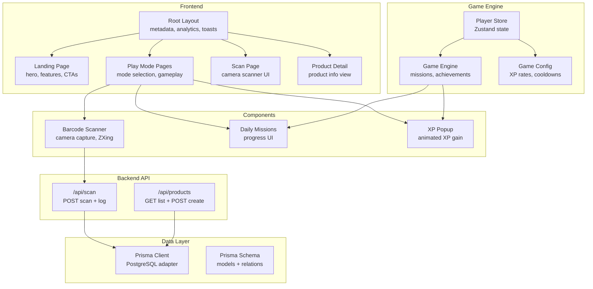
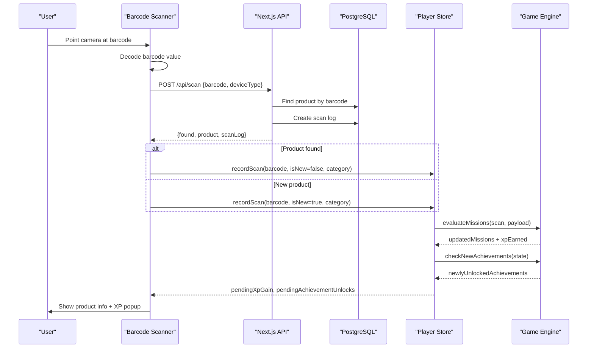
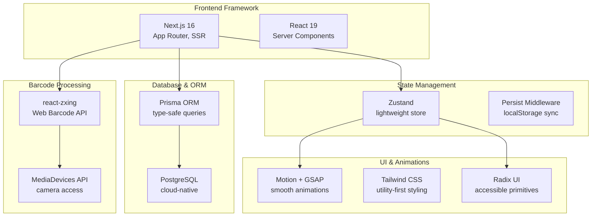
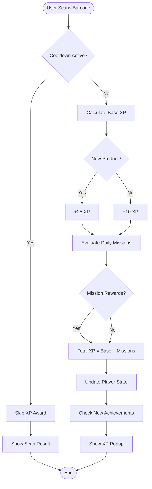
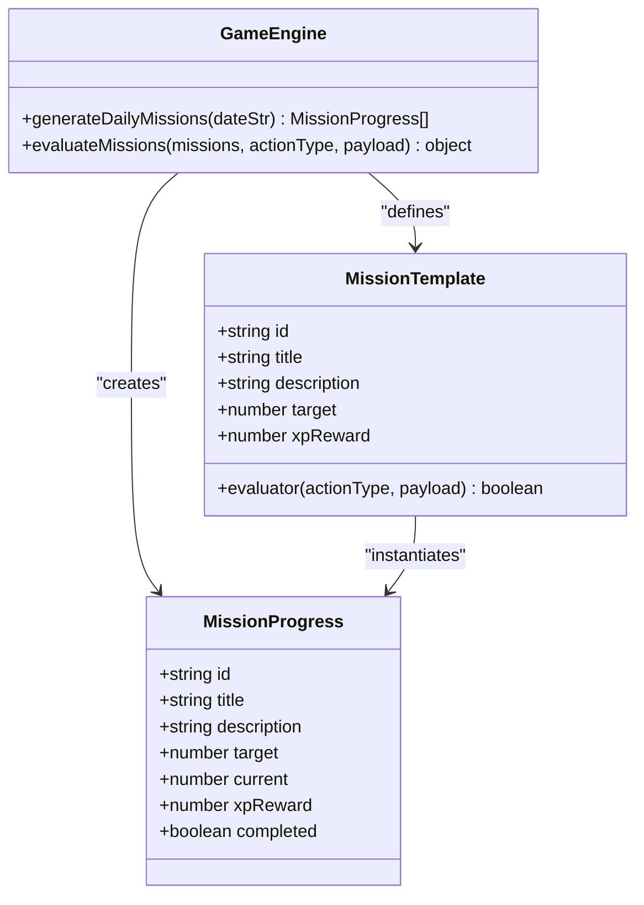
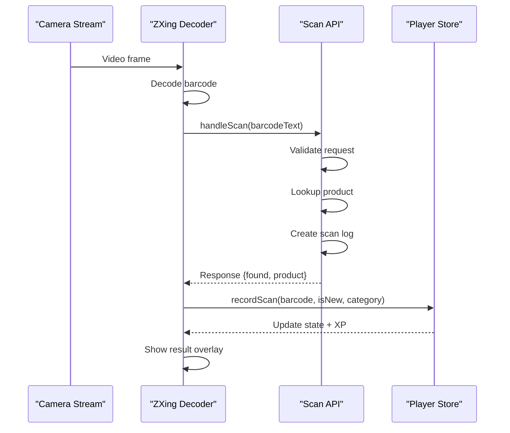
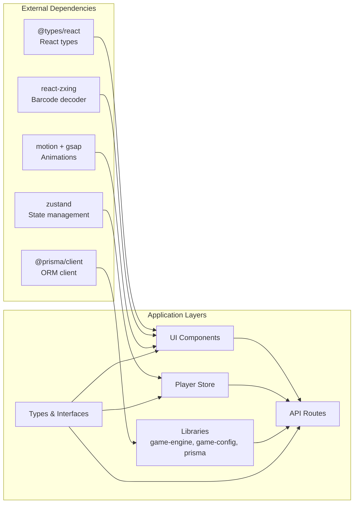

# Project Overview

<cite>
**Referenced Files in This Document**
- [README.md](file://README.md)
- [package.json](file://package.json)
- [src/app/layout.tsx](file://src/app/layout.tsx)
- [src/app/page.tsx](file://src/app/page.tsx)
- [src/lib/game-engine.ts](file://src/lib/game-engine.ts)
- [src/lib/game-config.ts](file://src/lib/game-config.ts)
- [src/stores/player-store.ts](file://src/stores/player-store.ts)
- [src/components/scanner/barcode-scanner.tsx](file://src/components/scanner/barcode-scanner.tsx)
- [src/components/game/daily-missions.tsx](file://src/components/game/daily-missions.tsx)
- [src/components/game/xp-popup.tsx](file://src/components/game/xp-popup.tsx)
- [src/app/api/scan/route.ts](file://src/app/api/scan/route.ts)
- [src/app/api/products/route.ts](file://src/app/api/products/route.ts)
- [prisma/schema.prisma](file://prisma/schema.prisma)
- [src/lib/prisma.ts](file://src/lib/prisma.ts)
- [src/types/index.ts](file://src/types/index.ts)
</cite>

## Table of Contents
1. [Introduction](#introduction)
2. [Project Structure](#project-structure)
3. [Core Components](#core-components)
4. [Architecture Overview](#architecture-overview)
5. [Detailed Component Analysis](#detailed-component-analysis)
6. [Dependency Analysis](#dependency-analysis)
7. [Performance Considerations](#performance-considerations)
8. [Troubleshooting Guide](#troubleshooting-guide)
9. [Conclusion](#conclusion)

## Introduction
Barcode Adventure is a gamified barcode scanning application built with Next.js 16 that turns everyday product scanning into an engaging adventure. Users can scan barcodes to discover product information, unlock achievements, earn experience points (XP), level up, and complete daily missions. The platform combines real-time barcode detection with RPG-style mechanics to create a fun, reward-driven experience for discovering and collecting product knowledge.

Key goals:
- Transform mundane barcode scanning into an entertaining journey
- Provide immediate feedback with XP popups and visual rewards
- Encourage continued engagement through daily missions and achievements
- Support both guest and themed modes for varied gameplay

## Project Structure
The project follows a modern Next.js 16 App Router architecture with a clear separation of concerns:
- Frontend pages and layouts under src/app
- Reusable UI components under src/components
- Game logic and state management under src/lib and src/stores
- API routes under src/app/api
- Database schema and Prisma client under prisma
- Shared types under src/types

**Diagram sources**
- [src/app/layout.tsx:1-48](file://src/app/layout.tsx#L1-L48)
- [src/app/page.tsx:1-231](file://src/app/page.tsx#L1-L231)
- [src/components/scanner/barcode-scanner.tsx:1-217](file://src/components/scanner/barcode-scanner.tsx#L1-L217)
- [src/components/game/daily-missions.tsx:1-95](file://src/components/game/daily-missions.tsx#L1-L95)
- [src/components/game/xp-popup.tsx:1-51](file://src/components/game/xp-popup.tsx#L1-L51)
- [src/stores/player-store.ts:1-294](file://src/stores/player-store.ts#L1-L294)
- [src/lib/game-engine.ts:1-241](file://src/lib/game-engine.ts#L1-L241)
- [src/lib/game-config.ts:1-28](file://src/lib/game-config.ts#L1-L28)
- [src/app/api/scan/route.ts:1-60](file://src/app/api/scan/route.ts#L1-L60)
- [src/app/api/products/route.ts:1-119](file://src/app/api/products/route.ts#L1-L119)
- [src/lib/prisma.ts:1-33](file://src/lib/prisma.ts#L1-L33)
- [prisma/schema.prisma:1-47](file://prisma/schema.prisma#L1-L47)

**Section sources**
- [README.md:1-37](file://README.md#L1-L37)
- [package.json:1-60](file://package.json#L1-L60)
- [src/app/layout.tsx:1-48](file://src/app/layout.tsx#L1-L48)
- [src/app/page.tsx:1-231](file://src/app/page.tsx#L1-L231)

## Core Components
The application consists of several interconnected systems that work together to deliver the gamified scanning experience:

### Gamification Engine
The game engine defines achievements, daily missions, and scoring mechanics:
- Achievements: Unlockable milestones like "First Contact", "Barcodian Hunter", and "Factory Owner"
- Daily Missions: Rotating challenges with XP rewards (e.g., scan 5 barcodes, register 3 products)
- Scoring System: Base XP for scans plus mission bonuses, with level progression

### Player State Management
The Zustand-powered player store manages all game state:
- Player profile: nickname, avatar, creator ID
- Progression: XP, level, streak tracking
- Gameplay: scan history, daily missions, unlocked achievements
- Cooldowns: Prevent rapid re-scan of same barcode

### Real-time Scanner
The barcode scanner integrates camera capture with instant product lookup:
- Camera access with device enumeration
- Multi-format barcode support (EAN, UPC, Code 128, etc.)
- Instant API lookup and result presentation
- Audio feedback and visual overlays

### Database Layer
Prisma ORM provides type-safe database access:
- PostgreSQL adapter with connection pooling
- Product, ScanLog, and Achievement models
- Automatic migrations and schema validation

**Section sources**
- [src/lib/game-engine.ts:1-241](file://src/lib/game-engine.ts#L1-L241)
- [src/lib/game-config.ts:1-28](file://src/lib/game-config.ts#L1-L28)
- [src/stores/player-store.ts:1-294](file://src/stores/player-store.ts#L1-L294)
- [src/components/scanner/barcode-scanner.tsx:1-217](file://src/components/scanner/barcode-scanner.tsx#L1-L217)
- [prisma/schema.prisma:1-47](file://prisma/schema.prisma#L1-L47)
- [src/lib/prisma.ts:1-33](file://src/lib/prisma.ts#L1-L33)

## Architecture Overview
The system follows a clean separation between frontend, backend, and data layers, with the gamification engine orchestrating user interactions:

**Diagram sources**
- [src/components/scanner/barcode-scanner.tsx:46-85](file://src/components/scanner/barcode-scanner.tsx#L46-L85)
- [src/app/api/scan/route.ts:7-59](file://src/app/api/scan/route.ts#L7-L59)
- [src/stores/player-store.ts:129-181](file://src/stores/player-store.ts#L129-L181)
- [src/lib/game-engine.ts:169-200](file://src/lib/game-engine.ts#L169-L200)

The architecture emphasizes:
- Real-time responsiveness with camera capture and instant lookups
- Persistent state management with localStorage persistence
- Deterministic daily mission generation based on date seeds
- Type-safe database operations with Prisma

**Section sources**
- [src/app/api/scan/route.ts:1-60](file://src/app/api/scan/route.ts#L1-L60)
- [src/stores/player-store.ts:1-294](file://src/stores/player-store.ts#L1-L294)
- [src/lib/game-engine.ts:137-163](file://src/lib/game-engine.ts#L137-L163)

## Detailed Component Analysis

### Technology Stack Overview
The application leverages modern web technologies for a smooth, responsive experience:

**Diagram sources**
- [package.json:20-46](file://package.json#L20-L46)
- [src/lib/prisma.ts:1-33](file://src/lib/prisma.ts#L1-L33)
- [src/components/scanner/barcode-scanner.tsx:1-217](file://src/components/scanner/barcode-scanner.tsx#L1-L217)

Key technologies and their roles:
- Next.js 16: Application framework with App Router for routing and data fetching
- TypeScript: Type safety across frontend, backend, and database layers
- Prisma ORM: Type-safe database access with PostgreSQL adapter
- Zustand: Lightweight state management with persistence for player progress
- react-zxing: Browser-based barcode decoding using modern Web APIs
- Motion/GSAP: Smooth animations for XP popups and UI feedback
- Tailwind CSS: Utility-first styling for rapid UI development

### Gamification Mechanics
The gamification system creates meaningful engagement through multiple reward loops:

**Diagram sources**
- [src/stores/player-store.ts:129-181](file://src/stores/player-store.ts#L129-L181)
- [src/lib/game-engine.ts:169-200](file://src/lib/game-engine.ts#L169-L200)
- [src/lib/game-config.ts:6-27](file://src/lib/game-config.ts#L6-L27)

The system ensures balanced progression:
- Cooldown prevents spamming identical scans
- Base XP rewards encourage exploration of new products
- Daily missions provide variety and replayability
- Achievement system offers long-term goals

**Section sources**
- [src/lib/game-engine.ts:1-241](file://src/lib/game-engine.ts#L1-L241)
- [src/lib/game-config.ts:1-28](file://src/lib/game-config.ts#L1-L28)
- [src/stores/player-store.ts:1-294](file://src/stores/player-store.ts#L1-L294)

### Daily Missions System
Daily missions provide fresh challenges each calendar day:

**Diagram sources**
- [src/lib/game-engine.ts:55-131](file://src/lib/game-engine.ts#L55-L131)
- [src/lib/game-engine.ts:137-163](file://src/lib/game-engine.ts#L137-L163)
- [src/lib/game-engine.ts:169-200](file://src/lib/game-engine.ts#L169-L200)

The deterministic mission generation ensures fairness and predictability:
- Date-based seed guarantees same missions per calendar day
- Hash-based selection ensures variety across days
- Evaluator functions validate mission completion criteria

**Section sources**
- [src/lib/game-engine.ts:55-131](file://src/lib/game-engine.ts#L55-L131)
- [src/lib/game-engine.ts:137-163](file://src/lib/game-engine.ts#L137-L163)

### Scanner Component Architecture
The scanner integrates hardware access with application logic:

**Diagram sources**
- [src/components/scanner/barcode-scanner.tsx:46-85](file://src/components/scanner/barcode-scanner.tsx#L46-L85)
- [src/app/api/scan/route.ts:7-59](file://src/app/api/scan/route.ts#L7-L59)
- [src/stores/player-store.ts:129-181](file://src/stores/player-store.ts#L129-L181)

The scanner prioritizes user experience:
- Environment-facing camera for mobile scanning
- Optimized barcode formats for retail products
- Immediate feedback with sound and visual cues
- Error handling for camera permissions and network issues

**Section sources**
- [src/components/scanner/barcode-scanner.tsx:1-217](file://src/components/scanner/barcode-scanner.tsx#L1-L217)
- [src/app/api/scan/route.ts:1-60](file://src/app/api/scan/route.ts#L1-L60)

## Dependency Analysis
The application maintains clean dependency boundaries with minimal coupling between layers:

**Diagram sources**
- [package.json:20-46](file://package.json#L20-L46)
- [src/types/index.ts:1-109](file://src/types/index.ts#L1-L109)
- [src/lib/game-engine.ts:1-241](file://src/lib/game-engine.ts#L1-L241)
- [src/lib/game-config.ts:1-28](file://src/lib/game-config.ts#L1-L28)
- [src/lib/prisma.ts:1-33](file://src/lib/prisma.ts#L1-L33)

Key dependency characteristics:
- Loose coupling through well-defined interfaces and types
- Clear separation between UI components and business logic
- Minimal external dependencies for focused functionality
- Type-safe database operations preventing runtime errors

**Section sources**
- [package.json:1-60](file://package.json#L1-L60)
- [src/types/index.ts:1-109](file://src/types/index.ts#L1-L109)

## Performance Considerations
The application is optimized for responsive interactions and efficient resource usage:

- Camera performance: react-zxing with optimized constraints and format filtering
- State updates: selective re-renders through Zustand selectors
- Database queries: indexed lookups and paginated product listings
- Animation efficiency: GSAP for GPU-accelerated transitions
- Memory management: localStorage persistence with migration support

## Troubleshooting Guide
Common issues and solutions:

### Camera Access Problems
- Enable camera permissions in browser settings
- Use environment-facing camera for mobile devices
- Handle PermissionDeniedError gracefully with user guidance

### Network/API Issues
- Verify API endpoints are reachable
- Check database connectivity and Prisma client initialization
- Monitor rate limits and cooldown periods

### State Synchronization
- Ensure localStorage persistence is enabled
- Handle migration scenarios for state schema changes
- Debug mission reset timing across timezones

**Section sources**
- [src/components/scanner/barcode-scanner.tsx:114-120](file://src/components/scanner/barcode-scanner.tsx#L114-L120)
- [src/lib/prisma.ts:8-21](file://src/lib/prisma.ts#L8-L21)
- [src/stores/player-store.ts:284-293](file://src/stores/player-store.ts#L284-L293)

## Conclusion
Barcode Adventure successfully transforms routine barcode scanning into an engaging, gamified experience. By combining real-time camera capture with RPG-style progression mechanics, the application encourages continued engagement through meaningful rewards and social features. The clean architecture, type-safe database operations, and responsive UI create a solid foundation for future enhancements while maintaining excellent user experience across devices.

The modular design allows for easy extension of new achievements, missions, and gameplay features, while the robust state management and database layer provide reliable persistence and synchronization. This foundation supports both casual users seeking entertainment and power users interested in building extensive product collections.