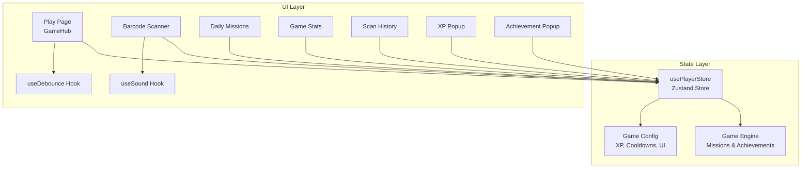
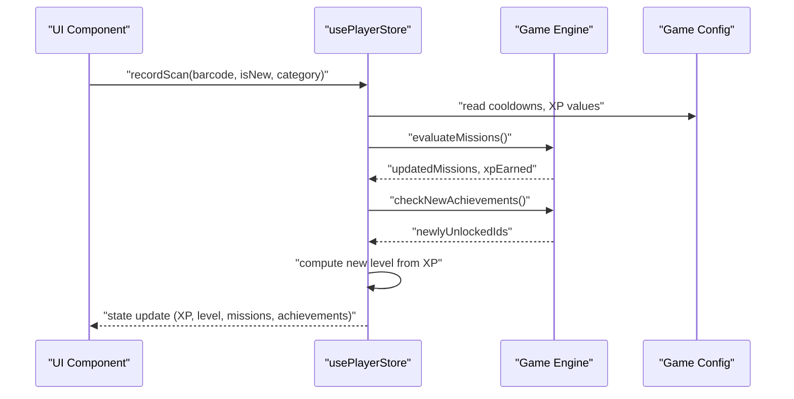
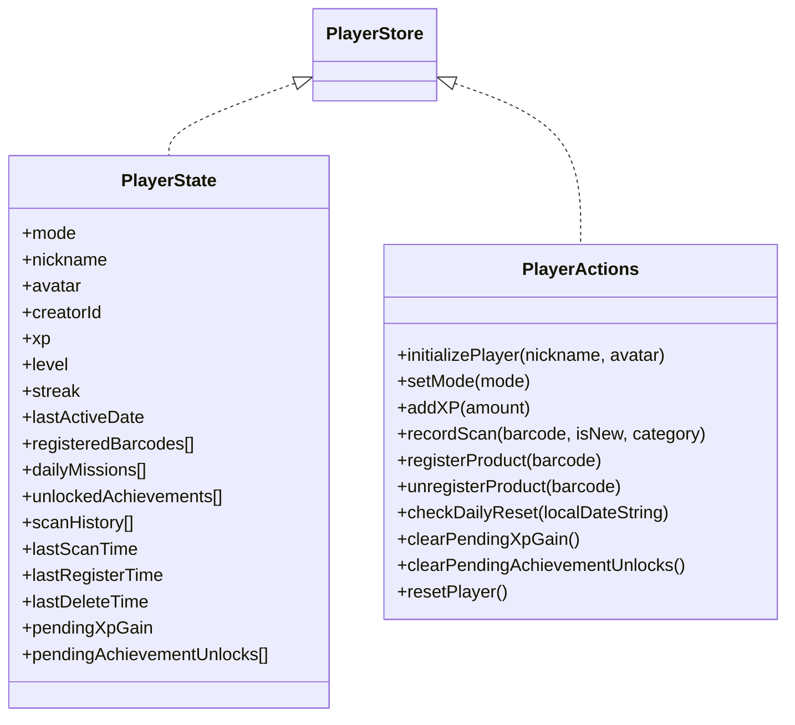
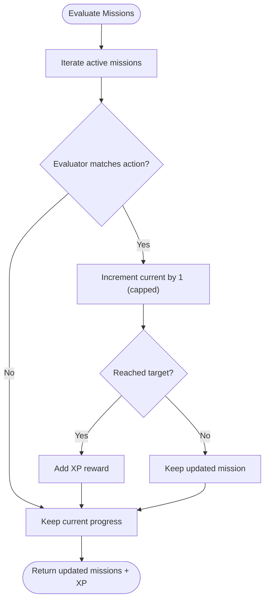
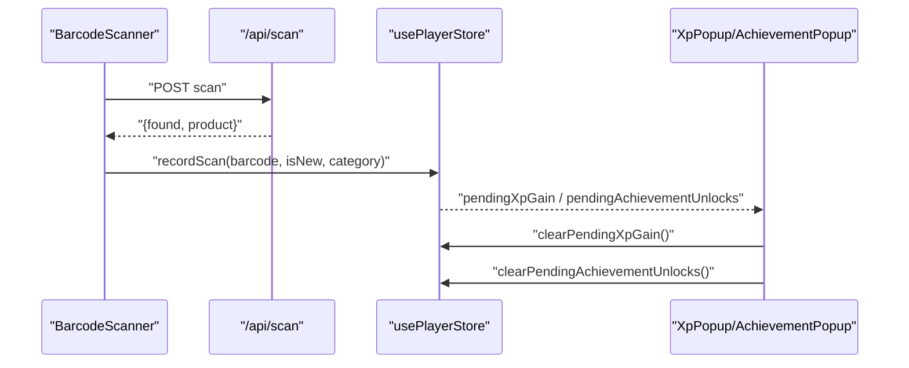
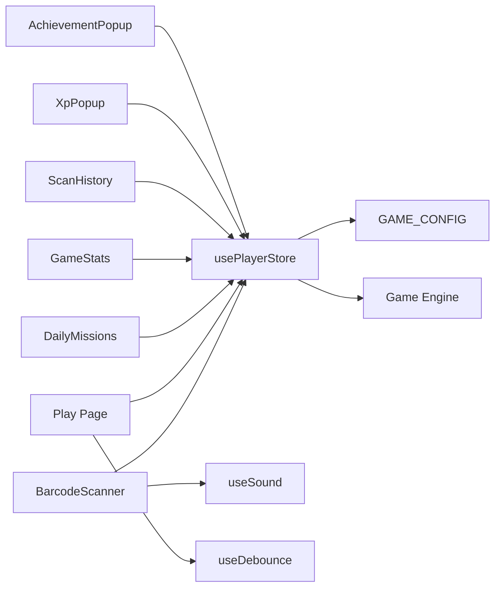

# State Management

<cite>
**Referenced Files in This Document**
- [player-store.ts](file://src/stores/player-store.ts)
- [game-engine.ts](file://src/lib/game-engine.ts)
- [game-config.ts](file://src/lib/game-config.ts)
- [index.ts](file://src/types/index.ts)
- [use-debounce.ts](file://src/hooks/use-debounce.ts)
- [use-sound.ts](file://src/hooks/use-sound.ts)
- [xp-popup.tsx](file://src/components/game/xp-popup.tsx)
- [achievement-popup.tsx](file://src/components/game/achievement-popup.tsx)
- [daily-missions.tsx](file://src/components/game/daily-missions.tsx)
- [game-stats.tsx](file://src/components/game/game-stats.tsx)
- [scan-history.tsx](file://src/components/game/scan-history.tsx)
- [product-list.tsx](file://src/components/game/product-list.tsx)
- [barcode-scanner.tsx](file://src/components/scanner/barcode-scanner.tsx)
- [page.tsx](file://src/app/play/page.tsx)
- [utils.ts](file://src/lib/utils.ts)
</cite>

## Table of Contents
1. [Introduction](#introduction)
2. [Project Structure](#project-structure)
3. [Core Components](#core-components)
4. [Architecture Overview](#architecture-overview)
5. [Detailed Component Analysis](#detailed-component-analysis)
6. [Dependency Analysis](#dependency-analysis)
7. [Performance Considerations](#performance-considerations)
8. [Troubleshooting Guide](#troubleshooting-guide)
9. [Conclusion](#conclusion)

## Introduction
This document explains the state management architecture in Barcode Adventure, focusing on the Zustand store, action dispatching patterns, persistence, and integration with the game engine. It covers player state (XP, level, streak, achievements), daily missions, and UI feedback mechanisms. It also documents custom hooks for sound and debounced operations, state synchronization across components, performance optimizations, memory management, migration/versioning strategies, and debugging approaches for complex state interactions.

## Project Structure
The state management system centers around a single Zustand store that encapsulates player state and actions. Supporting libraries define game mechanics (missions, achievements, XP formulas), while React components subscribe to the store to render UI and trigger actions. Utility hooks provide cross-cutting concerns like debouncing and sound playback.

**Diagram sources**
- [player-store.ts:100-293](file://src/stores/player-store.ts#L100-L293)
- [game-engine.ts:137-240](file://src/lib/game-engine.ts#L137-L240)
- [game-config.ts:6-27](file://src/lib/game-config.ts#L6-L27)
- [page.tsx:41-135](file://src/app/play/page.tsx#L41-L135)
- [barcode-scanner.tsx:20-85](file://src/components/scanner/barcode-scanner.tsx#L20-L85)
- [daily-missions.tsx:7-94](file://src/components/game/daily-missions.tsx#L7-L94)
- [game-stats.tsx:13-63](file://src/components/game/game-stats.tsx#L13-L63)
- [scan-history.tsx:20-51](file://src/components/game/scan-history.tsx#L20-L51)
- [xp-popup.tsx:8-26](file://src/components/game/xp-popup.tsx#L8-L26)
- [achievement-popup.tsx:22-46](file://src/components/game/achievement-popup.tsx#L22-L46)
- [use-sound.ts:7-90](file://src/hooks/use-sound.ts#L7-L90)
- [use-debounce.ts:3-12](file://src/hooks/use-debounce.ts#L3-L12)

**Section sources**
- [player-store.ts:100-293](file://src/stores/player-store.ts#L100-L293)
- [page.tsx:41-135](file://src/app/play/page.tsx#L41-L135)

## Core Components
- Zustand Store: Defines the player state shape, actions, helpers, initial state, and persistence configuration. It integrates the game engine for mission evaluation and achievement checks.
- Game Engine: Provides mission templates, daily mission generation, mission evaluation, and achievement unlock checks.
- Game Config: Centralizes XP values, cooldowns, UI durations, and level formula.
- UI Components: Subscribe to the store and trigger actions on user interactions (e.g., scanning, registering products).
- Custom Hooks: Provide reusable behaviors (sound playback and debounced values).

Key responsibilities:
- Player state: mode, nickname, avatar, XP, level, streak, daily missions, achievements, scan history, and timestamps.
- Actions: initialize, set mode, add XP, record scan, register/unregister product, daily reset, clear pending notifications, and reset.
- Persistence: Local storage-backed via Zustand’s persist middleware with versioning and migration hook.

**Section sources**
- [player-store.ts:9-45](file://src/stores/player-store.ts#L9-L45)
- [player-store.ts:78-96](file://src/stores/player-store.ts#L78-L96)
- [player-store.ts:100-293](file://src/stores/player-store.ts#L100-L293)
- [game-engine.ts:3-53](file://src/lib/game-engine.ts#L3-L53)
- [game-engine.ts:137-240](file://src/lib/game-engine.ts#L137-L240)
- [game-config.ts:6-27](file://src/lib/game-config.ts#L6-L27)

## Architecture Overview
The store acts as the single source of truth for player state. Components subscribe to specific slices of state and call actions to update it. The store persists state to local storage and exposes helpers to compute derived values (XP to level, daily missions).

**Diagram sources**
- [player-store.ts:129-181](file://src/stores/player-store.ts#L129-L181)
- [game-engine.ts:169-200](file://src/lib/game-engine.ts#L169-L200)
- [game-engine.ts:206-240](file://src/lib/game-engine.ts#L206-L240)
- [game-config.ts:6-27](file://src/lib/game-config.ts#L6-L27)

## Detailed Component Analysis

### Zustand Store: Player State and Actions
- State shape: Includes mode, identity, XP/level/streak, daily missions, achievements, scan history, per-barcode timestamps, and pending UI triggers.
- Actions:
  - Initialization: Sets mode, creator ID, streak, last active date, and generates daily missions for the current date.
  - Mode management: Switches game modes.
  - XP management: Adds XP and recomputes level; sets pending XP for UI.
  - Scanning: Enforces cooldowns, evaluates missions, computes XP, checks achievements, updates history and timestamps.
  - Registration: Updates registered barcodes, evaluates missions, XP, achievements.
  - Unregistration: Removes a product from registered list and updates deletion timestamp.
  - Daily reset: Recompute streak and regenerate missions based on local date.
  - Clear pending UI triggers.
  - Reset: Restore initial state.
- Persistence: Uses localStorage with version 1 and a migration hook reserved for future schema changes.

**Diagram sources**
- [player-store.ts:9-45](file://src/stores/player-store.ts#L9-L45)
- [player-store.ts:100-293](file://src/stores/player-store.ts#L100-L293)

**Section sources**
- [player-store.ts:9-45](file://src/stores/player-store.ts#L9-L45)
- [player-store.ts:78-96](file://src/stores/player-store.ts#L78-L96)
- [player-store.ts:100-293](file://src/stores/player-store.ts#L100-L293)

### Game Engine: Missions and Achievements
- Daily missions:
  - Templates define targets and evaluators (by action type and payload).
  - Deterministic daily missions generated from a date seed.
  - Evaluation increments progress and awards XP for completions.
- Achievements:
  - Unlock conditions based on scan counts, registrations, level, and streak.
  - Returns newly unlocked IDs for UI consumption.

**Diagram sources**
- [game-engine.ts:169-200](file://src/lib/game-engine.ts#L169-L200)

**Section sources**
- [game-engine.ts:3-53](file://src/lib/game-engine.ts#L3-L53)
- [game-engine.ts:137-240](file://src/lib/game-engine.ts#L137-L240)

### Game Configuration: XP, Cooldowns, and UI
- XP values for scans (existing/new) and product registration.
- Cooldowns for scanning and managing products.
- UI durations for popups and animations.
- Level XP formula used to derive level from cumulative XP.

**Section sources**
- [game-config.ts:6-27](file://src/lib/game-config.ts#L6-L27)

### UI Subscriptions and Action Dispatching
- Play page orchestrates mode transitions, session checks, and modal flows. It subscribes to mode, nickname, XP, level, streak, and registers actions for product registration/unregistration and daily reset.
- Scanner component handles barcode decoding, network requests, and invokes store actions to record scans. It also triggers sounds and manages loading states.
- XP popup and achievement popup subscribe to pending notifications and clear them after timeouts or user actions.
- Daily missions, game stats, and scan history components subscribe to relevant slices for rendering and filtering.

**Diagram sources**
- [barcode-scanner.tsx:46-85](file://src/components/scanner/barcode-scanner.tsx#L46-L85)
- [player-store.ts:129-181](file://src/stores/player-store.ts#L129-L181)
- [xp-popup.tsx:15-26](file://src/components/game/xp-popup.tsx#L15-L26)
- [achievement-popup.tsx:29-46](file://src/components/game/achievement-popup.tsx#L29-L46)

**Section sources**
- [page.tsx:41-135](file://src/app/play/page.tsx#L41-L135)
- [barcode-scanner.tsx:20-85](file://src/components/scanner/barcode-scanner.tsx#L20-L85)
- [xp-popup.tsx:8-26](file://src/components/game/xp-popup.tsx#L8-L26)
- [achievement-popup.tsx:22-46](file://src/components/game/achievement-popup.tsx#L22-L46)

### XP Tracking, Level Progression, and Achievements
- XP accumulation from scans and registrations, with cooldown enforcement for repeated scans.
- Level computed from cumulative XP using a configurable formula.
- Achievements unlocked based on thresholds for scans, registrations, level, and streak.
- Pending notifications drive transient UI feedback (XP popup and achievement popup).

**Section sources**
- [player-store.ts:123-127](file://src/stores/player-store.ts#L123-L127)
- [player-store.ts:146-179](file://src/stores/player-store.ts#L146-L179)
- [game-engine.ts:206-240](file://src/lib/game-engine.ts#L206-L240)
- [xp-popup.tsx:8-26](file://src/components/game/xp-popup.tsx#L8-L26)
- [achievement-popup.tsx:22-46](file://src/components/game/achievement-popup.tsx#L22-L46)

### State Synchronization Across Components
- Components subscribe to narrow slices of state to minimize re-renders.
- Derived computations (e.g., unique scan count, mission progress percentages) occur in components to keep the store lean.
- Pending flags decouple state updates from UI presentation, ensuring timely feedback and cleanup.

**Section sources**
- [game-stats.tsx:13-63](file://src/components/game/game-stats.tsx#L13-L63)
- [scan-history.tsx:20-51](file://src/components/game/scan-history.tsx#L20-L51)
- [daily-missions.tsx:7-94](file://src/components/game/daily-missions.tsx#L7-L94)

### Custom Hooks: Sound and Debounced Operations
- useSound: Manages preloaded audio assets and Web Audio API oscillators to play short tones and sound effects. Provides a unified interface for playing different sound types.
- useDebounce: Returns a debounced value after a delay, useful for search inputs and similar UI interactions.

**Section sources**
- [use-sound.ts:7-90](file://src/hooks/use-sound.ts#L7-L90)
- [use-debounce.ts:3-12](file://src/hooks/use-debounce.ts#L3-L12)

### Integration with the Game Engine
- Mission evaluation and achievement checks are invoked during state updates to keep derived state consistent.
- Daily missions are regenerated based on local date to maintain timezone-aware resets.

**Section sources**
- [player-store.ts:150-168](file://src/stores/player-store.ts#L150-L168)
- [player-store.ts:200-207](file://src/stores/player-store.ts#L200-L207)
- [player-store.ts:229-270](file://src/stores/player-store.ts#L229-L270)

## Dependency Analysis
- Store depends on:
  - Game config for XP values, cooldowns, and level formula.
  - Game engine for mission evaluation and achievement checks.
- UI components depend on the store for state and actions.
- Hooks provide reusable behaviors consumed by UI components.

**Diagram sources**
- [player-store.ts:100-293](file://src/stores/player-store.ts#L100-L293)
- [game-config.ts:6-27](file://src/lib/game-config.ts#L6-L27)
- [game-engine.ts:137-240](file://src/lib/game-engine.ts#L137-L240)
- [barcode-scanner.tsx:20-85](file://src/components/scanner/barcode-scanner.tsx#L20-L85)
- [page.tsx:41-135](file://src/app/play/page.tsx#L41-L135)
- [daily-missions.tsx:7-94](file://src/components/game/daily-missions.tsx#L7-L94)
- [game-stats.tsx:13-63](file://src/components/game/game-stats.tsx#L13-L63)
- [scan-history.tsx:20-51](file://src/components/game/scan-history.tsx#L20-L51)
- [xp-popup.tsx:8-26](file://src/components/game/xp-popup.tsx#L8-L26)
- [achievement-popup.tsx:22-46](file://src/components/game/achievement-popup.tsx#L22-L46)
- [use-sound.ts:7-90](file://src/hooks/use-sound.ts#L7-L90)
- [use-debounce.ts:3-12](file://src/hooks/use-debounce.ts#L3-L12)

**Section sources**
- [player-store.ts:100-293](file://src/stores/player-store.ts#L100-L293)
- [game-engine.ts:137-240](file://src/lib/game-engine.ts#L137-L240)
- [game-config.ts:6-27](file://src/lib/game-config.ts#L6-L27)

## Performance Considerations
- Subscription granularity: Components subscribe to minimal state slices to reduce unnecessary re-renders.
- Derived computations: Unique counts and progress percentages are computed in components rather than the store.
- Debouncing: useDebounce reduces expensive re-computation during rapid input changes.
- Cooldown enforcement: Prevents redundant XP awards and reduces mission evaluation overhead.
- Persist middleware: Avoids frequent writes by batching updates and leveraging localStorage efficiently.
- Memory management: Pending notification flags are cleared promptly by UI components to prevent stale state accumulation.

[No sources needed since this section provides general guidance]

## Troubleshooting Guide
Common issues and debugging tips:
- Stale or missing daily missions:
  - Verify daily reset runs on mount and uses local date string.
  - Confirm mission generation is deterministic and templates exist.
- Achievement unlock anomalies:
  - Ensure unlocked achievements set is respected and invalid IDs are cleared.
  - Confirm achievement checks receive correct state slices (XP, streak, history).
- XP not updating:
  - Check cooldown logic and ensure pending XP flag is cleared after UI presentation.
  - Validate XP values from config and mission evaluation results.
- Persistent state not loading:
  - Inspect migration hook and version field; ensure schema alignment.
- Scanner not triggering actions:
  - Confirm store action bindings and that API responses are parsed correctly.
- Sound not playing:
  - Verify audio context initialization and asset preloading; handle silent failures gracefully.

**Section sources**
- [player-store.ts:229-270](file://src/stores/player-store.ts#L229-L270)
- [achievement-popup.tsx:29-46](file://src/components/game/achievement-popup.tsx#L29-L46)
- [xp-popup.tsx:15-26](file://src/components/game/xp-popup.tsx#L15-L26)
- [use-sound.ts:11-17](file://src/hooks/use-sound.ts#L11-L17)
- [barcode-scanner.tsx:46-85](file://src/components/scanner/barcode-scanner.tsx#L46-L85)

## Conclusion
Barcode Adventure’s state management leverages a centralized Zustand store with robust persistence, clear separation of concerns via the game engine, and efficient UI subscriptions. The system supports XP progression, daily missions, and achievements while maintaining responsiveness through debouncing and careful subscription patterns. Versioning and migration hooks prepare the store for future schema evolution, and hooks encapsulate cross-cutting concerns like sound and debounced operations.