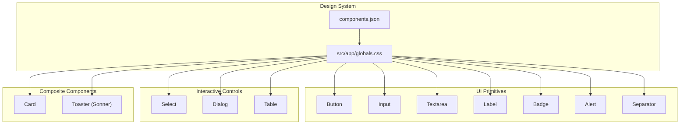
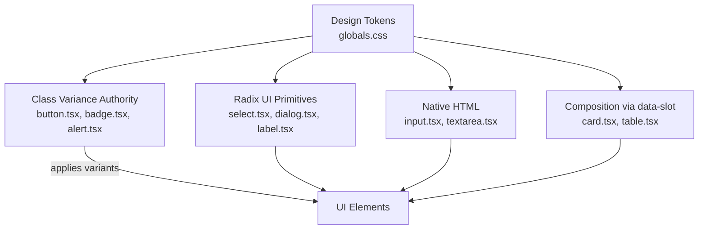
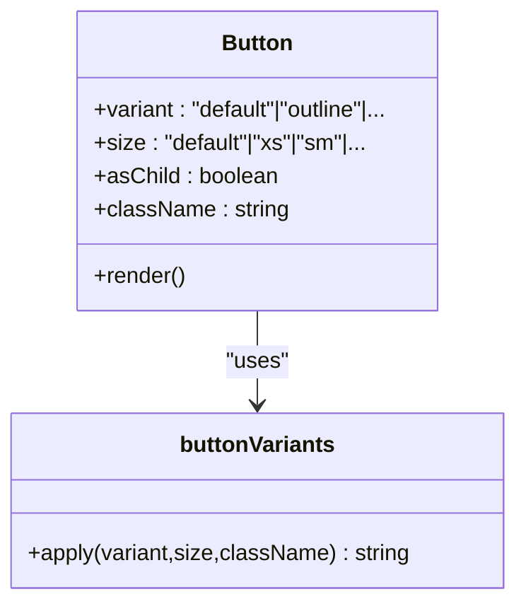
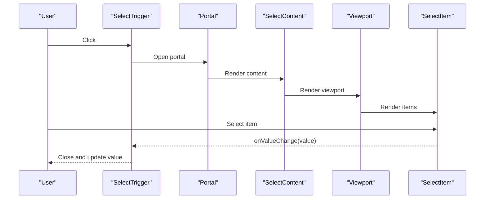
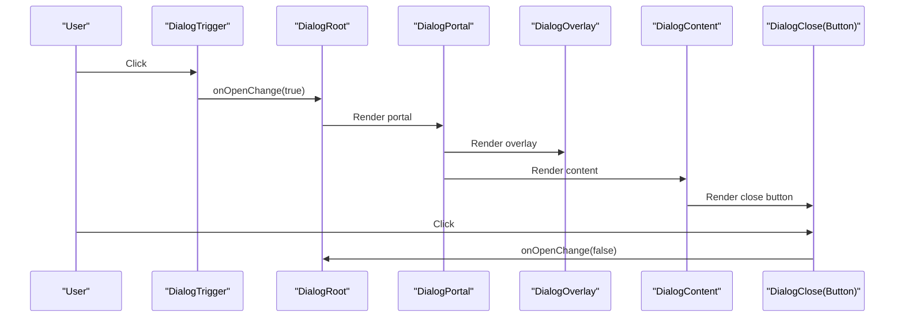
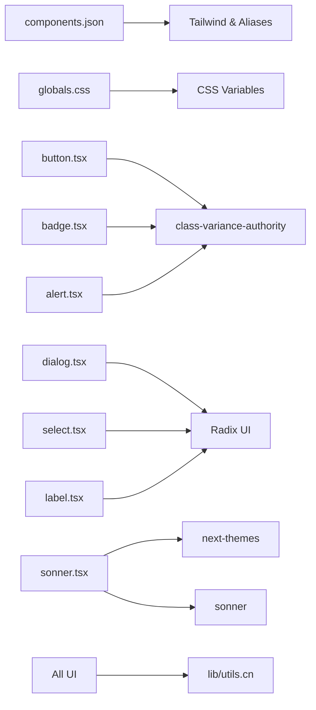

# UI Components

<cite>
**Referenced Files in This Document**
- [button.tsx](file://src/components/ui/button.tsx)
- [input.tsx](file://src/components/ui/input.tsx)
- [dialog.tsx](file://src/components/ui/dialog.tsx)
- [card.tsx](file://src/components/ui/card.tsx)
- [select.tsx](file://src/components/ui/select.tsx)
- [alert.tsx](file://src/components/ui/alert.tsx)
- [badge.tsx](file://src/components/ui/badge.tsx)
- [label.tsx](file://src/components/ui/label.tsx)
- [separator.tsx](file://src/components/ui/separator.tsx)
- [sonner.tsx](file://src/components/ui/sonner.tsx)
- [table.tsx](file://src/components/ui/table.tsx)
- [textarea.tsx](file://src/components/ui/textarea.tsx)
- [components.json](file://components.json)
- [globals.css](file://src/app/globals.css)
- [product-list.tsx](file://src/components/game/product-list.tsx)
- [barcode-scanner.tsx](file://src/components/scanner/barcode-scanner.tsx)
</cite>

## Table of Contents
1. [Introduction](#introduction)
2. [Project Structure](#project-structure)
3. [Core Components](#core-components)
4. [Architecture Overview](#architecture-overview)
5. [Detailed Component Analysis](#detailed-component-analysis)
6. [Dependency Analysis](#dependency-analysis)
7. [Performance Considerations](#performance-considerations)
8. [Troubleshooting Guide](#troubleshooting-guide)
9. [Conclusion](#conclusion)
10. [Appendices](#appendices)

## Introduction
This document describes the reusable UI component library used in Barcode Adventure. It covers primitive elements (buttons, inputs, labels), interactive controls (select, dialog), composite containers (cards, alerts, tables), and supporting utilities (toasts). It explains visual styles, behavior, user interaction patterns, props, events, customization, responsive design, accessibility, cross-browser compatibility, composition patterns, and integration with the design system. Usage examples are provided via file references to real implementations.

## Project Structure
The UI components live under src/components/ui and are built with Tailwind CSS, shadcn/ui conventions, Radix UI primitives, and class-variance-authority for variants. The design system is configured via components.json and styled globally in src/app/globals.css, which defines color tokens, typography, spacing, radius, and custom animations.

**Diagram sources**
- [components.json:1-26](file://components.json#L1-L26)
- [globals.css:1-194](file://src/app/globals.css#L1-L194)
- [button.tsx:1-68](file://src/components/ui/button.tsx#L1-L68)
- [input.tsx:1-20](file://src/components/ui/input.tsx#L1-L20)
- [textarea.tsx:1-19](file://src/components/ui/textarea.tsx#L1-L19)
- [label.tsx:1-25](file://src/components/ui/label.tsx#L1-L25)
- [badge.tsx:1-50](file://src/components/ui/badge.tsx#L1-L50)
- [alert.tsx:1-77](file://src/components/ui/alert.tsx#L1-L77)
- [separator.tsx:1-29](file://src/components/ui/separator.tsx#L1-L29)
- [select.tsx:1-193](file://src/components/ui/select.tsx#L1-L193)
- [dialog.tsx:1-169](file://src/components/ui/dialog.tsx#L1-L169)
- [table.tsx:1-117](file://src/components/ui/table.tsx#L1-L117)
- [card.tsx:1-104](file://src/components/ui/card.tsx#L1-L104)
- [sonner.tsx:1-50](file://src/components/ui/sonner.tsx#L1-L50)

**Section sources**
- [components.json:1-26](file://components.json#L1-L26)
- [globals.css:1-194](file://src/app/globals.css#L1-L194)

## Core Components
This section summarizes the primitive and composite building blocks of the UI library.

- Button: Variants (default, outline, secondary, ghost, destructive, link), sizes (default, xs, sm, lg, icon, icon-xs, icon-sm, icon-lg), slot support, and focus/ring states.
- Input: Base text input with focus-visible ring, disabled states, and aria-invalid styling.
- Textarea: Multi-line variant with similar focus/disabled/invalid states.
- Label: Styled label for form controls with disabled states.
- Badge: Small status/label indicator with variants and optional child rendering.
- Alert: Contextual message container with title, description, and action area.
- Separator: Divider with horizontal/vertical orientation.
- Select: Composite control with trigger, content, item, label, separators, and scroll buttons.
- Dialog: Modal overlay with portal, content, header/footer, title, description, and close button.
- Card: Container with header/title/description/action/content/footer slots and size variants.
- Table: Scrollable table wrapper and semantic parts (table, thead, tbody, tfoot, tr, th, td, caption).
- Toaster: Global notification system integrated with theme-aware styling.

**Section sources**
- [button.tsx:1-68](file://src/components/ui/button.tsx#L1-L68)
- [input.tsx:1-20](file://src/components/ui/input.tsx#L1-L20)
- [textarea.tsx:1-19](file://src/components/ui/textarea.tsx#L1-L19)
- [label.tsx:1-25](file://src/components/ui/label.tsx#L1-L25)
- [badge.tsx:1-50](file://src/components/ui/badge.tsx#L1-L50)
- [alert.tsx:1-77](file://src/components/ui/alert.tsx#L1-L77)
- [separator.tsx:1-29](file://src/components/ui/separator.tsx#L1-L29)
- [select.tsx:1-193](file://src/components/ui/select.tsx#L1-L193)
- [dialog.tsx:1-169](file://src/components/ui/dialog.tsx#L1-L169)
- [card.tsx:1-104](file://src/components/ui/card.tsx#L1-L104)
- [table.tsx:1-117](file://src/components/ui/table.tsx#L1-L117)
- [sonner.tsx:1-50](file://src/components/ui/sonner.tsx#L1-L50)

## Architecture Overview
The component library follows a layered architecture:
- Design tokens and utilities are centralized in globals.css and shared via CSS variables.
- Components are thin wrappers around Radix UI primitives or native HTML elements, adding design system classes and behavior.
- Variants and sizes are generated with class-variance-authority for consistent styling.
- Composition is achieved through data-slot attributes and slot-specific styling, enabling flexible layouts.

**Diagram sources**
- [globals.css:1-194](file://src/app/globals.css#L1-L194)
- [button.tsx:7-42](file://src/components/ui/button.tsx#L7-L42)
- [badge.tsx:7-28](file://src/components/ui/badge.tsx#L7-L28)
- [alert.tsx:6-20](file://src/components/ui/alert.tsx#L6-L20)
- [select.tsx:1-13](file://src/components/ui/select.tsx#L1-L13)
- [dialog.tsx:10-14](file://src/components/ui/dialog.tsx#L10-L14)
- [label.tsx:8-11](file://src/components/ui/label.tsx#L8-L11)
- [input.tsx:5-17](file://src/components/ui/input.tsx#L5-L17)
- [textarea.tsx:5-16](file://src/components/ui/textarea.tsx#L5-L16)
- [card.tsx:5-21](file://src/components/ui/card.tsx#L5-L21)
- [table.tsx:7-20](file://src/components/ui/table.tsx#L7-L20)

## Detailed Component Analysis

### Button
- Purpose: Interactive element with multiple variants and sizes, supporting icon and slot rendering.
- Props:
  - className: Additional Tailwind classes.
  - variant: One of default, outline, secondary, ghost, destructive, link.
  - size: One of default, xs, sm, lg, icon, icon-xs, icon-sm, icon-lg.
  - asChild: Render as a radix Slot to preserve semantics.
  - Native button props: disabled, type, aria-* attributes.
- Behavior:
  - Focus-visible ring and shadow transitions.
  - Disabled state applies pointer-events none and reduced opacity.
  - Icon sizing and padding adjust per size and icon presence.
- Accessibility: Inherits native button semantics; supports aria-invalid for form integration.
- Customization:
  - Extend variants/sizes via buttonVariants.
  - Override with className while preserving data-slot/data-variant/data-size.

**Diagram sources**
- [button.tsx:44-67](file://src/components/ui/button.tsx#L44-L67)
- [button.tsx:7-42](file://src/components/ui/button.tsx#L7-L42)

**Section sources**
- [button.tsx:1-68](file://src/components/ui/button.tsx#L1-L68)

### Input
- Purpose: Text input with consistent focus, disabled, and invalid states.
- Props: type, className, plus all native input attributes.
- Behavior: Focus-visible ring, disabled opacity and pointer-events, aria-invalid styling.
- Accessibility: Works with Label; integrates with form validation states.

**Section sources**
- [input.tsx:1-20](file://src/components/ui/input.tsx#L1-L20)

### Textarea
- Purpose: Multi-line text input with similar focus/disabled/invalid states.
- Props: className, plus all native textarea attributes.

**Section sources**
- [textarea.tsx:1-19](file://src/components/ui/textarea.tsx#L1-L19)

### Label
- Purpose: Styled label for form controls.
- Props: className, plus all native label attributes.
- Behavior: Disabled state styling and selection prevention.

**Section sources**
- [label.tsx:1-25](file://src/components/ui/label.tsx#L1-L25)

### Badge
- Purpose: Lightweight indicator or tag.
- Props:
  - variant: default, secondary, destructive, outline, ghost, link.
  - asChild: Render as a radix Slot.
  - className.
- Behavior: Variant-specific colors and hover effects; focus-visible ring.

**Section sources**
- [badge.tsx:1-50](file://src/components/ui/badge.tsx#L1-L50)

### Alert
- Purpose: Contextual message container with optional action.
- Props:
  - variant: default, destructive.
  - className.
- Slots: AlertTitle, AlertDescription, AlertAction.
- Behavior: Responsive grid layout; links inside description receive underlines.

**Section sources**
- [alert.tsx:1-77](file://src/components/ui/alert.tsx#L1-L77)

### Separator
- Purpose: Visual divider.
- Props:
  - orientation: horizontal or vertical.
  - decorative: boolean.
  - className.

**Section sources**
- [separator.tsx:1-29](file://src/components/ui/separator.tsx#L1-L29)

### Select
- Purpose: Accessible dropdown/select control.
- Props:
  - Root: value, onValueChange, open, onOpenChange, name.
  - Trigger: size ("sm","default"), className.
  - Content: position ("item-aligned","popper"), align, className.
  - Item: className.
  - Others: Group, Value, Label, Separator, ScrollUp/DownButton.
- Behavior: Portal-based overlay, scroll buttons, keyboard navigation, focus management.

**Diagram sources**
- [select.tsx:9-91](file://src/components/ui/select.tsx#L9-L91)

**Section sources**
- [select.tsx:1-193](file://src/components/ui/select.tsx#L1-L193)

### Dialog
- Purpose: Modal overlay with header, content, footer, and close behavior.
- Props:
  - Root: open, onOpenChange, modal.
  - Trigger, Portal, Overlay, Close.
  - Content: showCloseButton (boolean).
  - Header/Footer: showCloseButton (boolean).
  - Title/Description: className.
- Behavior: Animated enter/exit; focus trapping; Escape to close; backdrop click closes when enabled.

**Diagram sources**
- [dialog.tsx:10-86](file://src/components/ui/dialog.tsx#L10-L86)

**Section sources**
- [dialog.tsx:1-169](file://src/components/ui/dialog.tsx#L1-L169)

### Card
- Purpose: Container for grouped content with optional footer and actions.
- Props:
  - size: default or sm.
  - className.
- Slots: CardHeader, CardTitle, CardDescription, CardAction, CardContent, CardFooter.
- Behavior: Responsive spacing, border rounding, and footer padding adjustments.

**Section sources**
- [card.tsx:1-104](file://src/components/ui/card.tsx#L1-L104)

### Table
- Purpose: Scrollable table container with semantic parts.
- Props: All parts accept className and native attributes.
- Behavior: Hover and selected states; checkbox-friendly padding adjustments.

**Section sources**
- [table.tsx:1-117](file://src/components/ui/table.tsx#L1-L117)

### Toaster (Sonner)
- Purpose: Global notifications with theme-aware styling and icons.
- Props: Inherits ToasterProps; sets theme based on next-themes.
- Behavior: Uses CSS variables mapped to design tokens; custom toast class names.

**Section sources**
- [sonner.tsx:1-50](file://src/components/ui/sonner.tsx#L1-L50)

## Dependency Analysis
- Design system configuration: components.json defines style, icon library, Tailwind config, and aliases.
- Global styles: globals.css defines color tokens, typography, radii, and custom animations.
- Component dependencies:
  - button.tsx, badge.tsx, alert.tsx depend on class-variance-authority.
  - dialog.tsx, select.tsx, label.tsx depend on Radix UI.
  - sonner.tsx depends on next-themes and Sonner.
  - All components rely on cn utility (from lib/utils) for conditional class merging.

**Diagram sources**
- [components.json:1-26](file://components.json#L1-L26)
- [globals.css:1-194](file://src/app/globals.css#L1-L194)
- [button.tsx:1-6](file://src/components/ui/button.tsx#L1-L6)
- [badge.tsx:1-6](file://src/components/ui/badge.tsx#L1-L6)
- [alert.tsx:1-5](file://src/components/ui/alert.tsx#L1-L5)
- [dialog.tsx:3-8](file://src/components/ui/dialog.tsx#L3-L8)
- [select.tsx:3-8](file://src/components/ui/select.tsx#L3-L8)
- [label.tsx:3-7](file://src/components/ui/label.tsx#L3-L7)
- [sonner.tsx:3-5](file://src/components/ui/sonner.tsx#L3-L5)

**Section sources**
- [components.json:1-26](file://components.json#L1-L26)
- [globals.css:1-194](file://src/app/globals.css#L1-L194)

## Performance Considerations
- Prefer variants and sizes defined via class-variance-authority to minimize runtime conditionals.
- Use minimal animations; keep frame budgets low (e.g., dialog animations are duration-limited).
- Limit heavy DOM nesting in portals (Select/Dialog) to reduce reflows.
- Defer expensive computations off the main thread (e.g., barcode scanning in scanner component).
- Use CSS containment and transform-based animations where appropriate.
- Keep component render trees shallow; leverage slot-based composition to avoid unnecessary wrappers.

## Troubleshooting Guide
- Focus rings and accessibility:
  - Ensure focus-visible rings appear on interactive elements (Button, Input, Select).
  - Verify aria-invalid states propagate to ring and border classes.
- Dialog and Select overlays:
  - Confirm portal rendering and z-index stacking.
  - Test Escape key and backdrop clicks to close modals.
- Theme integration:
  - Confirm next-themes theme resolves to a supported value for Sonner.
  - Validate CSS variable mapping in globals.css for toast styles.
- Form integration:
  - Pair Input/Textarea with Label for proper semantics.
  - Use aria-invalid on form controls to trigger invalid styling.

**Section sources**
- [button.tsx:7-42](file://src/components/ui/button.tsx#L7-L42)
- [input.tsx:5-17](file://src/components/ui/input.tsx#L5-L17)
- [select.tsx:60-91](file://src/components/ui/select.tsx#L60-L91)
- [dialog.tsx:34-86](file://src/components/ui/dialog.tsx#L34-L86)
- [sonner.tsx:7-47](file://src/components/ui/sonner.tsx#L7-L47)

## Conclusion
The UI component library in Barcode Adventure is a cohesive, design-system-driven toolkit that balances accessibility, responsiveness, and performance. It leverages Radix UI for robust interactions, class-variance-authority for scalable variants, and Tailwind CSS for consistent styling. Components are composable via data-slot attributes and integrate seamlessly with global design tokens and animations.

## Appendices

### Usage Examples (by file reference)
- Product list filtering and pagination use native inputs and selects styled with design tokens and custom classes.
  - [product-list.tsx:94-124](file://src/components/game/product-list.tsx#L94-L124)
  - [product-list.tsx:138-221](file://src/components/game/product-list.tsx#L138-L221)
- Scanner UI composes animations, overlays, and dialogs; demonstrates integration with global design tokens and animations.
  - [barcode-scanner.tsx:128-216](file://src/components/scanner/barcode-scanner.tsx#L128-L216)

### Responsive Design Patterns
- Use size variants on Button and Select to adapt to small screens.
- Card spacing adjusts via CSS variables and data-size attributes.
- Table is wrapped in an overflow container for mobile readability.
- Dialog content adapts to smaller screens with constrained max-width and centered layout.

**Section sources**
- [button.tsx:23-35](file://src/components/ui/button.tsx#L23-L35)
- [select.tsx:36-58](file://src/components/ui/select.tsx#L36-L58)
- [card.tsx:5-21](file://src/components/ui/card.tsx#L5-L21)
- [table.tsx:7-20](file://src/components/ui/table.tsx#L7-L20)
- [dialog.tsx:50-68](file://src/components/ui/dialog.tsx#L50-L68)

### Accessibility Compliance
- Buttons and labels use native semantics; focus-visible rings ensure keyboard operability.
- Dialog and Select manage focus trapping and ARIA roles via Radix UI.
- Inputs and Textareas support aria-invalid for validation feedback.
- Screen reader text included for close buttons and icons.

**Section sources**
- [button.tsx:54-65](file://src/components/ui/button.tsx#L54-L65)
- [label.tsx:8-22](file://src/components/ui/label.tsx#L8-L22)
- [dialog.tsx:10-14](file://src/components/ui/dialog.tsx#L10-L14)
- [select.tsx:15-19](file://src/components/ui/select.tsx#L15-L19)
- [input.tsx:5-17](file://src/components/ui/input.tsx#L5-L17)

### Cross-Browser Compatibility
- Tailwind and CSS variables are broadly supported; ensure polyfills for older browsers if needed.
- Radix UI provides cross-browser accessibility features; test focus order and keyboard navigation.
- Sonner relies on modern APIs; verify fallbacks for unsupported environments.

### Animation Systems
- Custom animations defined in globals.css: float and pop-in.
- Dialog and Select use short-duration slide/fade/zoom animations.
- Motion libraries used in higher-order components (e.g., product list cards) for micro-interactions.

**Section sources**
- [globals.css:160-179](file://src/app/globals.css#L160-L179)
- [dialog.tsx:38-48](file://src/components/ui/dialog.tsx#L38-L48)
- [select.tsx:68-91](file://src/components/ui/select.tsx#L68-L91)
- [product-list.tsx:145-149](file://src/components/game/product-list.tsx#L145-L149)

### Theme Integration
- Design tokens defined in globals.css map to CSS variables for backgrounds, foregrounds, borders, and brand colors.
- Sonner integrates with next-themes to mirror system/theme preferences.
- Button and Badge variants use color-mix and current color contexts for dynamic theming.

**Section sources**
- [globals.css:8-59](file://src/app/globals.css#L8-L59)
- [globals.css:61-105](file://src/app/globals.css#L61-L105)
- [sonner.tsx:7-47](file://src/components/ui/sonner.tsx#L7-L47)
- [button.tsx:10-22](file://src/components/ui/button.tsx#L10-L22)
- [badge.tsx:10-22](file://src/components/ui/badge.tsx#L10-L22)